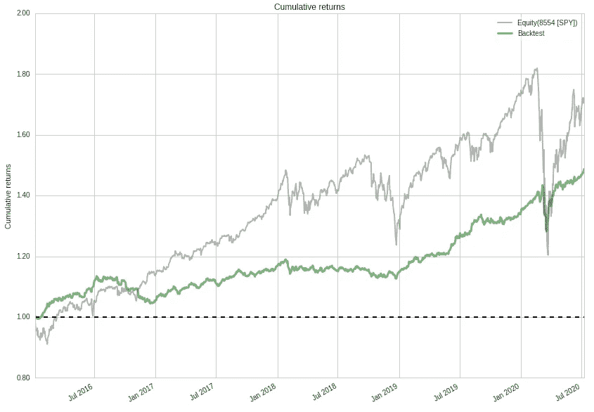

# HCA 固定比率系统

> 原文：<https://medium.datadriveninvestor.com/the-hca-fixed-ratio-system-fe7ddf4cf2c0?source=collection_archive---------16----------------------->

Harry Browne’s Permanent Portfolio

辣酱分析的目标是提供一个统一的框架，在这个框架中，你可以回溯测试你的想法，然后在现场交易中将它们付诸实践。

一旦你设计好你的系统，你就可以用这个软件自动向你的经纪人下单。

辣酱分析是“盒子里的基金管理”。

[HCA 固定比率系统](https://www.hotchilianalytics.com/post/fixed-ratio-allocations)是众多例子中的一个，旨在用一个简单的概念“指明道路”。一旦你选择了你的参数和投资组合，你就可以使用 HCA 软件进行交易了。

区分“投资”和“交易”很重要。固定比率系统是关于投资的。它认识到，从长期来看，战胜市场是极其困难的，因此专注于资产配置，而不是选股或交易。

HCA 并没有阻止你交易——远非如此。如果你有一个交易想法，并认为你可以在任何时间框架内战胜市场，HCA 是测试和交易你的想法的理想平台。

但是回到固定比率系统。投资者选择或设计一个投资组合，并决定他将投资组合总价值的百分之多少给每种工具。

一个例子是简单的 60/40 股票/债券分割，长期以来一直受到谨慎投资者的青睐。你可以选择多元化的交易所交易基金或共同基金投资股票，选择世界债券交易所交易基金投资债券。

然后，你定期调整投资组合，使其达到你选择的权重。期限由你选择:每天，每周，每月，每季度，每年？

你也可以使用固定比率系统来探索“懒惰投资组合”，如[哈里·布朗的永久投资组合](https://en.wikipedia.org/wiki/Fail-Safe_Investing)或任何其他需要固定比率分配和定期再平衡的系统。

哈里·布朗建议将投资组合的 25%投资于股票，25%投资于长期债券，25%投资于短期债券，25%投资于现金。使用 HCA 来观察这个投资组合在一段时间内的表现，然后将其付诸实践。如果这对你来说是个不错的投资。

或者测试一下[雷伊·达里奥的全天候组合](https://en.wikipedia.org/wiki/Bridgewater_Associates)的变化。他看到了 4 种不同的投资环境，并建议投资组合经受住所有这些环境:

通货膨胀

通货紧缩

不断增长的经济增长。

经济增长下降。

我们在 HCA 网站上的文章给出了一个全天候投资组合的样本，并对结果进行了回溯测试。你可以在回溯测试中试验投资组合和参数，如果你愿意，可以使用 HCA 进行交易。

HCA 给你所有你需要的工具来测试和交易你的投资想法。一个可靠的后台测试引擎和你的经纪人的连接。

看看这个。