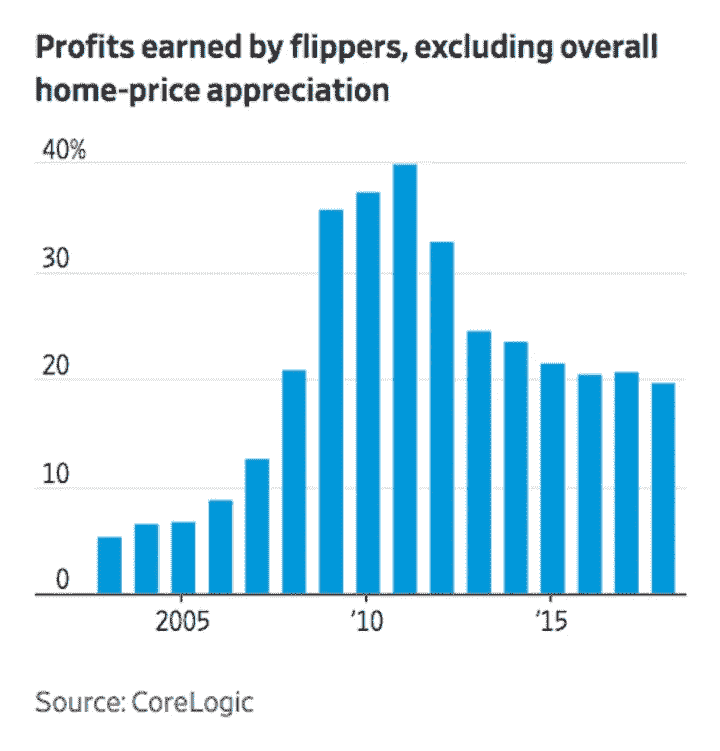

# “HGTV 效应”

> 原文：<https://medium.datadriveninvestor.com/the-hgtv-effect-2f9532c7bcad?source=collection_archive---------14----------------------->

## 在电视上看房看起来很容易。这种“翻转”会导致房地产市场的又一次“失败”吗？

Photo by [Jacques Bopp](https://unsplash.com/@jacquesbopp?utm_source=medium&utm_medium=referral) on [Unsplash](https://unsplash.com?utm_source=medium&utm_medium=referral)

> “历史不会重演，但它押韵…”
> 
> ——*马克·吐温*

# 本文的关键点

*   今天的房地产市场在很大程度上是由那些倒卖房屋的人推动的。十分之一的销售额来自房屋买卖，这是自十年前房地产泡沫破裂以来的最高水平。
*   今天的房屋买卖比过去更有利可图，这在很大程度上不是由猖獗的投机行为驱动的，而是通过改造和更新旧房屋实现的，这对社区非常有利。
*   所有这一切似乎都有媒体驱动的一面，由节目的受欢迎程度推动——特别是在排名很高的 HGTV 网络上——使所有这一切看起来相对“容易”。
*   这是否意味着“HGTV 效应”如果是这样，这对房地产市场和整体经济意味着什么？

每天晚上，超过一百万的美国同胞会坐在安乐椅上或蜷缩在沙发上看电视，这似乎正迅速成为这个国家最受欢迎的消遣。看着别人看房子当然是高清的！这使得 [HGTV](https://www.hgtv.com/) 一直是美国黄金时段收视率第三的有线电视网！

**基本有线电视前 10 名——平均每夜观众(黄金时段收视率，2019 年 4 月)**

1.福克斯新闻频道(233.9 万)

2.MSNBC(164.2 万)

3.[HGTV](https://www.hgtv.com/)(122.3 万)

4.[美国](https://www.usanetwork.com/)(115.3 万)

5.[待定](https://www.tbs.com/)(103.3 万)

6.[历史](http://www.history.com/)(98.9 万)

7.[调查发现](https://www.investigationdiscovery.com/)(95.4 万)

8.[A&amp；e](http://www.aetv.com/)(92.6 万人)

9.ESPN(92.1 万英镑)

10.[发现](https://www.discovery.com/)(91.7 万)

*来源:* [基础有线排名:2019 年 4 月 1 日](https://www.adweek.com/tvnewser/basic-cable-ranker-week-of-april-1/399105) *的一周，Adweek，2019 年 4 月 10 日。*

总而言之，这意味着一家媒体公司 [Discovery，Inc.](https://corporate.discovery.com/) 拥有十大基本有线电视网中的三个:HGTV、Discovery 和 Investigation Discovery！

现在，他们正在寻求扩大他们的市场地位。探索频道[宣布【HGTV 无可争议的最大明星](https://corporate.discovery.com/discovery-newsroom/discovery-chip-and-joanna-gaines-announce-multi-platform-media-joint-venture/)[奇普和乔安娜·盖恩斯](https://magnolia.com/about/)将为该公司推出他们自己的网络，用一个由这对[固定器 Upper](https://www.hgtv.com/shows/fixer-upper) 名人夫妇制作的频道取代 DIY 网络。他们是真正的美国成功故事，因为有一天他们在德克萨斯州的韦科经营一家小型房地产公司和商店，几年后他们成为巨星，并建立了一个个人品牌，这可能会在多年内为他们带来数十亿美元！正如拳击推广人唐·金的名言，“只有在美国……”

Chip And Joanna Gaines

因此，对于我们文化中所有关注政治和体育的人来说(电视网将大部分节目投入到人们就这两个话题相互争吵的节目中)，有一件事是肯定的…我们中越来越多的人通过看着其他人找到他们梦想中的家来逃避日常生活的压力，不管是在圣路易斯还是圣卢西亚！

Photo by [Tierra Mallorca](https://unsplash.com/@tierramallorca?utm_source=medium&utm_medium=referral) on [Unsplash](https://unsplash.com?utm_source=medium&utm_medium=referral)

这使得明星和大品牌不仅仅是赢家，而是一群漂亮的夫妇，他们帮助人们改造他们现有的房子，或者他们在节目中“购买”的房子(不过，剧透一下，[HGTV 的“真人秀”](https://www.ranker.com/list/behind-the-scenes-hgtv-facts/mariel-loveland)的“现实”非常，*非常*值得商榷！).这包括像 [Erin](https://www.instagram.com/erinapier/?hl=en) 和 [Ben Napier](https://twitter.com/scotsmanco) 这样的夫妇(他们把密西西比州劳雷尔的所有地方都变成了旅游胜地)。

Ben and Erin Napier

福特夫妇修复的[的史蒂夫](https://www.hgtv.com/shows/restored-by-the-fords)和[符晓薇·福特](https://leanneford.com/)，当然还有…

Leanne and Steve Ford

[乔纳森](https://twitter.com/MrSilverScott)和[德鲁·斯科特](https://twitter.com/MrDrewScott)，又名[地产兄弟](https://www.hgtv.com/shows/property-brothers)。

The Property Brothers — Jonathan and Drew Scott

当然，每一次*改造(至少在电视上)总会让房主看到他们的房子因为改造而升值，是的，完全改造你的整个房子真的只需要 30 分钟。耶，*对了*！*

Photo by [Agê Barros](https://unsplash.com/@agebarros?utm_source=medium&utm_medium=referral) on [Unsplash](https://unsplash.com?utm_source=medium&utm_medium=referral)

除了在美国和国外的一系列找房子的节目之外，在那里“有趣的”夫妇总是为不同口味的房子购物，当然，他们只从他们的房地产经纪人向他们展示的三个房子中选择(*这就是现实生活中的情况，对吗？可以说*HGTV 的一系列节目的主要内容*是围绕*看房*。这个[术语](http://www.businessdictionary.com/definition/flipping-houses.html)已经有了一个普遍理解的意思，根据[商业词典](http://www.businessdictionary.com/)的解释是:*

> 一种快速获利的策略，投资者以折扣价购买房地产，并对其进行改进，以便以更高的价格出售。如果房地产市场表现良好，这可能是一个非常有利可图的盈利策略。

Christina Antstead and her now “Ex,” Tarek El Moussa, of the original, *Flip or Flop*

当然,“我们可以做一场卖房秀”的现象都始于[塔里克](https://www.instagram.com/therealtarekelmoussa/?hl=en)和[克里斯蒂娜](https://www.instagram.com/christinaanstead/?hl=en)与恰如其分的标题[的翻转或翻牌](https://www.hgtv.com/shows/flip-or-flop)。当然，如果你关注当天的名人头条，这对上镜的、看似完美的夫妇[现在已经离婚](https://www.countryliving.com/life/entertainment/a20874468/flip-or-flop-christina-tarek-el-moussa-divorce/)，并在他们的个人生活中分道扬镳。但是，正如经典的演艺界格言所说，“表演必须继续下去…”事实也的确如此！

 [## 每天 20 分钟如何拯救你的财务|数据驱动的投资者

### 似乎永远没有时间给你的生活带来改变。特别大的变化似乎太令人生畏了…

www.datadriveninvestor.com](https://www.datadriveninvestor.com/2019/11/20/how-20-minutes-a-day-can-save-your-finances/) 

今天，不仅是原来的节目继续带有一些的“张力”，我们应该说，内置于对话中，而且*翻转或翻转*已经产生了一系列几乎“特许”的节目，建立在相同的格式上。从拉斯韦加斯[到亚特兰大](https://www.hgtv.com/shows/flip-or-flop-vegas)到纳什维尔[到棕榈泉](https://www.hgtv.com/shows/flip-or-flop-nashville)到沃思堡[以及可能更多的地方，光是 HGTV 上的看房节目名单就在继续增长。如果你纵观整个有线电视和节目辛迪加的格局，以翻转房屋为前提的节目正在激增，几乎就像泽西麦克的特许经营一样。](https://www.hgtv.com/shows/flip-or-flop-fort-worth)

Bristol and Aubrey Marunde

我对 HGTV 的了解(是的，这要感谢我的妻子！)让我怀着极大的担忧阅读了《华尔街日报》最近的一篇文章。这是因为，尽管这篇文章的标题是，“[房屋交易回到了危机前的水平。这就是为什么它不那么令人担忧的原因:今天的 Flippers 的利润率比上一个房地产周期的巅峰时期](https://www.wsj.com/articles/house-flipping-is-back-to-pre-crisis-levels-heres-why-its-less-of-a-concern-11554802201)高得多，“我了解 HGTV 作为一个好的中年丈夫，我可能从这篇文章中获得了*比作者(华尔街日报的房地产记者[劳拉·库斯托](https://www.linkedin.com/in/laura-kusisto-85370711/))可能打算的更不同的*信息。

现在，我强烈推荐 Kusito 的文章，因为它很好地概述了美国住房市场，以及翻转对它的影响，无论是在过去还是现在。这篇文章基于最近一份关于房屋转手对市场影响的报告，该报告来自加利福尼亚州欧文市的 CoreLogic，是一家领先的消费者、金融和房地产数据、分析和服务提供商。

Kusito 在《华尔街日报》上的文章表明，与十年前导致房地产崩溃和大衰退的“无首付”购房和猖獗的金融投机相反，今天的投机者不仅仅是在房地产市场上赌博。总的来说，目前的房屋交易商有着坚实的商业模式，而不是希望整个市场快速升值的投机性金融游戏。

事实上，今天的大多数翻筋斗者做的事情基本上与你能在 HGTV 上看到的 Tarek 和 Christina 或任何其他翻筋斗者做的事情相同。他们正在收购较旧的房产，对其进行更新，并提升其入住条件。然后，今天的房产经纪人以远高于 2000 年代中期最后一次房地产繁荣时期的价格出售这些房产。所以，是的，因为重点是实际改善，而不仅仅是转售房屋，全国各地的许多社区正在一次一栋房屋地进行修复。在这个过程中，许多人通过翻转房屋为他们的社区和他们自己做了有益的事情，过上了不错的生活。

今天，美国住房市场上房屋交易的总体影响是无可争议的。证据就在数据中。CoreLogic 二十年来一直在跟踪美国住房市场。“换房”在 T2 的术语中被定义为现在的房主拥有不到两年就出售的房屋。他们的分析显示，在 2018 年最后一个季度，该国所有房屋销售中有 10.6%是空翻。不过，这个数字在两个方面令人担忧。首先，成交量正在接近历史最高水平，这发生在 2006 年第一季度，当时售出的房屋中有 11.3%是成交量。此外，报告的 2018 年数字是 CoreLogic 跟踪住房数据的二十年来*第四季度最高*水平！

尽管 CoreLogic 的研究显示，尽管目前房屋交易的盈利水平较峰值水平有所下降，但远高于十多年前导致房地产泡沫破裂的时期。从 CoreLogic 为《华尔街日报》*准备的图表中可以清楚地看到，2011 年，房屋交易的利润率达到了近 40%的峰值！虽然房产投机者看到的经济盈利能力自峰值以来下降了一半，尽管平均回报率仍在 20%的范围内，但这是那些在 2000 年代初至 2000 年代中期房地产泡沫前的乐观时期从事投机的人所经历的盈利能力的两倍甚至三倍！因此，对投资者来说，炒房是一个有吸引力的前景，比今天看似火热但波动性大的股票市场产生更稳定、更高的收益！从 Kosito 的角度来看，额外的利润率“如果房价开始持平或下跌，为当前的投机者提供了更多的缓冲。”*

然而，对 CoreLogic 数据进行更深入的分析，揭示了一些趋势，这些趋势肯定会引起那些试图跟随电视角色模型的脚步，开始以卖房为生的人的某种程度的担忧。第一个值得关注的领域应该是，越来越多的家庭翻转不再是有线电视节目中描述的“夫妻店”经营。相反，它越来越成为一项大生意！考虑一下这个有说服力的统计数据:在 2018 年第四季度，企业卖家约占所有被归类为“翻转”的*销售的 40%。这个数字是上一次房地产繁荣高峰期的三倍(T3 )!大型的公司房屋翻转正在成为一种常态，而不是像有线电视房屋翻转节目中一遍又一遍展示的那样，由“勇敢的夫妇”独立工作，一次翻转一所房子。想想 Kusito 文章中讨论的一家公司， [Memphis Invest](https://www.memphisinvest.com/) ，每年在南方大部分地区与一千处房产合作！*

与此相关的一点也应该引起那些可能考虑追随塔雷克和克里斯蒂娜等英雄的脚步的人的关注:尽管房屋买卖的整体盈利能力无疑是一项有吸引力的投资，但回报因房屋位置的不同而有很大差异。在孟菲斯市场，特别是房屋脚蹼，平均回报率为 42%，大约是全国平均水平的两倍！因此，你在哪里很重要。请记住，拥有更多地区业务的大型实体可以分散风险和回报，而这是大多数炒房者无法做到的。因此，非常真实的市场特定的风险，使一个人的工作集中在一个特定的城市，甚至一个特定的大都市地区，正如 HGTV 房屋翻转节目中所描绘的那样，是有利于房屋翻转市场中更大、更多的公司实体的东西。

然而，最重要的是，我被文章中一个特别的评论震惊了，这个评论真的让我很震惊。当时，CoreLogic 副首席经济学家拉尔夫·麦克劳克林(Ralph McLaughlin)指出:

> “今天的鳍状肢和过去有很大的不同。尽管我们在流行文化中看到了这一点，但这并不是一件需要担心的事情。

呃…欢迎来到现实世界！作为一名战略管理顾问和教授，我不得不说“炒作和歇斯底里”基本上是今天媒体和营销的双重目标。好与坏，左与右，是的，*为了利润，*大众很容易被我们今天在电视、平板电脑和智能手机上看到的东西所左右(*可悲的是)*。

Photo by [Blake Cheek](https://unsplash.com/@blakecheekk?utm_source=medium&utm_medium=referral) on [Unsplash](https://unsplash.com?utm_source=medium&utm_medium=referral)

# 分析:HGTV 效应

所以，我想用一个新的术语来加入关于流行文化如何影响真实商业的辩论。我将把这称为" *HGTV 效应*"这是指媒体对房屋买卖的集体关注已经并将继续影响美国住房市场的方式。虽然 HGTV 肯定是*在推广卖房文化流行方面的*公认的领导者，但人们可以指出*任何数量的其他电视节目、电视网络、博客、社交媒体影响者和网站都在尽自己的一份力量，无论是有意*还是无意*增加美国房地产市场的泡沫。我认为，在了解了记录在案的*和*在当今营销策略世界中所展示的影响力之后，有线电视明星影响和加剧房屋倒卖活动的能力在美国房地产市场中相当普遍，这种集体影响可能比任何人想象的都要强大得多。*

虽然衡量“HGTV 效应”的真正力量将是一项困难的学术和研究任务，但也许更重要的是要认识到这是一个非常真实的现象，这是房地产市场的所有参与者都需要意识到的问题。大肆宣传。面对媒体的压力。拥有所有的明星，权力。房屋买卖是并将继续是美国房地产市场的一股强大力量。正如开头所说的，所有这些都有一个非常真实的、可以证明的好处，那就是老房子正在被更新以符合当前的标准和品味。然而，从我作为商业和社交媒体“专家”的身份来看，我确实相信，虽然确实有精明的房地产/改造人员能够利用这一点，为他们自己和他们的社区做好事，但也有其他人会说，“嘿，亲爱的，我认为我们是时候离开沙发，参与到这一切中来了！让我们看看我们能从我们的退休计划中提取多少，也许能得到第二次抵押贷款。见鬼，这是一个如此好的机会，我们需要检查一下我们信用卡的限额！把电话递给我……”

最后，我担心，就像俗话说的，我们以前看过这部电影——或者在这种情况下，电视节目！我们已经看到我们的世界被“[非理性繁荣](https://www.investopedia.com/terms/i/irrationalexuberance.asp)”一次又一次地震撼这是 20 世纪 90 年代末互联网泡沫最盛时期，时任[美联储董事会](https://www.federalreserve.gov/)主席、[艾伦·格林斯潘](https://www.federalreservehistory.org/people/alan_greenspan)在[美国企业研究所](http://www.aei.org/)的一次[演讲中使用的短语。繁荣和萧条。历史上到处都是这样的例子，不仅仅是在美国，在全世界都是如此！从“](https://www.thebalance.com/irrational-exuberance-quotes-dangers-and-examples-3305937)[郁金香狂热](https://www.investopedia.com/features/crashes/crashes2.asp)”到“[南海泡沫](https://www.investopedia.com/features/crashes/crashes3.asp)”再到“[咆哮的二十年代](https://www.history.com/topics/roaring-twenties)”，我们已经看到市场爆炸，然后剧烈收缩。许多人在这些时期赚了大量的财富，而其他人，通常是那些“聚会”迟到的人，在他们努力“打好牌”的过程中损失了同样多的钱，有时甚至更多。

就在十多年前，我们已经看到房地产市场上涨，上涨，然后下跌，下跌，然后下跌得更厉害！因此，最终，住宅房地产市场应该是一个个人特别不愿意下大赌注的领域。然而，数据清楚地表明，就目前而言，房屋买卖仍然是一个非常非常有利可图的行业。随着非常受欢迎的有线电视节目每周 7 天、每天 24 小时甚至按需提供的不断强化-是的，*鼓励-* ，人们不能不受到“HGTV 效应”的影响与麦克劳克林先生不同，我非常相信“流行文化中的炒作和歇斯底里”——特别是翻房子秀的泛滥——绝对是“值得担忧的事情！”

总之，这是一个非常复杂的问题，一个值得关注的问题，也是许多学术和应用研究的担忧。然而，我*确实*相信“HGTV 效应”是非常真实的，我认为这是市场中一股值得研究和考虑的力量。然而，我确实担心，今天的许多人可能容易受到太多房地产节目的“现实”的影响，这些节目可能没有描绘出所有艰苦工作的*真实*现实*和所有倒卖房屋固有的非常真实的金融风险*。毕竟，这些 HGTV 节目的每一个都以一个图形来显示这对漂亮的夫妇赚了多少钱，并带有某种形式的谚语，“*还有另一所房子要翻！*”

现在，我并不是要抛出这个新术语，让它成为一个“扫兴的人”或唱反调者。然而，如果不幸的是，五年后我们看到房地产市场出现非常显著的下滑，我坚信“HGTV 效应”很可能是其中一个因素。我希望我是错的，然而，历史、炒作和房地产市场似乎都在这一刻汇聚！

# **和我一起在媒体上写作**

想开始自己的写作之旅吗？想通过发布自己创作的文章来更好地建立个人品牌？考虑今天和我一起在媒体上写作，并使用这个链接:[https://davidwyld.medium.com/membership](https://davidwyld.medium.com/membership)。这样做，你将帮助支持我的写作，因为我收到你的媒介会员费的一部分。

 [## 通过我的推荐链接加入媒体-大卫·怀尔德

### 作为一个媒体会员，你的会员费的一部分会给你阅读的作家，你可以完全接触到每一个故事…

davidwyld.medium.com](https://davidwyld.medium.com/membership) 

# 关于大卫·怀尔德

大卫·c·怀尔德是路易斯安那州哈蒙德市东南路易斯安那大学的战略管理教授。他是管理顾问、研究员/作家、出版商、执行教育家和经验丰富的专家证人。他是[The IDEA Publishing](http://www.theideapublishing.com/)*The Best in News，Information and Content Marketing*和[Modern Business Press](http://www.modernbusinesspress.com/)*The Best in Academic Journals*的创始人和出版人。

**大卫·怀尔德的社交媒体链接:**

上[脸书](https://www.facebook.com/david.wyld)

上 [LinkedIn](https://www.linkedin.com/in/david-wyld-4923707/)

在[推特上](https://twitter.com/GoodAdvicePub)

*原载于*[*https://vocal.media/journal/the-hgtv-effect*](https://vocal.media/journal/the-hgtv-effect)

**访问专家视图—** [**订阅 DDI 英特尔**](https://datadriveninvestor.com/ddi-intel)