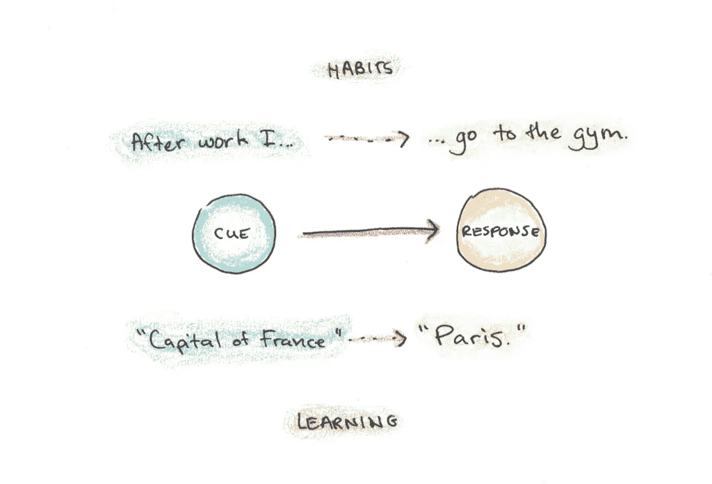
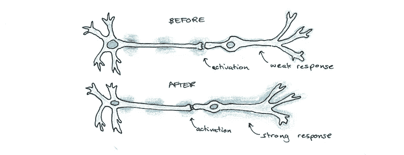

# 习惯和学习之间隐藏的联系

> 原文：<https://medium.datadriveninvestor.com/the-hidden-connection-between-habits-and-learning-4ed4ec1f11b6?source=collection_archive---------4----------------------->

学习和习惯似乎是我们心理的两个独立的事实。学习是关于知识、信息和技能的。习惯是关于常规、行为和行动的。

然而，我认为这两者实际上是基于几乎相同的大脑原理工作的，认识到这种联系可以帮助你更好地学习和形成更好的习惯。

# 学习=习惯

要看到其中的联系，让我们从问习惯是什么开始。习惯是一种半自动的行为反应，在环境中给予一定的提示。换句话说，当你说你有一个习惯时，你的意思是“每当 X 发生时，我就做 y。”例子:

*   我每天都去健身房=“每天下班，我都去健身房。”
*   我不吃肉=“只要东西里有肉，我就不吃。”
*   我有一个阅读习惯=“每当我有空的时候，我都倾向于阅读(而不是别的)”

非正式地说，习惯可能比 1:1 的关联更复杂。事实上，一个有规律的锻炼“习惯”可能是多个不同复杂程度的关联，例如:

*   "当我计划我的一天时，我总是进行锻炼."
*   "如果一天快结束了，而我还没有锻炼，我就锻炼."
*   "我下班后去，除非我有其他活动，在这种情况下，我早上去。"

虽然有些习惯实际上只是一个简单的提示和反应，但大多数是复杂的，需要处理特定的子情况，并为某些情况制定规则，因此它们在大多数时候都有效。一个习惯也不需要 100%地被计算在内。一个如饥似渴的读者可能没有说“每当 X 发生时，我必须阅读”的习惯，而只是在有空闲时间时倾向于阅读更多。

事实证明，学习几乎就是这样。学习意味着当给你一组提示时，你会产生某种反应(精神上或身体上的)。示例:

*   我知道每个州的首府=“当提到 X 州时，在询问首府时，我给出的是正确的城市 y。”
*   我会说中文=“当有人用中文跟我说话时，我会做出适当的反应。”
*   我可以下坡滑雪=“当我在滑雪板上摔倒时，我的身体会自动产生运动动作，让我安全到达底部。”

这听起来可能很简单，因为这些例子比简单的习惯要复杂和微妙得多。但是正如我之前提到的，习惯通常也很复杂，对不同的情况有不同的反应，有时只是概率性的，而不是对一种情况的完全自动化的反应。

# 意识控制与自动行动

学习和习惯之间一个看似不同的地方是，应用你所学的是一个更有意识的过程，而习惯被认为是自动的。

举例来说，一个专业的油漆工不只是在自动驾驶仪上乱泼油漆。每一次划水都是为了达到一个特定的结果。这种深思熟虑似乎与习惯完全相反，习惯是由它们的自动性水平来定义的。

虽然看起来是这样，但我也倾向于相信这只是表面上的差异，而不是第一次出现的那样。即使在简单的习惯中，如何执行也有很大的灵活性。就拿每天锻炼这样的事情来说:应该上午去还是下午去？跑步还是举重？逼自己还是放轻松？

当然，一个习惯性的行为往往有一个强烈的默认(否则它就不是一个习惯)，但这也类似于学习。当你遇到一个熟悉的问题时，最主要的倾向是应用你以前学过的技术。用创新的方式解决问题需要付出努力，就像打破习惯一样。

# 学习和习惯的神经科学

关于大脑中的学习和习惯形成，我们还有很多不了解的地方。但两者的共同原则似乎是选择性地加强导致期望输出的神经元回路之间的连接，并削弱不正确或虚假的连接。

当一系列神经元放电与下游突触形成强有力的连接时，一种习惯就形成了，因此当较早的神经元放电时，较晚的神经元放电的概率很高。想象一下，这就像一条河流在地面上雕刻出一个山谷，所以顺流而下的水极有可能沿着特定的路径流动。

当一个长期记忆与另一个长期记忆紧密结合时，学习就发生了。这可以像暗示反应一样简单:“问:法国的首都是哪里？答:巴黎。”或者它可以像解微分方程一样复杂，让微分方程的形式自动流向开始解它的心理活动。

虽然这些大类中的每一个都可能有相当多的细微差别，但我怀疑它们有相当多的重叠，而不是大体上独立的领域。一些学习形式被编码为运动序列(如学习驾驶汽车)，一些习惯被编码为更高层次抽象之间的关联(如在办公室会议上讨论行动时记得写下待办事项)。

# 如何利用这一点更好地学习(并养成更好的习惯)

通过将学习视为类似于习惯的形成，你可以开始不把学习视为存储信息的过程，而是在特定环境下准备行动的过程。因此，学习一门语言不仅仅是储存词汇，而是学习激活某些知识，以应对特定的情况。

一旦你将学习视为线索驱动和基于上下文的，以及像习惯一样训练的东西(通过重复线索-反应的模式)，那么你将更有可能以最终有用的方式练习。当你意识到你正在创造的习惯并不是你真正需要的习惯时，你就能发现低效的学习设计。

虽然你确实无法预测一种情况的每一个细节，但这很容易识别，例如，在说一种语言时有用的一个基本思维习惯是能够想到一个想法/概念，并想到该语言中的相关单词，但从单词框中挑选单词可能不是你需要的习惯(就像在 DuoLingo 等应用程序中)。

同样，你可以通过把它看做一种学习行为来改善你的习惯形成。不要把你的习惯看成是简单的单元，你可以看到你正试图对一大堆情况做出灵活的反应，所有这些都需要单独进行调整。锻炼习惯不仅仅是每天去健身房，而是在各种不同的情况下找到合适的反应(健身房关门了，你生病了，你忘了带跑鞋，等等)。)

通过将习惯视为学习，你认识到你所做的不仅仅是一个自律的问题，也是一个探索、实验和试图创造行为模式的问题，这些行为模式会在你无法预测的情况下产生有用的反应。这需要时间和实践，而不仅仅是一种执行意愿的行为。

最重要的是，通过看到学习和习惯之间的联系，你可以看到你的生活有多少是由相似的模式组成的。你的思想、情感、关系和身份也在类似的线索和反应循环中运作。看到模式，就可以开始改变了。