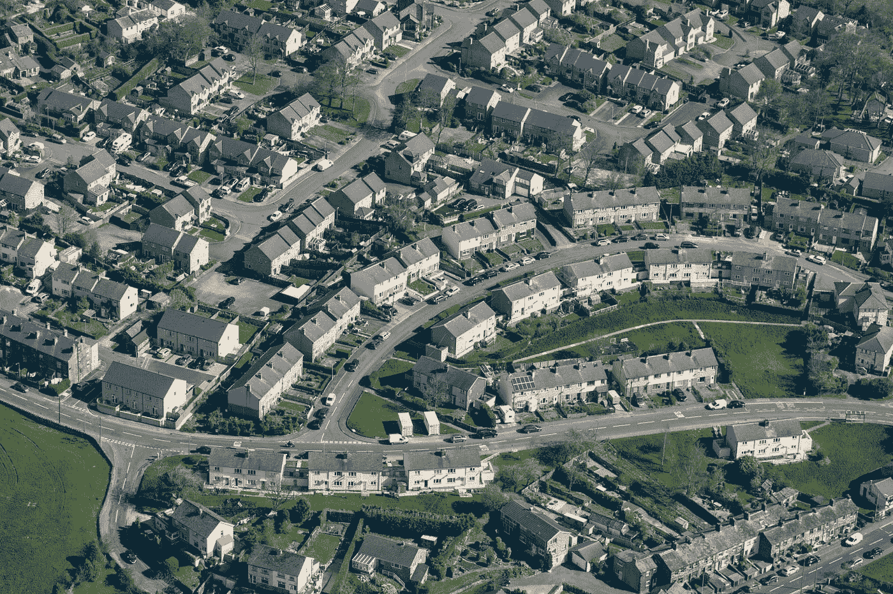

# 偏离正轨的房屋所有权运动

> 原文：<https://medium.datadriveninvestor.com/the-home-ownership-campaign-that-went-awry-32c4d10d041d?source=collection_archive---------19----------------------->

Photo by [Richard Horne](https://unsplash.com/@richardhorne?utm_source=medium&utm_medium=referral) on [Unsplash](https://unsplash.com?utm_source=medium&utm_medium=referral)

2008 年的危机以其一连串内爆而闻名，从华尔街的高层次证券化延伸到主街的基础贷款，在这中间的几年里，当然没有缺少评论。然而，这种大量的聊天并没有确切地产生一个坚实的共识，究竟是什么造成了这一切摆在首位。

这在很大程度上是因为 2008 年的危机无法追溯到单一源头；相反，它是许多元素的混搭:存在相互依赖，但也存在元素的反常碰撞。

这一惊人的不幸已经过去多年，但某种程度的模糊性仍然笼罩着画面，因此，个人很自然地倾向于选择一个或几个因素，并写出一个对过去有意义的故事。因此，缺乏共识和大量相互竞争的故事。

**有道德风险的故事，有监管不足的故事，有令人讨厌的会计实务的故事，等等。我们人类倾向于找出并谴责一个“罪魁祸首”，但事实上，这个故事是巨大的、多面的，缺乏帮助我们理解过去事件的线性。**

考虑到这一点，我想重点谈谈这些多重因素中的一个:房屋所有权运动出了差错。毫无疑问，这仅仅是一个全国性金融崩溃的更大故事中的一个促成因素(尤其是因为我们甚至没有办法*知道*它扮演了多大的角色)。

这个特别的小故事引发了一场政治运动，其初衷是好的，但最终却导致了明显糟糕的结果。十年的房屋收益在令人喘不过气来的几个月内崩溃，变成一堆房屋损失。这无疑是一个惊人的逆转。

这是一个政治和经济混乱而激烈碰撞的故事。这是一个关于主动性进化的故事，当它们达到一个危险的突变点并开始改变经济信号时。这是一个关于未能设想善意的住房所有权运动将如何在规模、激励措施以及公众期望和经济机会主义的快速发展环境等问题上成熟的故事。

# **这一切是如何开始的**

“房屋所有权运动”在法律上属于“社区再投资法案”。这是一项联邦法律，于 1977 年首次出现，旨在鼓励银行向低收入人群提供更多负担得起和容易获得的住房贷款。当 90 年代到来时，时任总统比尔·克林顿对 CRA 进行了著名的调整，包括向银行机构施加压力，让它们发放风险更高的贷款。这意义重大。

这些修正案导致了最初以机会为基础的立法转变为以结果为基础的立法，重点是以新的可疑方式获得新购房者的配额。对于没有达到令人满意的配额的银行，被指控歧视的恐惧升温，维权组织以这种方式瞄准银行，恳求它们降低贷款标准。

法律没有明确强制执行这种“配额”并不重要；房屋所有权运动已经获得了巨大的政治影响力，光是名誉受损的威胁就足以促使银行就范。

# **“新常态”的奇妙演变**

银行业*和*站在同一阵线，反对意见几乎没有大张旗鼓地宣布，这并不奇怪。很难反对向那些弱势群体敞开机会之门。社会正义运动经常是一个滑溜溜的地方——例如，对 20 世纪 90 年代购房热潮的长期金融智慧的疑虑很快被视为倒退的悲观主义而被抛弃，这揭示了激进主义的核心看似闪亮的道德核心。没有人想被称为无情的失败主义者。

**很少有人愿意公开批评乐善好施的撒玛利亚人，表面上是为了改善世界而放松贷款标准，以实现更多的经济适用房，而唯一可以利用的反对理由是忠于谨慎原则，渴望以数字为中心和有商业头脑。**

如前所述，谨慎被转化为悲观，一个“以数字为中心”和“以商业为目的”的目标很容易被当作逃避为住房所有权倡议做出贡献这一崇高职责的借口而被摒弃。因此，人道主义的论点战胜了谨慎的论点(如果有勇气的话)。

这里有一个案例研究了软改革的力量，而不是明确法律的重击。银行更多的是受到压力，而不是被迫的(或者至少是通过需要避免“不公平贷款”的指控而间接被迫的)。

但压力是唯一的代价，很快一个新的贷款标准就出台了。“新常态”是非常有趣的东西，人们需要减少对这种新鲜感的着迷，而更多地致力于以批判的、甚至怀疑的眼光审视它们最初是如何成为的。研究新常态的演变很重要，因为它揭示了谁掌握权力，谁有能力维持新的现状。

因此，不管银行是否愿意，向以前不合格的个人提供贷款现在已经提上了议事日程。每个人都在这么做。它变得越正常，人们就越有信心认为这是自然的(也是必要的！)努力追求。当某样东西变得更受欢迎时，它的受欢迎程度本身就能在我们人类的潜意识中成为其合法性的逻辑依据，因此我们忽略了质疑其受欢迎程度的潜在价值*。尽管如此，这种转变只是故事的一小部分。*

* [## 对有商业头脑的投资者有用的行为经济学概念|数据驱动的投资者

### 在美国企业界，高斯统计，对我们周围世界的确定性解释，以及理性…

www.datadriveninvestor.com](https://www.datadriveninvestor.com/2020/07/09/helpful-behavioral-economics-concepts-for-the-business-minded/) 

# **进入 2000 年代&一个强化的反馈周期**

新千年到来后不久，利率就下调了……一降再降。他们坐在那里。回想起来，比他们应该做的要长得多。这些历史(和长期)低点被广泛认为是创造了一个成熟的资产泡沫环境——在这种情况下，是抵押贷款泡沫。在低利率的情况下，人们很自然地会留意它们所传递的经济信号。他们自然会按照自己的利益行事。

例如，在获得丰厚利润的预期(即利用低利率和房价上涨的趋势)的诱惑下，房主为他们的房屋进行再融资变得越来越普遍。此外，人们的态度发生了转变:人们开始将美国房产视为一个投资机会。繁荣时期的再融资是一种巧妙的利用系统的手段。

当然，与华尔街抵押贷款证券化的规模相比，大量涌入的新抵押贷款相形见绌。因此，许多人认为，纽约那些雄心勃勃、“贪婪成性”的银行家应该为随后的金融灾难负责。他们当然不应该受到所有的指责。

事实上，抵押贷款证券化是政府自己鼓励的。房利美和房地美吞噬了数万亿美元的抵押贷款，在这样做的过程中，扭曲了现有的风险数量，并为更多的抵押贷款证券化创造了一个人为的经济信号。

这造成了一种危险的耦合，因为华尔街对抵押贷款证券化并出售给投资者的偏好助长了对更多抵押贷款的偏好。这种共生动力的演变对经济学来说是自然的，对追踪自然本身逻辑的自由市场来说也是自然的。

重要的是，在这种情况下，经济信号被破坏了。压低利率是一个因素。房利美和房地美的行为引发的道德风险和虚假需求也是如此。因此，随着抵押贷款需求和抵押贷款世俗化需求的加剧，两者无休止地相互依赖，恶性循环随之而来。

虚假的经济信号创造了一个变异的、错误的现实——泡沫总是如此，前面提到的泡沫膨胀到了巨大的高度。

# **政治机器&经济机器**

在最繁荣的时期，政府及其各种机构的自有住房运动进展顺利。布什总统赞扬了它的成就，并宣布他致力于这一事业。毕竟，越来越多的美国人拥有住房听起来不是一个明显的胜利吗？

在经济领域(华尔街)，抵押贷款的涌入被证明是有吸引力的赚钱工具，因为这些按风险分类的大额贷款可以很容易地被塞进投资者迅速抢购的各种信贷工具中。贷款人进一步降低标准，以跟上华尔街日益膨胀的胃口，最终跌跌撞撞地进入无单据贷款的阴影地带。

我们扪心自问，如此大规模的危机是如何荒谬地发生的，因为它的长期存在是基于高度适应的经济参与者之间明显而简单的供求经济概念。(当然，问题不在于供求机制，而在于现实变化的基本假设被破坏了。)

指责贯穿了整个层级:不仅华尔街将他们肯定(在某个时候)怀疑质量可疑的产品推向市场，抵押贷款机构也用一大堆申请签署了数百万份不仅是不明智的选择，坦率地说，也是不道德的选择。

总而言之，政治机器和经济机器之间的紧张关系产生了令人难以置信的令人不快的结果。这导致数百万房主别无选择，只能交出他们得到保证能买得起的房子的钥匙。

**该倡议——如前所述，在 90 年代变得尤为激进——并没有像预期的那样*帮助*低收入和边缘化人群。反而伤害了他们。不仅房屋所有权收益化为乌有，而且对所有相关的人来说，经济也大大恶化了。(更不用说这些家庭肯定遭受的心理痛苦了。)**

# 这个故事的寓意

这应该是关于金融恰当角色的一课。**银行不需要成为社会正义的武器，尤其是在它们需要偿付能力和道德实践的情况下。毕竟，银行既有经济使命(追求利润)，也有道德使命(避免欺诈和欺骗)。**

当他们的行为变得政治化时(例如，当不愿意降低贷款标准的银行受到歧视指控时)，这就破坏了他们必要的职能。银行不应该被社会公正的要求所束缚，因为这是一个危险的领域。如果它们是“排斥性的”,那么当银行显然必须做出财务上合理的决定，并且必须牢记这一目标进行歧视时，自动做出“歧视”的假设是错误的。

有很多人反对“房屋所有权运动”(及其立法部门社区再投资法案)在 2008 年危机中发挥了任何有意义的作用。许多人对这种说法的反应就好像这是对该倡议的人道主义方面的冒犯，并拒绝接受任何批评，认为这不公平地牵连到这些措施旨在帮助的无辜的低收入群体。

判决结果？意图是什么并不重要；因为后果是我们必须忍受的。更多“可获得的”抵押贷款听起来是一个好的政治主意，这并不重要。事实是，这些举措的长期经济后果是致命的。而且，不管怎样，[的证据](https://www.nber.org/papers/w18609)确实表明，这一举措助长了风险更高的借贷行为(这显然是次贷崩溃的基石)。

最终，08 年危机的故事是多方面的，前面的故事只是整个戏剧中的一部分。这是对政治动物“听起来不错”的活动家努力和经济动物泡沫及其壮观的涨跌之间的冲突的审视。

## 获得专家观点— [订阅 DDI 英特尔](https://datadriveninvestor.com/ddi-intel)*