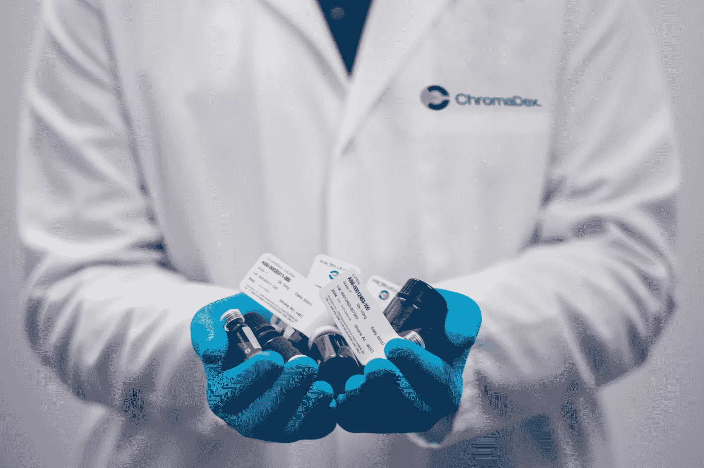

# 个性化医疗的时刻

> 原文：<https://medium.datadriveninvestor.com/the-hour-of-personalized-medicine-ed329b44bd45?source=collection_archive---------38----------------------->

为什么、何时以及如何塑造医疗保健的未来？

[Kendal](https://unsplash.com/@hikendal?utm_source=unsplash&utm_medium=referral&utm_content=creditCopyText) on [Unsplash](https://unsplash.com/s/photos/healthcare?utm_source=unsplash&utm_medium=referral&utm_content=creditCopyText)

个性化医疗也称为精准医疗(PM ),是一种临床模型，它将个人隔离到各种聚会中，根据患者的预期反应或对疾病风险的预期，为患者量身定制临床选择、实践、调解以及项目，并帮助根据疾病量身定制治疗。

简单地说，这是一个新兴的医学分支，它利用一个人的遗传特征来控制对疾病的预测、分析和治疗的选择。所以你说什么是独特？

这种方法依赖于对遗传、表观基因组和临床信息的感知，从而让我们了解一个人独特的基因组组合是如何使他们容易患某些疾病的。它有助于预测哪种药物治疗对个体患者是安全有效的。这是一个不断发展的领域，医生可以根据患者的基因特征选择治疗方法，这将自动增加积极的结果，减少有害的副作用。PM 可能汇集现有 med 的充分性，并使非 PM 方法识别的常规问题无效。用实验方法确定的不同结果包括药物危害性、药物合作、误诊、接受性治疗、药物毒性、药物相互作用、误诊和患者不满。这种方法减少了疾病治疗对非 PM 试错法的依赖。

个性化医疗的目标包括预防，而不是唯一的治疗。使用患者的分子分层，如评估导致对某些药物产生耐药性的突变，有助于医疗提供者为个体患者制定相应的治疗计划。目前，当今遵循的趋势是，当开出的药物无效时，患者可能转而使用另一种药物，这种药物延迟了有效的治疗，并可能导致疾病的发展。PM 的有效利用主要取决于全面指示装置的可及性，这些装置考虑了改善安静效果的恢复项目的理想选择。正如美国食品和药物管理局指出的，预防性维护的目的是通过更加可行地关注避免和治疗来提高效益和减少对患者的危险。然而，项目管理并不试图为患者创造新的药物，而是将人们划分为不同的亚群体，这些亚群体对有帮助的专家对他们的特定疾病的反应是不同的。

 [## 医疗保健太便宜，无法计量|数据驱动的投资者

### "当世界末日来临时，每个人都将独自购买医疗保健."戴夫“ePatient”德布朗卡特掉了这个…

www.datadriveninvestor.com](https://www.datadriveninvestor.com/2020/11/02/healthcare-too-cheap-to-meter/) 

预防性维护的好处:

*   减少财务和时间支出
*   早期疾病检测
*   疾病发展中早期基因组和表观基因组事件的检测
*   提高患者的质量和寿命
*   消除了痛苦治疗的需要
*   提高患者满意度
*   提高用药满意度
*   减少副作用
*   将医学的目标从反应性转向预防性
*   提高成本效益

许多研究表明，它的应用非常广泛，在许多例子中，最著名的是 CYP 450 酶及其在香豆定/华法林治疗中的应用。根据卡特博士和刘博士的说法，华法林的个性化剂量在美国可以预防 17，000 例中风，并避免 43，000 次急诊室就诊。

现在的问题是，如果它是如此全面和有益的，那么是什么阻止了医疗保健提供商部署它呢？嗯，在执行过程中有一些小问题，比如为医生提供正确的数据，社区医院下一代测序的可及性和可负担性，监管机构的批准以及规范和监管实践的普遍机构。是的，所有开创性的模型都是老样子。

尽管这种方法目前受到许多法律和伦理约束和困境的困扰，但如果将其纳入传统医学，个性化医学的未来将为制药公司开发分子靶向治疗剂打开许多大门，此外还将增强现有药物和组合疗法的最佳使用和再利用。它将改变诊断和治疗的方法，并增加患者在治疗过程中和治疗后的参与，从而有助于提供适合个人需要的量身定制的护理，使医生和患者都受益。

## 获得专家观点— [订阅 DDI 英特尔](https://datadriveninvestor.com/ddi-intel)