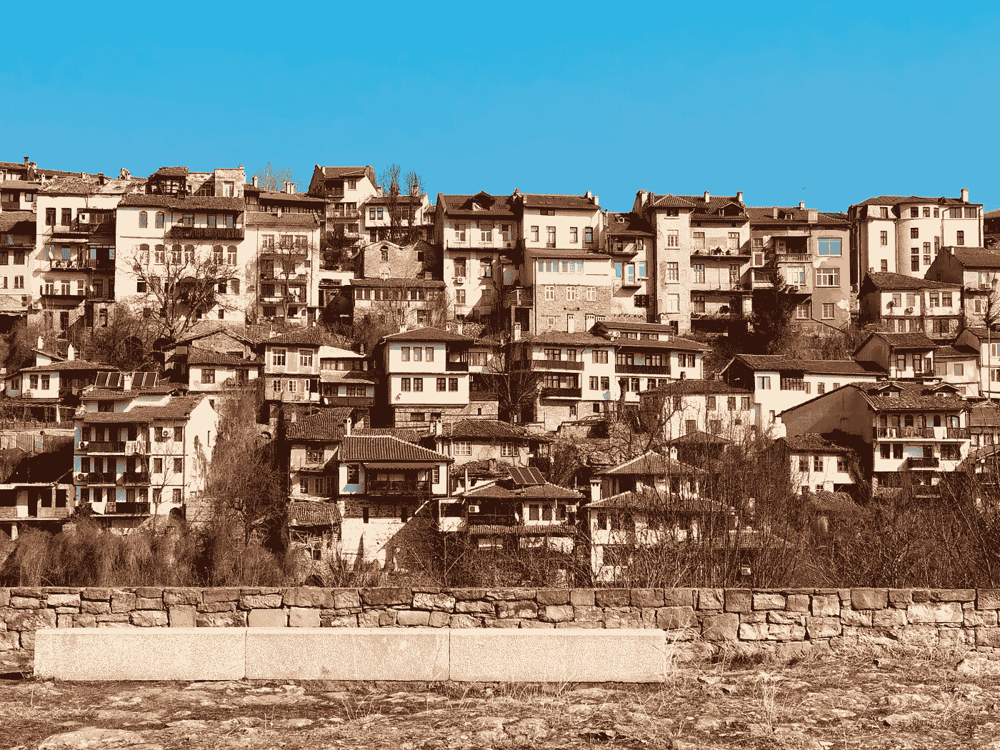

# 住房问题和我们的经济

> 原文：<https://medium.datadriveninvestor.com/the-housing-problem-and-our-economy-4ce6ccce83e6?source=collection_archive---------25----------------------->

更好的交通能解决我们买不起房子的问题吗？

Photo by [Ryan](https://unsplash.com/@ryantula?utm_source=unsplash&utm_medium=referral&utm_content=creditCopyText) on [Unsplash](https://unsplash.com/s/photos/housing?utm_source=unsplash&utm_medium=referral&utm_content=creditCopyText)

我们面临的大多数重大经济挑战在某种程度上都与缺乏负担得起的交通工具和负担得起的住房有关。

年轻人的住房拥有率处于几十年来的最低水平。我国人口的很大一部分已经成为租房者，而不是房主。有些人将高达 50%的收入用于支付房租。

无家可归的人数正在上升，每年都有越来越多的家庭因驱逐而流离失所。

 [## 经济就是包容人|数据驱动的投资者

### 建模，数据，最重要的是，人 Tayo Oyedeji 博士在他的食谱中混合了所有这些成分，为一个…

www.datadriveninvestor.com](https://www.datadriveninvestor.com/2019/03/06/economy-is-all-about-including-people/) 

很大一部分通勤者每天花 3 个小时往返于工作地点。

## 缺乏负担得起的住房与缺乏可利用的建筑用地有关吗？

快速浏览一下大多数城市周围土地的全景图，会发现有足够多的土地，但是需要更有效地利用地球。

这种对作为科技和金融中心的城市周边地区的低效利用尤其糟糕。这种观点清楚地表明了人们想要工作和生活的城市缺乏住房。

现有的房主和当地的政治力量竭尽全力建造更多的房屋，更小的地块或允许多家庭单位。

对于上面的问题，我们有足够的场地，但是由于限制性的分区法，我们没有充分利用现有的空间。

## 一个改进的交通系统能解决这些问题吗？

需要讨论如何让人们住在离工作地点更近的地方。

我们目前的交通方式约占每年二氧化碳排放量的 1/3。不解决交通问题，就不可能就气候变化和如何应对气候变化进行有意义的对话。

我们目前的制度是，一两个人乘坐一辆 5000 磅重的汽车，每天花两三个小时往返工作地点，这种制度应该改变。增加公共交通的可用性是我们可以用来减少这些排放的一个可能的方法。

与此同时，需要修改分区法，以允许更多的多家庭住房单元靠近扩大的公共交通路线。

交通的改善可以解决其中的一些问题。然而，真正的改变必须是在人们的思想中。必须认识到旧的建房方式必须改变。

*   无家可归在很大程度上与住房费用有关。
*   为了帮助应对气候变化，我们必须增加住房密度和公共交通。
*   如果人们希望他们的孩子有一个稳定的经济未来，他们就需要为更多的住房腾出空间。
*   许多城市增加工作岗位的速度比增加住房的速度快得多。
*   我们需要考虑在工作需求不断增加的城市及其周边增加人口的经济效益。
*   如果这些问题要得到有益的解决，人们需要改变他们对住房和交通的看法。

## 我们如何改善发展？

在 2018 年下半年的某个时候，明尼阿波利斯成为第一个结束单家庭分区的主要城市。俄勒冈州即将成为第一个大幅限制独栋住宅区划的州。这两项措施的实施都需要时间，但它们是朝着正确方向迈出的第一步。

随着越来越多的经济学家投入更多的时间和精力来分析住房状况，他们越来越意识到住房危机正在损害我们的国内生产总值。它通过减少经济发展的机会，使收入差距变得更加严重。低收入人群负担不起搬迁到收入更高的地区。

在这次选举周期中，一些提案浮出水面，包括增加经济适用房的资金数额，为租房者提供一些税收减免，以及可能的一些联邦授权，以迫使分区法发生变化。

## 什么时候或者如果高铁？

2009 年，美国政府提出了与欧洲高铁相媲美的高铁线路。有四个旨在建设高速铁路的大型项目，开始时，三个没有收到资金，第四个在加州，仍然落后了好几个月。其他几个项目进展缓慢，但离完成还有很长的路要走。

许多提案从一开始就没有得到足够的资金。然而，为了提高市内客运列车的可靠性、质量和频率，资金被重新分配。许多政治家，尤其是右翼，已经表示反对任何联邦资助的客运铁路线。

许多反对高速铁路线的政治论点都集中在相对于 farebox 产生的收入的建设成本上，这被称为 Farebox 回收率。大多数经济学家都会同意，这种观点相当短视。farebox 还有其他不算在内的好处。

好处之一是减少排放，这是应对气候变化所必需的。另一个原因是交通拥堵的减少，这意味着运送我们所有物资的卡车的通勤时间和行程都将缩短。

伊利诺伊州 Normal 市市长报告了另一个不包括在 farebox 中的福利的例子。2016 年，他就美国国家铁路客运公司火车站重建的结果向众议院交通和公共资产小组委员会作证。" Normal 住宅区现在是一个充满活力的社区，拥有住宅、商业和娱乐机会."公共资金达到 8500 万美元，这带来了 1 . 5 亿美元的额外私人投资。

一个关于铁路线的提议是允许在火车站附近建造多户住宅。即使人们从他们的公寓或公寓开车到火车站的距离很短，我们也可以看到排放量的显著减少。

随着越来越多的人获得高薪工作，我们可能会看到无家可归者减少，吸毒成瘾和犯罪也可能减少。

## 综上

这些都是非常复杂的问题，解决方案也必然如此。达成可行解决方案的大部分困难在于人类心理学领域。妖魔化反对派比寻找共同点和试图达成妥协更容易。

在妥协中，没有人得到自己想要的一切，但每个人都有所收获。整个社会都将受益，这将为每个人创造一个更美好的世界。俗话说:“有一块馅饼总比没有好。”

我们需要停止从当前成本的角度考虑基础设施投资。这是对未来的投资。为了创造更美好的未来，我们需要增加目前在住房和交通领域的投资。

变化可能是一件可怕的事情，但不管我们喜欢与否，变化总会到来。这些问题不会消失，如果我们现在找不到可行的解决方案，它们在未来只会变得更糟。

对我们的同胞的一点同情会给我们所有人带来巨大的好处。