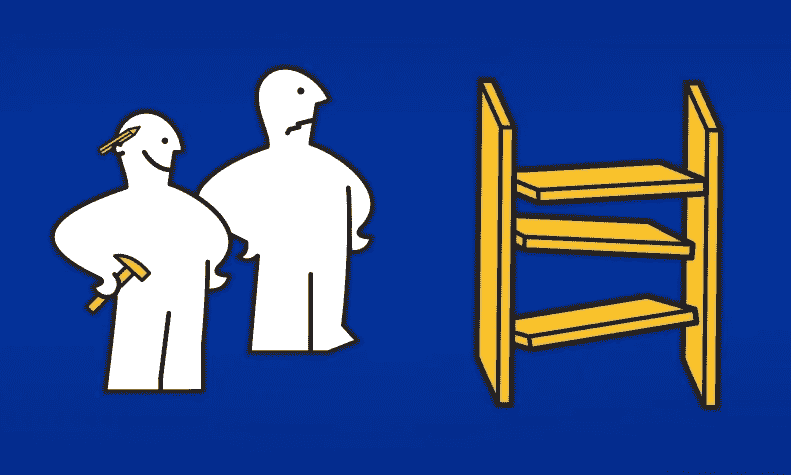
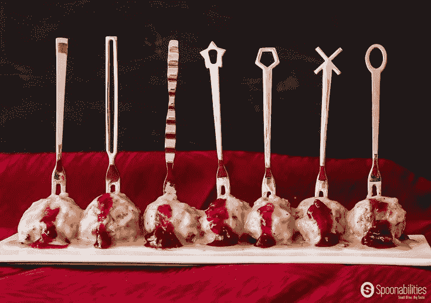

# 宜家效应正在创造僵尸。以下是对抗它们的方法

> 原文：<https://medium.datadriveninvestor.com/the-ikea-effect-is-creating-zombies-heres-how-to-fight-them-6a5e28018566?source=collection_archive---------24----------------------->

大学四年级的时候，我上过陶艺课。

在学习扔轮子之前，我们的作业之一是用粘土板制作一个功能性的作品。我设计了一个灵感来自《爱丽丝梦游仙境》的花瓶，并做了一些类似的设计。

显然，导师对我与生俱来的天赋印象深刻，他提出教我一种特殊的上釉技术，这种技术使用剧毒化学品来创造……嗯……我一听到“有毒化学品”就停止了聆听很危险，所以我加入了。

结果是一个相当畸形的花瓶(不是《爱丽丝梦游仙境》中的灵感)，看起来像是由大块生锈的金属制成的。

我喜欢它！

我的室友讨厌它。

她说这是她见过的最丑的东西，并禁止我把它放在公寓里任何她可能不幸看到的地方。

直到今天，她发誓这是她见过的最丑的东西。

我自豪地把它陈列在我办公室的书架上。

很容易把我们对我的艺术作品的不同反应解释为不同审美偏好的结果。虽然这可能有些道理，但我怀疑更好的解释是宜家效应。

## **宜家效应**

2011 年，哈佛商学院、耶鲁大学和杜克大学的教授首次发现并命名了宜家效应，这是一种认知偏差，人们对自己部分创造的产品赋予了过高的价值。

想想吧。我们都有自己组装、设计、制作、安装或建造的家具、艺术品、工艺项目或家居装修作品，我们绝对喜欢并拒绝放弃。

没有人理解我们为什么不放弃那个破碎的、破旧的、积满灰尘的、过时的、金钱的坑，但是，我们相信，这仅仅是因为他们不理解或看不到我们在做什么，一旦他们理解了，他们也会看到它的价值所在。

同样的行为也发生在创新中。团队投资数月甚至数年，开发、测试和推出新产品和服务，然而，当市场没有反应时(即，没有需求、有意义的收入或潜在利润)，产品或服务继续提供。

这是宜家效应在发挥作用。

而结果就是丧尸。

## **宜家效应僵尸**

随着越来越多的证据表明该项目不会取得市场成功，创新团队迫切地进行投资，相信更多的营销、更多的销售电话和更多的折扣将吸引那些肯定存在的客户。当增加的投资没有产生预期的结果时，资源被慢慢地“重新分配”，项目被“去优先化”，留下一个骨干团队来使它工作。项目是僵尸，是创新项目的活死人化身。

鉴于这种行为的共性，你可能会认为识别僵尸很容易。你就错了。

虽然宜家效应被认为是沉没成本效应和“不是这里发明的”综合症的原因之一，但它是一种更为根本的效应，深深植根于人们的情感和身份，并可能在基于精心挑选的数据的“逻辑”论证中表现出来。

这使得发现宜家效应僵尸几乎和杀死一个僵尸一样困难。

这就是为什么了解你的僵尸很重要:

**HiPPOPs** —薪酬最高的人的意见项目(HiPPOPs)是由一名高级管理人员设想、开发和推动的。当与主管意见相反的数据出现时，主管会找到另一份数据来支持他们的意见。该项目在管理层的支持下蹒跚前行了数年，整个组织的人眼睁睁地看着它慢慢腐烂。

**常年枢纽**——这些项目总是离成功只有一个枢纽。由一群永远的乐观主义者创造，没有失败这回事，只有学习什么不该做，什么该试。

**意外之财行者**——当你听到“这是一笔小投资，回报可能是巨大的”时，行者就在不远处。这些项目通常是个人的心血结晶，其承诺远大于回报。但他们活了下来，因为每个人都默默地同意，与僵尸生活在一起比杀死它更容易。

希望猎人(Hope Hunter)——也许是所有僵尸中最危险和残酷的，这些项目总是提供一线希望，即成功的曲棍球棒只是一个季度，一个客户，或一个公关时刻。确信坚持到底，再投入一美元、一个月或一个客户电话，就能让项目起死回生。

## **如何应对宜家效应僵尸**

就像所有其他冒险故事一样，问题的来源也是解决方案。在这种情况下，宜家创造了效果，他们的商场指出了解决方案。

**要杀丧尸，坚守阵地。**

当你不再专注于创造和交付合意的(解决客户的问题)、可行的(可以创造)和有吸引力的(达到或超过关键的战略和财务目标)的东西时，僵尸就出现了。

因为僵尸是你迷路的标志，所以当你在宜家迷路时，你需要做同样的事情——停下来，拿出地图，重新确定自己的方向。

回到你最初追求项目的标准。该项目是否仍然符合阈值，或者是否发生了某些变化，如公司的战略或项目的结果？变更如何影响项目的合意性、可行性和吸引力？根据这些变化，企业应该做什么？

当你重新定位自己的时候，试着保持客观，避免责备他人或打击自己的冲动。最重要的不是你如何来到这里，而是你从这里走向何方。

**躲避丧尸:**

***关注肉丸。*** 说实话，每次宜家之旅最棒的部分就是结账后咖啡馆里的肉丸(和越橘酱)。展厅里的每一次分心和折返都推迟了吃肉丸(和越橘果酱)的满足感。

当你开始一个创新项目时，一开始就设定一个清晰、客观、可衡量的目标。那是你的肉丸。在每个项目里程碑，重新审视目标。它仍然是一个理想的目标吗？或者业务中的某些东西已经发生了根本的变化，需要目标改变吗？相信项目将实现目标是否仍然合理，或者你是否学到了一些使目标不太可能甚至不可能实现的东西？

专注于目标，客观地评估你实现目标的可能性，会让你更容易放弃一个不能让你达到目标的项目。

***跟着箭头走。*** 宜家展厅地图通常和家具附带的组装说明一样有用。一点也不。这就是为什么地板上有箭头，天花板上挂着标志，引导你购物，最终找到肉丸。

具有清晰治理的项目过程相当于楼层箭头和天花板标志的创新。在开始创新项目之前，确定所需的活动、额外资源必须达到的阈值、团队成员的角色和职责以及决策标准。

当你做创新的工作时，你将提炼过程和治理。到你的第三个项目时，它应该已经完成了 80%,到你的第五个项目时，它应该已经完成了 90%(你永远不希望它是 100%,因为创新确实需要一点灵活性)。

创建并遵循标准流程和目标治理模式有助于消除驱动宜家效应和制造僵尸的情绪。

**僵尸和宜家效应自由创新区**

通过承认组织中的创新效应，识别并消灭它所创造的僵尸，并制定目标、流程和治理以防止僵尸的再次出现，您正在朝着更高效、更有效和更成功的创新努力前进。

我推荐用肉丸(和越橘酱)庆祝！

*Robyn M. Bolton 是 MileZero* *公司的创始人&首席导航员，她在该公司与价值数十亿美元的公司合作，利用创新创造有意义的新增长。你可以在*[*www . mile zero . io*](http://www.milezero.io/)阅读更多关于她和她的作品