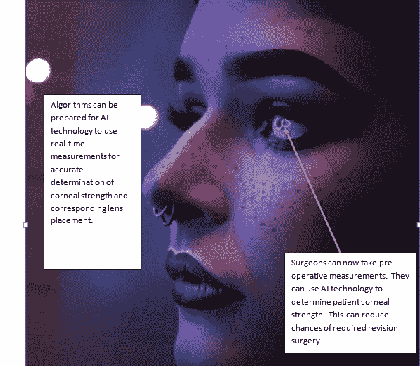
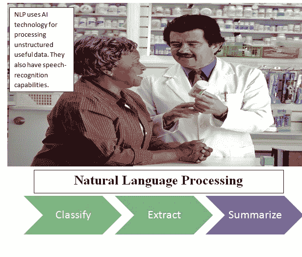
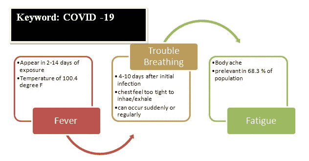

# 人工智能对现代外科的影响

> 原文：<https://medium.datadriveninvestor.com/the-impact-of-artificial-intelligence-in-modern-surgery-5df1511bf7dd?source=collection_archive---------5----------------------->

Photo by [National Cancer Institute](https://unsplash.com/@nci?utm_source=unsplash&utm_medium=referral&utm_content=creditCopyText) on [Unsplash](https://unsplash.com/s/photos/healthcare?utm_source=unsplash&utm_medium=referral&utm_content=creditCopyText)

*人工智能(AI)现在已经扩展到主要工业部门和其他高科技金融和网络安全公司的主要应用领域之外。他们目前的目标是**医疗保健行业。***

*根据*statista.com*的数据显示，2019 年**美国医疗保健行业**的收入为**24870 亿美元**。初创公司和风险投资家(VC)正在认识到 *AI* 和*机器学习(ML)* 解决方案在医疗保健行业的潜力，因为它为患者提供了提高效率和降低成本的解决方案。根据**美国整形外科医生协会(ASPS)的数据，**2018 年美国人在美容整形手术上的花费超过**165 亿美元**。总的来说，自去年以来，外科医生和手术的成本*增加了 4 %多一点。**

*矫正手术也称为屈光眼科手术，用于视力矫正。人工智能用于改变白内障手术的传统方法。以前，外科医生不得不依靠*患者眼睛的静态图像*和*其他常规测量*来摘除白内障。这为包括人工智能技术提供了范围，以提高效率和与手术相关的并发症。现在，人工智能可以用来与以前的数据进行比较，以确定患者的角膜强度和合适的晶状体。这将同时降低与翻修手术相关的成本并改善患者的健康状况。*

**

***(Modified)**Photo by [Yoal Desurmont](https://unsplash.com/@yoal_des?utm_source=unsplash&utm_medium=referral&utm_content=creditCopyText) on [Unsplash](https://unsplash.com/s/photos/cataract-eye?utm_source=unsplash&utm_medium=referral&utm_content=creditCopyText) **( Modified)***

***Optiwave 屈光分析(ORA)** 可以使用人工智能，实时测量可以使外科医生准确预测人工晶状体的位置。 ***ORA*** 进行瞬时微分计算，测量由 ***IOL*** 矫正的眼睛的屈光力。*

*大约在 1950 年， ***艾伦·图灵*** 提出了机器人辅助临床程序。他提出人类的决定可以被机器复制。*

*医疗领域的人工智能此前仅限于数据分析和诊断目的。医生通常使用它们来补充患者疾病诊断和治疗程序的决策过程。这种*最大限度地提高了可靠性和效率*鼓励外科医生选择具有认知人工智能或人工智能能力的机器人辅助手术技术。*

* [## 商业价值和人工智能的 5 个原则|数据驱动的投资者

### 提取商业价值很难。我是说真的很难...说到高级分析，这一过程甚至…

www.datadriveninvestor.com](https://www.datadriveninvestor.com/2020/07/07/5-principles-for-business-value-and-artificial-intelligence/) 

通过并入***【GPU】***进行图像分析，AI 在眼科领域开始流行进行图像分析。来自先前记录或实践的数据分析被比较用于手术的预测。人工智能可以提高图像质量，对手术所需的相关数据进行分类，并可以有效地补充外科医生的工作。

***【自然语言处理】*** 是另一项在外科领域有应用的 AI 技术。由于查看图表既费时又费力，NLP 可以从***【EHR】***电子健康记录中提取关键信息。Cody 等人设计了一个概念验证，使用 NLP 来确定***【THA】***全髋关节置换术所需的手术注意事项。NLP 算法能够以接近 99%的准确度提取 EHR 数据。它证实了该技术在从操作笔记中识别数据元素的有效性和潜在应用。

在外科领域实现 NLP 需要一系列步骤。 ***第一种方法*** 是将原始数据翻译成机器可读的语言。 *EPIC、AthenaHealth、GE Centricity* 是电子健康供应商(EHR)，专注于为医院和其他学术医疗中心开发软件和基于云的功能。非结构化的“原始”医疗数据在存储和执行分析方面都带来了挑战。NLP 有能力生成面向结果的结构化数据，可以进行分析并补充外科医生的工作。同时，它可以消除潜在的人为错误，从而减少处理时间，提高效率。

NLP 使用人工智能技术来处理非结构化的有用数据，并允许语音识别功能。它有三项任务:(一)对信息进行分类；(二)提取相关数据；(三)将其总结成机器可读的格式。

**(Modified)**Photo by [National Cancer Institute](https://unsplash.com/@nci?utm_source=unsplash&utm_medium=referral&utm_content=creditCopyText) on [Unsplash](https://unsplash.com/s/photos/rx-prescription?utm_source=unsplash&utm_medium=referral&utm_content=creditCopyText) **( Modified)**

在自然语言处理中，关键的患者信息可以包括:(I)社会和人口统计历史(ii)现有的医疗状况(iii)血型等。主界面被分成与关键字相关联的部分，例如:**新冠肺炎:** *发烧、发冷、呼吸困难。这种接口可以使诊断更容易，并有助于医生的工作。*

Potential Electronic health record (EHR) for COVID-19

艾米·金(Amy Jin)与斯坦福大学*的导师一起开发了一个可以衡量外科医生技术技能的软件程序。*该软件的目的是观察外科医生进行的视频操作，并跟踪器械的移动和定时。**

*手术机器人可以在任何手术过程中精确确定*深度*和*移动速度*。外科医生经常面临具有挑战性的重复性任务，人工智能集成可确保精确度，并避免因长时间运动肌肉疲劳而导致的任何意外事故。*深度学习(DL)* 可用于确定从实时观察外科医生的数据中收集的手术模式，并提供提高准确性的建议。*

****动词外科*** 由*(来自谷歌)和 ***Ethicon Endo 外科*** (强生)合伙组建。它旨在整合数据分析和 ML，使外科医生更加熟练，并通过具有成本效益的解决方案改善临床结果。Verb Surgical 的高级副总裁戴夫·赫尔曼(Dave Herrmann)将这家初创公司描述为外科医生使用单一平台来准备、执行和跟进病例的工具。它还将允许在全球范围内共享程序数据和学习最佳实践。数字手术平台旨在将技术转化为可操作的信息。**

**加州大学伯克利分校正在开发一种算法，允许机器人进行缝合。最初的模型是为腹腔镜手术开发的，但该模型的成功将允许适应各种其他外科机器人应用。I **初步研究显示成功率为 87 %** ，但随着手术并发症的增加，成功率急剧下降*。在这一过程中广泛采用*人工智能技术将会降低手术并发症和死亡率*。***

*加州大学圣地亚哥分校*的 ***高级机器人和控制实验室*** 正在利用机器学习为环境感知机器人设计生物医学机器人。他们正在研究使用*人工智能和运动规划算法*的手术机器人的控制策略。这将增加*精确度、控制力、灵活性*并允许机器人在真实的手术环境中适当地行动。**

**与缝合相关的类似研究在约翰·霍普斯金大学进行。 项目、*【STAR(智能组织自主机器人)*已经显示出与标准手术性能相当的成功。然而，在外科医院采用该平台之前，还需要进一步的研究。**

## **结论**

**人工智能技术正在不断发展，以整合外科医生的一些重复任务。它最终将允许外科医生处理外科手术的复杂挑战，而不是专注于重复的任务。然而，AI 的作用是补充外科医生的工作，而不是消除其作用，因为将其程序限制在算法上存在挑战。**

***NLP(自然语言处理)*的作用是将原始医疗数据转换成机器可读语言。这将允许人工智能进行数据分析，以获得更广泛的潜在问题视角。在开发复杂算法来复制外科医生使用的器械的运动和定时方面，已经取得了一些进展(在工业界和学术界)。尽管对于重复任务已经取得了显著的成功，但是对于复杂的新医学病例，它仍然具有独特的挑战。**

## **参考**

**[1][https://www . health catalyst . com/insights/how-health care-NLP-taps-unstructured-datas-potential](https://www.healthcatalyst.com/insights/how-healthcare-nlp-taps-unstructured-datas-potential)**

**[2][https://stanmed . Stanford . edu/2018 fall/young-scientist-artificial-intelligence-measures-surgeries-skill . html](https://stanmed.stanford.edu/2018fall/young-scientist-artificial-intelligence-measures-surgeons-skill.html)**

**[3][https://www . robotics . org/blog-article . cfm/Robotic-Surgery-The-Role-of-AI-and-Collaborative-Robots/181](https://www.robotics.org/blog-article.cfm/Robotic-Surgery-The-Role-of-AI-and-Collaborative-Robots/181)**

**[https://www.verbsurgical.com/physicians/](https://www.verbsurgical.com/physicians/)**

**[5][https://emerj . com/ai-sector-overviews/machine-learning-in-surgical-robotics-4-applications/](https://emerj.com/ai-sector-overviews/machine-learning-in-surgical-robotics-4-applications/)**

****访问专家视图—** [**订阅 DDI 英特尔**](https://datadriveninvestor.com/ddi-intel)***