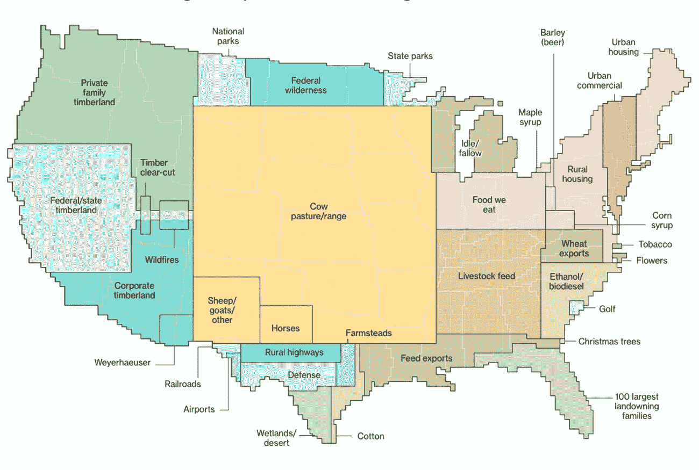

# 云对气候变化的影响

> 原文：<https://medium.datadriveninvestor.com/the-impact-of-cloud-on-climate-change-a45abc8145a4?source=collection_archive---------23----------------------->

*原载于* [*CloudOps 的博客*](https://www.cloudops.com/blog/) *。*

云计算对气候变化的影响是复杂的。数据中心在此过程中消耗能源并排放温室气体。预计到 2030 年，信息和通信技术产业将占据全球能源需求的 30%。目前，互联网技术消耗了世界能源供应的 7%,其碳足迹与航空业相同。

占全球能源需求 7%的这一来源，不会决定应对气候变化的成败。这一点最近被反复强调，因为人们呆在家里抗击新冠肺炎的传播。对于那些有幸订阅了《网飞》的人来说，狂看该剧的需求从未如此重要。然而，运输和工业生产的直线下降导致了近年来最低的碳排放量。要点:**应对气候变化需要一种“全社会”的方法。**

“全社会”包括云技术的排放，这使得对云的碳足迹的批评是正确的，但仅仅减少云的足迹并不能阻止气候变化。

让我们来解决云的碳足迹。一些供应商比其他供应商更环保。在 CloudOps，我们在很大程度上依赖魁北克的水力发电网，这使我们的低碳足迹吸引了像[伍兹霍尔研究中心](https://whrc.org/)这样的环保合作伙伴。

微软承诺在 2030 年成为碳负*负*负[，吸收比他们产生的更多的二氧化碳。谷歌已经将其数据中心使用的每千瓦时不可再生能源与购买的每千瓦时可再生能源相匹配，这是它](https://blogs.microsoft.com/blog/2020/01/16/microsoft-will-be-carbon-negative-by-2030/)[在 2018 年](https://blog.google/topics/environment/meeting-our-match-buying-100-percent-renewable-energy/)实现的。依靠购买能源来抵消排放是有争议的，但谷歌实施这一政策的规模，以及对新的可再生能源的投资，使得谷歌对环境的贡献意义重大。苹果进行了大量投资——83%的能源消耗来自可再生能源。

IBM 承诺到 2025 年 55%的能源依赖于可再生能源，声称到 2018 年其 38%的能源消耗已经来自可再生能源。不幸的是，阿里云在中国仍然严重依赖燃煤电网。亚马逊的 AWS 正在取得进展，以摆脱其燃煤时代，并在世界各地安装了几个[太阳能和风力发电厂](https://aws.amazon.com/about-aws/sustainability/sustainability-timeline/)，但随着它在“世界数据中心之都”北弗吉尼亚迅速扩大其[业务，自 2016 年以来，那里没有投资或计划投资可再生能源，它还有很长的路要走。微软和脸书也增加了他们在北弗吉尼亚州的业务，但也增加了他们在那里的可再生能源消耗。苹果在北弗吉尼亚的数据中心已经完全改用可再生能源。事实上，北弗吉尼亚(只有 4%的能源生产来自可再生能源，大约 40%的新云基础设施是在 2018 年开发的](https://www.greenpeace.org/usa/news/greenpeace-finds-amazon-breaking-commitment-to-power-cloud-with-100-renewable-energy/))是世界上云计算碳排放的最大来源之一。

然而，让我们记住，即使北弗吉尼亚的云基础设施 100%由可再生能源供电，气候变化也无法避免。总体而言，与工业的许多其他部门相比，云公司在可再生能源上的投资不成比例地大。我的一部分认为云计算上的“反气候变化”论点有利于石油和天然气生产，因为人们认为环保主义者想要关闭 YouTube。正如我认识的许多环境科学家一样，我向你保证事实并非如此。我们的主要目标是，而且必须继续是，让我们所有部门的能源消费摆脱化石燃料。

但是我们怎么做呢？这里值得考虑选项的多样性。这里一个很好的资源是[项目拨款](https://drawdown.org/)。[削减审查](https://drawdown.org/sites/default/files/pdfs/Drawdown_Review_2020_march10.pdf)汇集气候解决方案，提出如何降低大气中温室气体的水平。它关注 3 个主要领域:减少排放、支持碳汇和改善社会。

下降表明，随着可再生能源生产的扩大，其他一些领域也很重要。随着化学制冷剂使用范围的扩大，改善化学制冷剂的储存和处理将变得非常重要，因为化学制冷剂是极其强效的温室气体。通过替代或减少肉类(尤其是牛肉)的消费，食用食物链中较低的蛋白质，将阻止自然碳汇转化为农田。就每卡路里而言，无肉饮食更加环保。即使是天然的草饲牛肉也不是气候解决方案，也不能满足今天的肉类需求。特别是在巴西，当热带雨林被砍伐用来养牛时，气候和生物影响是毁灭性的。在美国，面积是巨大的。

美国不同部门使用土地的比例显示为连续的地块。看看有多少是用来养牛和生产牲畜饲料的就知道了。来自[彭博 2018](https://www.bloomberg.com/graphics/2018-us-land-use/) 。

然而，云可能会来拯救这里，因为许多现代能源技术将结合云/物联网的某些方面。下一代智能电网的安全性和隐私性与互联网相似。而且，就像互联网一样，需要对其道德使用进行早期定义。

在我们技术能力的这个阶段，长距离运输和分配能源的能力对于应对气候变化至关重要。可再生能源可以跨时区产生。能源市场可以向小企业开放，让它们赚钱，因为它们生产的能源可以在高峰时间出售给遥远的地区。云将会在那里，保持它的运行。

## 特里斯坦·科斯丘奇

Tristan 是一名进化生物学家，对景观水平对遗传和表型变异的影响感兴趣。他在温哥华岛研究三棘鱼，在维多利亚湖流域研究尼罗河鲈鱼和单带喙慈鲷。他在棘鱼方面的工作使用遥感来量化环境，以测试进化的可预测性。

*本帖原载* [*此处*](https://www.cloudops.com/blog/is-the-cloud-causing-climate-change/) *于* [*CloudOps 的博客*](https://www.cloudops.com/blog/) *。*

[**注册订阅 CloudOps 每月简讯，了解最新的 DevOps 和云原生开发。**](https://www.cloudops.com/newsletter-signup/)