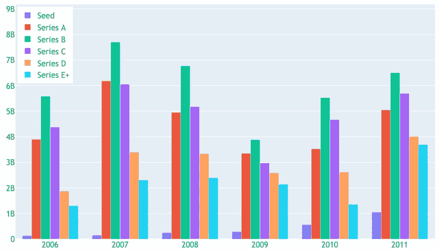

# COVID 19 对风险投资行业的影响

> 原文：<https://medium.datadriveninvestor.com/the-impact-of-covid-19-on-the-venture-capital-sector-85098c1de054?source=collection_archive---------10----------------------->

## 从大萧条到 COVID19 的风险资本市场分析。

当分析一家初创公司，尤其是处于早期阶段的公司时，投资者关注三个主要因素:团队、市场和产品。危机时刻不会降低非凡企业家的能力，产品也不会失去其技术品质。因此，改变并因此影响投资和估值的主要变量是市场。

目前的情况仍然存在许多不确定性，一直很大的市场可能会急剧下降，而在此之前不相关的细分市场可能会增强。在本文中，我们将探索风险资本市场的数据，以推断可能发生的变化。

Source: Unsplash [@frankbusch](https://unsplash.com/@frankbusch) — A man in front of a screen with a red arrow

# 1.大萧条

在这一步，我们将探索大衰退期间位于美国的初创公司的交易。

## 1.1.2006 年至 2011 年间的交易数量和投资总额

2008 年的危机没有影响种子交易的数量，这一时期种子交易数量显著增长。其他几轮在 2008 年和 2009 年有所下降，直到 2010 年才开始恢复增长。

Left: Number of transactions per year given the classification of the round. Right: Total amount invested, in USD billions, per year, given the rating of the round. (Startups based in the USA). Source: Crunchbase.

创业公司的目标是上市或被大公司收购，以获得良好的估值。通过这种方式，危机产生的变化影响了公开交易，降低了流动性事件成功的机会，尤其是对后期创业公司而言。在这种情况下，我认为种子投资变得更有吸引力，因为长期投资与市场条件改善的预期相结合。

 [## 如何真正衡量一个风险投资家的业绩？数据驱动的投资者

### 安德森·霍洛维茨的回报落后于风险投资精英安杰利斯特希望提高风险投资基金的业绩与…

www.datadriveninvestor.com](https://www.datadriveninvestor.com/2020/05/17/how-to-truly-measure-a-venture-capitalists-performance/) 

当看投资量时，我们意识到种子轮的代表性仍然很小，尽管在危机中有所增长。因此，种子投资的增长可以被理解为风险资本基金的一种选择，以继续寻找机会，放弃对资本的需求。

**从 A 轮开始的所有融资都遭遇了强劲的缩减** , **主要在 2009 年**注意到，因为 2008 年上半年能够保证全年良好的投资。还可能注意到，即使在 2011 年，某些回合的投资额也没有达到 2007 年的水平。

## 1.2.2006 年和 2011 年之间的回合数

2009 年，无论交易的分类如何，本轮融资的规模中位数都有所下降，其中种子投资的降幅最大。对于早期阶段和晚期阶段，四分位间距变化不大，但交易数量的急剧下降导致了该时期投资总额的减少。

Boxplot⁷ — Annual distribution of the rounds size in USD given the classification. Early-Stage: Series A and Series B. Late-Stage: Series C + (Startups located in the USA). Source: Crunchbase.

我们看到，总体而言，危机降低了交易数量和融资规模。

Representativeness of rounds of a certain size (range in USD) in relation to the total number of transactions in a given year. (Startups located in the USA). Source: Crunchbase.

在下图中，交易根据投资总额分成了几组。2008 年后，2M 高达美元的投资变得越来越重要，在 2010 年和 2011 年超过了 50%。这种增长是种子交易数量增加和首轮融资规模下降的结果。

使用的样本不包括估值数据，因此无法确定[下跌](https://www.investopedia.com/terms/d/downround.asp)的确切数量。然而，我们通过观察新一轮融资规模小于前几轮融资规模的创业公司数量，得到了一个接近的概念。这种情况并不常见，通常发生在初创公司需要现金，无法找到投资者来支持更大的交易时。融资困难导致估值低于或等于上一轮

这种不利的情况导致公司寻找[桥梁融资](https://microventures.com/startup-financing-understanding-bridge-rounds)，即上一轮投资者做出新的贡献，通常以相同的估值，目的是给初创公司的现金流注入一些氧气，避免[冲销](https://www.sciencedirect.com/topics/social-sciences/write-off)。当这种情况没有发生时，初创企业不得不接受估值较低的小额投资。此外，许多人无法获得新的贡献，即使是在不利的条件下，然后被迫削减成本，在许多情况下，导致公司的死亡。

Y-axis: Shows the percentage of startups that raised smaller size rounds in comparison to the previous (SeriesA to SeriesE). Axis X: Indicates the relationship between the years of the last two transactions of the startup. Ex: The first bar indicates that, for startups that raised subsequent rounds in 2006 and 2007, 22% raised, in 2007, a smaller round in comparison to 2006 round. (Startups based in the USA). Source: Crunchbase.

因此，一轮投资规模的减少，尽管不是决定性的，但可能表明初创公司的价值小于或等于上一轮投资的价值。

边上的图表显示了回合的百分比，其中收集的总金额少于最后一次交易。我们可以注意到，最糟糕的情况发生在 2007 年和 2009 年融资的初创公司。在这一群体中，53%的初创企业在 2009 年筹集的资金低于 2007 年的水平。

## 1.3.2006 年至 2011 年间的估值

一家*初创公司*的价值是客观和主观因素的结合，但总体动态总结如下:*初创公司*决定实现其短期和中期计划所需的资本数量，**的估值最终是舍入规模和** [**预期稀释**](https://blog.adioma.com/how-startup-valuation-works-infographic/) 的结果。通过接受一定的金额，投资者相信该公司将能够取得足够的进展，以比当前更高的估值进行新一轮融资(或被收购)。

在危机时期，流动性事件减少，上市公司的定价也较低。因此，后期投资者调整估值的方式与金融市场为上市公司支付的价格一致。其他投资者为了保护他们的回报，也降低了他们愿意支付的估价

在实践中，调整回报预期的过程是缓慢的，往往只影响到后期阶段。通过这种方式，**风险资本行业变得不那么容易受到资本市场波动的影响**，但是像大衰退和新冠肺炎这样的严重危机往往也会影响这个市场。

在不利时期，许多有限合伙人开始避免非流动性和高风险投资，而其他人则在其他资产中看到了好机会，如股票市场。在危机中，很难看到新的风险投资基金，已经资本化的投资更加谨慎。这导致企业家难以为投资回合创造竞争，这是估值上升的主要原因之一。

由于 Crunchbase 上没有估值信息，因此使用了 Pitch Book 所做的估计来可视化 2008 年危机期间发生的事情。**下降是显而易见的，尤其是在早期和后期，直到 2011 年才完全恢复**。种子交易的估值尽管在 2009 年有所下降，但在危机前已经开始波动。

The figure above indicates the distribution of the Pre-Money Valuation in USD, given the year of the transaction, with the upper line representing the 75th percentile, the center line indicating the median, and the lower line the 25th percentile. The graph on the left is for Seed rounds, the center graph is for Series A and Series B rounds, and the right graph for Series C + rounds. (Startups located in the USA).
Source: Pitch Book Report.

流动性事件是风险资本家管理预期的主要方式。首次公开募股的数量从 2007 年的 89 家下降到 2008 年的 13 家，甚至在 2011 年也低于危机前的观察点。2009 年意味着 IPO 估值的强劲复苏，然而，只有 11 笔交易，中位数不足以推断出改善。

Line graph with two Y-axes (left): Shows the annual evolution of the number of IPOs and the median of Post-Money Valuation (in USD) at the time of the IPO for companies located in USA which had received investments from Venture Capital. Line graph with two Y-axes (right): Shows the annual evolution of the number of acquisitions and the median of Post-Money Valuation (in USD) at the time of transaction, for companies located in USA which had received investments from Venture Capital. Source: Pitch Book Report.

2008 年和 2009 年，收购数量略有下降，而估值中位数下降了一半，这表明资本化公司利用危机，以更低的价格收购面临现金流困难的初创公司。这些收购通常专注于技术和团队(acqui-hire)，目标是加速买家的数字化转型进程。有趣的是，与首次公开募股不同，并购在 2010 年显示出强劲的复苏。

# 2.2010 年后的美国风险资本市场

在这一步中，我们将探索 2011 年至 2019 年间位于美国的初创公司的交易。

## 2.1.2011 年至 2019 年间的交易数量和投资总额

2010 年后，资产投资类经历了一段牛市。就风险资本而言，这一时期的特点是交易数量和投资总额都有增长。

Indicates the number of transactions in a given year. The colors indicate the total amount invested in USD. (Startups located in USA) Source: Crunchbase.

后期融资(C +系列)是投资总额增加的主要原因，因为很少交易会转移大量资本。这一现象表明**许多初创公司正在推迟可能的 IPO，选择在私募市场融资**。

一家公司留在私募市场有一些原因:IPO 的高成本。2)选择投资者和控制[上限表](https://www.investopedia.com/terms/c/capitalization-table.asp)的可能性。3)在公司进行重大变革更简单。4)对未来几年资本市场更加繁荣的预期。

这些原因，加上后期风险资本基金带来的资本供应，促成了这一时期投资额的增加。

Left: Number of transactions per year, given the classification of the round. Right: Total amount invested, in USD, per year, given the rating of the round. (Startups located in USA). Source: Crunchbase

尽管相对于投资的总资本而言，种子轮的代表性较低，但在交易数量上有所不同。原因之一是，新的风险投资经理通常会开始投资种子交易，因为这些投资需要的资本较少。在达到令人满意的回报后，新的基金开始启动，重点放在其他阶段。

另一种看待种子交易数量激增的方式是通过创建一家⁴.初创公司成本的下降水平计算和开源软件的普及降低了成本，从 1999 年的 500 万美元降至 2005 年的 50 万美元。以 AWS 为首的云计算使得这一成本在 2010 年达到了 5 万美元。有效地测试一个想法变得越来越容易，鼓励种子轮的增长。

A 轮和 B 轮交易的数量没有跟上 Seed 的增长，这表明许多创业公司没有进入投资周期的其他阶段，降低了投资组合的预期回报。这种情况使得许多早期投资者选择投资稍微成熟一点的创业公司，即使他们不得不支付更高的估值，这导致了 2015 年后种子轮上涨趋势的逆转。

## 2.2 2011 年至 2019 年之间的回合规模

Representativeness of rounds of a certain size (range in USD) accordingly to the amount of transactions in a given year. (Startups located in USA).
Source: Crunchbase.

我们注意到，在大萧条之后，低于美元的 2M 获得了代表性，这一趋势一直持续到 2013 年。5000 万美元以上融资的代表性在 2014 年有所增强，这与*初创公司*选择在私人市场呆更长时间的想法一致。

下图有助于我们直观地看到各轮的中位数和四分位数范围内的上升趋势。可变性的增加是多种因素的结果，从给定商业模式的资本密集程度到宏观经济动机，如低利率**。**融资规模的增加是更高估值的强烈迹象，因为企业家很难接受在市场火热时期的激进稀释。

Boxplot⁷ — Annual round size distribution, in USD, given the classification. Early-Stage: Series A and Series B. Late-Stage: Series C + (Startups located in USA). Source: Crunchbase.

## 2.3.2011 年至 2019 年间的估值

随着初创公司变得成功，这种成功转化为新一轮融资、收购和*IPO*，对市场的乐观预期增强。这种情况有助于在所有阶段的估值增长，沥青 Book⁵估计有助于我们设想这一趋势。

The figure above indicates the distribution of Pre-Money Valuation, in USD, given the year of the transaction, with the upper line representing the 75th percentile, the center line indicating the median and the lower line the 25th percentile. The chart on the left represents the Seed rounds, the center chart the Series A and Series B rounds and the right chart the Series C + rounds. (Startups located in USA). Source: Pitch Book Report.

近年来，风险投资行业因“疯狂的估值”而受到批评，这往往意味着泡沫。我们看到，估值实际上设法增加了，但其速度与美国资本市场观察到的情况没有太大差别。在 2010 年至 2019 年期间，*后期* - *阶段*的融资前估值中值增长了 2.5 倍，而同期纳斯达克指数增长了 3.7 倍。然而，如果我们看一下平均估值，有大约 5.7 倍的增长，这表明风险投资行业存在离群值。

通常，像 WeWork 这样的极端案例被用作行业行为的*代表*，这就产生了对该行业的短视观点。许多批评指出，估值的增长是市场极度火爆的结果，因为这种增长无法用收入和盈利能力等指标来衡量。这种情况与预期对创业公司评估的强烈影响有关。

流动性事件对于调整预期至关重要，毕竟，它们是保证回报的事件。在下面的图表中，我们可以看到首次公开募股和收购后的估值有所增加，但是，与观察到的*风险投资* *资本*融资的估值增长相比，一致性较差。

Line graph with two Y-axes (left): Shows the annual evolution in number of IPOs and the median of Post-Money Valuation (in USD) at the time of the IPO, for companies located in USA which had received investments from Venture Capital. Line graph with two Y-axes (right): Shows the annual evolution in number of acquisitions and the median of Post-Money Valuation (in USD) at the time of the transaction, for companies located in USA which had received investments from Venture Capital. Source: Pitch Book Report.

很难断定这个行业是否正在经历泡沫，但历史数据显示，风险资本的回报不是 best⁶.2017 年，美国风险投资行业过去 10 年的回报率中值比纳斯达克同期的回报率低 1.6 个百分点。这表明，就风险和回报而言，风险资本不是一项好的投资，考虑到流动性不足，它甚至变得更糟。那么，是什么证明了该行业的全球增长呢？

虽然一般来说，风险投资并不是一个好的资产投资类别，但最好的投资者会获得非凡的收益，并激励整个行业。因此，由高估值产生的泡沫感觉可能表明市场实际上正在朝着这个方向发展，或者只是揭示了一个行业的现实，即从历史上看，该行业并没有产生令人满意的回报。

# 3.2020 年第一季度

2020 年第一季度，全球对风险投资的投资略有下降，各地区有所不同。虽然中国的降幅很大，但美国略有增加。

Left: Comparison of the total amount invested in Venture Capital between the first quarter of 2019 and 2020, given the investment stage. Direct: Comparison of the total amount invested in Venture Capital between the last quarter of 2019 and the first quarter of 2020, given the stage of the investment. Source: Crunchbase

2020 年第二季度与第一季度相比略有增长，这与预期完全相反。即便如此，与 2019 年同期相比仍有所下降。这一下降幅度低于 2008 年危机恶化后的几个季度，表明当前的危机将对风险资本投资产生简单的影响。

Left: Comparison of the total amount invested in Venture Capital between the second quarter of 2019 and 2020, given the investment stage. Direct: Comparison of the total amount invested in Venture Capital between the first quarter of 2020 and the second quarter of 2020, given the stage of the investment. Source: Crunchbase

Comparison of the total amount invested in Venture Capital and the number of transactions between 2019 and 2020\. Source: Crunchbase

关于 M&A 的退出，2020 年第一季度没有受到危机的影响，其标志是收购运动的价值增长。在 2020 年第二季度，可能会注意到负面影响，这可以通过总交易量和记录数量来解释，无论是同比还是环比。

## 3.3.2020 年的资本市场

股票市场实时反映了人们的感受和预期，我们可以用它来想象危机对投资的影响。因此，我们能够看到哪些部分将受到损害，哪些部分将在当前场景中脱颖而出。

Comparison of different capital market indices return, in the USA, between 01/02/2020 and 05/28/2020\. Nasdaq (IXIC), S&P Technology (XLK), S&P Health Care (XLV), S&P 500 (GSPC), S&P Real Estate (XLRE), Dow Jones (DJI), S&P Industrial (XLI). Source: Yahoo Finance.

构成标准普尔 500 的科技公司表现高于平均水平，在 2020 年 1 月 2 日和 2020 年 7 月 6 日之间产生了 13.5%的回报率。此外，在分析期内，纳斯达克的回报率比标准普尔 500 高出 17.3 个百分点，比道琼斯高出 24.1 个百分点。

在危机时期，大多数行业预计会收缩，然而，一些更有弹性，最终表现更好。在这种情况下，许多技术公司倾向于受益于社交距离带来的条件。

下面的图表有助于我们根据 2020 年的第一天，直观地看到某些资产的回报分布。第一张图表包括获得风险投资并在 2019 年进行 IPO 的公司。另外两个图表指的是构成新兴云指数和道琼斯指数的公司。

The graphs show the distribution of returns in relation to the first day of 2020, for a given group of assets, with the upper line representing the 75th percentile, the center line indicating the median and the lower line the 25th percentile. The 2019 IPO group includes companies based in USA which had received input from the Venture Capital industry and held an IPO in 2019\. The Emerging Cloud Index group includes the companies that make up the Emerging Cloud Index of Nasdaq and Dow Jones and the companies that make up the Dow Jones index. Source: Crunchbase, Yahoo Finance.

云解决方案受益于由社交距离产生的强制数字化过程。[新兴云指数](https://www.bvp.com/bvp-nasdaq-emerging-cloud-index)包括提供这种解决方案的公司，如 Zoom、Paypal、Shopify，并且是自疫情危机开始以来表现最好的公司之一。第三个四分位数的公司的回报率超过 80%，甚至第一个四分位数的公司同期的回报率也超过 15%。

2019 年 IPO 集团中的公司是创业公司*、*的良好代表，因为它们代表了风险投资行业中管理公开募股的最新投资。但是，由于这一群体还包括受危机严重影响的行业的公司，预计回报率将比新兴云指数更差。此外，2019 年 IPO 集团中的公司比科技巨头面临更大的风险，因为它们在市场上的整合程度较低。

2019 年 IPO 集团公司的回报率中值为 13%，低于新兴云指数的 42%，也低于亚马逊和谷歌等大型科技公司的回报率。然而，它明显高于道琼斯的回报率，道琼斯同期的中值为-13%。这个场景强化了一个论点，即科技公司对当前的危机更有弹性。

# 4.最终意见

在中国确诊首例新冠肺炎病例七个月后，我发表了这篇文章。从那时起，我们看到世界各地的情况恶化，超过 1200 万人受到污染，超过 50 万人死亡。今天，2020 年 8 月 7 日，情景仍然非常不确定，我们不确定疫苗何时可用，多少人将失去生命，经济需要多长时间才能恢复。

> 我做了最坏的打算，但抱最好的希望。*(本杰明·迪斯雷利)*

面对如此多的不确定性，对于初创公司来说，确保现金流和延长 T2 跑道的建议是最合理的。尽管疫情造成的社会距离对传统企业的损害更大，但大多数初创企业将受到失业和经济衰退带来的需求减少的影响。

我们看到，在 2008 年危机期间，投资总额低于危机前的观察水平，即使在 2009 年和 2010 年也是如此。当时，条款对企业家不太有利，下行轮次的增加以及投资规模和估值的下降就是明证。在大萧条后的第一次危机中，风险投资行业将感受到优先考虑增长而非盈利的长周期的**影响。**

在此之前，2020 年的数据不会显示投资大幅减少，即使是对后期创业公司也是如此。同样，股市正走向快速复苏，科技公司表现最佳。如果这种增长是长期的，风险资本市场往往会受益于流动性，尽管过去的危机表明**投资将在未来几个月**下降。

疫情暴露了效率低下的问题，加速了数字化进程，改变了消费习惯。有些变化是暂时的，而有些是结构性的。在后 COVID19 世界，许多商业模式将不复存在，但对于愿意解决传统参与者未能解决的问题的新一波企业家来说，将有大量机会。在投资者方面，结构性变化为回报创造了独特的机会。

## 参考文献和方法:

[1][3]我们使用了 2006 年至 2019 年间在美国*初创公司* [Crunchbase](https://www.crunchbase.com/home) 发布的 57，814 笔交易的信息。包含分类在*种子和 J 系列*之间的交易，披露了其投资总额。

PitchBook 分析师注:新冠肺炎对美国风险投资市场的影响

[4] [种子期风险投资发生了什么？—前期风险投资](https://www.slideshare.net/msuster/seed-stage-2019-final)

[6] [《沙丘之路的秘密》第二章:那么说真的，什么是风险投资？](https://a16z.com/book/secrets-of-sand-hill-road/) [美国风险投资指数及精选基准统计](https://www.cambridgeassociates.com/wp-content/uploads/2018/05/WEB-2017-Q4-USVC-Benchmark-Book.pdf)，[美国风险投资 2017 年取得可观的两位数回报](https://www.globenewswire.com/news-release/2018/10/15/1621269/0/en/US-Venture-Capital-Achieved-Respectable-Double-Digit-Return-in-2017.html)，[巴西私募股权和风险投资行业表现](https://www.insper.edu.br/wp-content/uploads/2018/09/Performance-private-equity-venture-capital-industry-Brazil.pdf)

[7]异常值已从箱线图中排除，以确保更好的观察。

关于这一主题的其他相关材料:

*   [冠状病毒:2020 年的黑天鹅](https://medium.com/sequoia-capital/coronavirus-the-black-swan-of-2020-7c72bdeb9753)
*   [2020 年风险投资资金的大幅减少还没有发生…目前还没有](https://news.crunchbase.com/news/massive-slowdown-in-2020-vc-funding-hasnt-happened-yet/)

**访问专家视图—** [**订阅 DDI 英特尔**](https://datadriveninvestor.com/ddi-intel)