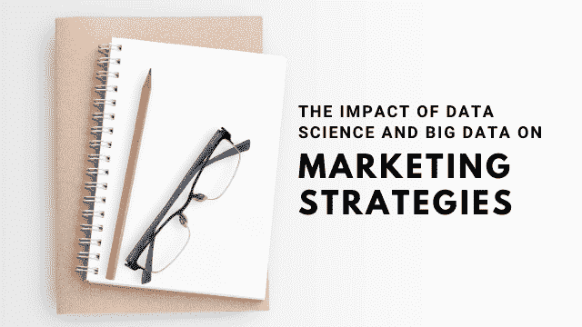

# 数据科学和大数据对营销策略的影响

> 原文：<https://medium.datadriveninvestor.com/the-impact-of-data-science-and-big-data-on-marketing-strategies-658370db9733?source=collection_archive---------11----------------------->

在当今世界，营销是任何公司的主要支柱之一。找到接触潜在客户的最简单、最有效的方式是任何企业家每天都要面对的一场斗争。

识别潜在客户的需求并寻找满足他们的方法只是第一步。确定什么吸引他们的注意力是至关重要的。由于全球市场充满了不同的选择，所有参与者都在不断改进他们的营销方法，因此要脱颖而出是一个相当大的挑战。

发起营销行动既费钱又费时。这就是为什么选择正确的方法对任何企业都至关重要。当有如此多的因素需要考虑时，该如何做呢？

数据科学和大数据解决方案提供了答案。

# 营销人员的基本数据类型

市场营销就是寻找顾客并进行销售。为了吸引消费者，首先，我们需要了解他们

# 客户数据

简单地说，消费者数据是公司收集的关于其潜在客户的所有信息。随着电子商务市场在过去十年中快速增长，监控客户偏好变得更加有效。

每当我们使用互联网寻找我们想要购买的物品时，就会弹出一个烦人的关于“cookies”的对话框。一个全球通用的软件要求我们允许跟踪我们的所有行动，以便跟踪我们的偏好。

 [## 大数据颠覆了我们所知的信贷应用|数据驱动的投资者

### 融合是金融领域的最新流行词，由于支付和贷款之间的关系，我们现在…

www.datadriveninvestor.com](https://www.datadriveninvestor.com/2020/03/19/big-data-disrupts-credit-applications-as-we-know-them/) 

有了这些见解，营销人员就能够准备一个有效的营销策略，最有可能说服我们购买某个特定品牌提供的一些产品。

# 财务和运营数据

每家公司都需要跟踪自己的财务状况，并衡量结果——与竞争对手进行比较。得益于对绩效的深入分析，企业能够采取相关措施支持自身发展。

运营数据是一组关于公司发生的所有过程的信息。衡量效率和寻找削减成本的机会至关重要。

根据 Rakuten Marketing 的数据，至少 26%的营销预算没有得到有效利用。减少金钱浪费的唯一方法是应用数据科学解决方案。

根据直觉做出营销决策的时代已经结束；营销人员在数字世界中所做的一切现在都可以被追踪，从第一次点击一直到交易结束。不拥抱和接受这一概念的首席营销官可能不会当很久。”— Kurt Andersen，Savo 营销和销售执行副总裁

# 数据科学和大数据能提供什么？

全球范围内产生的数据数量已经达到了人类没有丝毫机会处理的地步。每天，全球产生 [2.5 万亿字节的数据](https://www.forbes.com/sites/forbesagencycouncil/2020/01/17/the-past-present-and-future-of-big-data-in-marketing/#6d3f79f45da9)。从 it 中获取有价值的商业洞察力的唯一方法是实施[数据科学分析](https://addepto.com/data-science-consulting-ai-consulting/)。

它是如何工作的？一个数据科学专业人员团队设计了一个人工智能驱动的软件，能够以令人难以置信的速度分析所有收集的数据。它可以持续处理新信息——不像人类，它不需要休息或睡觉。

有了这样的支持，营销人员可以比以往更加灵活，更快地应对新出现的趋势。让我们仔细看看大多数营销人员苦苦挣扎的特定营销流程。

# 在正确的时间发掘正确的人

这被认为是营销人员面临的最大挑战之一。识别潜在客户，选择最合适的营销方法，并在正确的时间实施。似乎不可能？不再是了。

预测性销售线索评分系统现在能够自动完成所有这些任务。它观察客户的行为，预测他们未来的行动，并实施最有效的方法，通常会导致销售。

今天的技术并没有到此为止。在机器学习的帮助下，这样的软件也可以向每一个新的客户端学习，每次都能做出更准确的判断。

# 规定性分析

换句话说——预测预期的行动何时会发生，以及可能对它们产生什么影响。

有许多不同的因素可能会改变你的营销行动的成功率，如天气、季节性等。通过谷歌广告等方式投资互联网曝光可能代价高昂，尤其是对中小企业而言。

为了确保你的广告能对客户产生影响，减少点击付费预算，同时又不失去潜在客户，实施说明性分析是有益的。

规定性分析是基于数据科学的。人工智能驱动的软件选择有用的数据，并基于这些数据建立一个复杂的模型。考虑到可用的预算，它提出了导致成功营销活动的正确方法。

# 营销个性化

个性化方法可能是过去几年市场营销中最热门的趋势，也是高利润的投资。研究表明，每投资 1 美元，就会产生[20 美元的投资回报。](https://econsultancy.com/five-ways-data-science-help-optimise-marketing-budgets/)

“个性化营销不是单向的中断，而是在用户需要的正确时刻传递价值。” —《营销和公关的新规则》的作者大卫·梅尔曼·斯科特

从营销个性化中获益的关键是实时运营。这意味着观察客户，预测他们的行为，并立即采取行动。通过实施大数据技术，现在有可能实现这一目标。提供产品或服务的公司与买家之间的联系从未如此紧密。

# 未来会带来什么…

大数据工具将继续发展，这是肯定的。这将带来更高的个性化营销努力以及客户体验的发展。

有几件事我们可以确定:

*   随着时间的推移，建立强大的市场地位将变得更加困难，因为更多的竞争对手将获得新技术；
*   电子商务部门将继续增长，消费者的期望也将继续增长；
*   据信，到 2025 年，将有 150 万亿千兆字节的数据需要处理——实施大数据和数据科学技术将成为新的标准，也是营销人员处理这些数据的唯一解决方案；
*   营销人员将不得不关注每一个小细节，减少反应时间；
*   为了保持市场优势，必须在营销策略中采用创新方法。

大数据和数据科学的时代已经到来。现在，客户有了自己的声音，他们希望被听到。营销人员需要仔细倾听并适应不断变化的趋势。