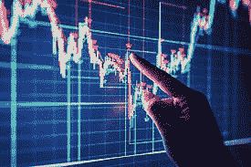
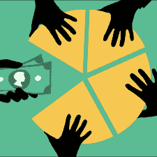
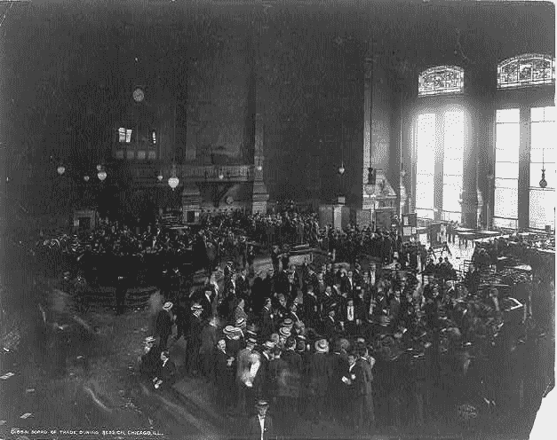
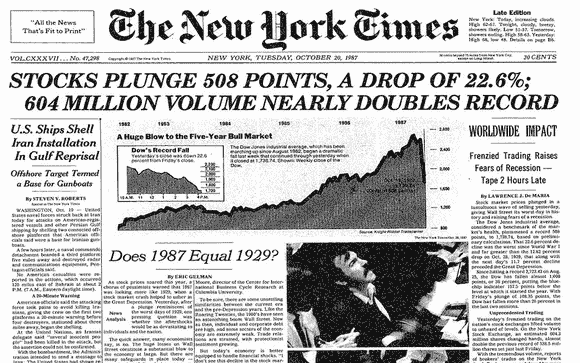
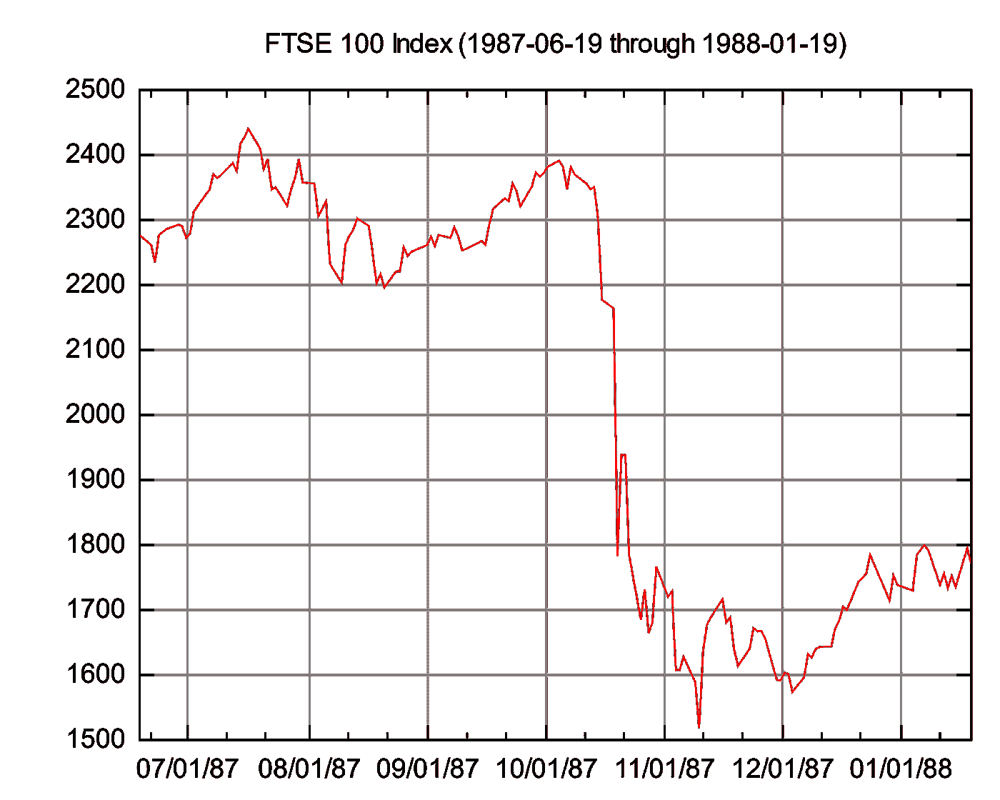
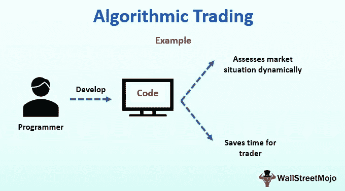

# 技术对股票市场的影响

> 原文：<https://medium.datadriveninvestor.com/the-impact-of-technology-on-the-stock-market-7e3b5654c55?source=collection_archive---------12----------------------->

无论是看《华尔街之狼》里的莱昂纳多·迪卡普里奥，还是看电视节目主持人一大早就喊出市场上哪些股票是热门买卖，股市的存在一直是我们生活中莫名其妙的一部分。700 多年来，股票市场一直是人类生活和文化的重要组成部分，第一个公认的股票市场形式是在 17 世纪建立的。随着这些年来创新和技术占据了中心舞台，股票市场的功能已经发生了跳跃式的发展。

Ref: wealthwithin.com

尽管纽约证券交易所可能被认为是当今世界上最强大的证券交易所，但它并不是第一个对市场施加影响的交易所。在 13 世纪，威尼斯放债人开始向贷款人和投资者出售债券。随着时间的推移，比利时的交易所在 16 世纪以处理票据和债券而闻名。股票市场的第一个正式形式出现在 17 世纪，当时出现了各种东印度公司，它们向私人投资者发行股票，为他们的企业获取更多资金。最近，**1971 年，** **纳斯达克成立，使证券交易电子化**。

今天，当全球化的存在使我们的世界变得更小的时候，世界各地有各种各样的证券交易所，如纽约证券交易所、纳斯达克、东京证券交易所、上海证券交易所、香港证券交易所和伦敦证券交易所。

Ref: thestreet.com

**股票市场会发生什么？**

股票市场并不像看起来那么复杂。股票市场的基本前提包括**购买或出售‘股票’**。顾名思义，股票指的是一家公司所有权的一定比例或份额，交易者可以在股票市场上购买。同样，如果一个人已经拥有一股股票，它可以在股票市场上匿名出售。随着买卖股票的人数的变化，这些股票的供求关系也发生变化，从而引起股票价格的变化。

**场内交易实务**

现在让我们放慢脚步，开始一次回到过去的旅程。就在不久前，全球各地证券交易所里喧闹的交易员们还在互相大声下达指令，制造出一片嘈杂。例如，在 1905 年的芝加哥期权交易所这样的证券交易所中，发生了“场内交易”,其中特定产品或证券的交易者与相同证券的其他交易者聚集在单独的场内(如下图所示)。

Ref: alamy.com

在这种情况下，交易员宣布他或她愿意买入或卖出的价格，以及他或她希望在该价格下交易的证券数量。此外，如果其他交易者有兴趣接受交易，他们会喊回来。然后，如果有匹配，两个交易者都记下来，在一天交易结束时，交易者确保他们的所有交易都与对手正确匹配。显然，**这种方法似乎非常费时费力**。股票市场数字化的开始通常与 1987 年联系在一起。

**黑色星期一**

无论一个人是否直接参与股票市场，1987 年 10 月 19 日出乎意料的股票市场崩溃所造成的巨大影响是全球每个人都可以看到的。这一天被称为“黑色星期一”,因为它对世界各地的经济产生了严重影响。

Ref: thestreet.com

Ref: stockpickssystem.com

在此期间，股票的买卖取代了电话。因此，由于股票市场崩溃，由于害怕面临巨大损失，股票经纪人拒绝接电话。这导致美国证券交易委员会(SEC)探索了**电子交易**的方法。这促进了电子路由器的使用，这意味着人类不再能够破坏它们。

**高频交易**

随着股票交易变得更快和更方便，电子交易的引入导致股票市场的操作发生了一些重大变化。这导致了“高频”公司的形成。这些交易公司在很短的时间内以较低的价格买入股票，并在价格上涨时卖出，从这些交易中赚取少量的钱。通过在每笔交易中到处赚取一分钱，这些公司能够赚取数十亿美元。

2005 年，证券交易所私有化，以增加竞争和降低经纪费用。这一时期见证了 BATS 和 Direct Edge 等新交易所的开业。

**开设托管服务**

2012 年，Apex Clearing 成为第一家向经纪人提供托管服务的公司。Apex 向经纪商提供了一套 API，帮助他们保管和清算证券。此外，Wealthfront 和 Betterment 等公司率先推出了“机器人顾问”等新型经纪平台。最新的券商产品如 Robinhood、Stash Invest、Acorns 也依赖 APEX。

今天，当全球化的存在使我们的世界变得更小的时候，世界各地有各种各样的证券交易所，如纽约证券交易所、纳斯达克、东京证券交易所、上海证券交易所、香港证券交易所和伦敦证券交易所。

**算法交易**

随着机器学习和人工智能的出现和普及，公司开始通过开发算法来进行股市投资决策——这导致了算法交易的发展。

算法交易旨在消除人为因素，并根据预定的统计数据做出决定。消除人情味意味着情感永远不会成为决策过程中的因素。

Ref: wallstreetmojo.com

算法交易可以包括各种机器学习模型的开发。下面给出了一个简单的算法示例:

1.  当一只股票过去一个月的平均股价高于过去六个月的平均股价时，买入该股票。
2.  当股票上个月的平均价格低于过去六个月的平均价格时，卖出股票。

在这方面也可以采用更先进的技术。使用新闻文章的自然语言处理 (NLP)可以作为进行市场预测的附加因素。目前，正在进行的研究可以用来在**回归模型**的帮助下预测未来‘n’分钟的股票价格和股票市场指数值。**深度学习**也可以用于根据公司的需要，在特定的一天做出与特定股票相关的预测。

随着人工智能领域的日益强大，股市预测的准确性和程度必然会提高。尽管取得了这些进步，但由于股票市场的波动性及其操作中涉及的大量因素，实际上不可能有完全准确的股票市场预测。因此，尽管技术对股票市场的影响是巨大的，但基于经验的人类本能将在股票市场的决策过程中始终发挥关键作用。