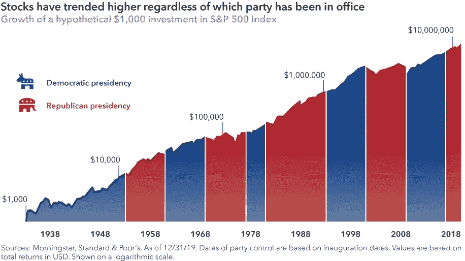
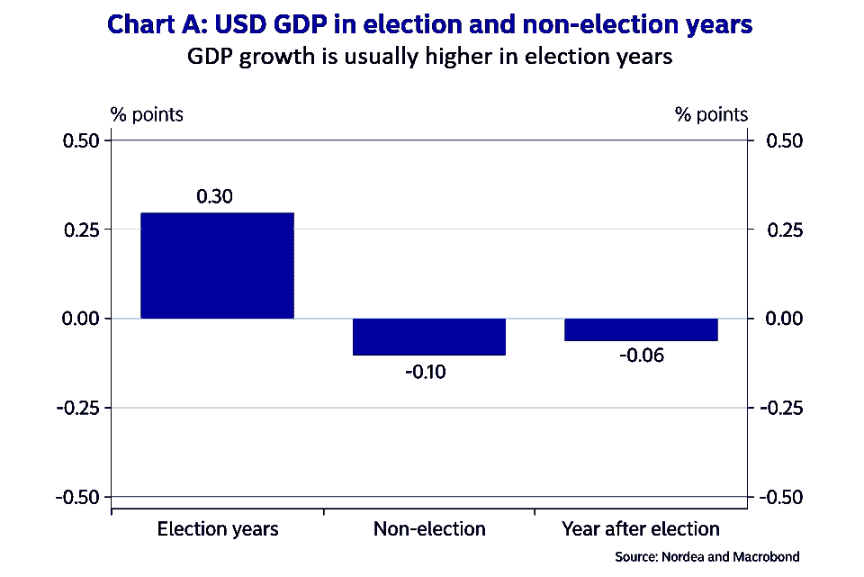
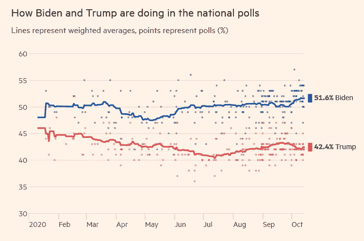
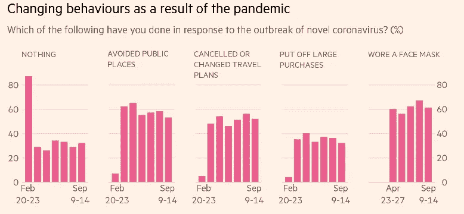
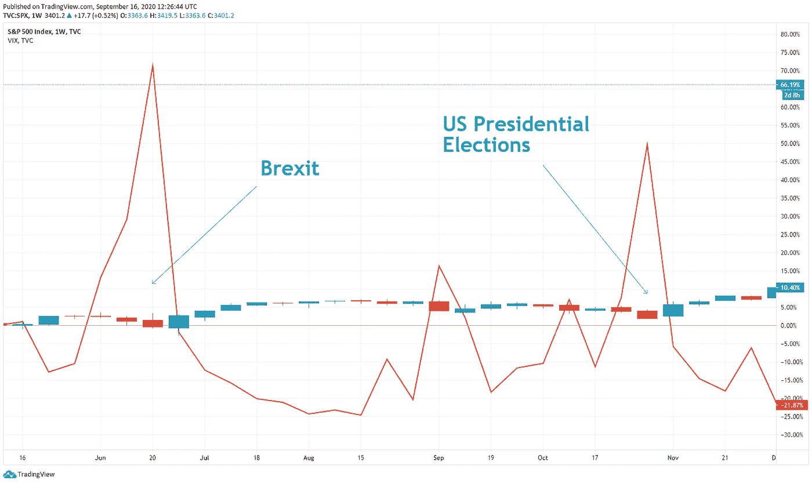

# 美国总统选举对你投资组合的影响

> 原文：<https://medium.datadriveninvestor.com/the-impact-of-the-us-presidential-elections-on-your-investment-portfolio-a563e19e7e85?source=collection_archive---------5----------------------->

Photo by [Element5 Digital](https://www.pexels.com/@element5?utm_content=attributionCopyText&utm_medium=referral&utm_source=pexels) from [Pexels](https://www.pexels.com/photo/person-dropping-paper-on-box-1550337/?utm_content=attributionCopyText&utm_medium=referral&utm_source=pexels)

几周后，世界将见证美国历史上最期待的总统选举之一。11 月 3 日，美国人将投票选举世界上最大的经济体和最大的军事机构之一的领导人。可以理解，选举结果将极大地影响改革、政策和国际关系。

根据资产管理公司 Hartford Funds 的一项调查，93%的投资者认为总统竞选将影响股市，而 84%的人承认他们预计会因此改变投资习惯。

但是他们应该吗？让我们拉开帷幕，看看历史能说些什么…

# **选举前后的市场**

历史数据显示，市场的行为取决于我们是着眼于中期选举年、选举前还是选举后。

对标准普尔 500 过去 90 年市场数据的回顾表明，在总统选举前的 12 个月准备期内，股票和债券市场往往表现得更加平静。与非选举年相比，他们的收益减少了 1.00%至 2.5%(股票市场为 6.00%对 8.5%，债券市场为 6.5%对 7.5%)。

关于 DJIA 的数据表明，[自 1833 年以来，在选举前的 12 个月期间，该指数平均为 10.4%](https://www.kiplinger.com/article/investing/t043-c008-s003-how-presidential-elections-affect-the-stock-market.html) ，而选举年期间为 6%。

据 [JP 摩根资产管理](https://am.jpmorgan.com/lu/en/asset-management/per/insights/market-insights/on-the-minds-of-investors/us-presidential-election-2020/)称，标准普尔 500 指数的历史波动性在选举年更高。原因是投资者试图对候选人想法的概率进行“定价”。

另一方面，选举后时期的股市回报相对较低，债券表现略好。美国银行财富管理部门的[报告](https://www.usbank.com/investing/financial-perspectives/market-news/how-presidential-elections-affect-the-stock-market.html)显示，中期选举后的一年里，股票市场持续超出预期。

当谈到获胜者的政党归属的影响时，传统智慧表明，当共和党总统当选时，市场应该做出更积极的反应，因为这些想法被认为更有利于市场。然而，回顾自 1900 年以来收集的数据，民主党当选总统对股票更有利，DJIA 平均为 9%，而共和党总统为 6%。

贝莱德(BlackRock)首席投资策略师拉斯克斯特里奇(Russ Koesterich)表示，年度股市回报的正常波动将缩小这种差异。这就是为什么今天大多数分析家认为哪个政党控制白宫没有区别。最终，市场无论如何都会保持长期增长。

*Source:* [*Capital Group*](https://www.capitalgroup.com/advisor/ca/en/insights/content/articles/3-investor-mistakes-election-year.html)

更能影响市场的是权力是否发生转移。根据一些报道，当一个新的政党到来时，股市收益通常平均为 5.00%。另一方面，当总统连任，或同一政党保持控制时，回报率平均为 6.5%。市场对后者反应更积极的原因是，它们已经知道会发生什么，而且不确定性更低。

然而，如果候选人给投资者一个开始抛售的主要理由，所有这些可能都是错误的。

谈到美联储，普遍的说法是它是“选举中立的”，因为它试图在选举年保持更安静的政策，以避免破坏局势的稳定。

历史记录显示，自 1948 年以来，美国经济在选举年表现稍好。GDP 增长率更高，平均为 0.3%，而潜在增长率超过 0.4%。原因是大选前执政内阁的扩张性财政政策。

一个重要的评论是，自 1932 年以来，在任美国总统从未失败过赢得连任，除非他在任期间出现了衰退。

# **今天的环境使它变得不同**

如果我们在任何其他时间点分析总统竞选，我们通常会考虑一些共同因素，如经济、候选人对财政和货币政策的看法、对国际关系的看法、拟议的改革等。

然而，2020 年的方程有一个独特的变量 COVID 疫情。特朗普总统对健康危机的处理完全是一场灾难。美国受灾最严重，死亡人数超过 218 000 人。相比之下，尽管欧盟人口多得多，但死亡人数却少了大约 20 000 人。

疫情给市场带来了不确定性，进一步扭曲了投资者的视角。市场讨厌不确定性。根据 2019 年 Dimensional Funds 的一份报告，在 1928 年至 2016 年期间，负市场回报仅出现过四次，所有这些都伴随着导致全球不稳定和市场不确定性的地缘政治事件。

除此之外，还有迫在眉睫的经济衰退，我们有理由解释为什么特朗普在六个月的时间里从最受欢迎的人变成了不受欢迎的人。皮尤基金会的调查数据显示，超过 67%的拜登选民更像是“反特朗普”的选票。

 [## 将数据隐私转化为你的优势，重建消费者的信任:下一个投资前沿

### 疫情期间，抖音的使用量激增，全球约有 8 亿用户使用该平台…

www.datadriveninvestor.com](https://www.datadriveninvestor.com/2020/09/18/turn-data-privacy-to-your-advantage-and-rebuild-consumers-trust-the-next-investment-frontier/) 

今年年初，人们普遍认为，由于美国经济的弹性和他最喜欢的指标——标准普尔 500 的表现，唐纳德·特朗普(Donald Trump)将轻松连任。快进到选举前的一个月，民调和博彩市场显示乔·拜登取得了令人信服的胜利。即使是与特朗普积极的连任前景一致的纳斯达克指数，现在也在不断攀升，尽管他的机会越来越少。

Source: [FT](https://ig.ft.com/us-election-2020/)

英国《金融时报》称，冠状病毒重新调整了选民的担忧和行为。这也是由于社会行为和对疫情的看法发生了变化，他们反对现任总统的做法。

Source: [FT](https://ig.ft.com/ft-peterson-poll/)

即使在他被诊断出感染了病毒之后，他的方法也没有太大的改变。消息传出后，市场起初经历了剧烈波动，但后来平静下来。

# **潜在的选举结果及其对市场的影响**

特朗普的国际政策和贸易战是全球制造业放缓的核心，这表明潜在的第二任期将进一步增加升级的风险。在这种情况下，受影响最大的将是欧洲汽车制造商等国际股票。由于特朗普对美联储的压力、减税和放松监管，预计美国股市将继续上涨。

然而，Hightower 首席投资策略师兼投资组合经理斯蒂芬妮·林克(Stephanie Link)表示，市场倾向于特朗普连任，国会两党分裂的情况。她补充说，金融、科技和传统能源等小公司和行业可能会因这一消息而上涨。

在相当长的一段时间里，民主党人无法提出一个明确的竞选候选人。伊丽莎白·沃伦和伯尼·桑德斯主张激进的政策变革，包括反对大银行和科技公司、禁止水力压裂、征收财富税和增加公司税，而乔·拜登的政策更加温和。尽管他仍计划取消减税，但市场可能会将拜登获胜视为温和的积极消息。

根据林克的说法，2%至 4%之间的小幅抛售可能是合理的，为制药和科技股投资者创造了“逢低买入”的机会。另一方面，基础设施、清洁能源和医疗服务公司预计表现良好。林克还认为，如果拜登获胜，而国会仍在两党之间分裂，将导致市场反弹。

查尔斯·施瓦布首席投资策略师利兹·安(Lizz Ann)持有类似观点，承认拜登担任总统不会是“股市的必然灾难”。据 JP 摩根的分析师称，这种情况甚至会对市场产生中性到轻微的积极影响。他们的结论基于拜登提出的政策，包括基础设施支出、关税软化、更高的工资和总体上更加外交化的方法，这应该会降低波动水平并增加总需求。

根据摩根大通的预测，即使部分逆转川普的减税和就业法案(TCJA)的好处，也将使税率回到 28%，导致标准普尔 500 每股高达 9 美元的打击。然而，他们也得出结论，在 COVID 时代，更有可能的情况是就业增长优先于威胁经济增长的政策。根据世行的分析，在这种情况下，潜在的跑赢者有望是特斯拉、强生和波音等公司。瑞银首席投资办公室也持类似观点，该办公室预计，由于拜登的绿色议程，重工业和汽车制造商面临越来越大的压力。这种情况也将给亚洲太阳能和生物技术公司带来好处。

瑞银财富管理(UBS Wealth Management)表示，选举后，最初可能会出现一些波动，但好的一面是，这种波动将是短暂的，直到投资者学会管理围绕拟议政策的不确定性。然而，如果结果不确定，波动性可能会更高。不过，瑞银全球财富管理(UBS Global Wealth Management)美洲固定收益部门负责人托马斯·麦克洛林(Thomas Schmidt)表示，即便如此，随着时间的推移，美元仍将走软，不足以成为转向避险资产的理由。

*The jump in the VIX around the Brexit vote and the 2016 US Presidential Elections. Chart by Tradingview*

摩根士丹利预测，在共和党总统、参议院和民主党众议院的情况下，我们可能会看到短暂的衰退和持续的放松管制，这有利于能源、电信和资产管理行业。在民主党总统和众议院以及共和党参议院的情况下，该行预测金融、能源、电信、信息技术和制药行业将面临压力，同时疫情将得到更好的处理。考虑到五只 FAANG 股票(脸书、亚马逊、苹果、网飞和谷歌)占美国股市的 20%，并且目前正在推高美国股市，如果它们受到审查，整个市场可能都会受到影响。

如果共和党赢得所有三个席位，该行预计将出现 V 型复苏，延长即将到期的税收条款，并出台大规模的反华政策。这将导致强势美元和潜在疲软的国债。同样，美国能源、电信和资产管理类股有望受益。在一个全民主党的领导层中，摩根士丹利预计医疗保健行业将出现高基础设施支出和扩张，同时伴随着更高的利率和通胀。这种情况下的可能赢家是医疗保健、国际石油和天然气、运输和大型银行，制药行业可能会下跌。

# **如何玩转市场**

专家们的共识是，尽管投资者可能会被诱惑采取大胆举措，利用政治不确定性，但最好还是保留他们的长期策略。理由是经济周期比总统任期长得多。

投资者不应专注于捕捉短期波动，而应着眼于投资组合评估，将可能影响其长期表现的新政策考虑在内。

贝莱德北美收入信托(black rock North American Income Trust)联席经理托尼德斯皮里托(Tony DeSpirito)表示，投资者应该关注科技和医疗保健等优质行业，这些行业在上述两种情况下都能提供长期增长。摩根大通美国投资信托基金经理乔纳森·西蒙建议寻找那些已经证明适应能力强、有能力克服意外危机的公司。在投资组合的价值方面，他以 Booking.com 为例，说明一家本应受到疫情高度影响的企业，却成功调整了成本结构，变得更加强大。

瑞银首席投资办公室给投资者的建议是，坚持战略性投资组合配置，牢记长期目标。这包括从自动化、生物技术和可再生能源到从全球化等全球趋势中受益的任何行业。

如果投资者希望对冲总统选举的不确定性，他们应该考虑没有美国敞口的行业和公司。这将转化为一个全球性的多资产投资组合，能够抵御行业和地区特定的风险，并有可能从所有选举结果中受益。例子包括面向国内的利基市场，如公用事业或稳定的部门，如消费品。还有一些投资机会，包括基础设施和技术投资领域，预计这两种结果都会有不错的表现。

所有分析师一致认为，拜登当选总统将有利于新兴市场和外国股票。摩根大通(JPMorgan)表示，新兴市场的股票回报率预计将在未来几年超过其他市场，这意味着在建立或重新平衡长期投资组合时，应该优先考虑新兴市场。

# **结论**

简而言之，华尔街的精英们不认为有必要对高度多元化和平衡的长期投资组合进行任何重大改变。这背后有合理的理由。

正如诺贝尔经济学奖获得者保罗·克鲁格曼在他的《纽约时报》评论文章中所说，如今，经济和股票市场已经相去甚远。美联储银行的每周经济指数显示，经济仍然比 2008 年后衰退时期的任何时候都更加低迷。美国经济的就业岗位比今年 2 月减少了 1150 万个。

> 有一个古老的经济学家笑话，市场预测了过去五次衰退中的九次。

然而，尽管经济前景黯淡，疫情的影响日益加深，但市场仍在飙升。9 月初，标准普尔 500 创下历史新高，而苹果的估值超过了 2 万亿美元。

这种不一致的部分原因是，超过 50%的股票目前由 1%的美国人持有。其余的 50%只拥有 0.7%的市场份额。华尔街的传言是，我们应该为“K 型复苏”做好准备，这种复苏将体现为最富有者的股票估值和个人财富上升，而最贫穷者的收入下降。

所有这些都表明，不管理论上怎么说，如果你的投资组合非常多样化，总统选举可能不会对你的投资组合产生重大影响。经济政策、投资、地缘政治理念——所有这些因素很可能会在短期内影响你的投资，但它们在长期规划中不会起主要作用。

***文章最早出现在 20202 年秋季刊的《国际投资者杂志》*******。它不构成投资建议。这篇文章是一篇一般性的通讯，仅供参考。在任何司法管辖区，它不被视为对任何特定投资产品、策略、计划特征或其他目的的建议或推荐。****

## *访问专家视图— [订阅 DDI 英特尔](https://datadriveninvestor.com/ddi-intel)*