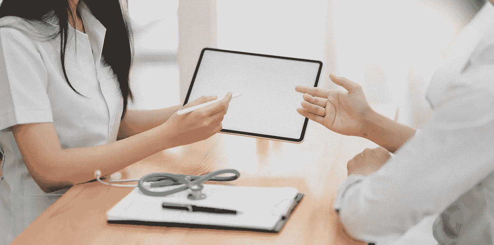

# 物联网在医疗领域的实施

> 原文：<https://medium.datadriveninvestor.com/the-implementation-of-iot-in-the-health-sector-ce36335ec8c7?source=collection_archive---------27----------------------->

[https://images.pexels.com/photos/3758748/pexels-photo-3758748.jpeg](https://images.pexels.com/photos/3758748/pexels-photo-3758748.jpeg?auto=compress&cs=tinysrgb&dpr=2&h=750&w=1260)

了解物联网设备如何在医疗领域获得更大的市场份额，以及如果不采取必要的措施，这将如何带来风险。

在卫生部门的技术流程中引入物联网越来越多，为改善患者护理提供了多种可能性。

可以通过连接的设备收集和分析大量的临床数据，从而允许卫生专业人员更有效地定制每个患者的治疗。拥有这些设备是拯救生命的巨大潜力。

有了物联网，所有这一切都成为可能，包括远程患者护理、持续关注患者的生命体征，以及通过专业人员移动到患者附近来自动调整机器而不浪费时间的可能性。远程病人护理也有利于老年人，他们可能在家中有传感器，以在紧急情况下提醒护理人员，如跌倒、心脏病发作，或监测糖酵解水平等。

 [## 理解物联网|数据驱动的投资者

### 一个系统越开放，它就越有利于创新和产生信任。然而，当谈到开放系统时…

www.datadriveninvestor.com](https://www.datadriveninvestor.com/2019/09/28/making-sense-of-iot/) 

因此，我们看到这些技术可以提高医院的效率。物联网增加了监测患者的时间，从而提高了对患者的关注质量、数据的存储和发送，以及在专业人员不在场的情况下提供服务的可能性，这降低了员工人数少的情况下的风险。

但是，即使有这么多好处，采用物联网的卫生部门的机构在寻找高级解决方案时也必须注意安全性。这些设备将患者和实体人员的机密数据置于危险之中。健康服务提供者应该采取积极的措施来保护他们免受黑客的攻击，无论是收集、存储还是传输数据。

**医疗领域的物联网挑战**

物联网在医疗领域的应用为确保医疗保健的效率和安全性提出了新的要求，例如:

实现互操作性，以便集成您的医疗保健中使用的工作流设备；

考虑到许多设备不能连接到普通充电器，确保持续供电，以避免设备停机；

应用用户友好的界面，使患者和卫生专业人员更容易与系统交互并解释所提供的数据；

维护有效的硬件和软件交付协议。

还应注意的是，没有为在卫生部门实施物联网制定标准。因此，虽然它们已经在开发中，但是渠道和 it 人员必须注意，以便它们被有效地引入到组织中并满足目标。

**勒索软件攻击的危险**

针对卫生领域物联网设备的网络攻击数量越来越多。保健中心和医院的脆弱性已被深入探讨。卫生部门面临的危险不再局限于勒索软件攻击，如 2017 年初的 WannaCry，导致英国取消手术和关闭手术室，或 2016 年洛杉矶的医院，不得不支付 17，000 美元的赎金。

了解设备的漏洞取决于了解不同类型的智能对象。

当我们想到便携式医疗设备，如起搏器和胰岛素泵时，网络攻击往往成为勒索患者的依据，如果患者不同意支付赎金，他们就有可能被这些设备的操作打断。

另一方面，如果黑客入侵装载医疗设备的治疗和操作数据的设备，这可能会给患者的生命带来严重的风险，如药物或化疗站的智能分配器的情况。这些数据允许医生评估治疗，因此劫持这些数据可以被用来勒索整个医院，而不仅仅是病人。

**如何保护卫生部门**

将物联网设备遭受攻击的风险降至最低至关重要。第一步是寻找可以在所有阶段引入的隐私模型，从机器设计的那一刻到健康物联网的完成和商业化，保护患者、医院和公司，这些都必须符合欧洲个人数据保护法，简称 GDPR(General Data Protection Regulation)。

另一方面，必须确保移动安全系统和高级设备高效运行，制定全面的保护策略。这样，我们可以确保单一架构保护所有设备，并涵盖与网络分段和减少多种高级攻击媒介相关的方面。这些解决方案应与旨在预防威胁的解决方案结合使用。

所以，我们看到物联网可以对医疗领域产生革命性的影响。这也为网络攻击的新风险打开了大门。对于 IT 渠道而言，这意味着需要更加关注并提供设备保护产品，此外还需要针对攻击预防、灾难恢复和访问限制提供不同的解决方案，以保证数据安全，从而保护患者和医院免受甚至可能导致生命损失的损害。[顶级应用开发者](https://topappdevelopmentcompanies.com)还应该确保物联网应用得到正确开发，以防止黑客获取其用户的数据。

**作者简介:**

Melissa Crooks 是为 Hyperlink InfoSystem 写文章的内容作者，Hyperlink InfoSystem 是美国纽约州领先的[应用程序开发公司](https://www.hyperlinkinfosystem.com/mobile-app-development.htm)之一&印度拥有最优秀的技术熟练的专业应用程序开发人员团队。她是一名多才多艺的科技作家，喜欢探索最新的科技趋势、企业家和创业专栏。她还为顶级应用程序开发公司写文章。