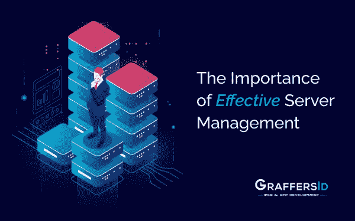

# 有效服务器管理的重要性:Graffersid

> 原文：<https://medium.datadriveninvestor.com/the-importance-of-effective-server-management-b38ee282bfdf?source=collection_archive---------21----------------------->

难怪，今天的每个企业，无论是大企业还是小企业，都需要技术工具和应用程序来繁荣和维持。因此，服务器在确保任何业务的平稳运行中起着不可或缺的作用，尤其是在 IT 领域。

服务器是 IT 设置不可或缺的一部分，充当公司网络的中心枢纽，便于连接的 IT 设备之间的通信和交互。

对于希望保持在线状态并希望拥有流畅的网站托管体验以取悦客户的企业来说，服务器是基础。因此，有效的服务器管理非常重要。这是一个基本要求，而不是一个选项。

**不仅仅是服务器管理，有效的服务器管理**

有效的服务器管理和支持服务可以让事情变得更简单，让您的日常操作更顺畅。服务器管理服务提供商提供的设施使您的 web 服务器保持最佳运行状态。有效的服务器管理非常重要，但是很多公司都没有意识到它的潜在好处。

嗯，这是一个很大的错误，需要严格避免。服务器的默认设置不足以长期使用，因此将服务器管理任务外包给一家好的服务器管理公司至关重要。

在本文中，我们将探讨服务器管理对企业的重要性。但是在我们深入细节之前，让我们先了解一下基本概念——服务器管理到底意味着什么，以及它对组织有什么好处。

另请阅读: [PHP 或 PYTHON:服务器端开发选择哪种语言？](https://graffersid.com/php-or-python-which-language-to-choose-for-server-side-development/)

# 什么是服务器管理？

服务器管理仅仅是指维护运行你的网站的网络服务器。服务器管理过程包括管理和监控服务器基础设施，使其以最佳性能运行。

服务器管理实践还包括硬件、软件的管理，检测问题并进行备份，问题分析，以及设置正确的安全元素。

# 有效服务器管理的基本目标包括:

●创建安全的服务器环境。
●降低服务器变慢和停机的可能性。
●持续的服务器监控和升级，以根据组织不断变化的需求进行调整。

然而，不注意对服务器的适当管理会导致严重的后果。它可能会导致一系列问题的开始，如数据丢失或数据被盗。

这些问题造成的不便可能会对您的业务产生重大影响。根据这项研究，发现 94%遭受数据丢失的公司无法恢复。

# 服务器的类型

根据需求有不同类型的服务器，包括:

●应用服务器
●物理服务器
● Web 服务器
●备份服务器
●文件服务器
●数据服务器
●虚拟服务器

上述服务器要么运行在 Linux 环境下，要么运行在 Windows 环境下。而物理和虚拟服务器都需要服务器管理和支持，才能以最佳效率运行。

# 为服务器的正常运行选择一个明智的选择

有效的服务器管理始于将任务分配给专门的技术团队，该团队可以跟踪服务器的技术故障，并在出现故障时及时进行诊断。服务器管理服务的供应致力于将停机时间消除到零。

除此之外，服务器管理实践还需要不断升级服务器以提高性能。服务器的功能不仅仅限于数据库存储，它还在管理不同的业务运营中发挥着至关重要的作用。此外，它还负责汇集所有 it 需求和命令，以促进公司更好地运作，并增强业务各点的协调。

由于配置中断、输出混乱或任何其他原因导致的服务器故障都会导致大量数据丢失。这会让你的整个生意停顿下来。由于非功能性服务器问题导致的数据丢失对任何公司来说都是灾难性的，因为他们需要大量的时间和投资，这在快速发展的商业世界中是不可接受的。

虽然这是一个令人担忧的原因，但接近技术专家可以在很大程度上帮助简化服务器管理。这就是为什么大多数公司考虑将服务器管理外包给可信的服务器管理和支持服务提供商。

专门的服务器管理组织以合理的价格为您提供一流的专业服务。

 [## 谷歌最近的想法是将一个城市地区运作的几乎每一个方面都转移到服务器上，这是一个…

### 直到现在，几乎每次致力于智能城市的会议都会提供智能大都市的例子，它…

www.datadriveninvestor.com](https://www.datadriveninvestor.com/2020/04/04/googles-recent-idea-to-move-nearly-every-aspect-of-a-city-districts-operation-to-a-server-is-a-whole-new-quality-in-terms-of-smartcity-development/) 

# 为什么服务器管理对您的企业很重要

不是所有的企业都有能力跟踪服务器行业的所有最新发展。这就是提供这些服务的公司提供巨大帮助的地方。他们熟悉该行业的所有知识，因此他们能够恰当地处理这项任务。因此，通过选择他们的服务，你可以在你的业务领域脱颖而出。

**此外，以下是专用服务器管理服务对您的企业非常重要的原因。**

# 1.服务器监控

维护服务器需要全天监视，这个过程从服务器监控开始。服务器监控是指跟踪和分析影响服务器性能的关键指标。

有了持续的监控，您的企业可以以最佳效率运行。此外，它让您提前意识到即将到来的问题，以便它们不会影响您的业务的实时性能。

服务器监控的另一个好处是，它提供了对您公司的 it 基础设施的全面观察，以帮助制定未来的业务扩展战略。因此，拥有一个活跃的服务器管理团队来进行服务器监控是非常重要的。

# 2.服务器维护

缺乏服务器维护可能会引发影响您业务绩效的问题。服务器管理公司负责执行定期审计、软件更新、备份、安全检查和恢复过程，以确保良好的服务器性能。而服务器软件、预防措施和安全功能需要及时更新，而您的公司可能并不知道。

为此，您需要专门的专业人员在需要时全天候工作。此外，您的服务器还可能面临日常问题，可能需要频繁更改服务器设置。为了得到最好的改变，服务器管理专家的帮助是更可取的。

# 3.自定义服务器设置

如前所述，根据需求不同，有不同类型的服务器。WordPress 博客的服务器配置与电子商务网站所需的配置有很大不同。因此，您的服务配置取决于您的业务需求。

服务器管理专业人员对您的业务托管和服务器要求进行深入分析，以找到根据您的业务类型定制的合适的服务器设置和规格。

对于初始服务器设置，实施了业内经过测试的配置策略。这样做是为了确保最高的服务器性能，同时消除网络攻击和利用的风险。

# 4.服务器稳定性

服务器稳定性取决于多种因素，如加载时间、服务器软件、速度、服务正常运行时间等。即使是服务器配置的微小变化也会降低整个服务器的性能。因此，最好寻求服务器性能调优的专业帮助。

专门的服务器专业人员全面管理您的服务器，并为服务器提供及时的软件更新，以避免不断增加的冲突和停机风险。除此之外，他们还仔细检查并重新优化其他服务器性能参数，如数据库延迟和页面加载时间。

# 5.备份

数据丢失的情况可能会造成创伤。他们会给你的生意带来相当大的损失。一项研究显示，60%经历过数据丢失的小型企业会在六个月内倒闭。因此，拥有数据备份对您的业务非常重要。

既然麻烦是不可避免的，不如做好应对这种突发事件的准备。雇佣一家服务器管理公司来承担保护你的数据安全的任务。服务器管理专业人员通过创建定期数据备份让您高枕无忧。

因此，即使您的服务器无法运行，您也可以随意使用您的数据。

# 6.正常运行时间保证

正常运行时间是每个在线业务的要求。如果服务器不能保证你在高峰服务时间正常运行，那么你可能会失去你的客户。正常运行时间的减少给你的企业带来了风险，因此要解决这个问题，你需要专业的服务器管理。

有效的服务器管理可以让您的服务器 100%的时间都在运行，以便您的服务始终可用。嗯，通过全天候的服务器管理和支持，这是可能的。

服务器管理公司专业地承担起这项任务，并为您提供全天候的支持，无论是在一天中的什么时候。

# 内部服务器与外部服务器监控

任何想要有效管理服务器的公司首先需要决定他们是否可以在内部管理服务器，或者需要将任务外包给外部管理公司，或者需要两者的结合。

如果你的公司有很多专业技术人员，那么管理你自己的服务器是更好的选择。这样，您就可以访问整个服务器环境。但是，为了确保您的内部服务器管理团队发挥最大效率，他们需要访问正确的服务器监控工具。

市场上有多种服务器管理工具，它们带有各种管理选项，可以让您的服务器保持最佳运行状态。从性能跟踪等简单选项到工作流管理等复杂选项，有一系列服务器监控工具可以满足您公司的需求。

# 如何选择最好的服务器管理工具

为选择正确的服务器管理工具而困惑？寻找能够同时提供操作系统监控和 IT 基础架构监控的软件，开始您的研究。接下来，问自己这两个重要的问题:

●您的服务器管理软件有一体化监控吗？理想的服务器管理软件应该为您提供跨应用程序、系统以及任何现有或即将推出的 Xaas 计划服务的监控。
●软件是否能够执行分析功能，如诊断服务器问题的根本原因？

有了这些问题的答案，您就可以找到能够满足您组织当前和未来需求的软件。

# 服务器管理是当今的必需品

今天，IT 服务器管理是一项必要的要求。有效的服务器管理实践可确保您的 IT 系统发挥最大潜力。它们为您提供服务器安全性、正常运行时间的保证，并在出现任何问题时提供及时的解决方案。因此，有效的服务器管理可以帮助您解决所有服务器性能低下的问题。

但最重要的是选择专业的服务器管理服务。将这项工作交给没有经验的管理人员会导致服务器停机，并对您的业务造成巨大损失。

所以，永远要依靠值得信赖的[服务器管理公司](https://graffersid.com/)。这些公司的服务器管理专家经验丰富，能够在问题影响到您的客户之前处理它们。此外，它们还指导您采取预防措施，阻止病毒、恶意软件和其他安全漏洞。

*原载于 2020 年 11 月 20 日*[*【https://graffersid.com】*](https://graffersid.com/the-importance-of-effective-server-management/)*。*

**访问专家视图—** [**订阅 DDI 英特尔**](https://datadriveninvestor.com/ddi-intel)