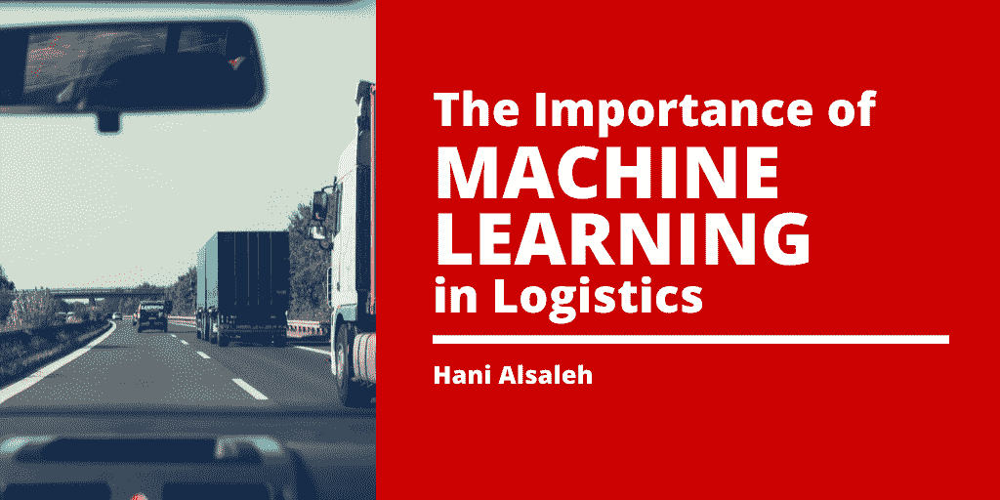

# 机器学习在物流中的重要性

> 原文：<https://medium.datadriveninvestor.com/the-importance-of-machine-learning-in-logistics-c33d54148c2b?source=collection_archive---------18----------------------->

我写过人工智能在物流行业的价值——直接说，这是一个巨大的机会，每个公司都需要采用它来保持竞争力。当然，没有简单的方法来扳动开关，将人工智能集成到操作中。对于拥有人工智能的物流公司所面临的每一个挑战，也没有一个通用的解决方案。最有可能的采用模式是在供应链的不同环节增加技术。为此，通过机器学习来利用数据是人工智能的一种应用，许多公司已经在使用它来改善他们业务的不同方面。

物流依赖于数据，从庞大的数据集中筛选见解一直是该行业面临的重大挑战之一。虽然总是需要数据科学家(可以说现在比以往任何时候都需要)来解释数据，但许多比喻性的繁重工作可以由机器学习程序自动化。在许多方面，机器学习非常适合物流。它是预测性的，围绕着在更大的数据框架中寻找模式，并且可以检测异常。在当前新冠肺炎疫情的环境下，机器学习可以帮助公司先发制人地调整他们的运营，以应对公共健康问题和需求的变化。

甚至在疫情之前，许多基础设施已经到位，以建立一个更具预测性的物流环境。物联网(IoT)提供了一套工具和传感器，为智能交通系统提供动力，并有助于实时收集和分析数据。这种即时反馈可以帮助物流专业人员对供应链进行实时调整，这在当前动荡的形势下已经变得势在必行。在许多方面，物联网传感器可以被视为推动机器学习工作的基础设施，并确保机器学习接收最准确和最新的信息。

就此而言，这些数据可以帮助公司对供应链的每个方面进行更多的监督和控制。当运营的某些部分缺乏可见性时，很容易意外忽略安全漏洞或潜在欺诈等问题。任何异常都可以很容易地检测出来，更好的验证过程有助于保护关键系统。对于需要立即关注的问题，机器学习可以提供做出响应所需的关键信息。

 [## 认知计算——一套被广泛认为是……

### 作为它的用户，我们已经习惯了科技。这些天几乎没有什么是司空见惯的…

www.datadriveninvestor.com](https://www.datadriveninvestor.com/2020/02/19/cognitive-computing-a-skill-set-widely-considered-to-be-the-most-vital-manifestation-of-artificial-intelligence/) 

除了运营的战略层面，机器学习还有助于深入了解企业的实际情况。可以评估设备、车辆和其他机器等资产的使用模式。然后，公司可以利用这些见解来最大限度地延长使用寿命，并获得更准确的总体设备效率(OEE)指标，这是一个在有许多移动部件的行业中非常有用的指标。采用机器学习来监控资产的公司[报告称](https://www.fronetics.com/7-ways-machine-learning-is-improving-supply-chain-management/)维护成本降低了 10%，资产生产率提高了 20%。

很大一部分物流公司已经采用了机器学习，只是从这里开始逐步推广。在优化设备成本、解释异常活动和提高整个供应链的可见性之间，这些工具被证明是有效的。每个物流公司都应该有一个计划，以一种与他们现有的战略框架相结合的方式采用这项技术。

*最初发表于*[T5【https://www.linkedin.com】](https://www.linkedin.com/pulse/importance-machine-learning-logistics-hani-alsaleh/?trackingId=MW2Ogf4pZhHvXW%2BqnqOk8g%3D%3D)*。*