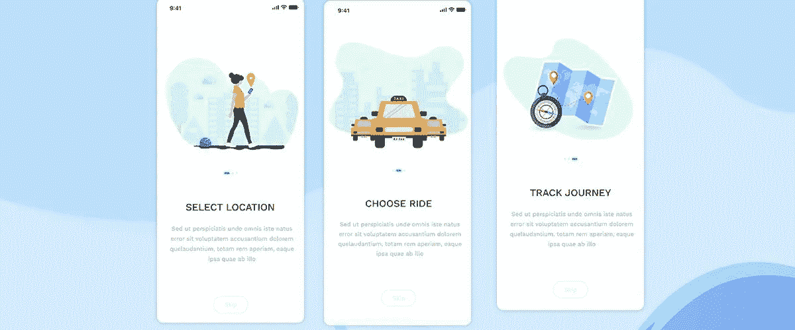
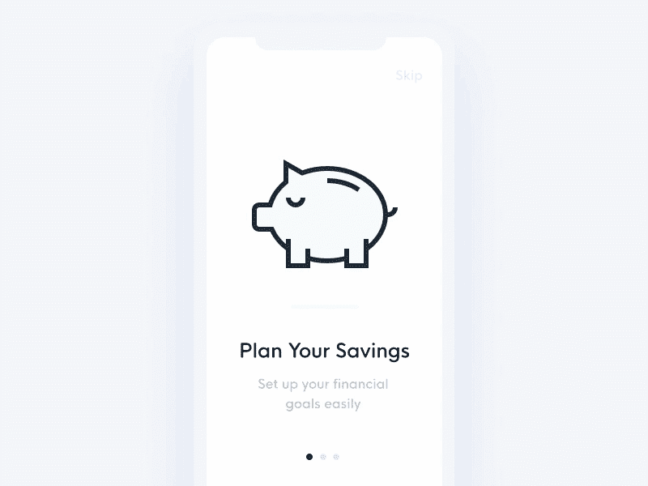
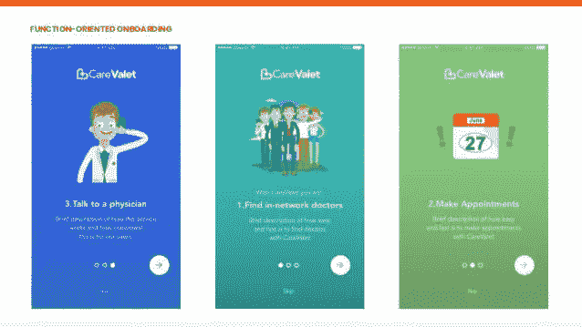
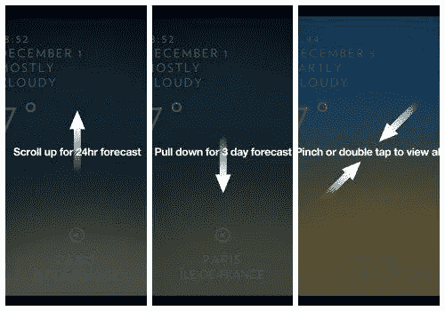
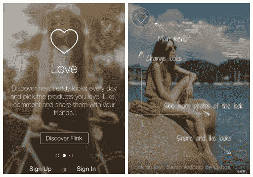
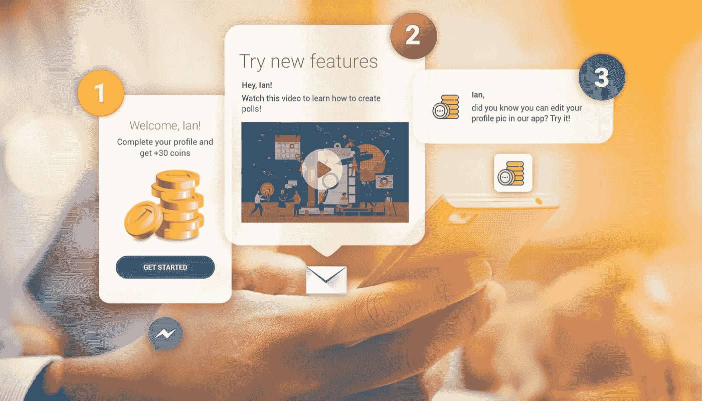
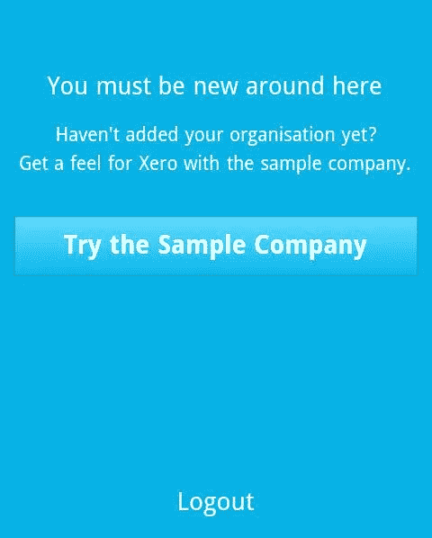

# 为什么你应该让用户使用你的移动应用

> 原文：<https://medium.datadriveninvestor.com/the-importance-of-onboarding-users-to-your-mobile-app-76b152d1e0dd?source=collection_archive---------3----------------------->

Source: zesium.com

*‘第一印象决定一切*！’

如果你考虑你的移动应用程序，这是你应该遵循的座右铭。

有时，与应用程序的初始交互可能会有点混乱，而不是你希望的直观流程。

这就是应用程序上线的阶段——这是用户旅程中最重要的阶段之一，确保了良好的第一印象和即时联系。

# 什么是应用程序入门？

[App onboarding](https://en.wikipedia.org/wiki/User_onboarding) 是一组屏幕，引导用户了解你的应用的优势和特性。

入职流程是必要的，因为它向用户展示了该应用的优势，向他们介绍了相关功能，并收集了个人资料信息以提供个性化的内容和通知。

 [## 2019 年移动应用开发之路|数据驱动的投资者

### 任何在移动应用程序开发行业工作的人，无论他们是专注于在伦敦开发 iOS 应用程序还是…

www.datadriveninvestor.com](https://www.datadriveninvestor.com/2019/01/15/the-path-of-mobile-app-development-in-2019/) 

整个过程促进了积极的用户体验，从而导致更高的用户获取率和[更高的保留率](https://practicoanalytics.com/mobile-app-retention-rates/)。

# 为什么你的应用需要入门？

对于新用户来说，立即知道如何导航你的应用程序可能很复杂，尤其是如果你的界面与他们习惯的不同。

统计显示[21%的用户只会使用一次](http://info.localytics.com/blog/21-percent-of-users-abandon-apps-after-one-use)——如果花太长时间弄清楚应用程序如何工作，用户就会失去兴趣。

加入应用程序有助于确保首次使用尽可能顺畅，降低用户放弃应用程序的比例。

为用户创造积极的初始体验对于我们的应用成功以及确保应用的持续使用至关重要。

根据' [Hubspot '博客](https://blog.hubspot.com/)，保留可分为三个阶段:

***短期保留*** 是最重要的阶段——与用户的最初互动可以产生积极或消极的影响。这个阶段也会影响后面的两个阶段。

***中期保留*** —目标是形成新的习惯，在常规中创造重复。

*—专注于改善现有产品。*

*研究表明，使用量的最大下降发生在短期保留期间，你的目标应该是确保你的应用在该阶段的第一周内被使用超过一次。*

*如果你提供可靠的入职培训，你可以激活应用的早期使用，并逐渐增加留存率。*

**

*Source: mindinventory.com*

# *入职类型*

*由于今天有许多不同类型的应用程序和业务，因此也有不同的用户加入方法。*

*所有的入门方法都有一个共同点:它们鼓励用户通过导航应用程序来学习。*

*最常见的入职类型有:*

## *以利益为导向的入职*

*该方法显示了应用程序为用户带来的好处和作用，而不是如何使用应用程序。*

*面向利益的入职界面还可以包括用户可以选择加入的权限请求，比如访问位置和发送推送通知。*

*成功的以利益为导向的入职指南包括:*

*   *限制显示最多三项主要优势*
*   *每张幻灯片只能包含一项优势*
*   *优先显示主要优势*
*   *一致的词汇*
*   *在任何注册流程之前入职*
*   *尽可能保持简短*

**

*Source: uplabs.com*

## *面向职能的入职培训*

*这种方法教育用户如何使用你的应用程序。常见的例子是一个简短的应用程序浏览，其中包含如何开始和/或如何执行特定操作的说明。*

*如果您想使用这种方法，可以参考以下指南:*

*   *无需解释明显的功能*
*   *限制为 3 张幻灯片，每张幻灯片一个功能*
*   *设定焦点:帮助用户开始*

**

*Source: slideshare.net/MisaelLenOrteganear/soft-mobile-onboarding-workshop*

## *渐进式入职*

*该方法在用户使用应用程序的过程中向他们显示新的信息。*

*屏幕上显示的说明与用户所在的页面相关，这类似于一次实时游览。例如，如果用户在注册屏幕上，他们将只能看到与注册相关的信息。*

*这更实际一些，因为用户在浏览应用程序时学习，而不是事先获得指示。*

*如果您决定采用这种方法，可以参考以下指南:*

*   *用它来展示复杂的工作流程*
*   *用它来隐藏功能*
*   *手势驱动交互的理想方法*

**

*Source: smashingmagazine.com*

# *可供选择的事物*

*上述方法是最常见的，但是您可以根据自己的需要组合和修改它们。*

## *备选方案 1:混合动力*

*混合方法无非是将一种、两种或所有三种方法混合在一起以获得最佳服务。虽然这并不总是可能的，但有时会被证明是有用的，例如 Flink 过去的以下示例:*

**

*Source: smashingmagazine.com*

## *替代方案 2:视频*

*一些应用程序使用视频来搭载用户，事实证明这是值得冒险的。*

*有不同类型的视频供你选择——有些可以是教程形式的更实用，有些则可以是本质上的广告。*

*视频可能是一种很好的入职方式，但你应该小心网站上的视频——无论质量如何，都要避免自动播放，因为用户可能会发现它不合适，从而导致反效果。*

**

*Source: Pushwoosh.com*

## *备选方案 3:样本数据*

*另一种入门方法是提供样本数据供用户体验。这对于处理诸如人力资源或财务等敏感数据的应用程序很有帮助。*

*样本数据让用户在学习你的应用程序如何工作时，通过尝试和犯错误而感到舒适。如果你提供了这样一个选项，用户会觉得对真正的数据输入更有准备。*

**

*Source: smashingmagazine.com*

# *结局*

*我已经介绍了一些最常见的用户入门技术，但是如果您仍然不确定使用哪一种，请测试一两种方法，看看哪些有效，哪些无效。*

*没有放之四海而皆准的解决方案，所以请利用这些数据来充分利用您的入职流程。*

*有许多网站提供各种各样的入职模式来获取灵感，例如模式、[移动模式](https://www.mobile-patterns.com/)、 [UX 档案](http://uxarchive.com/)、 [Pinterest、](https://www.pinterest.com/)所以如果你需要一些新鲜的想法，试着去看看它们。*

*通过以下链接安排与[**Maja Dakic**](https://app.ddichat.com/experts/maja-dakic)**的 DDIChat 会话。***

*** [## 马贾达基奇-迪迪恰特

### 技术行业(软件、移动应用、物联网、人工智能等)的资深作家。)以及在…

app.ddichat.com](https://app.ddichat.com/experts/maja-dakic)***