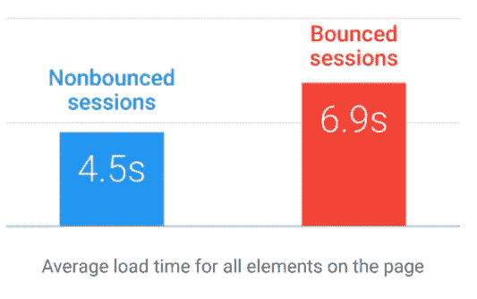
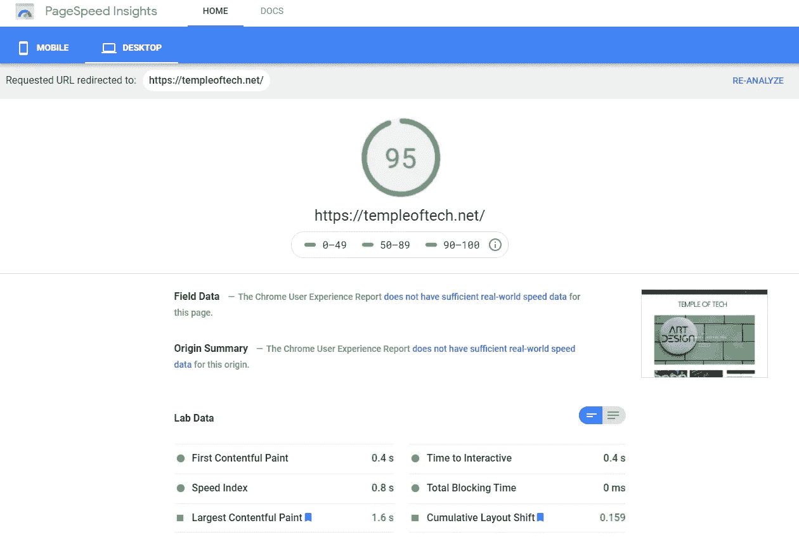

# 网站速度对 SEO 的重要性

> 原文：<https://medium.datadriveninvestor.com/the-importance-of-site-speed-to-seo-a3e12c8d28d1?source=collection_archive---------23----------------------->

当一个网站需要很长时间加载时，每个人都会感到恼火，如果太多的话，他们甚至会点击关闭。搜索引擎也不喜欢网站加载时间过长。

Photo by [Merakist](https://unsplash.com/@merakist?utm_source=medium&utm_medium=referral) on [Unsplash](https://unsplash.com?utm_source=medium&utm_medium=referral)

虽然你可能已经知道关键词密度、关键词排名和网站结构在 SEO 中扮演着重要的角色，但拥有一个快速加载的网站应该是必不可少的。这在文章中提到的不多，但是速度真的很重要。谷歌对网站速度算法进行了更新，使得加载时间成为一个更重要的因素。

谷歌的研究表明，如果网站加载时间从 1 秒增加到 3 秒，反弹的几率会增加 32%。如果时间增加到 5 秒，反弹率增加到 90%，10 秒或更长时间，反弹率增加到 123%。单从这一点就能明白页面速度和用户留存的重要性。

[Image Source](https://www.thinkwithgoogle.com/marketing-strategies/app-and-mobile/mobile-page-speed-load-time/)

# 网站速度和购买意向

尽管网站速度对 SEO 排名很重要，但谷歌发现了另一个相关性。用户的购买意图也与加载速度相关。“毫秒成就百万”报告清楚地解释了加载时间 0.1 秒的变化会如何改变买家的购买意图。这就是为什么对于电子商务来说，网站速度更加重要。仅仅一毫秒的差异就可能造成数百万的损失。

[Image Source](https://web.dev/milliseconds-make-millions/)

该研究表明，网站速度每提高 0.1%，支出就会增加 9.2%。这些数字显示了网站速度的真正意义，对于网站开发者来说非常重要。他们的网站需要尽可能快，以达到最佳效果。

 [## 擅长谷歌是一种技能|数据驱动的投资者

### 擅长‘谷歌’是一种技能。是的，你听到了。知道什么和如何谷歌或搜索的东西是一个…

www.datadriveninvestor.com](https://www.datadriveninvestor.com/2020/08/11/being-good-at-google-is-a-skill/) 

# 没有所谓的过度优化

老实说，我对你的网站有这种感觉，如果你尽可能多的优化，你不会失去任何东西。在我拥有博客和不同网站的这段时间里，我犯了很多错误。

其中之一是我决定坚持使用一个漂亮的主页，有动画和一切，但以牺牲性能为代价。我曾经认为更好的视觉效果会说服用户留下来消费我网站上的内容。但是，我错了。

只是在我决定把周围的东西换成更简约的外观后，我才开始看到用户保留和更多的参与。这种极简的外观比之前的版本速度快了一倍多，效果也很明显。我试图修复另一个版本，但我不能达到令人愉快的结果，所以我决定留在新的外观。

# 谷歌帮你优化

我们已经谈了很多关于页面速度的重要性，谷歌也注意到了这一点。它为你提供工具来检查你的网站的速度，并给出建议，告诉你是什么让你慢下来。这是一个完美的工具来了解你的网站出了什么问题，如何修复它们取决于你。

PageSpeed Insights 是每个网站所有者都应该使用的工具，用来确定他们网站的速度。那里的实验室数据部分给了你关于你的网站是对是错的信息。90 分以上应该是对你的网站满意的最低分数，但理想情况下，你会希望它在 90 分以上。

[Image was taken from PageSpeed Insights.](https://developers.google.com/speed/pagespeed/insights/?url=http%3A%2F%2Ftempleoftech.net%2F&tab=desktop)

正如你所看到的，在最近的测试中，我的网站表现得非常好，获得了 95 分，这是理想的成绩，但仍然有一些事情需要解决。你可以在实验室数据部分的底部看到我的网站上有两个需要改进的橙色因素。

# 结束语

不管你是否有一个已建立的网站，如果你的网站速度达不到标准，它不会表现得很好。正如你从谷歌的报告中看到的，即使比竞争对手多一秒钟的优势也可能意味着大量的利润，所以把网站速度放在第一位。我希望你喜欢这篇文章。如果你有一个网站，参加谷歌 [PageSpeed Insights](https://developers.google.com/speed/pagespeed/insights/) 的测试，并在评论中留下你的分数。

## 获得专家观点— [订阅 DDI 英特尔](https://datadriveninvestor.com/ddi-intel)