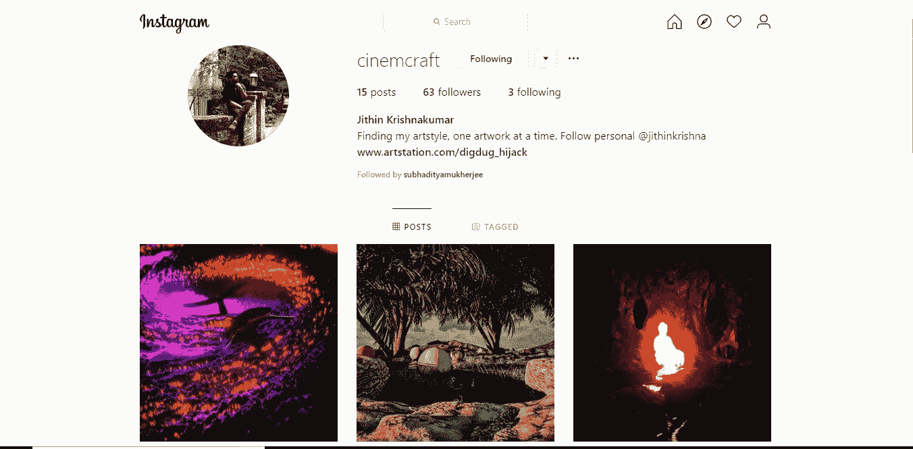
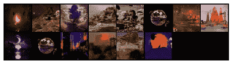
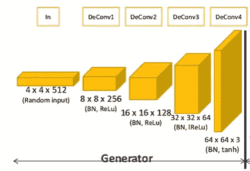
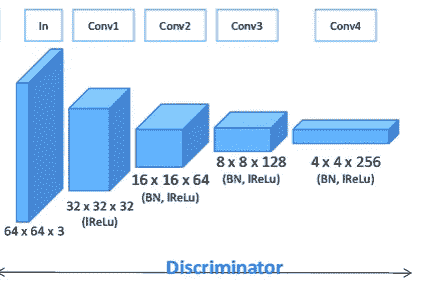
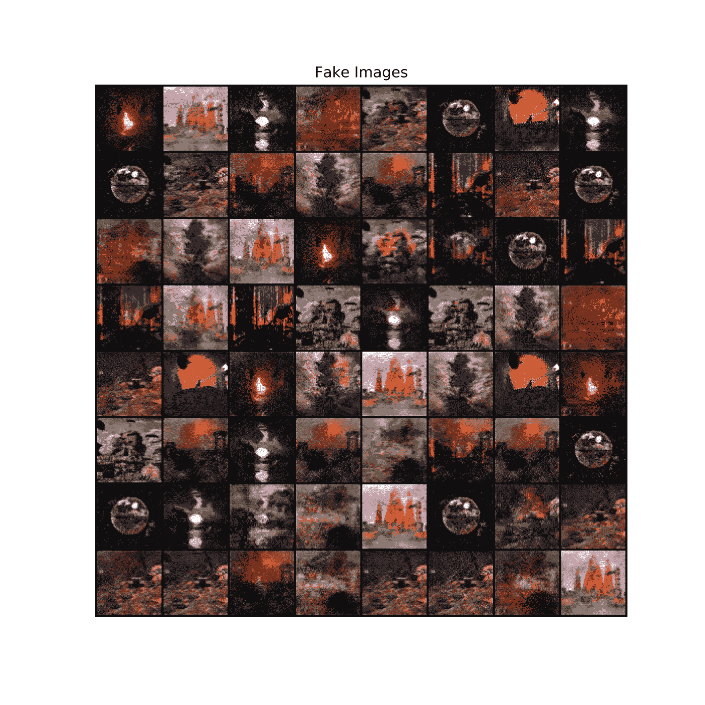

# 无限艺术机器

> 原文：<https://medium.datadriveninvestor.com/the-infinite-art-machine-3a2decab85d9?source=collection_archive---------3----------------------->

[https://c4.wallpaperflare.com/wallpaper/579/612/913/space-simple-wallpaper-preview.jpg](https://c4.wallpaperflare.com/wallpaper/579/612/913/space-simple-wallpaper-preview.jpg)

自古以来，人类就试图创造。我们从洞穴绘画开始，现在我们看着来自全球的照片，这些照片都是在一个闪亮的受热的沙子表面上拍摄的。数以千计的博物馆存在，每年花费数十亿美元来迎合我们对我们称之为艺术的新颖图案的渴望。

 [## 深度学习用 7 个步骤解释-更新|数据驱动的投资者

### 在深度学习的帮助下，自动驾驶汽车、Alexa、医学成像-小工具正在我们周围变得超级智能…

www.datadriveninvestor.com](https://www.datadriveninvestor.com/2019/01/23/deep-learning-explained-in-7-steps/) 

> 但是，如果我们能从伟大的大师和不那么伟大的大师身上学习呢？如果你，在把你的想法变成现实方面有点平庸的天赋，有能力创造一个无限的艺术机器会怎么样？

正如任何试图赋予计算机思考能力的应用一样，我们来看看深度学习的概念。在这篇文章中，我们将尝试使用一种特殊类型的深度神经网络架构来完成上述任务，这种架构称为 DCGAN 或深度卷积 GAN。参考文献部分提到了开始这一工作的论文。[ [1](https://arxiv.org/abs/1511.06434)

由于本教程旨在跟随，所以尝试在进行过程中编写代码。注意，你需要一个 GPU 来运行这个程序，所以如果你没有，你可以使用 Google Colab[Google it；)].

# **第一阶段:库、环境和数据集**

我们首先导入所有需要的库。这段代码是使用脸书的 Pytorch 库编写的，因为它更好地利用了 GPU。

很明显，我们需要安装库，为此，可以在您的终端版本上运行以下命令。

> pip3 安装 matplotlib 火炬火炬视觉数字枕

对于那些使用环境的人，请确保你是对的。

至于数据集，我用过我朋友的美术作品。这个数据集的所有功劳都归他。请一定去看看他的作品，我真的很喜欢它们。

[*https://instagram.com/cinemcraft*](https://instagram.com/cinemcraft?igshid=705j03y371sq)

现在，我们设置本教程剩余部分所需的参数。

*   种子:允许再现性
*   dataroot:根目录(根据需要进行更改)
*   工作线程:数据加载器的线程数
*   nc:输入中的通道数
*   nz:发电机输入的大小
*   ngf:生成器中特征映射的大小
*   ndf:鉴别器中特征图的大小
*   max_epochs=5
*   学习率
*   beta1:我们优化器的参数
*   ngpu:我们正在使用的 gpu 数量

我们现在必须加载数据并对其进行预处理以适应我们的模型。

我们首先从文件夹中加载数据，将其调整到我们之前决定的图像大小，裁剪它并将其转换为张量。

> 张量是在神经网络中使用的数据表示。

然后我们将图像标准化。这是一个图像处理步骤，用来实现图像像素范围的一致性。它将所有像素亮度映射到给定范围内的值。这使得神经网络能够更快更好地从这些图像中学习。

然后，我们批量加载整个数据集，也就是说，我们将整个数据分割成块，并逐个处理这些块，否则它们将无法放入内存。

我们现在决定在哪里运行我们的模型。如果您使用的是 cpu，请将设备更改为“CPU”。由于我有一个 GPU，我正在为这个项目使用，我使用的参数' cuda '。

之后，我们将数据集作为小批量加载，并绘制它们以查看它们是否正确加载。并不是说我们将批处理发送到 GPU，而是必须将它们发送回 CPU 进行显示。

我们得到了下面的图像:

我们现在转到特定的层，并尝试初始化其中的权重。这是通过下面这段代码完成的。

# **第二阶段:架构**

现在，对于架构，使用生成对抗神经网络(GAN)架构。简单来说，它分为两部分——生成器和鉴别器。

> 生成器做的工作是试图创造艺术，而鉴别者试图证明生成器是错的。

这一过程一直重复，直到作品与原作几乎无法区分，鉴别者也无法证明它是错误的。本文首次发表于[ [2](https://arxiv.org/pdf/1406.2661.pdf) ]。

我们首先创建发电机模型。请注意，本文中定义了发生器和鉴别器的架构。

The GAN Generator Architecture

我们在 Pytorch 中使用顺序表示，这允许我们一个接一个地传递层。

*   ConvTranspose2d 是一种二维转置操作，我们将输入传递给卷积运算。转置是一个学习参数。
*   BatchNorm2d 是一种提高网络学习速率的技术。由于各层之间的参数不同，出现了一种称为协变量偏移的现象，这种现象阻碍了学习。BatchNorm2d 减少了这种影响。
*   ReLU 或整流线性单元是深度学习历史上的里程碑之一。这是一个简单的数学函数(Picewise 线性),如果输入为正，则输出输入，否则输出零。这使得网络更容易训练，并在神经网络的结构中引入了非线性。这被称为激活函数。
*   现在轮到坦了。Tanh 也是和 ReLU 一样的另一个激活功能。DCGan 论文推荐使用这一层作为发生器的最后一层，而不是常规的 ReLU。负权重被强映射，零输入被映射到零附近。这又使得网络更容易训练。

请注意，偏差函数用于向输出添加可学习的偏差，以获得更好的表示。

现在我们已经定义了架构，我们把它传递给 GPU。还使用了一个小助手函数来处理多个 GPU。
然后，我们应用权重函数，将所有权重转换为平均值 0 和标准偏差 0.2。
转发功能允许我们进入网络的下一层。

The GAN Discriminator Architecture

然后，我们尝试定义鉴别器架构。这里的新术语如下。

*   LeakyReLU:这是对 ReLU 函数的一个修改，与 ReLU 相比，它赋予一个小的正值(例如:0.01)，而不是将值设置为 0。
*   Sigmoid:深度学习的另一个里程碑。这是另一个数学函数，叫做逻辑 sigmoid。它有助于引入非线性，并将输出映射到 0 和 1 之间的真实值。

我们现在遵循与生成器相同的步骤。

我们必须选择一个损失函数。这将允许我们的模型比较输出，并确定它们之间的差异。我们使用一种称为二元交叉熵损失的损失类型。因为我们只对真实图像和虚假图像进行分类，所以我们可以使用这种类型的损失。BCELoss 接收我们之前定义的 Sigmoid 函数的输出作为输入。
然后，我们创建一个随机噪声作为生成器必须转换的输入。
我们使用 Adam 优化器。(这是另一个讨论的话题，更多信息可以在[这里](https://towardsdatascience.com/adam-latest-trends-in-deep-learning-optimization-6be9a291375c)找到)。

我们现在为小批量处理的全部数据创建训练循环，并运行特定数量的时期。

# 第三阶段:总结

这可能需要一些阅读来理解，因此涉及的步骤概述如下。

## 第 1 部分—鉴别器

1.我们必须更新鉴别器网络并最大化函数 log(D(x)) + log(1 — D(G(z))。这意味着我们需要最大化鉴频器的输出。
2。我们将所有现有的梯度初始化为零
3。我们将当前批次连同标签一起发送到 GPU
4。我们将真正的批次通过鉴别器，并计算梯度
5。我们反向通过鉴别器并计算梯度
6。我们现在采取的是随机噪声
7 的假批次。我们尝试用鉴别器
8 对假货批次进行分类。我们将真假批次的梯度相加
9。我们在优化函数中采取了一个步骤

## 第 2 部分—发电机

1.我们必须最大化函数 log(D(G(z))。这将使我们的生成器变得更好，创建更真实的图像。
2。我们再次将所有现有梯度初始化为零
3。我们使用假标签作为发电机
4 的真标签。我们获取输出并计算发电机损耗
5。然后，我们执行一个向后传递
6。我们在优化函数中采取了一个步骤

## 第 3 部分—输出

这是可选的，但将允许我们绘制我们的损失，并看到我们的训练进度。我们使用一个助手函数来创建一个图像网格，当它们在网络中传播时，将它们保存到一个列表中，这样我们就可以在稍后阶段绘制动画。

如果需要，我们现在可以画出发生器和鉴频器的损耗。运行该位留给读者。

由于看到我们的网络学习看起来真的很酷，我们使用一个小的助手函数将我们存储的权重绘制成一个很酷的动画并保存它。试试看。

**Aaaaanddd…我们完成了:)**
祝贺那些坚持到最后的勇敢的灵魂们。
既然你远道而来，这里有[招待](https://www.thispersondoesnotexist.com/)。该页面使用 GAN(与我们自己的不同)在您每次打开它时生成一个新的面孔。顾名思义，这张脸真的不存在，是由一个 GAN 生成的。

## 谢谢大家！

## **参考文献**

1)拉德福德大学、梅斯大学和钦塔拉大学(2015 年)。深度卷积生成对抗网络的无监督表示学习。arXiv 预印本 arXiv:1511.06434。

2) Goodfellow，I .、Pouget-Abadie，j .、Mirza，m .、Xu，b .、Warde-Farley，d .、Ozair，s .、… & Bengio，Y. (2014 年)。生成对抗网络。神经信息处理系统进展(第 2672-2680 页)。

3 ) [PyTorch DCGAN 教程](https://pytorch.org/tutorials/beginner/dcgan_faces_tutorial.html)