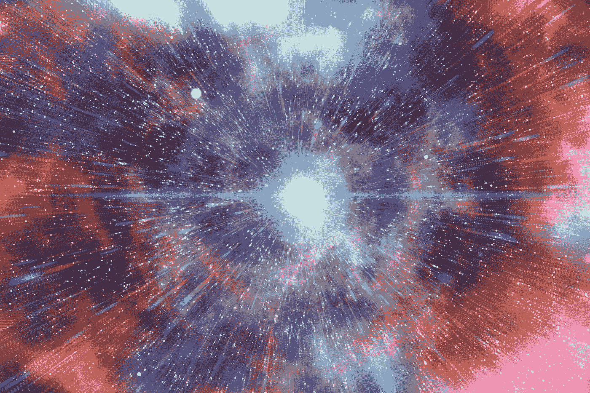
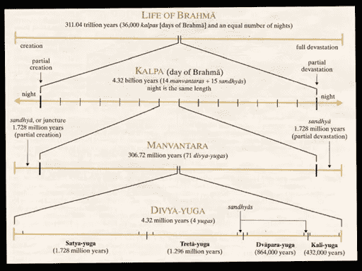
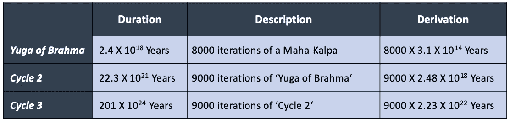

# 印度历法中惊人的大时间刻度

> 原文：<https://medium.datadriveninvestor.com/the-insanely-large-timescales-in-hindu-calendar-8d07dc6a11ae?source=collection_archive---------5----------------------->

印度教历法从古代(大约从公元前 1000 年开始)就在印度次大陆使用，并被用来确定节日的吉祥时间，如胡里节、希瓦拉特里节、Pongal 节、Onam 节、Janmashtami 节、难近母节、排灯节和许多其他节日。

但那只是人类的历法。

> 印度教神的历法包括长达 201 亿年(10 ⁴)的时间刻度。

Big Bang, the beginning of the creation of the Universe. Credit: [Gerd Altmann](https://pixabay.com/users/geralt-9301/) at [Pixabay](https://pixabay.com/)

# 印度教的时间概念在历史上非常庞大

让我们从基础开始。印度教的创世神 [**梵天**](https://en.wikipedia.org/wiki/Brahma) 的寿命持续 100 年。他的 *12 小时白天*或 [***卡尔帕***](https://en.wikipedia.org/wiki/Kalpa_(aeon)) ，后面是 *12 小时夜晚*或 [***普拉利亚***](https://en.wikipedia.org/wiki/Pralaya) ，它们长度相等。在他第二天的开始，他重生了，重新创造了恒星、行星、生命体和宇宙中的一切。在他生命的最后，他和他的创造物在部分分解中未呈现(未被创造)。

*有趣的是，这条时间线算出来是 86.4 亿太阳年，与我们目前知道的大约 138 亿年前开始的* [*大爆炸*](https://en.wikipedia.org/wiki/Big_Bang) *的数量级相同。*

Figure 2: The sculpture of Brahma at a 6th/7th [Aihole](https://en.wikipedia.org/wiki/Aihole) temple. Credit: Wikimedia Commons

这一系列中的每一个卡尔帕都有不同的名字。我们现在在“***Sweta-Baraha***”(Sweta =白人，baraha =公猪) *kalpa* ，也就是第五十一个 kalpa。

 [## 一瞬间学会数据科学！？数据驱动的投资者

### 在我之前的职业生涯中，我是一名训练有素的古典钢琴家。还记得那些声称你可以…

www.datadriveninvestor.com](https://www.datadriveninvestor.com/2020/07/23/learn-data-science-in-a-flash/) 

简单地说，根据对印度教神话的一些解释，

> 宇宙已经被毁灭和创造了 50 次，我们现在是在第 51 次事件中。

*根据* [*摩诃婆罗多*](https://en.wikipedia.org/wiki/Mahabharata) *的说法，梵天的 12 个月或 360 天构成他的一年，100 个这样的年份构成宇宙的生命周期。*基于这一点，下面是印度历法的简化计算

*   一个卡尔帕日= 43.2 亿地球年
*   一天一夜=梵天的白天和黑夜= 86.4 亿地球年
*   梵天 30 天= 30 X 8.64 亿年= 2592 亿年
*   1 年梵天= 360 个梵天= 3.11 万亿个地球年
*   梵天 100 年= 311。04 万亿地球年

梵天的 100 年生命被称为一个 ***Mahā-Kalpa*** ，之后是一个 ***Mahā-Pralaya*** (完全溶解)，持续时间相等，宇宙的基础完全溶解。这个周期叫做[***Prakriti***](https://en.wikipedia.org/wiki/Prak%E1%B9%9Bti)，在一个 *Mahā-Kalpa* 的开始显现，结束不显现，大约是 311.04 万亿太阳年。

Figure 3: A day of Brahma. Credit: Wikimedia Commons

8000 个这样的“摩诃-卡尔帕”形成一个“梵天的余割”，它的长度是 2.4 万亿分之一(2.4×10⁸或 24 亿亿年)。还有其他更长的周期，它们的长度分别是 22.3 六次方年和 201 七次方年(10 ⁴)。

Figure 4: The timescale of Hindu calendars are as large as 201 Septillion (10²⁴) years

下次你想知道印度人是如何掌握数学和数字的诀窍时，就从他们的印度日历开始吧！

> ***结语:我写关于大数、数据科学、机器学习、产品管理和职业成功的故事。你可以跟着我把这些放进你的培养基里。***

***上一个故事:*** [***用“印度级”技术为世界供电***](https://medium.com/@SantanuB/powering-the-world-with-india-class-technologies-2c7dab9c496b?source=friends_link&sk=defcbb3c0e1f7a7cefcbea3331c478f0)

***下一个故事:*** [***印度贫困地址的经济影响:一年 100-140 亿美元***](https://towardsdatascience.com/economic-impact-of-poor-addresses-in-india-10-14-billion-a-year-11cc97cb40fc?source=friends_link&sk=53dbad114fd73c8cc3e44a3f0398209a)

**访问专家视图—** [**订阅 DDI 英特尔**](https://datadriveninvestor.com/ddi-intel)