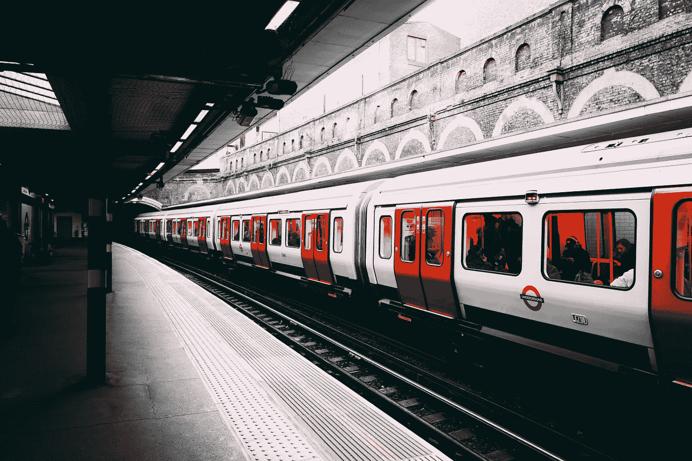
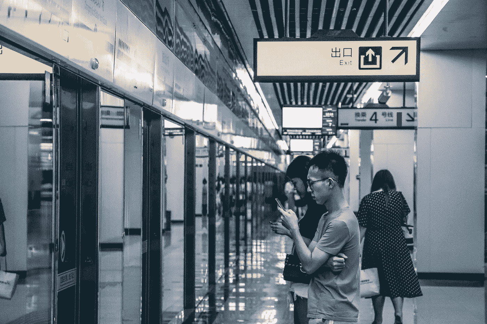

# 现代世界的智能城市轨道交通系统

> 原文：<https://medium.datadriveninvestor.com/the-intelligent-urban-rail-transit-system-of-the-modern-world-2bc418527a01?source=collection_archive---------26----------------------->

## 新型城市轨道交通系统具有低能耗、高性能的特点，是城市中最便捷、最安全的交通方式

Photo by [Tomas Anton Escobar](https://unsplash.com/@tomasjolmes?utm_source=unsplash&utm_medium=referral&utm_content=creditCopyText) on [Unsplash](https://unsplash.com/s/photos/subway?utm_source=unsplash&utm_medium=referral&utm_content=creditCopyText)

# 这篇文章主要是关于什么的？

摘要:本文以西南某省会城市地铁 3 号线工程为对象，分析专用通信系统中无线通信系统的定位要求，并提出具体的设计建议。通过顶层设计总体规划和分项工程深化设计相结合，实现标准规范和服务能力的统一，解决上述问题。

# 让我们从介绍开始

在当今世界，城市轨道交通的整个结构是基于一个通信系统。通信系统是地铁的中枢神经。该通信系统为地铁运营管理所需的各种信息的快速、准确、可靠传输提供了保障。

这些信息包括常见的语音、广播、文本、数据和图像信息，并且还应该能够为需要通信传输信道的其他系统提供相应的传输信道。

通信系统包括四个相对独立的系统，专用通信、乘客信息、民用通信和公安通信系统。

其中，专用通信系统包括专用传输、无线通信、公务电话、专用电话、视频监控、广播、时钟、通信电源系统及接地、集中网管系统、计算机网络系统。

> **城市轨道交通通信系统存在的问题集中在五个方面**

1。整体规划不足，多以单线设计，导致通信设备物理位置分散，占地面积大，后续存在重复投资风险。

2。为了安全起见，备用电源的负载能力设计得太高，浪费很大。

3。通信系统中的各个子系统没有实现信道共享，造成通信信道的严重浪费。

4。各子系统与轻轨线路不能有效互联，存在“烟囱”现象。

5。各子系统和线路建设中软硬件标准化不足，升级复杂，兼容性差。由于缺乏甚至没有标准和规范，我国城市轨道交通信息化建设和运营中存在严重的信息孤岛，各通信子系统单独组网运行，无法进行集中信息处理和统一调度，分散的通信设施导致整体利用率低，网络资源浪费，安全管理、控制程序由各子系统单独建设，缺乏统一调度，维护能力不足。

## **项目概述及原则**

西南某省会城市地铁 3 号线项目，该项目为西南某省会城市新建城市轨道交通 3 号线一期工程。工程全长 43 公里，全部为地下。设有 29 个车站、2 个停车场、3 个主变电站，控制中心位于 3 号线与其他规划轻轨线路的换乘站附近，要求与已运营的 1 号线和在建的 2 号线实现资源共享和互联互通。

[http://gph.is/17HrjCJ](http://gph.is/17HrjCJ)

## **通讯系统的总体原理**

本项目充分考虑了我市城市轨道交通网络的总体建设规划，实现了技术与经济的统一，充分考虑了安全、环保和社会效益。

该系统不仅能满足该线路的运营、维护和管理要求，还能保证城市轨道交通网络通信系统网络建设的合理性。

同时在设计中明确，通信系统应作为灾害或事故发生时应急处理和指挥抢险救灾的通信手段。

因此，通信系统整体应具有高可靠性、技术先进、易扩展、开放性、通用性、灵活性，并能满足与其他在建和规划线路以及公用电信网之间良好的互联能力。

能够满足轨道交通运营、维护和管理对语音、数据、文本、图像等信息的处理、传输、交换和应用要求。

## **无线通信系统的设计原则**

在本项目无线通信系统设计中，遵循线网总体建设规划进行了深入设计，充分考虑了本线换乘站、在建线路和规划线路的设计。

> 同时

建设周期和建设计划与系统的设计相结合。接口划分和连接，既要满足本线运营、维护、管理的要求，又要保证与在建线路通信系统的互联互通，并应具备连接后续建设系统的能力，使城市轨道交通作为一个整体进行通信。

> **网络结构合理**

充分利用在建的通信子系统设备，最大限度地实现信息和资源共享，充分发挥通信网络的整体效益，保证通信网络的统一维护和管理要求。

> **在设计具体的方案**

必须保证通信系统具有良好的兼容性。从线网角度，尽量采用统一的技术和设备，便于通信系统的互联互通、资源共享，便于轨道交通的运营维护管理。

通信系统应尽可能数字化和模块化，使用符合国家技术标准和 ITU 建议的标准设备，并在 3 号线特定环境下设计，严禁设备侵入边界。

 [## 机器学习和人工智能如何改变电子商务的面貌？|数据驱动…

### 电子商务开发公司，现在，整合先进的客户体验到一个新的水平…

www.datadriveninvestor.com](https://www.datadriveninvestor.com/2020/11/19/how-machine-learning-and-artificial-intelligence-changing-the-face-of-ecommerce/) 

## **换乘站设计原则**

中转站要分系统，分具体情况，分线路之间的接口和接口。

第一条线路的建设应为后面的线路预留设备容量和接口。在一线和前期工程中应充分考虑配套电源。

预留设备间及相关的管沟、管孔等配套工程。换乘站可共用公用服务电话、视频监控、广播等系统设备，由线路前期建设实施，并为线路后期建设预留接入条件。

[https://gph.is/g/ZxPr636](https://gph.is/g/ZxPr636)

## **无线通信系统的定位和标准**

为了满足 3 号线一期工程的语音和数据通信业务，无线通信系统的用户包括固定工作者和移动工作者两种类型。

固定人员包括控制中心调度员、车站服务员、停车场服务员和其他人员，而移动操作员包括司机、车站、停车场服务员、维护人员和环境控制人员。

**同时**，无线通信系统应安全、可靠、技术先进、易于扩展。根据轨道交通运营管理的实际情况，本项目无线通信系统配置以下五个子系统:

> **驾驶调度子系统**
> 
> **维修调度子系统**
> 
> **防灾环控调度子系统**
> 
> **总调度子系统**
> 
> **停车场调度子系统**

其中，列车调度子系统用于列车调度员、列车驾驶员、车站乘务员和站台乘务员之间的通信，以满足交通需求。

维护调度子系统用于维护调度员和现场服务人员之间的通信，以满足线路、设备日常维护和紧急维修要求。

防灾环控调度子系统，用于防灾环控调度人员、车站值班员、现场指挥人员，以及相关人员进行沟通和交流，以满足事故救援和防灾的需要。

停车场调度，该子系统用于停车场值班员、作业仓库值班员、列车司机、现场操作员之间的通信，满足现场调车和车辆维修的需要。

## **系统功能定位设计**

无线通信系统具有诸如呼叫功能、通话功能、优先级功能、数据传输功能、广播功能、网络管理、记录功能、故障弱化功能和动态重组功能的主要功能。

根据城市轨道交通运营管理的需要，无线通信系统分为主线无线调度通信组和车辆段或停车场无线调度通信组。

其中，主线无线调度通信子系统包括行车无线调度通信组、环控(防灾)无线调度通信组、检修无线调度通信组。

## **无线通信系统设计**

目前，有两种主要类型的技术系统可用于专用无线通信，即窄带数字集群系统和具有调度呼叫功能的宽带 LTE 系统。

1。窄带数字集群系统最具代表性的是地面集群无线(TETRA)系统，它是在我国城市轨道交通发展初期，经过大量的分析比较、研究、论证后选定的。

TETRA 数字集群通信系统包括车辆定位(AVL)、个人定位(APL)、短消息、状态信息、数据传输、语音呼叫和基于该系统的调度等功能。它频谱利用率高，技术成熟，调度通信功能强大，非常适合建设轨道交通专用无线通信系统。缺点是不能支持宽带数据传输业务。

2。具有调度呼叫功能的 LTE 系统是近年来新兴的通信系统。除了调度呼叫功能，其大带宽特性还可以全面承载移动数据业务。但目前仅在港口和石油行业有相关应用，轨道交通行业目前没有开放项目。

结合上述系统的特点，并考虑到城市轨道交通 2 号线项目已采用 800 MHz 频段的 TETRA 数字集群解决方案，本项目也推荐使用 TETRA 数字集群系统建立无线通信系统，但密切跟踪具有调度呼叫功能的 LTE 系统的发展。

*系统应与城市预先建设的专用无线通信系统兼容，并实现互联互通。*

Photo by [偉宗 勞](https://unsplash.com/@lwzee?utm_source=unsplash&utm_medium=referral&utm_content=creditCopyText) on [Unsplash](https://unsplash.com/s/photos/china-subway?utm_source=unsplash&utm_medium=referral&utm_content=creditCopyText)

# **无线通信网络结构和覆盖设计**

根据轨道交通线路的特点，TETRA 数字集群通信系统根据基站设置的不同，分为小区系统、中心区系统和大区系统三种网络结构。

1。社区系统在控制中心设置切换控制设备在轨道交通沿线各车站设置基站，通过有线传输通道将切换控制设备与基站连接。架设漏泄同轴电缆或利用空间电波实现全线强覆盖。

**小区系统的缺点**投资比较高，列车司机和列车调度员之间的交接比较多。

**优点**通道利用率高，系统故障削弱能力强，能实现车站值班员与接近列车司机的区别。不需要拨号来建立通信链接。

2。中央系统在控制中心设置切换控制设备，在轨道交通沿线重要车站设置基站，在其他车站设置光纤直放站，通过有线传输通道连接切换控制设备与基站，在轨道交通同轴电缆沿线设置漏泄。

中间区域系统在设备投资、信道利用率、切换频率和故障削弱能力方面介于大区域系统和小区域系统之间。它不具备小区域系统的小三角通信功能。

3。大区域系统在控制中心设置交换控制设备和基站，在轨道交通沿线车站设置光纤直放站，在轨道交通沿线架设漏泄同轴电缆，实现场强覆盖。

**大区域系统的优势**投资相对较低，列车司机和调度员之间没有交接

**缺点**信道利用率不高，故障弱化能力差，无法实现小三角通信。除此之外，大面积结构不容易扩展是它的致命弱点。由于 3 号线工程是分期建设的，其后续工程注定要在一期工程体系之上展开。

**在移动通信系统**中，不建议采用信道过多的大区域系统，但建议采用将大区域划分为小区的方案。

也就是说，从话务量和服务质量的关系来看，多基站的中小小区系统要优于单基站的大区域系统。

**综上**，本设计推荐使用社区结构为三号线一期建设专用无线通信系统。

# **无线通信系统解决方案**

无线覆盖设计使用以下方法来覆盖其场强:

1。沿线隧道段和沿线岛站站台区主要采用漏泄同轴电缆辐射方式覆盖场强，漏泄电缆也可用于超长人行通道。

2。沿线站厅区域(包括部分出入口通道)和侧站站台区域采用室内吊顶低剖面天线进行场强覆盖。

3。室外全向天线主要用于车辆段或停车场地面区域的场强覆盖，低剖面天线用于应用仓库的场强覆盖。

4。中央虚拟机箱控制设备设置方案，共享 1 号线在线网络控制中心设置的虚拟机箱控制设备。该阶段，3 号线将在新建的控制中心新设置中央虚拟底盘控制设备。

> **由于三号线控制中心为新建，为便于工程实施，保证系统可靠性，确保网络建设灵活方便**

因此，本项目将在新建的控制中心设置一台新的中央集群交换控制设备。

**本期工程**无线通信系统采用 800 MHz 频段的 TETRA 数字集群调度系统。

该系统由 TETRA 基础设施、调度设备、无线终端和天馈系统组成。中央集群控制设备与基站和远程调度站之间通过传输信道的点对点连接由专用传输系统提供。

1。在控制中心新建一个集群交换机，设置新的调度设备，包括驱动调度站、维护调度站、防灾、环控调度站、总调度站。

车辆段设置 2 套车辆段调度站，控制中心设置 2 套 3 号线 1 套集群网管设备，一期工程 24 个车站设置“24”2 载频基站，车辆段设置 1 套 2 载频数字集群基站设备。

基站通过有线传输信道连接到控制中心中继交换机。在中央控制器的指挥下，控制一期工程基站设备的正常运行。

2。在各车站配置固定无线电台，为列车配置车载电台，为移动人员配置手持电台。在车站大厅和办公区，使用无源小型天线和射频电缆进行覆盖。根据站厅和办公区的面积、布局和结构，采用 3-6 根天线覆盖，共用发射和接收天线。

3。漏泄电缆用于区间覆盖。利用泄漏电缆的线性覆盖特性，可以用均匀的场强覆盖该部分。增加长隧道段光纤直放站覆盖。站台一般比较窄，借助轨道线漏缆覆盖在一起，降低工程难度和复杂程度，减少工程量。

**在**隧道段，漏泄电缆架设在隧道顶部，在站台区，漏泄电缆的具体位置根据建筑结构和装修情况确定。覆盖范围考虑转运站公共区域的覆盖范围。

[https://gph.is/2RQaLnZ](https://gph.is/2RQaLnZ)

# **无线覆盖计划**

本期工程无线通信系统的无线场强覆盖范围主要包括控制中心大楼、运营线上所有车站的站台、大厅、区间，以及整个车辆段和停车场地面区域，包括维修仓库、应用仓库等。

业务呼损率 GoS ≤ 2%，无线调度网呼叫语音质量达到三级标准(**音频带内信噪比≥ 20 dB)，进入本地电话网呼叫语音质量达到四级标准(音频带内信噪比≥ 29 dB** )。

同频干扰保护比≥ 19 dB，邻频干扰保护比≥ 45 dB，一般接收机在无线覆盖边缘的动态参考灵敏度为基站 106 dBm(上行)，移动终端 103 dBm(下行)，设计预留余量为 6 dB。

在满足信噪比和可靠性要求(时间和地点覆盖概率为 95%)的前提下，最低接收电平为下行链路(从基站到移动台)不低于 85 dBm 每载波(在移动台天线输入端)，上行链路(从移动台到基站)不低于 88 dBm 每载波(在基站输入端)。

# **总结**

**总体而言**，本期工程无线通信系统由 TETRA 集群移动交换控制中心设备、网络维护和管理设备、线路调整、环境调整或灾难调整、维护和调整调度台以及沿线各车站、车辆段或停车场 TETRA 集群组成，由基站设备、车载站、车站固定站、移动站、漏泄同轴电缆和天线组成。

对于超过 2000 米的隧道段，设置光纤直放站，采用光纤直放站加天线的方式，对车辆段或停车场作业仓库和维修仓库实施室内覆盖。

**本文结合某城市轻轨 3 号线工程的设计原则**，功能定位，标准选择，网络架构，基站，无线覆盖。相关设计方案的结论已应用于具体工程项目，并得到专家认可。

## 获得专家观点— [订阅 DDI 英特尔](https://datadriveninvestor.com/ddi-intel)