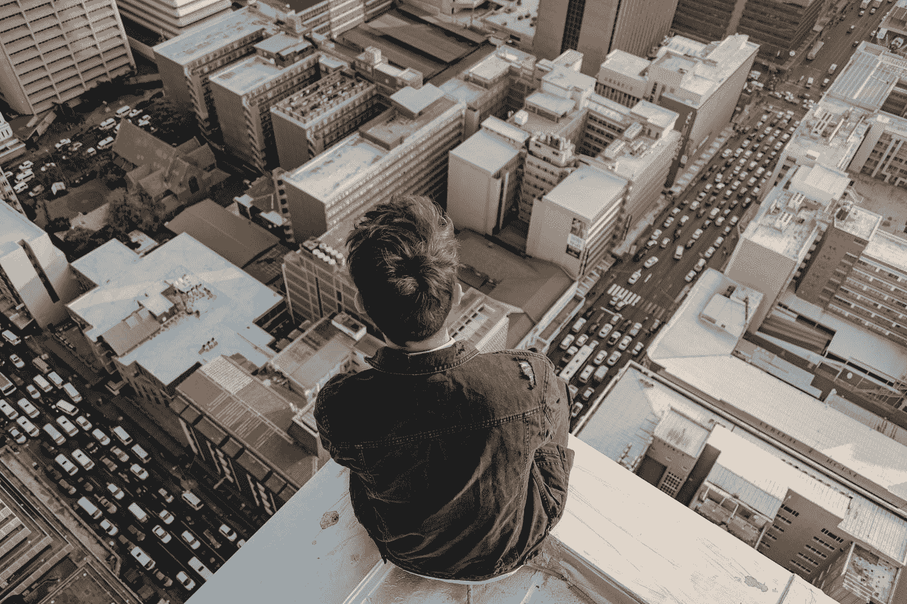

# 互联网改变了我们的故事

> 原文：<https://medium.datadriveninvestor.com/the-internet-changed-our-stories-fb7918ffff95?source=collection_archive---------15----------------------->

Photo by [Dominic Blignaut](https://unsplash.com/@domi_blig?utm_source=medium&utm_medium=referral) on [Unsplash](https://unsplash.com?utm_source=medium&utm_medium=referral)

## 技术

也许每一代人都在抱怨一种新技术正在摧毁社会。历史上以前的时代见证了电力、汽车、电话和电视的发展。这是真的；每一项技术都改变了人类工作、生活以及与社区互动的方式。这些物品如此普遍，以至于我们很少考虑它们是否属于“技术”的范畴

我自豪地成为 1977 年至 1983 年出生的小一代中的一员。我在哪里读到过，这意味着我这一代是最后一个没有持续连接就一直到成年的一代。我想这意味着我有资格过早地抱怨“我成长过程中的事情”我四十一岁了。在我有权利为另一项新技术给社会带来的弊病而哀叹之前，我至少还会有 15 年的时间。

除了这个世界*与二十年前有了很大的不同。今年夏天，我冒险写了一部自动民族志，故事的核心围绕二十年前的事件展开。当我坐下来写下我在 20 世纪 90 年代末的生活事件时，我第一次意识到我的存在在不久前是多么的不同，因为它主要局限于我的周围环境。我没有一部智能手机能让我随时与世界各地的朋友和家人联系。每当一个奇怪的想法出现在我的脑海里，我就无法查找信息。我依靠书面指示和城市网格系统找到我的目的地。*

我是我大学宿舍里唯一一个有电脑的人。那是一台配有大型 CRT 显示器的台式机。我在预定的时间用电话卡给异地恋的男朋友打了电话。当我 19 岁的时候，我很高兴能订阅《时代》杂志，了解世界大事。我独自一人在费城和芝加哥郊区之间进行越野公路旅行，不带 GPS 或手机去看望我的家人。现在回想起来，这对我来说听起来很冒险。我仍然可以访问我获得的第一个电子邮件地址，它从来没有收到垃圾邮件，因为广告商知道它基本上已经过时了。

当我开始写一篇关于 2001 年 9 月 11 日的节选时，我不确定如何描述我的经历。那天，我开始了一个新组织为期一周的工作培训。我看着一架飞机撞上世贸中心，一屋子的陌生人。正如我描述的那样，我觉得有必要加上一句，“但是房间里没有人有手机。”我们这些经历过这一天的人都认识到当时手机的稀缺，但我想我们可能不记得在没有即时通信和更新的情况下观看这样的活动是什么感觉。那次恐怖袭击是一次骇人听闻的事件。直到我把它写下来，我几乎忘记了我已经无法与全国各地的家人联系，直到我的新雇主决定在一天工作结束后释放我们所有人。我仍然要开 45 分钟的车到我的公寓，用座机给我的父母打电话，然后我们才能说话。

我仍然想知道如何向潜在的年轻读者恰当地解释我的世界看起来有多么不同。甚至如何提醒我的同龄人我们的生活曾经是什么样子。18 个月前，我给准备毕业并第一次进入职场的学生讲授了一门大学水平的领导力和管理课程。2016 年大选期间，我也教过同样的课程。2016 届和 2019 届之间的比较让我看到了我们国家好斗和邪恶的两极分化对我们人生观的影响有多大。除了广告和算法不断提供给我们的信息之外，也许我们对自己的了解都少了一些。

我想以乐观的调子结束我的课；鼓励这些学生做真实的人，捍卫他们的价值观。在整个课程中，他们强调的相关领导者是有影响力的人和艺人。塑造他们世界观的人是遥远的。我问他们第一次拥有智能手机或加入脸书的年龄。当他们第一次拥有自己的手机时，大多数人还没有进入青春期。直到大学毕业后，我才买了第一部手机。我 28 岁时注册了脸书，35 岁时注册了 Instagram。一些学生承认，他们对自己强烈的观点和内心信念感到不安，以免他们面临取消文化的愤怒或错误表达自我的尴尬。最后，我不确定乐观的音符是什么，除了提醒这些年轻人试着在网络观众的聚光灯之外识别他们是谁。

最近，当我与另一名即将入学的大学生分享这段对话时，她问我，在大学里谁对我有影响。我愣了一下。我试图回忆那些影响我思维的公众人物，但没有一个人有如此重要的意义。我的影响者是我个人认识的人——一位大学教授，一位倾注了额外精力指导我的老板，一对邀请我吃家常菜并指导我应对约会关系挑战的已婚夫妇。互联网出现之前的影响者是我面对面交谈过的人。他们可以批评我的不良行为，直接鼓励我坚持下去，或者挑战我更努力地思考一个问题。

这不是反进步、反技术的诽谤。缺乏技术并没有让世界变得更好，只是变得不同。写我的回忆录最困难的部分是试图描述一个仍然有一些空间留给隐私、安静和不联系的时刻的社会。当我重读旧日记时，我突然意识到，我所经历的任何孤独都更加明显；我必须承认这种情绪，而不是通过给朋友发短信或在社交媒体网站上发帖，然后等待 ping 告诉我有人看到了我的话，来赶走这种情绪。

不可能不注意到科技对时事的影响。我们大多数人可能对社交媒体对美国政治气候的影响有强烈的看法。我们知道我们总是联系在一起。我们知道社交媒体影响着我们的生活。我们知道算法会影响我们信息的可见性，无论这些信息是个人反映还是产品销售。我们知道技术可以让我们的生活更容易、更快捷、更有见识、联系更紧密。

但像我这样的普通用户可能还没有深入思考这些系统，它们的发展，以及它们将我们引向何处，无论是个人还是社会。也许我们目前的两极分化和公民分裂状态是由于我们自己缺乏对 20 年前、10 年前、5 年后以及去年我们选择采用的工具的反思。2017 年，我偶然看到一本名为*激进技术:日常生活的设计*的书。自从我读了这本书，其中的一段摘录就一直萦绕在我心头:

> “每当我们被某种新技术的自我强化势头和诱人逻辑所吸引，我们就会忘记问它还可能在做什么，它可能是如何工作的，以及谁最终会从它的出现中受益。”

几年前，我的工作主要是弥合数字鸿沟。10 年后，我已经不再关注这个问题，但获得高质量、负担得起的互联网仍然和当时一样是一个公平问题。2020 年 9 月的一项皮尤研究表明，由于缺乏互联网接入，近 60%的低收入学生在疫情期间将面临远程学习的挑战。然而，机器人技术、机器学习、人工智能、面部识别、云服务和其他技术正在继续进步，而我们中的一些人仍然在努力上网。

我们中有谁了解我们先进技术带来的意想不到的社会后果吗？我很难想象年轻的马克·扎克伯格，在他开发脸书的宿舍里，梦想着有一天他会在最高法院面前就他的产品的党派偏见的后果作证。最近，有人鼓励我寻找更多关于现代技术发展的影响的不同观点，并了解正在崛起的技术活动家。在媒体方面，我很欣赏阅读[帕里斯·马克斯](https://medium.com/u/1c35f0069aa5?source=post_page-----fb7918ffff95--------------------------------)和[道格拉斯·拉什科夫](https://medium.com/u/881540f516d3?source=post_page-----fb7918ffff95--------------------------------)的观点。

由于技术设计的影响，每个行业都已经并将会发生变化。我们关于世界和生活的故事正在改变，因为我们的社会参数比以往任何时候都大。与此同时，关于我们人性的决定，如我们看到和读到的东西、我们的信誉，甚至我们是否危险，越来越多地由机器而不是人来决定。我们不能将决策权交给拥有特权的开发人员、程序员和初创企业创始人等小群体。

如果你像我一样(即:不是一个技术专家)，将这些关于设计、民主和分配的对话委托给技术中心、开发者和数字专家会更容易，因为我们不了解他们的内部工作方式。如果我们希望技术用于社会公益，就必须加以利用。数字鸿沟将继续扩大，数字领域将改变人们的期望，并最终重塑每个行业的竞争环境。至少，如果我们不考虑技术将把我们带到哪里，我们将建立甚至在执行之前就过时的商业模式。我们需要跨学科、跨行业的合作来设计好我们未来的世界。如果我们不发展这些，二十年后，我们的故事可能不再属于我们。

格林菲尔德，亚当。突破性技术:日常生活的设计。纽约布鲁克林:Verso 2017。