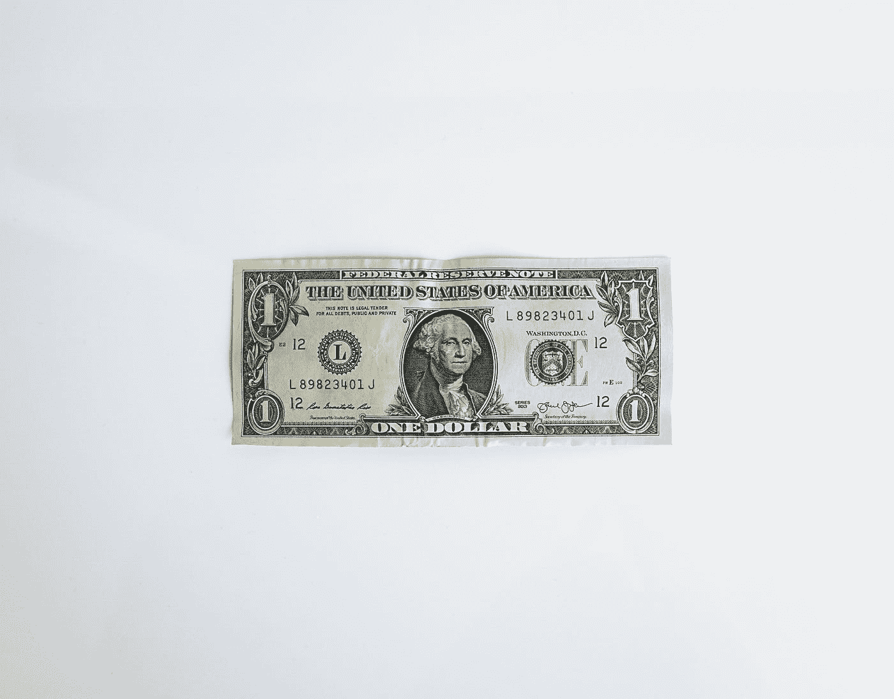

# 4%提款规则的发明者说它不再有效

> 原文：<https://medium.datadriveninvestor.com/the-inventor-of-the-4-withdrawal-rule-says-it-is-no-longer-valid-5b8cae6e6984?source=collection_archive---------0----------------------->

## 他更新的观点如何影响你的财富积累

Photo by [NeONBRAND](https://unsplash.com/@neonbrand?utm_source=medium&utm_medium=referral) on [Unsplash](https://unsplash.com?utm_source=medium&utm_medium=referral)

1994 年，南加州的财务顾问比尔·本根发明了 4%提款规则，或称“4%规则”，它已经成为那些寻求财务独立的人的圣杯。这是一种计算方法，通过预算在第一年花费不超过退休储蓄余额的 4%,确保退休储蓄永远不会用完。这种计算一直是主张财务独立和提前退休的 FIRE 运动的核心。在首次出版 25 年后，比尔·本根(Bill Bengen)卖掉了他的财务规划业务，搬到了亚利桑那州，他建议改变这一规则。

# **确保你不会比你的花费更长寿**

在他的第一份出版物中，比尔·本根分析了自 1926 年以来发生在 1929-1931 年、1937-1941 年和 1973-1974 年的三次最大的股市下跌。在这期间，股市分别下跌了 61%、33%和 37%。然后，比尔设计了一个投资组合，其中 60%是股票，40%是债券，从 1926 年开始，每年退休的人都有不同的提款率。他的结论是，绝对安全的 3%的提款率确保了 50 年的投资组合寿命，而对于 30 年的投资组合寿命来说，4%更合适。在股票市场的历史上，没有一个时期会在不到 30 年的时间里，以 4%的提款率耗尽他们的投资组合。这就是 4%原则的诞生。

# 4%规则过于悲观

比尔·本根今年发表了一份新的出版物，声明他不再坚持 4%原则。他说，这是基于一个最坏的情况，某人将在最近历史上他能找到的最糟糕的时刻退休。那是在 1968 年 10 月，市场已经见顶，一个高通胀时期开始了。退休的人不得不忍受长达 14 年的熊市和暴涨的通货膨胀。从历史上看，平均安全提款率应该是 7%,在某个时间点它达到了 13%的峰值。

# 目前的市场条件表明提款率不会超过 5%

今天的提款率必须受到股票市场的昂贵或便宜程度以及市场预期的未来通货膨胀水平的影响。事实上，股市越便宜，其预期实现的预期收益越高，安全退出率也越高。比尔·本根说，基于今天的条件，如果新退休人员开始时提款率不超过 5%，他们应该是安全的。如上所述，鉴于股票和债券目前并不便宜，相比之下，平均安全提款率为 7%。

# 30 年以上投资组合的提款率较低

正确的支取安全率是 4%还是 5%甚至 7%，值得强调的是我们在消防界看到的一个常见错误(财务独立提前退休)。许多 30 多岁或 40 多岁退休的人希望每年提取 4%的退休金，这样他们的退休金就能永远存在下去。这是完全错误的。比尔·本根的规则是为 30 年的投资组合寿命而设立的。一个 30 多岁或 40 多岁退休的人可以再活 50 或 60 年。历史告诉我们，由 75%的股票和 25%的债券组成的投资组合有 15%的机会在 50-60 年 4%的提取率后耗尽。如果投资组合由 50%/50%的股票/债券组成，这一概率会增加到 30–35%。在 5%的提取率下，同样的投资组合在 50-60 年内有 60-65%的可能性被耗尽。为了安全起见，对于高投资组合寿命或那些打算将财富留给子女的人，我们建议提取率为 3.0-3.25%。