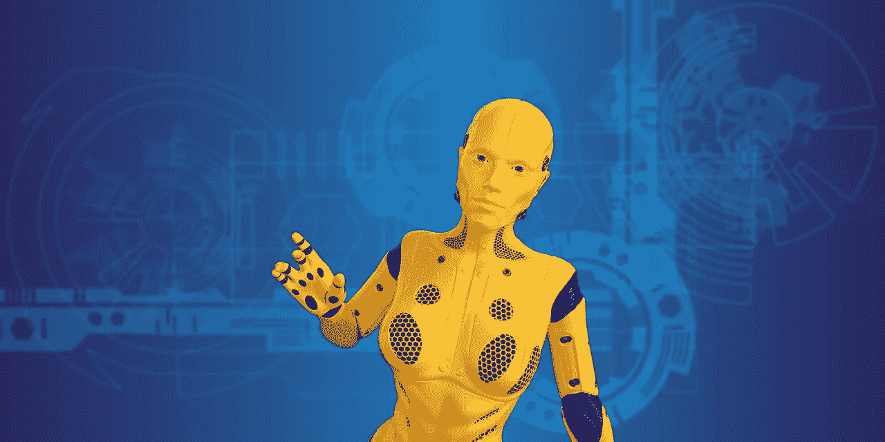

# 将改变一切的无形革命

> 原文：<https://medium.datadriveninvestor.com/the-invisible-revolution-that-will-change-everything-3e5734f6333e?source=collection_archive---------23----------------------->

Dolores from HBO Series Westworld. No copyright infringement is intended.

看《西部世界》第三季时，我发现自己对人工智能(AI)和智人的未来思考了很多。出于同样的原因，几年前我是太空堡垒卡拉狄加的超级粉丝。《西部世界》对未来可能释放的东西进行了更具挑衅性和更令人不安的审视，而且，根据我们的本性，我们人类无法抗拒诱惑，无法沿着这条充满傲慢和错误信念的道路走下去，因为我们相信自己有能力控制我们所创造的一切。

也许，不为我们所知的是，一旦我们在进化中达到某一点，在创造了一个更灵活、适应性更强的替代品之后，我们就会被编程为自毁。也许我们会用一个更聪明的版本取代自己，一个更少被物理定律和宇宙中的巨大距离束缚和约束的版本，来继续探索发现。

 [## 人工智能和监督资本主义|数据驱动的投资者

### 大科技，总是现在:人工智能推动的大科技，已经使购物，搜索，在你的…

www.datadriveninvestor.com](https://www.datadriveninvestor.com/2020/03/04/on-artificial-intelligence-and-surveillance-capitalism/) 

有充分的理由相信这可能是我们的命运。尽管我们在获取知识方面取得了进步，并且能够接触到令人惊叹的技术，但我们仍然意识到，我们的 DNA 中有一个致命的缺陷。虽然我们在物质和技术上取得了进步，但我们的大脑结构仍然和石器时代一样，用矛、弓和箭追逐猎物，采集种子以求生存。我们拒绝应对气候变化带来的挑战，拒绝放弃对化石燃料能源的依赖，坚持相信一种只会毁灭我们和我们赖以生存的地球的经济模式，这暴露了我们的缺陷。我们这个物种似乎不能牺牲对快乐的追求，即使我们的存在要求我们这样做。

也许创造一个数字化的自我是学会在可持续的范围内生活并探索我们周围宇宙的唯一答案。

人类的进化伴随着周期性的创新，这些创新改变了我们的历史轨迹。书写的发展、活字印刷术的引入和约翰内斯·古腾堡在欧洲的印刷(中国人在此之前已经做了很多，但影响有限)，以及现代个人电脑都是值得一提的例子。

每一项创新都对人类发展产生了深远的影响。意识到计算机的长期影响仍有待确定。然而，在不久的将来，我们开始得到新技术更大后果的暗示。其中一个影响涉及我们存储和访问信息的方式。

一场缓慢的革命正在全球展开。这不是一个你会注意到的，也没有太多的人说或写，但当完成时，它将永远不可逆转地改变人类。它的影响很可能会以我们今天判断文字进步、印刷术发明、计算机和互联网发展的方式来看待。有什么可能做到这一点？我指的是什么新玩意？

我指的是所有人类知识的数字化，这些知识目前被划分并储存在全球数千个图书馆、档案馆和无数其他信息室中。我指的不仅仅是所有这些信息和数据的数字化，还包括将其整合到一个统一的知识体系中，这个体系可以被地球上任何地方的任何人访问和比较。这种将所有人类知识收集成一种可以随意调用的可访问资源的影响是无法估量的。我们只能推测它可能会有什么影响。

目前，世界各地的各种实体、组织和政府为了特定的目的正在实施大量的项目。目前没有统一或协调这项工作的运动，但过去和未来的事件可能会增加一些动力和势头，因为我们在一个因气候变化和对稀缺资源的竞争加剧而变得紧张的环境中走向不确定的未来。

地震、火灾、战争、恐怖活动和普遍的动乱将刺激人们对保存目前锁在遍布全球的图书馆中的信息的需求。我们大多数人都记得埃及亚历山大图书馆被烧毁的悲剧，以及由此造成的其中所包含的许多古代知识的损失。

2013 年 1 月，在法国军队支持下的马里军队将伊斯兰极端主义叛乱分子赶出这座历史名城时，叛乱分子放火焚烧了廷巴克图古图书馆的两栋建筑，摧毁了数千份无价的历史手稿。在阿富汗、伊拉克、叙利亚和其他地方，我们目睹了极端组织在许多地方实施的破坏活动，使我们的共同遗产面临风险。保护和保存藏在图书馆里、目前被忽视和遗忘的巨大知识财富是巨大和不可理解的。我们从历史中知道，我们伟大的信息和知识宝库是脆弱的，处于极度危险之中，正如 2018 年里约热内卢国家博物馆被烧毁所揭示的那样。该博物馆收藏了过去 200 年间收集的巴西土著文化的无价之宝。

我认为，除了学会在地球的可持续范围内生活之外，数字化、保存和利用人类的集体知识和智慧是我们人类打开未来探索太阳系和宇宙之门的重要一步。为了成功地通过“伟大的过滤器”的众多测试和挑战，我们需要每一种工具和资源。

(No attribution required)

所有这一切，尽管肯定会产生影响，但只是触及了随着复杂智能算法的完善和人工智能(A.I .)的发展，我们很快就会看到的人类文化和人类的变化的表面。我们需要思考当我们将所有知识的数字化、其他大数据和先进的人工智能结合起来时会发生什么。我们今天需要就此进行辩论，因为我们的物种记录很清楚:如果我们能够做一些事情，我们迟早会在某个地方做。我们需要做好准备，尽我们所能做好准备，这样我们才能知道会发生什么。中国人已经在这条路上走得很远了。

HBO 热门剧集《西部世界》第三季正在进行中。想象一下这样一个世界，其中任何个人的所有信息都被私人实体或政府收集和分析。假设你的决策是基于智能算法的分析做出的，这些分析影响了你生活的方方面面，你选择或从事的职业，以及由此给你带来的价值。它表明了我们在收集和整合大数据的过程中正在走向的方向，人工智能的发展，尽可能多地了解我们每个人的愿望，以及人类寻求财富和权力来控制他人的弱点，这不仅令人不安，而且令人恐惧。一个让奥威尔的《1984 年的 T1》看起来像是儿童学校野餐的世界的噩梦般的画面困扰着我。我想起了 1997 年的电影 *Gattaa* ，但即使这样也太平淡无奇了。如果这是未来，地球和宇宙没有我们可能会更好。