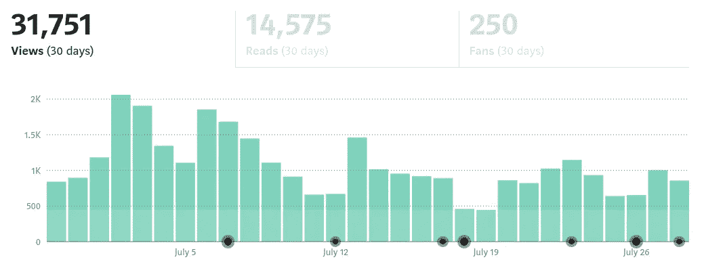
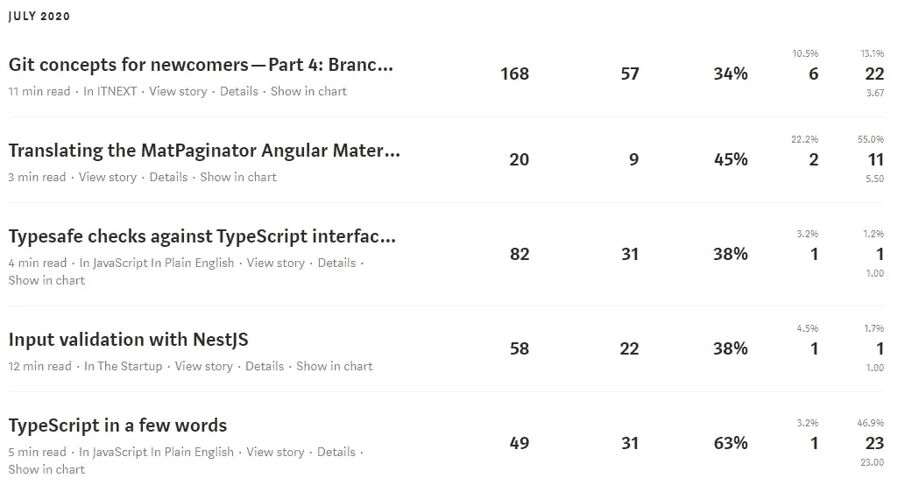
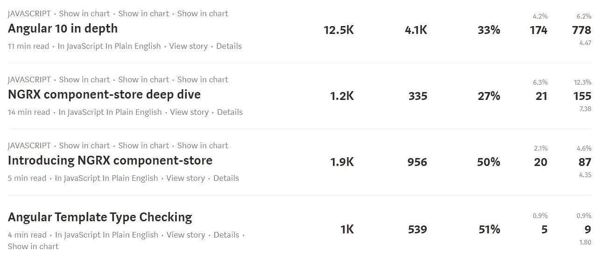
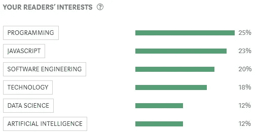
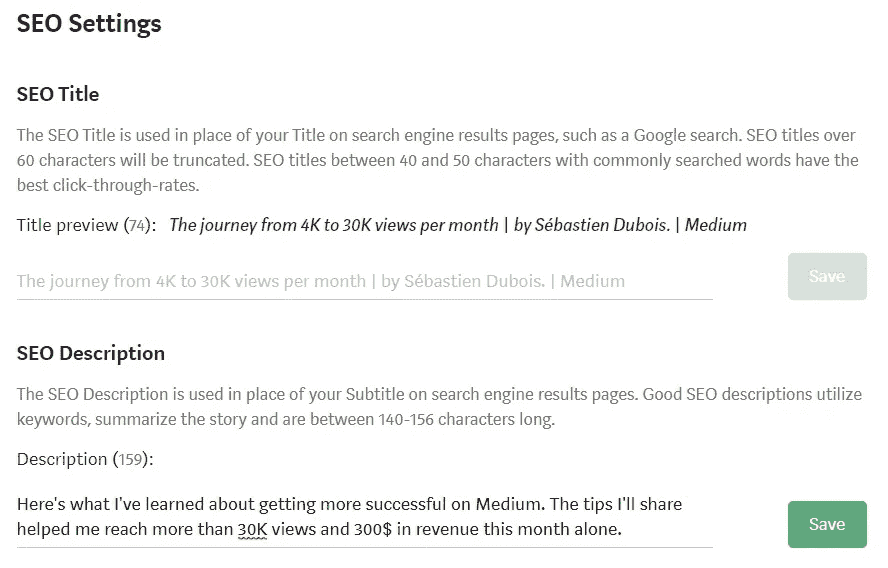
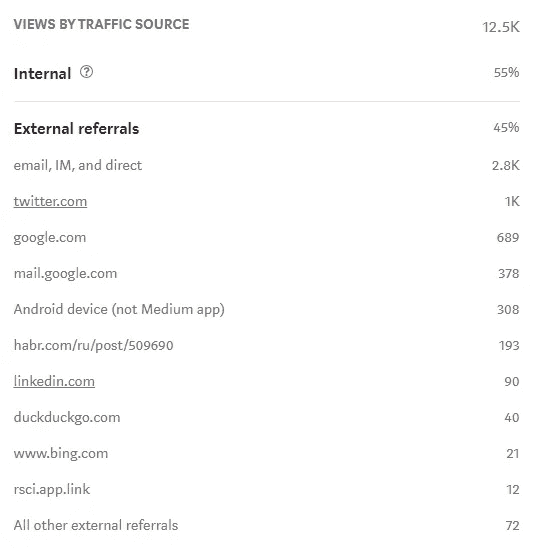
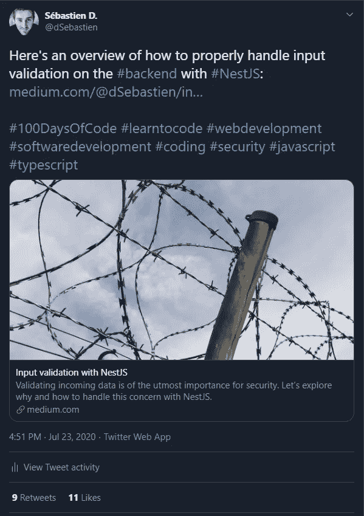
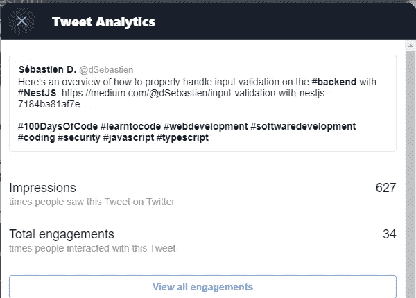

# 从 4K 到每月 30K 浏览量的旅程。经验教训

> 原文：<https://medium.datadriveninvestor.com/the-journey-from-4k-to-30k-views-per-month-lessons-learned-19fb8456bbba?source=collection_archive---------9----------------------->

## 让我告诉你我是如何在写作上取得更大成功的

Picture courtesy of [Vlad Bagacian](https://unsplash.com/@vladbagacian)

探索！这就是我的媒介“旅程”的全部。

在这篇文章中，我将分享我最近几个月学到的一些东西，这些东西帮助我在写作上取得了更大的成功。

我将分享我的故事的一部分，我的目标，我在媒体上写作的原因，以及我增加我的内容的可见性的方法。

# 我的故事到此为止

我一直喜欢写作。我记得在 199x 年的时候，我为我的主机游戏网站输入了完整的视频游戏指南(当时我大约 14 岁)。

我从 2005 年左右开始写博客，在很长一段时间里，我只发表很小的文章。我的帖子大多是关于摄影、网络开发、电子和其他极客(好吧，书呆子:p)主题。那时，我最感兴趣的是尽我所能学习软件开发和 IT 的一切知识。这曾经是(现在仍然是)我真正热爱的事情。

 [## 您的企业今天需要虚拟现实营销的 3 个原因|数据驱动的投资者

### 新冠肺炎是并将继续是一个前所未有的全球性事件，将医疗保健系统和全球经济带到…

www.datadriveninvestor.com](https://www.datadriveninvestor.com/2020/04/09/3-reasons-why-your-business-needs-vr-marketing-today/) 

这些年来，我在 Blogspot、Google+上发布了我的内容，然后在[我自己的域名](https://www.dsebastien.net/)上使用 [Wordpress](https://wordpress.com/) 发布。当我切换到 Wordpress 时，我建立了[谷歌分析](https://analytics.google.com/analytics/web/)，并对 [SEO](https://moz.com/beginners-guide-to-seo) 给予了一点关注，因为我有兴趣了解谁会出现在我的网站上。尽管如此，我当时并没有多想。我没有寻求受欢迎程度/知名度或类似的东西。我喜欢免费的开源软件，对分享源代码比对分享想法更感兴趣。

直到去年，我甚至从未考虑过从我的写作技巧中获得收入。我的旅程始于与 Packt Publishing 的一本编程书籍交易。他们[通过 LinkedIn](https://medium.com/@dSebastien/the-story-behind-my-upcoming-book-learn-typescript-by-building-web-applications-part-1-26926bd1756d) 联系我，提议我给[写一本关于](https://www.amazon.com/gp/product/B081FB89BL)[打字稿编程语言](https://www.amazon.com/gp/product/B081FB89BL)的书。

那发生在我创办了我的 it 咨询公司之后，所以对我来说，这是一个提升我的技能、获得一些认可和获得一些咨询工作的好机会。

经过近一年的奋斗(没有别的词可以形容)和 800 页之后，我终于完成了这个项目。这本书于 2019 年 11 月[出版](https://www.amazon.com/Learn-TypeScript-Building-Applications-understanding-ebook/dp/B081FB89BL)，迄今已售出几百册(数字+平装本)。

我总共收到了约 1.6 万€(约 1.9 万美元)的预付款，我不希望从这个项目中获得任何更多的直接收入。尽管如此，我认为这是我一生中一次宝贵的经历。我知道我能做到，我是对的。但是，更重要的是，它让我意识到我真的有多喜欢*写作。*

稍事休息后，我开始在 Medium 上发表文章。我最初的目标是帮助推广我的书，同时分享我的想法和发现。

多年来，我在 IT 的各个领域工作过，从软件开发到基础设施。我做过企业软件框架，领导过多个团队，管理过大型项目，创办过自己的公司，经历过一年左右的 IT 咨询(长话短说:我并不怎么享受)。最后，我现在在 SaaS 启动一个项目，并忙于写一部小说(优先级较低)。

我提这个不是为了吹牛(我讨厌那样)，但是那些经历深刻地改变了我，塑造了今天的我。我是一个狂热的学习者，我喜欢分享我学到的任何东西。这适用于许多学科，包括管理、个人生产力/组织、团队管理、写作以及“低级”技术细节(这是我非常喜欢的)。

好消息是我的热情依旧，我不厌倦学习和分享新事物。我目前的项目是打造一款 SaaS 产品；这是我着手的最具挑战性的项目之一，但旅程本身就很有趣。这是一个巨大的金融赌注，但我愿意承担这个风险，只是为了看看它会给我的生活带来什么。

除了那个项目，我真的想继续写作，这就是为什么我抓住每一个机会发表新文章。就目前而言，媒介是我的媒介。让我告诉你为什么。

# 为什么中等？

老实说，我有点“惭愧”地大声说，我正试图从我的写作中获得收入。我感到惭愧，因为 IT 社区中有这么多了不起的人免费分享他们的内容，没有付费墙，无论是在媒体上还是在像 [DEV.to](https://dev.to/) 这样的平台上。

作为这个社区的一员，我感觉自己就像一个“小偷”，试图从别人免费分享的想法中获得一分钱。尽管如此，我还是很想试试，看看这个平台能让我走多远。

我不是在寻求受欢迎或赚大钱。不过，我真的很好奇，想知道我的写作副业是否可以支付一些账单，或许，给我一个替代兼职员工的选择。

那么为什么是中等呢？

和 Packt 一起写书让我明白了，有些“链条”我已经不感兴趣了，而且我 90%的工作都是自己做的，要拿 12%的版税实在不值得。投资的财务回报太低，与所需要的巨大努力不相称。

我的书有 800 页长(我写了大约 1000 页，但有几章被遗漏了)，花了我一年的时间才写完。几乎每天，我都花 1-3 个小时写书。我甚至不想数我在这上面花了多少时间。

事实是，作为一名自由软件开发人员，我可以在仅仅 2-3 天的工作中赚到这本书给我带来的那么多钱。如果你仔细想想，花了几百个小时却得到了同样多的东西，这完全是疯了。幸运的是，还有其他原因。此外，这本书的合同阻止我以任何我想的方式重复使用我的内容。它不再是我的了。

如果你曾经想过出版一本书，那么明智地思考和行动。不要低估自己。如果你能自己出版，那就去做吧。你会得到更好的投资回报，这是肯定的！

Medium 有一个非常有趣的收入模式，而且不会剥夺我的知识产权。这意味着我可以在付费墙后面的媒体上发布我的内容，但也可以在我的博客或其他地方重新发布。

此外，Medium 上的出版物让我有机会接触到大量的潜在读者，如果你在其他地方发表文章，就不容易获得这些读者。我将在文章的后面详细解释这个想法。

最后，中型文章可以在发表后很长时间内继续产生收入，这本身就很有趣。

# 我现在所处的位置

在过去的 30 天里，我的文章有近 32K 的浏览量，对此我非常自豪和感激。

7 月份，仅我的媒体文章就获得了 300 美元的收入，高于上个月的 73 美元。这个月很特别，因为一篇文章给我带来了[几乎一半的浏览量](https://medium.com/javascript-in-plain-english/angular-10-in-depth-a48a3a7dd1a7)和大约 200 美元的收入。

我们将会看到接下来的几个月是由什么组成的，但我认为它可能会回到 70-100 美元的经常性收入。尽管如此，这对我还是很重要。它不支付租金，但这是一个相当不错的数额。我很有信心，我从媒体中获得的收入会比我的书多。

我在 Medium 上写了大约一年(偶尔)后实现了这一点。从今年二月开始，我才开始写更多的文章(每月 5-15 篇)。成功不会一蹴而就。尽管如此，我在这个过程中学到了一些东西，帮助我在这个平台上取得了更好的成绩。

那些东西根本不是秘密；我认为现在有数百篇文章分享这些相同的想法。但是让我告诉你这些。以防你还不知道。

# 追随你的激情

正如我提到的，这是我的主要专业领域，也是我的一个真正的爱好。我可以写许多其他主题(在某种程度上我会写)，但我打算主要集中在 IT 相关的文章上。

为什么？因为对我来说容易多了。写一些你有深刻第一手经验的东西比强迫自己研究和写你不熟悉的主题要容易得多，感觉也自然得多。

虽然我已经做了 15 年了，但由于骗子综合症，我仍然觉得自己像个骗子。尽管如此，客观地说，我现在确实知道了不少，也确实有知识和想法可以与我的同行们分享。如果你追随你的激情并写下它，对你来说也是如此。

所以，如果你正在开始，那么试着先写下是什么让你心动；会更容易；-)

# 定期发布

为了让你的写作达到更好的效果，最有效的方法就是定期发表文章。这并不意味着你应该发表枯燥和没有灵魂的文章，而是你应该付出足够的努力来达到内容的临界质量。不要让自己一开始就被低数字所打击。很正常。

如果你有动力，那就计划你的写作；每周花一到两次时间来写和发表你的想法。这是一种需要养成的习惯，就像其他任何习惯一样。

以下是我帮助自己保持稳定步调的方法:

*   早起写作:新鲜的头脑思考得更清楚
*   一直收集想法*:每当我做一些有趣的事情或学习一些很酷的东西时，我会在我的特雷罗板上添加卡片，上面有我下一步可以涉及的主题；这有助于我建立写作积压*
*   *定期检查我的写作积压，根据几个标准对其进行优先排序:与我以前的文章的一致性(例如，继续我已经开始的系列)，它将花费我的精力和*动力*。动力很重要，因为如果我等太久才写一篇文章，那么我的想法/知识可能已经消失了，这使它变得更难*
*   *计划有规律的写作时间。需要花时间；它不会神奇地解放自己。说“我没有时间”太容易了*
*   *不要耗尽我的精力。好吧，这是一个谎言，我是一个工作狂。但这对大多数人来说无疑是个好建议:不要给自己太大压力。保持合理的步调，但不要让自己讨厌自己做的事情。如果感觉太累，那就休息一会儿。*

# *改变乐趣*

*尝试不同的形式:长，短，以及不同的主题。这将达到两个目的。首先，它会帮助你更好地理解什么是最“舒服”和最喜欢写的。其次，它会让你探索不同的主题，接触更多的观众。*

*当然，我认为最好是专注于一个主要领域，以创造一个更稳定的观众群。但我只是猜测，我可能是错的..；-)*

*例如，我主要写前端 Web 开发，但我也想涵盖后端开发、软件架构、一般软件开发和产品管理。*

*除了这个核心的“IT”主题，我还想写其他主题，如团队/人员管理、项目管理、领导力、企业家精神、生产力、个人发展、写作、摄影等。但是这些可能仍然是次要的主题。我觉得写这些东西很舒服，但它们本身并不是我的热情所在。*

# *有效率*

*注意你写文章的时间。我有时会花一整个晚上写一篇文章。有时候这很正常，但大多数时候不是，这意味着我在瞎混，或者我在浪费时间无休止地重述事情(我*真的*擅长这个！).*

*接受我的建议，使用[番茄工作法](https://en.wikipedia.org/wiki/Pomodoro_Technique)来尝试给你的写作设定时间。用 25 分钟的时间，看看你能写多少。*

*   *0-5 分钟:用要点列出你的想法，然后找到正确的顺序，并尝试组织这些想法*
*   *5-15 分钟:一旦你有了基本的框架，你只需要填补空白*
*   *最后，大声朗读你的文章，改编你不喜欢的内容*

*如果一次还不够，那就再来一次。但是请继续使用计时器。否则，你会像我一样浪费时间。这很有趣，我也很喜欢玩文字游戏。但有时这有损我的工作质量。*

# *观察过去预测未来*

*随着时间的推移，帮助我提高的一个习惯是回顾和评估我过去文章的成功之处。*

*在 Medium 中，你可以去[统计页面](https://medium.com/me/stats)了解你的文章有多成功:*

**

*请注意，默认的 stats 视图看起来并不像这样。我使用的是由托马斯·图拉真(T11)创建的令人敬畏的中等增强统计谷歌 Chrome 扩展(T9)，它增加了更多的信息，如鼓掌次数、更好的图表等。*

*那么我们能从这些数据中学到什么呢？*

*首先，我可以看到我关于用 NestJS 进行输入验证的文章并没有太大的成功。只有约 60 次浏览，但更重要的是只有 38%的阅读率和一个单一的“鼓掌”；意思是对内容没什么兴趣。这可能是由多种原因造成的:*

*   *可能我没有接触到目标受众(可能关注我的人对前端软件开发更感兴趣)。为了证实这一点，我应该分享几次，也许在社交网络上尝试不同的标签*
*   *也许这篇文章的标题不够清楚:我可以改变它，看看是否有影响*
*   *也许这篇文章太长或者太宽泛*
*   *等等*

*在现实中，可能有不同的事情在起作用，并且不总是容易猜测。尽管如此，重要的是要试着理解哪里错了，哪里可以改进。*

*实际上，对收入的影响是巨大的。关于 NestJS 的文章给了我 0.11 美元，而关于 Typesafe checks 的文章给了我 0.68 美元，只有 20 多次浏览。*

*一个重要的教训是，观看/阅读比率对收入有真正*大的*影响，这是直观的，因为它与兴趣相关。*

*现在让我们来看看我最近成功的文章:*

**

*正如你所看到的,“Angular 10 in depth”这篇文章的阅读率很低，但是浏览量和掌声数量却高得多。这意味着这篇文章来的正是时候，有一个吸引人的标题，总体上有有趣的内容。人们显然想看这个。*

*后面两篇也有 1K 多的浏览量(一点都不差)，很多拍手。所以这些触及的受众较少，但对这些内容有明显的兴趣。*

*最后，“有角度的模板类型检查”文章也获得了相当多的观点和人们更多地关注内容。*

*基于这些数据，我可以清楚地看到人们对新闻文章的兴趣。我非常确信，如果我写更多关于软件开发世界中新的和闪亮的东西，我会得到更多的关注。这也难怪。每个人(包括我自己)都对未来感兴趣。*

*此外，我可以看到，我试图做一个真正的“深潜”文章是相关的，但可能不值得努力。我花了很多时间准备那本书，但人们实际上并没有详细阅读它。所以，是的，这很有趣，但我有更好的选择来获得更多的成功。*

*回顾以前文章的结果对于理解你的观众的期望是非常有用的。定期这样做可以引导我写出更好的文章，避免那些我的观众似乎不感兴趣的主题。另外。通过这样做和尝试不同的东西(例如，不同的主题，不同的风格，不同的标题等)，你可以看到是否有积极的影响。*

*另一件事，独立于统计数据，是看看你的文章产生的收入。一旦你开始从你的写作中获得一些钱，你可以简单地看看每篇文章产生了多少，并将其与写它所花费的时间/精力进行比较，以评估它是否值得。*

# *使用正确的标签*

*标签对于提高文章的可见性非常重要。随着时间的推移，我开始关注标签，通常更喜欢添加拥有最多订阅者的相关标签。*

*例如，我更喜欢使用“编程”(135K)而不是“编码”(49K)。每个尼斯都有自己的“星级”标签。做你的家庭作业，找出那些是什么。*

*标签帮助对特定主题感兴趣的人找到符合他们兴趣的文章。所以你越精确，你能达到的范围就越大。*

*如果你查看特定文章的统计数据，那么你就可以看到你的读者的兴趣。一定要看看这些来帮助你选择更好的标签:*

**

# *加入(受欢迎的)出版物并获得策划*

*这是众所周知的关于媒体的建议，但对我来说却有着巨大的不同。*

*刚开始的时候，我不明白为什么要加入刊物，也不明白怎么加入刊物，所以我只是发表我的文章，尝试自己推广。它确实有效，但不是很有效。*

*从那以后，我加入了一些媒体出版物(例如，The Startup，ITNext，JavaScript in Plain English，Management Matters 等)，并通过它们发表了我的所有文章。*

*出版物帮助我接触到更多的读者。例如，简单英语的 JavaScript 有 [~30K 用户](https://medium.com/javascript-in-plain-english/latest)，而“The Startup”有 635K 用户。*

*毫无疑问，让我的文章被出版物接受对我写作活动的成功产生了巨大的影响。*

*将我的文章加入出版物并不意味着我将失去知识产权；我完全保留这些，并且可以随时撤回我的文章。另外，我全额保留收入(afaik)，所以真的没有理由错过。*

*此外，一些出版物的编辑还可以为媒体的特定部分(如 JavaScript)策划文章，并让您的文章出现在更多的屏幕上。*

*我有机会让我的一些文章策划和影响是重要的。*

# *挑选好的标题*

*你文章的标题是读者看到的第一个东西。*

*关于这一点，有[无数](https://blog.medium.com/how-to-write-a-headline-a72ab3449150) [指南](https://blog.medium.com/5-of-the-most-common-easy-to-fix-problems-we-see-in-curation-48f9a0395fb7)，但确实关系很大。如果你没有选择一个好的标题，那么人们会继续滚动，他们甚至不会打开你的文章。*

# *想想 SEO*

*每当我发表一篇文章时，我都确保编辑设置，以便写一篇好的描述:*

**

*我确信这些设置对于搜索结果的更好显示至关重要(在 Medium 上，但更重要的是在 Google 和其他搜索引擎上)。*

*默认情况下，SEO 标题是文章的标题(通常对我来说足够好了)，但描述只是取自文章的前几句；通常，描述需要被改编。*

*如果你查看一篇文章的统计数据，你可以看到按流量来源分类的浏览量:*

**

*这很有用，因为它显示了你的观众来自哪里。基于此，你可以尝试看看如何增加这些不同来源的数字。*

# *使用稳定的文章结构*

*在我的文章中，我通常保持相同的结构，我认为这是我的观众所欣赏的:*

*   *第一句话让你知道文章的内容*
*   *一张照片，通常是从[未拍摄的](https://unsplash.com/)拍摄的，或多或少与拍摄对象相对应*
*   *一小段或两段关于我将在文章中涉及的内容*
*   *关于这个主题的介绍*
*   *核心主题*
*   *一个总结，我对我在文章中所涉及的内容做了一个回顾*
*   *链接到我的个人资料、邮件列表等*

*这个结构非常简单，但我认为已经足够好了。它帮助我组织我的写作，并且更有效率。此外，它帮助读者找到他们的标记；如果他们习惯了我的文章，他们就会赢得时间。*

*注意，图片真的是必须的。它给文章增加了一个“面子”。没有这一点，你的文章只会看起来像一团一团的文字，对潜在读者的吸引力会小得多。*

# *交叉引用文章*

*如果你谈到了主题 X，并涉及到了主题 Y，那么这是一个很好的机会来链接到你以前在 Y 上写的文章。*

*随着时间的推移，当你向博客添加内容时，你会有越来越多的机会交叉引用你的文章。不要错过这些机会，因为它们提供了一个让你的读者找到更多他们可能感兴趣的文章的好方法。*

*网络是由链接组成的，人们喜欢探索！；-)*

# *推广你的内容*

*我不知道有多少人喜欢自我推销，但这实际上是不可避免的。不推广你的内容，你可能永远不会成功。*

*数字营销并不难学。当然，推广你的文章和做全职数字营销人员是有差距的。营销文章比较容易，不用怕；-)*

*以下是我目前正在做的事情。*

*在发表一篇文章并将其添加到出版物后，我会写一条小推文，讲述我的最新文章，并试图将主题浓缩到一行文字中。我通常很啰嗦，所以对我来说很难保持简短，但这是必须的(否则人们不会阅读)。*

*在这个一行程序之后，我添加了文章的链接，并以一些精心选择的标签结束。我知道标签会让人觉得垃圾，我能理解，但是我觉得它们确实帮助我接触到了更多的观众。*

*最近，我一直在使用#100daysofcode 这样的标签，因为我真的很想接触到更多的初级软件开发人员。我想分享这些年来我所学到的东西，以及我在指导和训练中的经历。如果我能在网上做同样的事，我会很激动。*

**

*一旦推文发出，我通常会用我公司的 Twitter 账户重新分享。*

*之后，我也会在 LinkedIn 和脸书等其他社交平台上发布同样的信息，并在我的个人/公司账户上分享。*

*我确信在营销我的内容方面还有改进的空间，但这是我目前正在做的。*

**

*通过分析，我还可以了解有多少人与这条推文进行了互动。*

*推广工作的另一个方面是，你可以利用你的文章和社交媒体平台作为渠道来提高你的产品和服务的知名度。*

*许多免费分享内容的作者实际上是在为他们的咨询业务提供资金，这也是(至少部分)他们不想坐在付费墙后面的原因。*

# *交际*

*这听起来可能很愚蠢，但是作为一个内向的人，社交并不容易。尽管如此，获得内容的可见性仍然非常重要。*

*多年来，我一直在 Twitter 上关注我觉得有趣的人。我现在关注 5000 人(推特不让我关注更多的^_^).当然我不能全部读完，但是我喜欢看到有趣的内容一直出现在我的“墙”上。在 LinkedIn 上，我也通过工作积累了很多人脉。*

*所有这些人对我来说都有点“触手可及”。当我分享内容时，他们有可能会看到内容并与之互动。*

*此外，我对我的社区成员正在做什么/分享什么真正感兴趣，我经常喜欢/转发/评论他们的内容。我这样做并不希望得到什么回报，但人们确实会欣赏它，有时也会为我这样做。例如， [Santosh Yadav](https://twitter.com/SantoshYadavDev) (顺便说一下，他是一个很棒的人)重新分享了我的一些文章，并帮助我接触到了更多的读者。*

*这就是我们人类的工作方式；我们通常喜欢回报过去帮助过我们的人。*

*总之，在[媒体](https://medium.com/better-marketing/is-it-still-possible-for-new-writers-to-make-money-on-medium-9e04b5e1f10a)和其他社交网络上，关注者很重要。*

# *不止一次分享*

*几周前，我开始意识到没有理由只推广我的文章一次。我从来没有多想，但是到目前为止，我只是一次写、出版和推广我的文章。*

*现在，我开始多分享几次我的文章。问题是，鉴于我在 Twitter(约 700 名订户)和 LinkedIn 上的影响力很小，我很少有机会在一次拍摄中获得很多曝光率，这取决于我何时发布我的消息、人们何时看到/阅读它等等。*

*通过多次张贴我的文章(不同的日子，不同的时间)，我增加了将我的内容展示给更多读者的机会。当然，有一个合理的限度；我不能开始滥发相同的文章一遍又一遍。但仍然值得到处尝试几次。*

# *交叉柱*

*我之前说过，Medium 并没有拿走你的知识产权。因此，除非你发送文章的出版物另有说法，否则你有权在其他地方发布你的内容。*

*例如，我有时会把我在 [DEV.to](https://dev.to/) 上的文章交叉发布，这得到了不喜欢付费墙的读者的赞赏。在这样做的时候，我提到了我的文章最初出现在 Medium 上的事实(或者至少指出了我主要是在 Medium 上写作的事实)。这样，我可以让新的读者发现我的内容。*

*这似乎是徒劳的，但是你创造的能见度越高，你就能获得越多的成功。当然，更多的阅读不仅意味着更多的收入，而且更多的人有机会从你这里学到一两件事。我不知道你怎么想，但我确实很看重那部《T4》。*

# *创作系列和衍生作品*

*我最近尝试的一件事是创作一系列文章。*

*出于好奇，我决定为初学者解释一下 [Git 概念](https://itnext.io/git-concepts-for-newcomers-part-1-what-is-a-dvcs-bc873076c424)。我刚刚出版了[第四部分](https://itnext.io/git-concepts-for-newcomers-part-4-branches-52aee1da4385)，我可能总共会写 10-12 篇文章。编写这个系列对我来说相当容易，因为我已经专业地使用 Git 很多年了。所以创作这个系列的时间/努力仍然是合理的。*

*这个系列的每篇文章都指向前面/后面的文章。如果有人读了其中的一篇文章，那么他们很有可能会继续读下去(假设内容令人愉快，并且质量足够高)。仅此一点就足以成为投资写作系列的理由。*

*此外，我认为创建这个系列是创建完整的 Git 课程的第一步。这可以采取不同的形式:视频课程、电子书等。*

*事实上，已经有很多关于 Git 的课程了。但我不会让这阻止我；这并不意味着我不能成功。*

*创作衍生作品无疑是获得更大成功和创造额外收入的一个好方法。当然，这需要努力和奉献。*

# *与你的观众建立关系*

*这方面我还是个新手，但我现在正努力“接近”我的观众。几个月前，我开始出版一份关于软件开发的新闻简报。*

*通过这篇时事通讯，我有了一个多的渠道去接触那些对我要分享的感兴趣的人，我可以写更多“个人的”(我把它看作是我写作活动的一种“后台”)。*

*许多作者在他们的时事通讯上取得了巨大的成功(达到数百份),并设法创造了额外的收入，例如通过广告、联盟系统和订阅。*

*我相信有很多选择，但我现在不能发表太多评论。到目前为止，我“只有”25 个订户，但我打算继续投入时间来接触更多的人。*

*到目前为止，我已经发表了[十篇简讯](https://mailchi.mp/1f5eb2a12806/developassions-newsletter-10)，并且打算发表一千篇！；-)*

*时事通讯也能很好地提及你的读者可能错过的文章，从而增加获得额外浏览量的机会。*

*最后，注意使用像 [Mailchimp](https://mailchimp.com/) 这样的服务创建一个真的很容易。*

# *寻找赞助商*

*最后我想提的是赞助计划。*

*我刚刚[开始](https://github.com/sponsors/dsebastien)这个，所以我还没有任何赞助商，但我认为如果你想获得更多成功，从你的写作中获得更多收入，这也是值得一看的。*

*如果你发现你的观众和人们喜欢你创造/分享的内容，那么你可以试着让他们赞助你的工作。*

*就我而言，如果有人[赞助我](https://github.com/sponsors/dsebastien)，我会很激动。这还没有发生，但它可能与我没有敦促任何人这样做的事实有关。*

*在 Github 赞助商或者像 [Patreon](https://www.patreon.com/) 这样的平台上创建一个页面是非常简单的，并且可以帮到你。*

*那么对你的读者有什么好处呢？好吧，这取决于你的想象力。例如，你可以让你的赞助商优先考虑你的写作积压，或写赞助商专用的文章，等等。有数不清的方法可以让它变得有意义。*

*这绝对是我想在未来几个月探索的事情。我希望得到赞助来帮助 IT 社区，无论是通过写作、软件开发、辅导还是指导！*

# *结论*

*在这篇文章中，我与你分享了我的一些故事。这不是故事的全部(我不想让你太无聊)，但这足以让你了解我为什么写作以及我来自哪里。*

*我也分享了一些关于如何让你的写作更加成功的技巧和诀窍。这可能不多，但这些东西确实给了我很大的帮助。*

*我不能光靠这个活动活着，但是我最近的“成功”(一切都是相对的)感觉很棒！我在 Medium 上挣的每一块钱都比我在咨询工作中每天挣的几百块钱感觉好得多*。**

*我想我喜欢全职写作来谋生的想法。我们会看到事情如何演变；-)*

*今天到此为止！*

***访问专家视图—** [**订阅 DDI 英特尔**](https://datadriveninvestor.com/ddi-intel)*