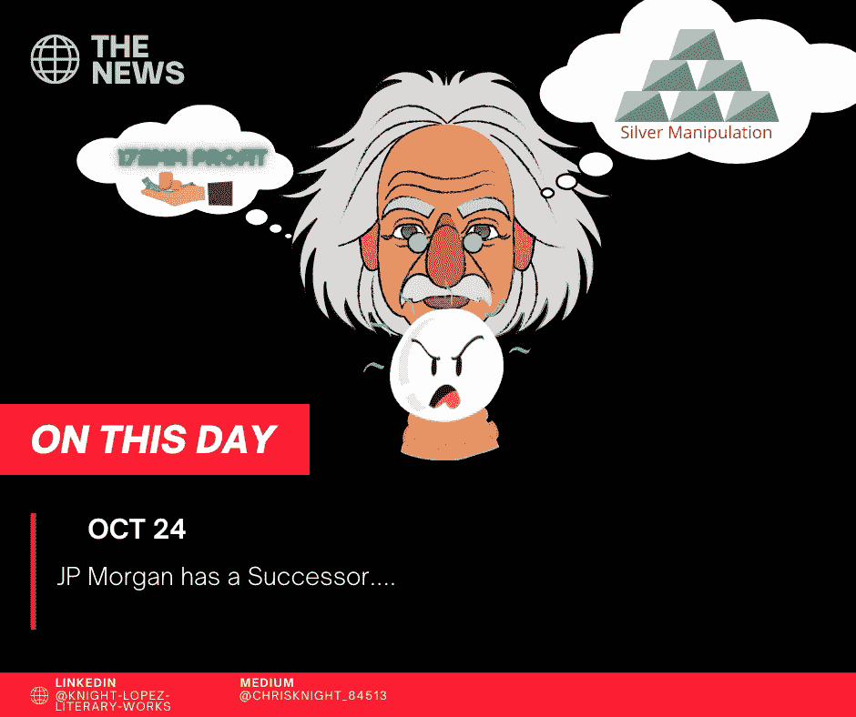

# 摩根大通人类不断膨胀的贪婪创造了泡沫

> 原文：<https://medium.datadriveninvestor.com/the-jp-morgan-bubble-of-creation-for-mans-ever-expanding-greed-639b38821b4e?source=collection_archive---------10----------------------->

## 我创造。我制造。我愚弄别人。我会想尽一切办法变得富有。下一个我会是谁？

Source: Self Created Image with Canva.

**疯狂科学家**

电流在房间里燃烧。通过能量线圈，能量在一个人周围涌动。这个房间有可以水平转动的窗户。窗户的位置使房间完全敞开。

强风吹来。文件在房间里乱飞。

一个男人坐在一座高塔上。这个人似乎在世界之巅安了家。

有人称之为世界中心。有人把他的城市命名为现代巴比伦。其他人认为它的中央大街是金融活动的主要场所。

在散落的零件中，电脑屏幕在他周围闪烁。当他辛苦工作时，电源线会发出电火花。

“在哪里！?"疯狂的科学家大叫。

**欺骗的行为**

房间里没有人。只有他。现在是凌晨 4 点。他坐在巨大的钢桌周围，壁灯向他照射下来。他狂热地搜索着他的屏幕。他像疯子一样穿过它们。然后…他停了下来。他的眼睛紧紧盯着四个屏幕中的一个。

“啊……”疯狂的科学家叹了口气。

“……就在那里。”

这位疯狂的科学家伸出手，敲了一个键。再来两杯。然后是第三个。出现了线条和图形。

“我的程序…让我看看…”

疯狂科学家移动了几个屏幕。“好的。大块移动到这里。通过……[摩根大通](https://www.finextra.com/pressarticle/84292/jpmorgan-chase-fined-920-million-for-market-manipulation#:~:text=Under%20the%20terms%20of%20the,with%20the%20CFTC%20being%20announced)……”

屏幕上除了贵金属什么都没有。他凝视的是银、金和钯。

“如何[操纵](https://www.sec.gov/news/press-release/2020-233)这个…”

疯狂的科学家认为。他沉思着。他的手指一个接一个地敲打着桌子。他坐回到椅子上。

“我想我知道。”

他向前倾斜。多个职位空缺。疯狂的科学家一次放置一大块。

“我会给算法编程，让它在开市后停止交易。比如 30 分钟左右。填充然后取消。这些都是未来。”

**一种阴险的满足感**

疯狂的科学家看起来很高兴。他的眼睛睁得很大。今年是他跑步的第 8 个年头。从 2008 年到 2016 年，他成功部署了这一战略。众所周知，在一个被高估的市场中制造虚假泡沫。

“[我认为市场至少被高估了 77%](https://www.forbes.com/sites/mikepatton/2020/08/18/us-stock-market-hits-record-77-overvalued/#112f37da358c)…”

疯狂的科学家越走越远。他的眼睛从一个屏幕转到另一个屏幕。他把椅子滑到下一站。

“…我赚了多少…”

疯狂的科学家拔掉了他的屏幕。他把屏幕从桌子上拉下来。他打开它。屏幕本身是一个芯片。他拔掉了芯片。他把屏幕重新组装起来。

“…现在我可以看着它了…”

疯狂的科学家继续打开他的屏幕。然后他打字，在屏幕上他看到了。

“……这很好。172，034，790 美元是我的总收入。摩根大通的新纪录……”

大厅里回荡着洪亮的笑声。电源线圈以一种不祥的方式发光。风呼啸着穿过房间。笑声变成了尖叫声。

“啊……那些傻瓜在追逐我的梦想!”！！！!"

**这是所有邪恶的终结吗？**

这将如何结束？会有怎样的结局？结论会像所有事物一样类似于那些屈服于贪婪的人。贪婪总是要付出代价的。

摩根大通被要求支付总额为 9.202 亿美元的赔偿金，这是 CFTC 有史以来最大的一笔赔偿金，包括最高赔偿金(311，737，008 美元)、没收赔偿金(172，034，790 美元)以及任何欺诈案件中的民事罚款(436，431，811 美元)。

那个疯狂的科学家？

他已被起诉，即将入狱。

市场被操纵了。私营企业支撑这种虚假形象已经太久了。现在[美国政府干预购买价值 87 亿美元的 ETF 股票是](https://www.marketwatch.com/story/the-fed-has-been-buying-etfs-what-does-it-mean-11600704182)的延续。我们的市场完全是由虚构驱动的。

保护自己免受下一个大泡沫的影响。当我们的美国国债需求下降时，股票和债券的崩溃是显而易见的。美国政府将无法逃脱这位疯狂科学家的命运。

执行机构将是世界强国。到 2030 年，他们将回避并拒绝购买美国国债。这是长期规划将彻底崩溃的时候。准备好接受美国评级下调吧。AAA 在这里不会永远存在。

祝你知识成功！

***

关于 Christopher:Christopher Knight Lopez 是一名职业骗子，在他的职业生涯中，他与职业企业家进行了广泛的合作。在他 14 年的职业生涯中，Christopher 已经开了超过 7 家公司。克里斯托弗的目的是利用各种市场驱动的机会。Christopher 是注册项目经理(MPM)和认证财务分析师(AFA)。Christopher 之前通过了 65 系列证券执照考试。克里斯托弗也有他的总路线——人寿、意外、健康和健康维护组织。Christopher 已经管理了总计 2 . 86 亿美元的报告管理资产和建议资产。Christopher 在 29 个国家有工作经验，为各种业务筹集了超过 5000 万美元，在他的个人职业生涯中总收入超过 1300 万美元。Christopher 曾在高科技行业工作:生物技术、金融、证券、制造、房地产和住房抵押贷款。克里斯托弗是一名美国空军老兵。克里斯托弗热爱家庭、竞技体育、钓鱼、武术，并倡导企业家精神。克里斯托弗为崭露头角的企业家提供自助课程。克里斯托弗对导师的热情来自于企业家和骗子需要指导的信念。这个世界充满了关于企业家身份的相互矛盾的信息。在[www.christopherklopez.com 看更多。](http://www.christopherklopez.com.)

免责声明:这些信息并不意味着是一种投资建议或财务建议。不要把这种情况应用到你自己的个人环境中。各种风险包括:商业风险、投资风险、政治风险和其他风险。此信息仅用于信息和教育目的。请不要向作者寻求任何投资策略或哲学。针对自己的情况，请咨询自己的理财顾问或法律顾问。不是任何形式的推荐或认可。