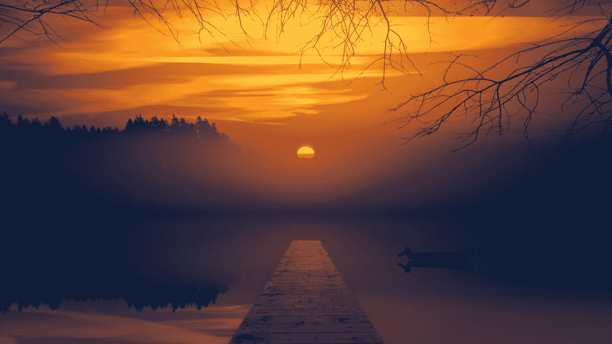

# 判断陷阱

> 原文：<https://medium.datadriveninvestor.com/the-judgement-trap-48ced5dbb3dc?source=collection_archive---------35----------------------->

## 我们不会根据天气来判断天空——为什么我们会根据自己的情绪来判断自己？

Photo by [Johannes Plenio](https://unsplash.com/@jplenio?utm_source=medium&utm_medium=referral) on [Unsplash](https://unsplash.com?utm_source=medium&utm_medium=referral)

最近的日落格外美丽。

夜幕降临时，深橙色、紫红色和深红色的喷雾像野火一样蔓延到我卧室的墙上，这是我一天中停下来欣赏简单的*的时刻。*

日落和日出有一些神奇的东西，尤其是如果你碰巧看到一个好的日落和日出。

在你碰巧不在天上荣耀的日子里，这并不像你突然决定天空不再美丽。日出和日落没有伟大的判断——当然，除非你是一名摄影师，或者是一名等待完美照明的画家。

**一般来说，当傍晚的夕阳没有给我们带来惊喜时，我们不会诅咒天空的丑陋。**

我认为这是对生活的一个比喻:我们不会因为天气而判断天空，那么为什么我们会因为情绪而判断自己和他人呢？我们的阶段，我们的心情，我们的生活方式？

就像天空一样，我们也是多变的，有时会突发奇想，只有守护着我们所有人的更强大的力量才能理解。难道我们不应该给自己和他人同样的机会，让他们被世界上更大的力量所牵引，而不把我们的判断强加给他们吗？

Photo by [Anh Nguyen](https://unsplash.com/@pwign?utm_source=medium&utm_medium=referral) on [Unsplash](https://unsplash.com?utm_source=medium&utm_medium=referral)

正如尼采曾经说过的，“我们如此喜欢到大自然中去，因为它对我们没有看法。”

不被别人强加给我们的思想、欲望和存在结构所拖累的感觉真好——这就是世界给我们像约翰·缪尔这样的人的原因，去传播大自然带给我们所有人的独特快乐。

但是如果我们可以用同样的想法来不带偏见呢？如果我们能像大自然一样，不评判任何事物，只是看着它从我们身边经过，会怎么样？

我并不主张抛弃常识，或者不听从强烈的直觉，因为你可能会认为这是“主观判断”。我说的不是为了“无判断”而危及你的生命。开阔你的视野是好事，但这并不意味着抛弃你的判断力。

但是我认为区分“判断”和“有观点”的概念是很重要的。

至少在我看来，评判一个人是将你的世界观强加于他们的故事之上，将你的笔迹强加于他人的书上。对其他人正在采取的行动有自己的看法是好的，但是一旦你要告诉别人如何行动或者试图让他们按照你的方式思考，你就落入了判断的陷阱。

没有人会喜欢有人干涉他们的生活，尤其是当你自己的思想在破坏你的时候。

你甚至可以在没有其他人在身边的情况下陷入判断陷阱——如果你习惯了持续的自我贬低和仇恨，这很容易做到。但是有一件事要永远记住，那就是:只有你知道你的整个故事，所有美好和糟糕的部分。只有你能解开你为什么会这样做的谜团，其他人也一样。别人的谜团不是你能解开的，只有你自己的。

所以，不要因为你没有取得好成绩而指责你自己，也不要因为你妹妹对你妈妈大喊大叫而指责她，而是从你自己的角度退一步。看看你自己，或者你的妹妹，就好像这是一个暴风雨的天空。它本身仍然很美，但令人敬畏，而且对于所有的噪音和闪光灯来说有点可怕。然而，没有什么是你不能面对的——你以前经历过更糟糕的风暴。

Photo by [Oziel Gómez](https://unsplash.com/@ozgomz?utm_source=medium&utm_medium=referral) on [Unsplash](https://unsplash.com?utm_source=medium&utm_medium=referral)

几年前，我处于一种非常片面的关系中。我爱上了一个男孩，他有着迷人的微笑，说起话来就像一个投身科学而不是语言的诗人。有一次，我确信无论是什么软件给我的大脑编码，他的都是由完全相同的部分组成的。但是对他的那种独特的判断让我看不清他到底是谁:一个对我毫不在乎的人。我眼中的星星阻止我看清真相——我自己的判断让我失望了。

在我们的生活中，我们经常会被证明是错误的。这不是我们任何一个人愿意承认的事情，但是为了成为一个活在现实中的人，有时候承认失败是必要的。

Photo by [veeterzy](https://unsplash.com/@veeterzy?utm_source=medium&utm_medium=referral) on [Unsplash](https://unsplash.com?utm_source=medium&utm_medium=referral)

**所以，与其假设我们了解自己或他人的一切，为什么不花点时间停下来，等待，观察呢？**摘下评判的眼镜，让*看看。我们不需要评价我们遇到的每一个人或我们采取的每一个行动——我们只需要观察、注意、观察，最终这个世界会向我们展现自己。缓慢而谨慎的考虑是这场混乱的关键，而不是强有力或愤怒的对抗。*

视角永远是有限的；这就是在这些承载着我们的身体中，被削减到我们仅有的几个人类感官的本质。但是如果你试着打开它，你最终会发现——外面有一个美丽的世界，有很多值得欣赏的日落。