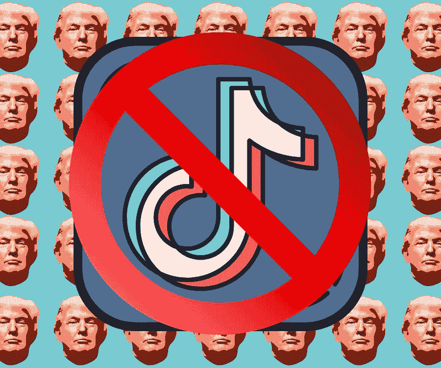
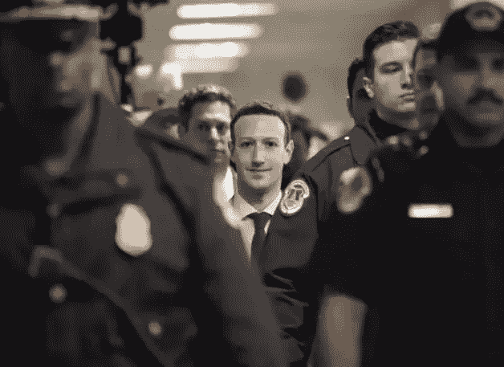
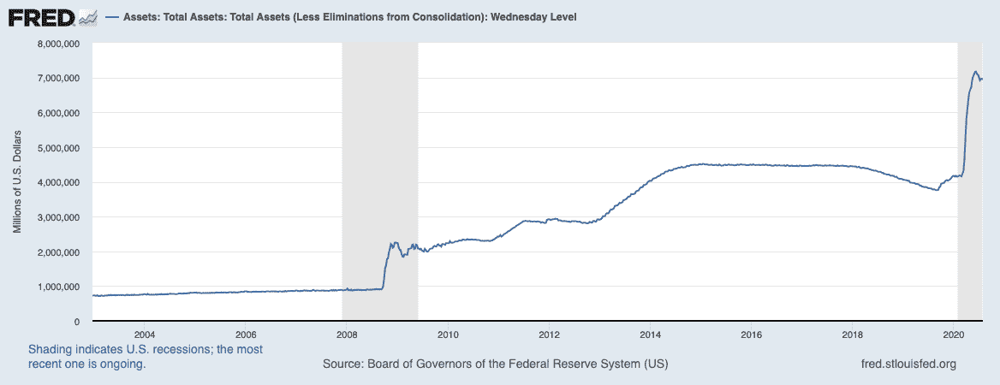
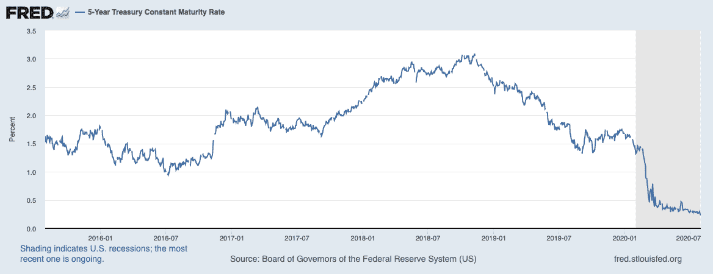
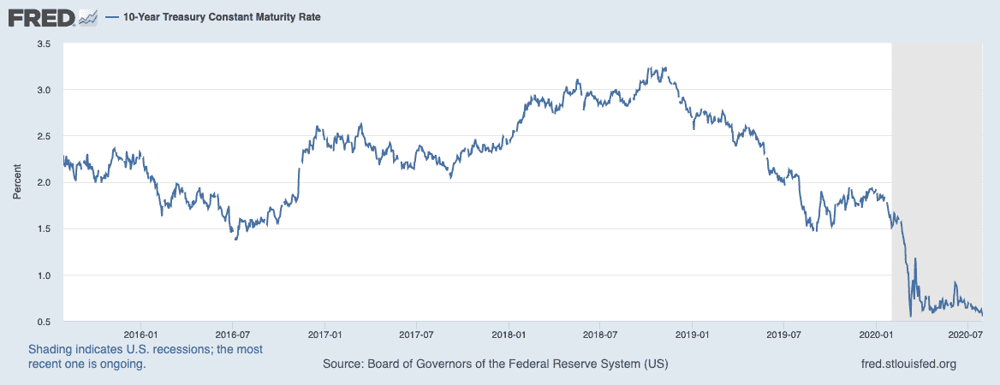

# 最后一支舞——川普删除了抖音

> 原文：<https://medium.datadriveninvestor.com/the-last-dance-trump-deletes-tiktok-f436edac2c76?source=collection_archive---------17----------------------->

## **DDI 市场&8 月 2 日的经济简讯周以及 Alpha 交易**

又是疯狂的一周——川普禁止抖音，大型科技反垄断谈判，淘金热，美元跌跌撞撞。抓住上一期关于加密货币[**【here】**](https://medium.com/datadriveninvestor/bitcoin-rises-defi-recharges-28f162f4c86b)以及所有关于市场和经济的[**【here】**](https://medium.com/datadriveninvestor/fear-and-uncertainty-in-the-markets-as-investors-turn-to-gold-7b0fc2c82818)。

*如果你没有在收件箱里阅读这篇文章，请* [*订阅 DDI 时事通讯*](http://medium.com/datadriveninvestor) *，这样你就不会错过任何一个精彩瞬间。知道谁会喜欢这个吗？请将这一期转发给他们；我们会很感激的。*

# 推销

[**恐惧&贪婪指数**](https://money.cnn.com/data/fear-and-greed/)**:【65:贪婪】(截至 2020 年 8 月 3 日)**

**反垄断，谁？在五个小时的反垄断指控后，苹果、亚马逊、脸书和谷歌的股票因强劲的收益而爆发。大到不在乎？从今年大型科技公司(包括微软)的交易数量来看，从 2019 年的这个时候起，大型科技公司似乎更关心晚餐是什么。**

Too Big to Zuck

你见过这张图表吗？标普 500 指数与标普 495 指数的对比显示出大型科技公司与经济其他领域的明显脱节。

**黄金时代|** 黄金继续飙升，[引发对美元作为全球储备货币地位未来稳定性的担忧](https://thehill.com/policy/finance/509368-spike-in-gold-shows-dollars-reserve-status-in-question-goldman-sachs)。我们稍后会详细讨论这一点。

# 经济

政治僵局随着每周 600 美元的失业结束对于[数百万失业的美国人](https://www.bbc.com/news/business-53534435)。共和党人和民主党人[尚未就刺激计划](https://www.nytimes.com/2020/07/31/us/politics/white-house-congress-relief-plan-jobless-aid.html)达成一致，民主党人[拒绝](https://www.marketwatch.com/story/democrats-reject-white-houses-band-aid-fix-for-600-jobless-benefit-2020-07-30?mod=home-page)白宫提出的 1 万亿美元，众议院议长南希·佩洛西说:

> “他们只是没有意识到它有多大。”

随着政策制定者继续斗争，近一半失去工作的家庭预计这些工作将永远消失。按下。批准新的失业救济可能是避免冠状病毒萧条的最好和最快的方法，即使这只是一个临时的解决方案。

# 驱逐流行病

近 1100 万美国家庭面临在四个月内被驱逐的风险，其中 2400 万家庭表示他们几乎没有机会支付下个月的房租。根据 apartmentlist.com 的数据，三分之一的租户未能按时支付 7 月份的租金。在商业领域，预计 2020 年将有多达 25，000 家零售店关闭(Coresight Research)。

有史以来最糟糕的 GDP 报告*。由于疫情的广泛影响，美国经济在 Q2 暴跌了 32.9%。*

**通向零的道路|** 美联储将利率[维持在接近零的水平](https://www.bloomberg.com/news/articles/2020-07-29/fed-leaves-rates-near-zero-repeats-vow-to-use-all-of-its-tools)，承诺使用一切可用的工具来支持经济复苏。这包括[将其贷款和信贷计划](https://www.cnbc.com/2020/07/28/the-fed-is-extending-its-lending-programs-until-the-end-of-the-year.html?utm_campaign=daily-global-29-07-2020&utm_source=email&utm_medium=Daily%20Global%20Edition%20Users&utm_term=Daily%20Global%20Edition%20Users)延长至 2020 年底。由于低利率和冠状病毒减缓经济复苏，美元经历了近十年来最糟糕的月份之一。此外，美联储的资产负债表已经接近 7 万亿美元，许多专家指出，说到底，它甚至还不到它的一半。

不管通过哪项刺激法案，也不管利率下降到多低，美国经济都有一大堆麻烦。从这个洞里爬出来需要一段时间。伦敦 Aberdeen Standard Investments 的投资总监 James Athey 也表达了对央行行动的担忧:

> “可能会出现一些非常令人不安的结果:违约、萧条。在没有生产支持的情况下，向金融体系注入的流动性越多，货币贬值就越明显。”

# 中国

## [川普将封杀抖音](https://edition.cnn.com/2020/07/31/tech/tiktok-trump-bytedance-sale/index.html)，数百万青少年会烧毁国会大厦吗？

可能不会，但这会造成一些讽刺的情况，美国青少年将使用 VPN 访问中国应用程序。形势逆转了！

说真的，川普将命令抖音的母公司字节跳动出售其美国业务。今年早些时候，微软曾表示有兴趣收购抖音，但现在已经搁置了这些计划。

随着美国制裁的可能性越来越大，中国的银行[可能会脱离 SWIFT 系统](https://www.reuters.com/article/us-china-banks-usa-sanctions/chinese-banks-urged-to-switch-away-from-swift-as-u-s-sanctions-loom-idUSKCN24U0SN),以减少他们对美元的敞口，从而使人民币进一步国际化。一段时间以来，将 SWIFT 系统的替代方案纳入主流一直符合中国的利益。然而，现在我们可能会见证这种转变的加速。

虽然没有直接关系，但仍然相当危险，中国的三峡大坝正面临破纪录的洪水。

# 找到你的优势。

我不敢相信他们免费送这么多东西。我试着说服团队不要这么做，但是阿尔法交易坚决提供可靠的技术分析。这是他们最近的市场分析，是对本周时事通讯的有力补充。

[**【完整故事】**](https://medium.com/datadriveninvestor/finding-opportunities-in-the-stay-at-home-economy-2216eaa0a176)

[订阅 Alpha Trades Discord 服务器](https://bit.ly/2KJ1oor)，与专业人士进行一对一的指导。加入阿尔法包两天，无风险。

# 意见

弱势美元对不同的人来说意味着很多事情。这可能意味着美国以外的国际经济更加活跃。其他人认为这是一个信号，表明疫情最糟糕的时期已经过去。Bridgewater Associates 的创始人雷伊·达里奥认为，不断升级的美中冲突最终会损害美元。

> “有贸易战，有技术战，有地缘政治战，还可能有资本战，”*达利奥对福克斯说。*

达利欧呼应了最近涌入贵金属市场的投资者的担忧，这与美国 5 年期和 10 年期国债的表现成反比。

我们不会在这里讨论所有的细节，但随着美国经济刺激放缓，这种可能性很大。个人储蓄减少，美元将进入熊市，我们将看到通胀飙升。为了理解可能导致这一结果的反馈回路，[阅读这篇文章](https://seekingalpha.com/article/4361350-end-to-u-s-dollar-hegemony-arrived?utm_source=morning_brew)(剧透:虽然贵金属目前是一个过度扩张的游戏，[铜有潜力](https://katusaresearch.com/copper-bold-hold-fold-or-who-cares-its-not-gold/))。

# 其他新闻

美联储指控三名年轻人策划了一起大规模的推特盗窃案。这些孩子并没有颠覆世界秩序，他们只是想要一些额外的比特币。

**又一个******21 亿美元瞄准冠状病毒疫苗** |美国将支付制药商赛诺菲和葛兰素史克生产 1 亿剂他们的新冠肺炎疫苗。这两家制药公司将与辉瑞公司、Moderna 公司和 BioNTech 公司一起加入大规模疫苗的努力。他们都获得了 T21 政府对生产疫苗的大力支持。祈祷这不会是僵尸末日。尽管如此，美国病毒热点地区的新增病例率似乎正在缓慢下降。**

**在美国，T 公司的 5G 网络已经覆盖全国。对投资者和技术希望者来说是好消息，对 5G 阴谋论者来说是坏消息。**

# **观看表演**

**我们在 Alpha Trades 的朋友这周深入研究了市场、密码和经济。通过最近的剧集找到你的优势:**

**[**美股讨论| Pinterest 和 Twitter 被低估？**](https://youtu.be/l-Bu6I3QmNs)**

**[**永远不要浪费一个好的危机| 4 只科技股在收益后增值 2000 亿美元！**](https://youtu.be/6j8Nx1wqXoo)**

**[**新加密牛市？|比特币涨到 13.9 美元的速度可能比你想象的要快。**](https://youtu.be/cRZUOfDfljY)**

# **想免费试用 Advantage 两天吗？**

**[订阅 Alpha Trades Discord 服务器](https://bit.ly/2KJ1oor)学习技术分析以及如何投资获利。询问 2 天的高级会员试用！**

# **放弃**

**数据驱动投资者(DDI)提供的信息不用于做出任何金融决策，也不是购买、持有和/或出售特定证券或金融工具的请求或建议。**

**Alpha Trades，LLC 提供的信息不用于制定任何财务决策，也不是购买、持有和/或出售特定证券或金融工具的请求或建议。**

**访问 Alpha Trades 的完整服务条款:[https://bit.ly/3faVeeV](https://bit.ly/3faVeeV)**