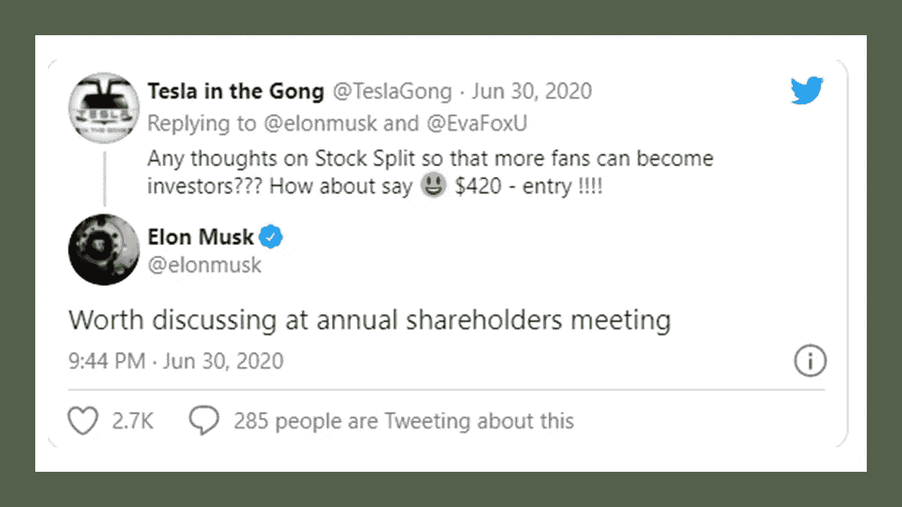

# 你需要知道的最新特斯拉股票消息

> 原文：<https://medium.datadriveninvestor.com/the-latest-tesla-stock-news-you-need-to-know-cccf42a87df3?source=collection_archive---------5----------------------->

## 这可能是持有特斯拉股票的最佳时机

Photo by [Dylan Sauerwein](https://unsplash.com/@rawdyl?utm_source=unsplash&utm_medium=referral&utm_content=creditCopyText) on [Unsplash](https://unsplash.com/s/photos/tesla?utm_source=unsplash&utm_medium=referral&utm_content=creditCopyText)

你可能已经听说了关于特斯拉 5:1 股票分割的最新消息。在股市疯狂的一年里，特斯拉是为数不多的亮点之一。这也可能是拥有这家公司一部分的最佳时机。详细如下你会发现，当你需要拥有股票的一部分，股票分割。此外，你会发现股票分割后你什么时候可以购买特斯拉。我希望解释一些细节，以便你对该公司以及特斯拉创始人之一埃隆·马斯克有更多的了解。希望这能给你一些启示，让你可以自己做决定。

# 特斯拉到底是什么？

[特斯拉公司](https://en.wikipedia.org/wiki/Tesla,_Inc.)。前特斯拉汽车公司，成立于 2003 年 7 月，由马丁·艾伯哈德和马克塔彭宁。公司的名字是为了纪念投资者和电气工程师尼古拉·特斯拉。加入他们的还有伊恩·怀特、埃隆·马斯克和 J.B .斯特劳贝尔，他们被任命为公司的联合创始人。马斯克以前是董事长，但目前是特斯拉的首席执行官。

# 特斯拉提供哪些产品？

特斯拉因其生产的汽车而闻名。一些型号是[S 型](https://www.tesla.com/models)、[3 型](https://www.tesla.com/model3)、[X 型](https://www.tesla.com/modelx)和[Y 型](https://www.tesla.com/modely)。这些车辆是用电而不是煤气驱动的。

那么你可能听说过目前正在生产的[赛博卡车](https://electrek.co/guides/tesla-cybertruck/)。迄今为止，超过 50 万人已经预订了这款看起来像未来汽车的电动卡车。去年亮相时，这种卡车可以承受被强力物体撞击时的损坏。

YouTube

该公司还在研发一款[特斯拉半自动卡车](https://www.trucks.com/tesla/semi/)。这款卡车预计售价 15 万美元，续航里程 300 英里。行驶里程为 500 英里的卡车价格将在 20 万美元左右。最初的 200 辆卡车被称为方正系列，每辆售价 20 万美元。

[特斯拉还生产](https://en.wikipedia.org/wiki/Tesla,_Inc.)Powerwall(家用可充电锂离子电池)、Powerpack(用于家庭储能的可充电锂离子电池)和 Megapack 电池(大规模锂储能产品)。

 [## 2020 年最佳短期投资选择精选资源|数据驱动型投资者

### 投资是增加你净财富的一个好方法。如果你通过遵循一个严格的…

www.datadriveninvestor.com](https://www.datadriveninvestor.com/2020/03/28/handpicked-resources-for-the-best-short-term-investment-options-of-2020/) 

2016 年，特斯拉还收购了太阳能公司 Solar City。特斯拉的业务是为业主提供太阳能电池板和业务。许多人认为特斯拉是一家汽车公司，但正如你所见，特斯拉提供许多不同的产品。

# 为什么更多的投资者会购买特斯拉的股票

特斯拉股票从 2019 年 7 月到 2020 年 6 月表现非常好，因为该股票录得四个盈利季度。这意味着这使得股票有资格加入标准普尔 500。该公司还达到了 2050 亿美元的市值，超过丰田成为最有价值的汽车制造商。

由于如今持有特斯拉股票的成本很高，这使得大多数投资者都买不起股票。一些投资者仍然可以购买零股来拥有特斯拉股票的一部分，但这并不等同于拥有全部股票。随着股票分割，这将为投资者购买特斯拉股票提供一个更实惠的价格。

# 特斯拉为什么要拆分他们的股票？

10 年前，当埃隆·马斯克(Elon Musk)将特斯拉上市时，他一直在关注这个小人物。股票拆分符合埃隆的愿景，即向更多投资者提供股票。

Twitter

该股本身在 2020 年飙升了 500%，成为世界上最有价值的汽车制造商。在 7 月份的 twitter 评论中，他提到他会考虑股票分割，让股票在小投资者手中。

 [## 关于苹果 4 对 1 股票分割，你需要知道什么

### 看看苹果的历史，产品，过去的股票分割和未来的预测

medium.com](https://medium.com/datadriveninvestor/what-you-need-to-know-about-apples-4-for-1-stock-split-cb8ee151a4c1) 

# 如果你目前持有特斯拉股票，会发生什么？

特斯拉董事会批准了 5 比 1 的股票分割。这意味着你在 8 月 21 日拥有的任何特斯拉股票，你的股票将在 8 月 31 日拆分为 5 股。特斯拉会计算出股票价格的精确值。

YouTube

本质上，你持有的特斯拉股票不会有任何损失。一周后，这些股票将从 8 月 21 日的价格拆成 5 股。

# 现在买还是以后买

为了理解股票分割，您可以将一张 25 美元的钞票分割成五张 5 美元的钞票。你还有 25 美元，或者是 5 元的，或者是 5 元的。两种美元形式都等于 25 美元。股票分割也是如此。你还有同样多的股票。

如果股票分割时特斯拉股票是 1600 美元，你将有 4 股额外的特斯拉股票。所以今天你可能没有 1600 美元买特斯拉股票。如果你有钱，那太好了。你可以买股票。在撰写本文时，特斯拉的股票实际交易价格为 1631.75 美元。

股票拆分后，特斯拉的股价可能会达到 1600 美元。因此，分拆后，特斯拉股票的交易价格将为 320 美元。如果你今天没有 1600 美元，那么你可以等到股票分裂，以 320 美元买入股票。无论哪种方式，你都可以购买股票，但这取决于你目前可用的资金。

 [## 帮助你在 2020 年投资的 10 个强有力的建议

### 在你的旅途中避免噪音和所谓的专家

medium.com](https://medium.com/datadriveninvestor/10-powerful-tips-to-help-you-invest-in-2020-be40ecb8edf1) 

股权分置后你打算买特斯拉吗？

作者持有特斯拉(TSLA)的股票。

[**汤姆·汉迪**](https://medium.com/@tomhandy1) 是一位顶尖的写作、金融、投资和比特币作家，也是两个孩子的父亲。他从军队退役，并在几个非营利委员会任职。你可以在推特 [@tomhandy1](http://www.twitter.com/tomhandy1) 上找到他。

本文仅供参考。不应将其视为财务或法律建议。并非所有信息都是准确的。在做出任何重大财务决定之前，请咨询财务专家。

**访问专家视图—** [**订阅 DDI 英特尔**](https://datadriveninvestor.com/ddi-intel)