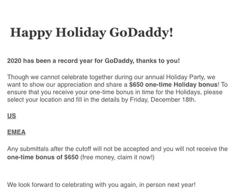

# GoDaddy 的假圣诞奖金邮件钓鱼测试的教训

> 原文：<https://medium.datadriveninvestor.com/the-lesson-of-godaddys-fake-christmas-bonus-email-phishing-test-ede2d171f266?source=collection_archive---------5----------------------->

## 这家公司的 IT 安全测试是如何出问题的，以及管理人员如何通过更好地管理决策室来避免将来犯类似的错误。

Photo by [Nastuh Abootalebi](https://unsplash.com/@sunday_digital?utm_source=medium&utm_medium=referral) on [Unsplash](https://unsplash.com?utm_source=medium&utm_medium=referral)

# 概观

这是一个经典的管理错误，即使是在最好的公司，人们也会继续犯。虽然具体情况可能会发生变化，但问题是人们可以坐在会议室里，提出他们认为是好主意的想法。这个想法可能是非常善意的，甚至有非常好的研究和数据支持。然而，一旦这个想法实际上被提出，对它的反应几乎普遍是负面的。每当这种情况发生时，无论是拙劣的营销活动、关键生产流程的改变，还是人力资源政策指令，背后的人都会被对这个想法的糟糕反应弄得措手不及。虽然结果对“发生它的房间”内的人来说是个谜，但这个想法的问题对开发这个概念并计划实施它的小圈子(或一个人的圈子)以外的几乎每个人来说都是显而易见的。

所以现在我们有了一个典型的例子，一个来自美国知名品牌公司的想法，意图很好，但构思和执行都非常糟糕。GoDaddy 案是一个真正的公司混乱，更糟糕的是，这一行动的时机使该公司的管理层看起来真正像吝啬鬼！不过，希望其他人可以从 GoDaddy 的失误中吸取教训，避免未来自己的管理失误。

Photo by [Chad Madden](https://unsplash.com/@chadmadden?utm_source=medium&utm_medium=referral) on [Unsplash](https://unsplash.com?utm_source=medium&utm_medium=referral)

# 假日网络钓鱼

正如发生在科技行业内外的许多其他公司一样，GoDaddy [今年早些时候经历了一次大规模数据泄露](https://www.forbes.com/sites/daveywinder/2020/05/05/godaddy-confirms-data-breach-what-19-million-customers-need-to-know/?sh=135936d11daa)。因此，IT 安全无疑是 GoDaddy 在 2020 年下半年管理关注的首要问题。然而，该公司选择如何解决这一问题是有争议的部分。

众所周知，每当我们打开电子邮件收件箱，几乎总会有一两封可疑的邮件。有些是显而易见的，比如尼日利亚王子给你 100 万美元，只要你把你所有的银行信息发给他，而其他的就很难察觉了。有时最难识别的是[“网络钓鱼”邮件](https://www.consumer.ftc.gov/articles/how-recognize-and-avoid-phishing-scams)，它们要求你提供你的电子邮件和登录凭证，骗子可以利用它们侵入公司或组织的系统。通常，这些看起来来自合法的来源，经常模仿你的雇主、你的大学或你的电子邮件/网络服务提供商的网站。

因此，组织可以并且已经做了 IT 界所谓的“pentests”——渗透测试的缩写，可以被[定义为](https://searchsecurity.techtarget.com/definition/penetration-testing):

> *“测试计算机系统、网络或 web 应用程序以发现攻击者可能利用的安全漏洞的实践……渗透测试的主要目标是识别安全弱点。渗透测试还可用于测试组织的安全策略、对合规性要求的遵守情况、员工的安全意识以及组织识别和响应安全事件的能力。”*

对于 GoDaddy 及其员工来说，2020 年是艰难的一年。六月，公司解雇了 400 名员工。因此，当一封关于圣诞节奖金的电子邮件到达员工的收件箱时，这是一个受欢迎的消息——难道不是吗？

Photo by [Austin Distel](https://unsplash.com/@austindistel?utm_source=medium&utm_medium=referral) on [Unsplash](https://unsplash.com?utm_source=medium&utm_medium=referral)

这个故事开始在社交媒体上泄露，关于此事的第一篇文章是由总部位于亚利桑那州的《铜信使报》的作家洛林·隆吉写的。她从员工那里得到了一些关于 GoDaddy 发生的事情的线索，这些员工对刚刚进行的 pentest 感到不安，她的故事( [GoDaddy 的员工被告知他们将获得假期奖金。这实际上是一个网络钓鱼测试](https://coppercourier.com/story/godaddy-employees-holiday-bonus-secruity-test/?utm_source=digg)】)在短时间内迅速传播开来。GoDaddy 的故事被许多主要新闻机构复制，极大地放大了这一构想拙劣的 pentest 的影响范围和该公司的负面公关。

在 GoDaddy 发生的事情的基本情况是这样的。12 月 14 日，大约 500 名员工收到了下面的电子邮件，通知他们将获得 650 美元的节日奖金，而不是圣诞派对。他们所要做的就是点击两个链接中的一个，指出他们在公司的哪个地区工作——国内或国际。

然而，如果他们点击了——他们被列入“淘气名单”——两天后，那些试图注册奖金的人会收到一封来自[德米特里厄斯·卡斯](https://www.linkedin.com/in/demetriuscomes)、GoDaddy 的 CISO(首席信息安全官)的后续电子邮件。这封邮件通知那些“点击者”，他们不仅得不到任何圣诞奖金，还得重做一次安全培训课程:

> *“您收到这封电子邮件是因为您没有通过我们最近的网络钓鱼测试。您需要重新参加安全意识社会工程培训。”*

现在，所有这些中的一个关键细节是发送 pentest 电子邮件的电子邮件地址。有趣的是，钓鱼测试邮件来自一个地址为[happyholiday@godaddy.com](mailto:happyholiday@godaddy.com)的账户。当然，由于它来自公司自己的电子邮件服务器，这是这么多 GoDaddy 员工点击他们所在地区的链接并提供所需个人信息的主要原因之一——当然，除了钱。因此，GoDaddy 测试电子邮件不同于人们从邪恶行为者那里看到的大多数网络钓鱼活动，在这些活动中，公司域名中可能会包含一个额外的字母，或者. net 或其他扩展名可能会替换. com 域名，这将是对被告不要对该电子邮件采取行动的危险信号。

Photo by [Markus Spiske](https://unsplash.com/@markusspiske?utm_source=medium&utm_medium=referral) on [Unsplash](https://unsplash.com?utm_source=medium&utm_medium=referral)

# 对圣灵降临节的反应

## **媒体反应**

媒体对这个故事进行了广泛的报道——尽管它发生在圣诞节期间，主流和科技新闻网站上都有关于这个问题的文章。简而言之，媒体对圣诞节的评论是严厉的。一篇文章的标题是:“ [GoDaddy 给员工发圣诞奖金，简直是‘去你妈的’。”](https://www.wonkette.com/godaddy-give-employees-christmas-bonus-of-hey-f-k-you)“只要从媒体对此事的评论中抽取一个样本，就能让你知道该公司的行为被认为是多么糟糕。在 [Mashable](https://mashable.com/) 中，[Brenda Stolyar](https://www.linkedin.com/in/brenda-stolyar-529a6b82/)写道:

> *“对于一家公司来说，我想不出有什么比发送电子邮件通知员工他们将获得假期奖金更糟糕的方式来测试其员工是否会陷入网络钓鱼骗局，尤其是在一年中受到全球疫情困扰的 12 月份。但 GoDaddy 似乎不这么认为，因为这正是它所做的。”*

而[Gizmodo](https://www.linkedin.com/in/rhett-jones1/)的编辑瑞德·琼斯很好地描述了这种情况，[说](https://gizmodo.com/godaddy-sorry-we-promised-holiday-bonuses-that-was-ju-1845948766):

> 对于一家虚拟主机公司来说，数据泄露可能是一个非常头疼的问题，但是如果没有人愿意在那里工作，没有人愿意在一代人最艰难的一年中最艰难的时刻与一个视员工如粪土的组织做生意，那么就没有什么可以保持安全了

 [## 人工智能、领导力和人才管理|数据驱动的投资者

### 人工智能正在改变人才管理游戏——从招聘到团队建设再到继任…

www.datadriveninvestor.com](https://www.datadriveninvestor.com/2020/11/02/artificial-intelligence-leadership-and-talent-management/) 

## **社交媒体反应**

但当然，今天事情的运作方式是，随着媒体对该事件的报道，GoDaddy 的品牌和形象受到的损害才刚刚开始，因为该公司的行为在社交媒体上引起了巨大的轰动和反弹。Twitter 用户不仅帮助传播了该公司所做的事情…

…并批评该公司在网络钓鱼测试背后的“想法”…

IT 专家对此事进行了权衡，从技术角度指出了在实施该想法时存在的一些实际问题…

不满的顾客在评论他们对此事对公司的厌恶..

。呼吁 GoDaddy 客户转向其他平台，无论是个人用户…

…对于企业客户来说…

许多人呼吁 GoDaddy 采取行动，帮助纠正这种情况，或者至少改善其员工的状况，实际支付测试电子邮件主题的奖金…

最后，几个 Twitter 用户抓住了问题的核心，因为网络钓鱼测试及其后果确实表明 GoDaddy 管理层的判断失误…

…仅仅通过将奖励作为练习的核心，这可能是一种不道德的渗透测试方式:

最后，GoDaddy 的所作所为可能会产生长期的后果，与它试图通过测试实现的目标背道而驰——提高员工对 it 安全的意识和行动:

很能说明问题的是，在所有关于 GoDaddy 钓鱼测试邮件的帖子、分享和评论中，我只找到一个人在 Twitter 上支持该公司的行动…

……毫不奇怪，他的评论得到了*没有*喜欢——一个也没有！

当然，公司道歉确实来了。几乎具有讽刺意味的是，GoDaddy 发言人[在平安夜就钓鱼测试邮件向媒体道歉](https://www.engadget.com/godaddy-sent-fake-phising-email-promising-holiday-bonus-220756457.html)，声明:

> *“go daddy 非常重视我们平台的安全性。我们理解一些员工对网络钓鱼的企图感到不安，并认为这是麻木不仁，对此我们已经道歉。虽然测试模拟了当今游戏中的真实尝试，但我们需要做得更好，对员工更加敏感。”*

Photo by [Sigmund](https://unsplash.com/@sigmund?utm_source=medium&utm_medium=referral) on [Unsplash](https://unsplash.com?utm_source=medium&utm_medium=referral)

# 分析

那么我们该如何看待这一切呢？这里有什么重要的教训可以吸取？当然，还有一个显而易见的问题——不要在疫情、经济不确定性和几乎所有人都普遍面临高压力的情况下发送涉及虚假圣诞奖金的测试电子邮件。但如果有人认为 GoDaddy 是唯一一个为了进行一次 pentest 而向员工发放假奖金的失策者，那你就错了。事实上，[一个类似的钓鱼邮件测试](https://www.cbsnews.com/news/tribune-bonus-email-hoax-cybersecurity-test/)在九月由[论坛出版](https://www.tribpub.com/)进行，它本身在五月测试之前已经被裁员，导致一位作家称该公司的行动为“[卡通化”水平的管理恶行](https://www.vice.com/en/article/y3z8g5/tribune-publishing-out-evils-itself-with-phishing-email-promising-bonuses)，

因此，作为一名战略管理顾问和教授，我认为从 GoDaddy 的 pentest 出错甚至是论坛出版公司的钓鱼测试事件中吸取的真正教训是这样的:“*他们到底在想什么？*“答案是，很明显，他们没有思考——或者更具体地说，他们没有以批判的、移情的、超越我个人兴趣范围的方式思考！

然而，完全可以理解这种管理错误是如何以及为什么发生的——甚至在最好的组织中也会发生。这是因为有时候，当人们聚集在会议室的桌子周围时，或者可能在今天的放大会议中，动力就不会正常工作。人们陷入了一个经典的决策陷阱。我们称之为高端术语“[群体思维](https://www.psychologytoday.com/us/basics/groupthink)”，即人们只是随大流，不会“捣乱”——即使他们应该这样做，以避免做出可能导致发送电子邮件告诉员工他们在圣诞节期间将获得急需的奖金的决定，只是为了看看他们是否严格遵守了公司的电子邮件安全政策。是的，从技术上讲，该测试实现了 it 人员想要看到的结果:公司员工是否会避免点击可疑的电子邮件。好吧，除了在 GoDaddy 事件中，邮件来自一个真实的公司邮箱账户！

因此，从这些案例中，我们真正要吸取和记住的教训是。作为一名领导者——在任何企业或组织环境中，你需要确保而不仅仅是让合适的人在房间里——真实的、虚拟的或两者的结合。是的，你需要组建一个多元化的团队，因为这是今天的基础。然而，更重要的是，你需要确保房间里的人感觉他们有自由——*并且实际上被鼓励——*——对正在讨论的想法提供真正关键的反馈，并且提出他们可能有的——或者他们认为其他人可能有的——关于那个想法的任何担忧。只要想想 GoDaddy 现在可能正在避免的所有“问题”——不仅仅是员工的问题，还有同情员工的客户的问题，这些员工是这个圣诞节期间出问题的对象，如果在讨论并最终批准这个想法的会议室中有人只是简单地问了一个“如果”的问题就好了。通过给予每个人公开讨论想法的自由，并鼓励真正的批判性思维——甚至可能指定某人扮演[“魔鬼代言人”](https://www.urbandictionary.com/define.php?term=devil%27s%20advocate)的角色来提出关于想法的问题和争论，作为一名高管、一名行政人员、一名任何事情的经理，你将会走很长的路——非常长的路——以确保你不会犯下大错甚至更糟糕的错误！

所以，是的，这是一个警示性的圣诞故事，但这是一个好的领导者应该全年牢记在心的故事——无论他们在哪里，无论他们监督的主题是什么！

哦，对了——付给员工 650 美元的奖金！

# **和我一起在媒体上写作**

想开始自己的写作之旅吗？想通过发布自己创作的文章来更好地建立个人品牌？考虑今天和我一起在 Medium 上写作，并使用这个链接:[https://davidwyld.medium.com/membership](https://davidwyld.medium.com/membership)。这样做，你将帮助支持我的写作，因为我收到你的媒介会员费的一部分。

# 关于大卫·怀尔德

大卫·怀尔德([dwyld@selu.edu](http://dwyld@selu.edu/))是路易斯安那州哈蒙德市[东南路易斯安那大学](https://www.southeastern.edu/)的战略管理教授。他是管理顾问、研究员/作家、出版商、执行教育家和经验丰富的专家证人。

**大卫·怀尔德的社交媒体链接:**

*   上[脸书](https://www.facebook.com/david.wyld)
*   上 [LinkedIn](https://www.linkedin.com/in/david-wyld-4923707/)
*   在[推特上](https://twitter.com/GoodAdvicePub)

**访问专家视图—** [**订阅 DDI 英特尔**](https://datadriveninvestor.com/ddi-intel)