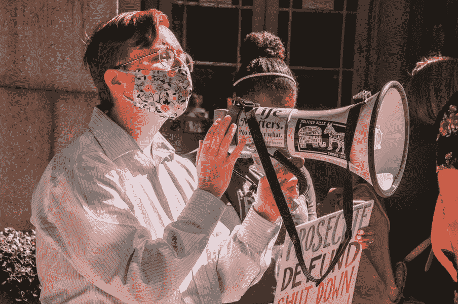
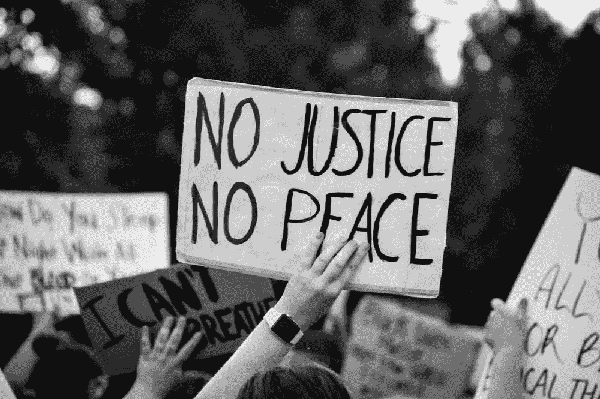
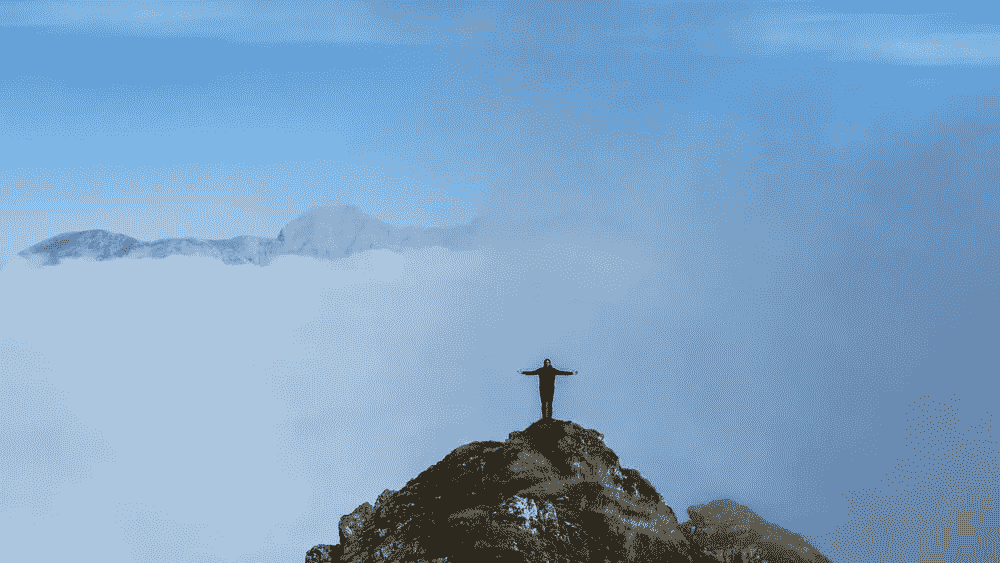

# 2020 课留给我

> 原文：<https://medium.datadriveninvestor.com/the-lessons-2020-taught-me-97627fd383e6?source=collection_archive---------33----------------------->

## 我耐心地等待 2021 年的到来。

这是多好的一年啊！2020 年是 ***硬*** 。《时代》杂志甚至将 2020 年 [*【有史以来最糟糕的一年】*](https://112.international/society/time-magazine-declares-2020-worst-year-ever-57081.html) 。像大多数人一样，我度过了动荡的一年，然而，2020 年也是我迄今为止经历的最具变革性的一年。除了世界上发生的其他事情，我还跨越到了自由职业的领域；不仅仅是下班后，而是全职个体户。我选了多好的一年啊！但是，我*在这里*，苟延残喘。那是一场胜利，一场大的胜利。

Photo by [Maria Oswalt](https://unsplash.com/@mcoswalt?utm_source=unsplash&utm_medium=referral&utm_content=creditCopyText) on [Unsplash](https://unsplash.com/s/photos/2020?utm_source=unsplash&utm_medium=referral&utm_content=creditCopyText)

不要误会，我确实经历过精疲力尽和一些抑郁发作。从我十几岁开始，我就一直在与抑郁症作斗争，所以这个特殊的结果实际上是一种进步……从各方面来看。我将继续带着抑郁生活，可能是我的余生，我对此没有意见。经过几年的认知行为疗法和药物治疗，我可以有把握地说，在人生的低潮期，我已经成为自己更好的朋友。

不幸的是，我一开始就没有高水平的幸福基线。在地球上生活了将近 30 年，我不能说“生日快乐！”、*“新年快乐！”*或“*快乐……”*对任何人任何事都 100%真诚；或者感受这些场合带来的*“快乐”、*喜悦。然而，今天是我有记忆以来第一次，我可以说我很快乐，对我现在的位置，对我自己，(忽略世界的状态)。

几十年后，我会记得 2020 年是我学会放手的一年。我意识到我还保留着多少怨恨:对那些伤害过我的人的怨恨，还有对宇宙的怨恨。因为真实的我，我被别人虐待过。那种伤害变成了愤怒。然后愤怒变成了墙。我曾经骄傲地穿着我的愤怒，就像一个战士穿着他们最好的盔甲去战斗。但是盔甲可能很重，愤怒也是如此——不管愤怒有多么合理。我想让我的痛苦和挣扎消失，但我不知道怎么做。我不确定没有过度增长的怨恨我会是谁。

面对疫情，我的怨恨突然显得如此毫无意义。2020 年让我觉得自己很渺小，甚至比以前更强烈，对此我心存感激。我现在平静多了。结果，我和周围人的关系得到了改善。我更感激那些在我生命中的人，我感激和那些已经离开的人一起度过的时光。我甚至(在某种程度上)原谅了自己对他人造成的伤害。

在很长一段时间里，我不得不习惯于过度工作。今年，我(已经努力)减少工作，只是更加相信自己和自己有能力让事情发生。为了做到这一点，我需要始终对自己 100%诚实。这个过程比我想象的更有挑战性，尤其是在早期。甚至会很痛苦。但是当我开始诚实地说出我真正想要的生活，我在哪里，我要去哪里，事情开始变得有条不紊。一切似乎都变得轻松了一些，轻松了一些。

Screenshot of Whimsical diagrams my business setup — Before & after

就目前而言，我正尽我最大的努力去摆脱那些没有根据的信念和恐惧。当我开始放下对财务的恐惧时，我花在转动轮子和简单行动上的时间就少了。塞思·戈丁说[如果在你脑子里，那就不算](https://soundcloud.com/designmatters/design-matters-with-debbie-millman-seth-godin)。行动是唯一有用的东西。不确定你在做什么？无论如何都要做。做你喜欢做的事情。利基下降或多样化，这并不重要。重要的是你尝试，然后从尝试新事物的经历中学习。有想法，执行，测试，学习，重复。坚持不懈地做好你的工作，不要放弃，那么工作会为你做好它的一部分。停止(过度)思考，多做。

让我们谈论不那么抽象的事情，好吗？我今年学到的一些重要经验对其他人来说并不陌生，尤其是对黑人和棕色人种。我给[写了一篇关于我非黑人觉醒的文章](https://madeupbyshay.substack.com/p/have-you-ever-wanted-to-change-the)，这篇文章没有在网上疯传，也没有让我赚到一大笔钱；它甚至没有达到中等策展水平——但我对写作和发行它感到非常自豪。真的，真的，真的很难写。我觉得我的心脏要爆炸了，目睹并内化了全球黑人群体的痛苦，他们已经经历了几个世纪的痛苦。我很惭愧没有更好的了解。所以我写了，来处理我的感觉，成为反种族主义者。写完之后，我变得更好了，在很多方面我以前都无法想象。

Photo by [Kalea Morgan](https://unsplash.com/@kaleamorgan?utm_source=unsplash&utm_medium=referral&utm_content=creditCopyText) on [Unsplash](https://unsplash.com/?utm_source=unsplash&utm_medium=referral&utm_content=creditCopyText)

另一方面，我也是第一次用一个新的媒体帖子在 2 天内冲击了 [1k 的浏览量，出乎意料。以今天的标准来看，这仍然不是一篇病毒式的文章，但对我个人来说，这是一个重要的里程碑。我最近也意识到自己是媒体设计领域的顶尖作家。11 月，我获得了我的第一个设计奖。我所有的渠道都在增长，缓慢但稳定。我制作了我的第一个单人 MVP 产品，为此我得到了很多鼓励。与此同时，与我刚开始做自由职业者时相比，我的过程和工作有了显著的改善。我还创作了比我多年来创作的还要多的艺术品，总共超过了](https://uxdesign.cc/toxic-traits-that-need-addressing-in-any-design-team-388bc7a60685) [30 件艺术品](https://www.instagram.com/myagender/)。

我现在挣得少了，少了很多，但还是挺好的。没有压力去获得最新的旗舰手机，了解网上发生的最新消息，或者每天关注我的外表。我可能会在周一情绪不稳，拒绝接电话，因为下周三我没有足够的精力。我可以在周四小睡一会儿，如果这能提高我之后的工作效率的话。有些日子，感觉就像自由一样。总的来说，我仍然有经济压力(还有疫情压力和其他各种形式的焦虑)。尽管如此，我的生活已经变成了一场除了我自己没有别人的比赛。

我天生不是一个特别有耐心的人，尽管我的一些熟人会说不是。如果需要的话，我可以表现得很耐心。但总的来说，我希望事情发生在昨天。尽管如此，我明白这不现实。2020 教会了我真正的耐心。这些天来，我让事情按照他们需要的那样发展，不管有多慢(🐢🐢🐢)人生有时候可以。有些事情比别人花的时间长，有些时候比任何人能处理的都快，我对此很平静。

总的来说，我的注意力已经从试图获得关注转移到给予更多的关注(结果很矛盾，作为回报，我获得了一些关注)。我更关注自己对不同情况的反应。我更加关注我周围的人对我所做的事情的反应，并试图做出对每个人都有帮助的决定。虽然我的成就对一些人来说似乎很小，但我相信我走在正确的道路上，我的**之路**。因为我能清楚地看到我下一步要去哪里，所以对不适合我的道路说不要会容易得多。

Photo by [Paul Gilmore](https://unsplash.com/@paulgilmore_?utm_source=unsplash&utm_medium=referral&utm_content=creditCopyText) on [Unsplash](https://unsplash.com/s/photos/peace?utm_source=unsplash&utm_medium=referral&utm_content=creditCopyText)

每个人都会犯错，我们都有失败的时候。我很早就学到了这一课。没有人想成为坏人，伤害别人，但我们大多数人都身心疲惫。所以我们做的决定和做的事情与我们的信念不一致。当这种情况发生时，我们会怀疑自己，因为我们的信仰体系已经动摇甚至粉碎。突然，我们发现自己在一个从未去过的地方，在黑暗中。我们抓住空气寻找出路。我们在黑暗中呆的时间越长，内心的恐惧就越多，我们就越容易发泄出来。

我们很多人现在都处于黑暗中，即使大多数人试图说服自己他们不是。学校里不教伦理和道德。在极少数确实发生的情况下，他们以孩子们能理解的方式被教导。许多成年人对善恶的现实看起来很困惑，尤其是当支付账单越来越难的时候。我们有些人懒得学。迷失，搞砸，惨败都没关系。集体感到失落是正常的，尤其是在百年一遇的疫情。当我们开始[拥有我们的故事](https://brenebrown.com/blog/2015/06/18/own-our-history-change-the-story/)时，我们拥有它们的结局，无论是欢乐还是艰辛。

如果你现在感到失落，继续向你周围的人展示&不要放弃。我相信你最终会找到自己的路的。我们都需要勇敢去做，而不仅仅是说说而已。当我们找到光，我们自己的个人道路，我们可以帮助别人找到他们的。然后，我们可以一起找到更好的前进道路。在这个过程中，我们可能会争论，我们可能会沮丧，但我们不能放弃对更美好未来的希望。可悲的是，许多人已经停止为未来而战，他们忙于为自己囤积资源而战。在这个过程中的某个地方，他们失去了希望，随之而来的是他们的人性。

无论你现在在旅途中的什么地方，坚持走下去，即使有时候感觉你做的事情不值得。即使当你感到绝望的时候，也要坚持出现。你垒的每一块砖，你浇的每一粒种子，你的每一份努力都将成为更大事业的基础。没有什么是真正浪费的。如果它给你带来快乐和知识，继续做你正在做的事情。我从未想过我会有现在的成就。我在这里只是因为，在 [2019](https://madeupbyshay.substack.com/p/2019-the-lessons-learned) 年，我决定我对得起我的梦想。

Star War: The Empire Strikes Back. Story by George Lucas.

对于那些熬过了 2020 年却没有任何成就的人，我很高兴你在这里，我的朋友。在疫情幸存下来是一个不小的壮举，所以恭喜你！希望 2021 年对我们都好一点。不管生活给了你什么牌，或者你现在正在打什么仗，我希望你在打一场正义的仗，而且你会打得很好。最终，我希望你能找到自己的路。

大家节日快乐！我明年再来找你。

加入我的[子栈](https://madeupbyshay.substack.com/)免费阅读**&获取订户专属**独家**关于设计&生活的随笔。**

****访问专家视图—** [**订阅 DDI 英特尔**](https://datadriveninvestor.com/ddi-intel)**