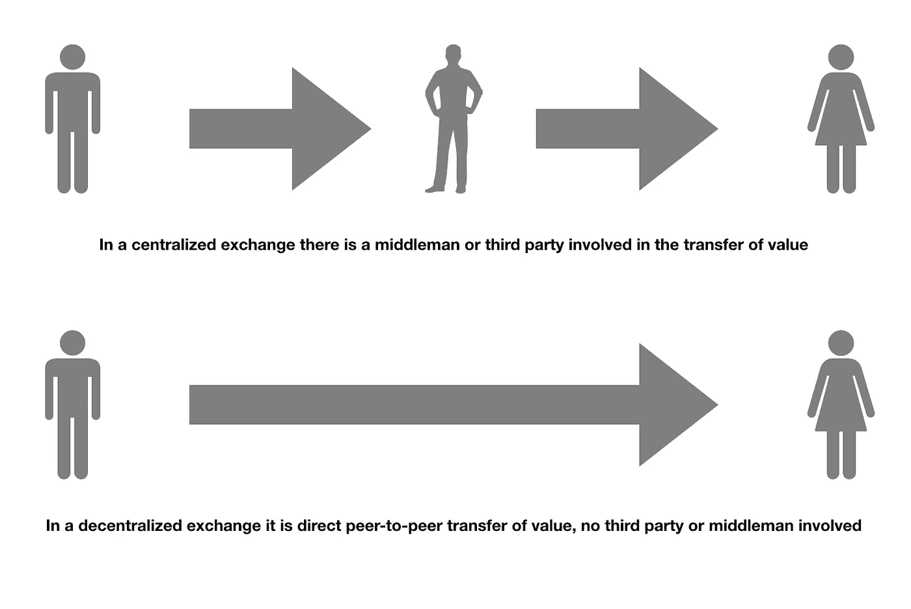
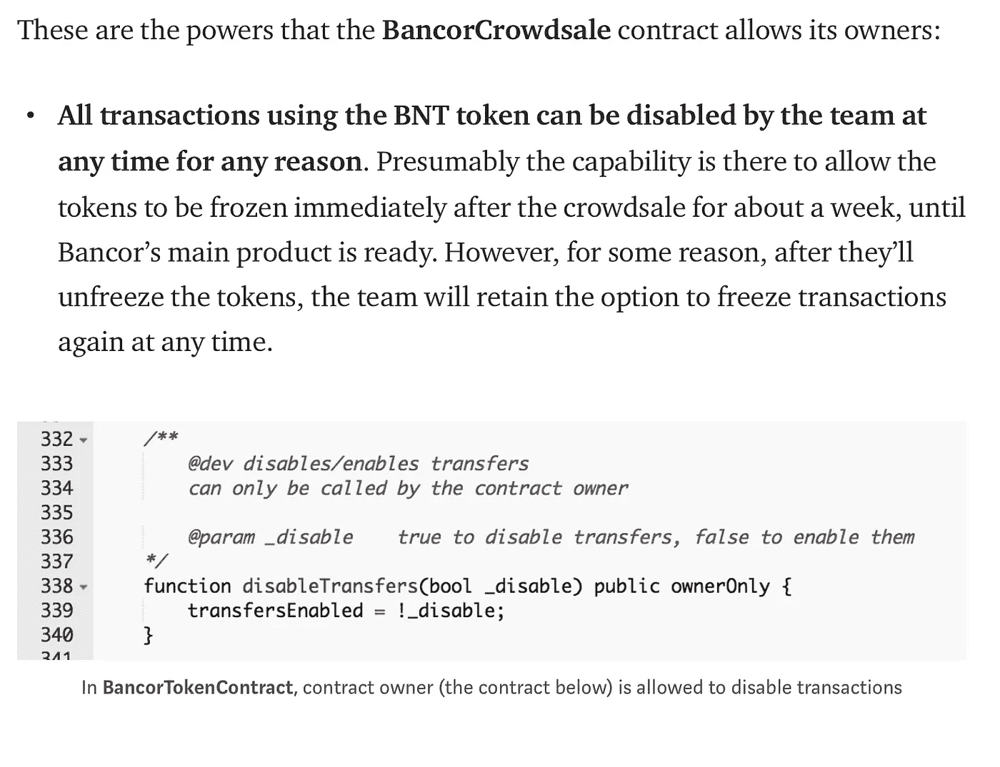
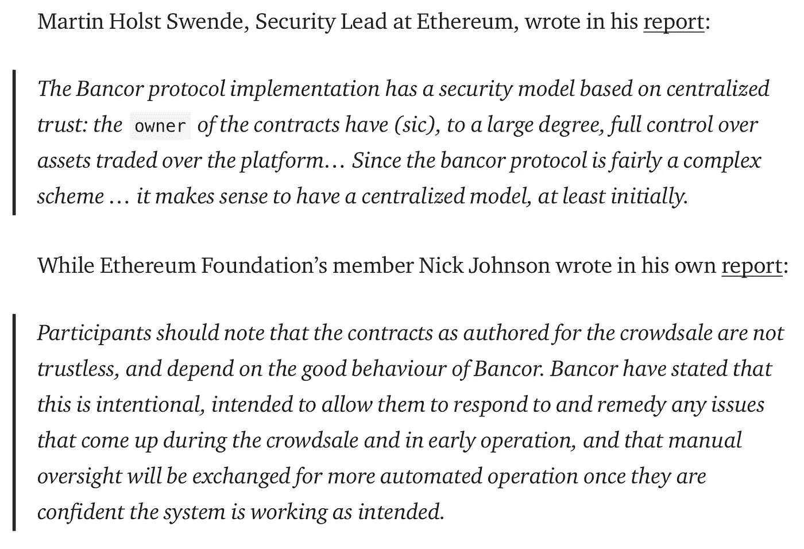

# 从错误的分权观念中吸取的教训

> 原文：<https://medium.datadriveninvestor.com/the-lessons-learned-from-a-false-sense-of-decentralization-875b8c2731a6?source=collection_archive---------4----------------------->

Decentralized Finance

随着数字交易所开始提供去中心化交易，我们正处于**去中心化金融(DeFi)** 时代。在监管严格的金融行业中，满足合规性要求似乎是 DeFi 想要规避的一项要求。监管者不喜欢这种方式，但它提供了一种无需中央机构的交易方式。然而，术语*分散*可能会产生误导。当注册为交易所时，试图提供分散金融服务的公司仍然必须遵守像 SEC 这样的监管机构。在一个分散的系统中，证券交易委员会将没有注册的公司，任何个人都可以自由地兑换货币。

仅仅因为一些东西在区块链上运行，并不意味着它是分散的。一家名为 Bancor 的密码公司，一家*去中心化交换*或 **DEX** 服务，于 2018 年 7 月 9 日被[黑客攻击。这是一个不幸的事件，只会在动荡的加密货币市场上创造更多的 FUD。该平台上的用户总共损失了 2350 万美元。现在没有意义的部分是，分散式交易所或 DEX 是如何被黑客攻击的？](https://techcrunch.com/2018/07/10/bancor-loses-23-5m/)

这实际上是可能的，因为在 Bancor 之前，另一个 DEX 被黑客攻击，称为 EtherDelta，后跟 Waves。EtherDelta 黑客影响了价值 27 万美元的用户资金。黑客利用 DNS 漏洞将用户重定向到一个假的 EtherDelta 域，因此 DEX 不能被黑客攻击是不真实的。在这两次黑客攻击中，Waves 事件让 DEX 更加怀疑他们的分散平台。自那时以来，已经吸取了教训。

## Bancor 黑客

Bancor 的黑客攻击涉及到一份智能合同，该合同被拥有其私钥的黑客破坏了。由于黑客有私钥，他们完全控制了资金，所以这不是什么复杂的利用。资金是从 Bancor 创建的智能合同中流出的。Bancor 不得不冻结其在 BNT 平台上的交易，以防止任何进一步的资金撤出。具有讽刺意味的是，如果 Bancor 是一个 DEX，它应该不能冻结用户的资金。这更多的是集中交易所的一个特点。

 [## 总部位于瑞士的 ETP 进入加密交易市场|数据驱动的投资者

### 虽然金融市场几乎没有沉闷的时刻，特别是在引入…

www.datadriveninvestor.com](https://www.datadriveninvestor.com/2019/03/10/swiss-based-etp-enters-the-crypto-trading-market/) 

根据 Bancor 的说法，冻结账户的能力被纳入了 Bancor 协议*“用于极端情况下从安全漏洞中恢复。”*这允许限制黑客在入侵期间可以提取的金额。因此，在接受调查期间，Bancor 关闭了其交易所。

Litecoin (LTC)加密货币的创始人查理·李在推特上说:

“如果一个交易所可能会失去客户资金，或者可能会冻结客户资金，那么它就不是分散的。Bancor 可以做到这两点。这是一种错误的分权感。”

Centralized vs. Decentralized

Dogecoin 的创始人杰克逊·帕尔默也在推特上发表了评论:

“这里的关键不是黑客本身，而是 Bancor 团队有能力冻结资金的事实。有多少其他“分散式”DApps 内置了中央控制的切断开关？”

事实上，Bancor 确实“披露”了他们的权力，用代码写的，并由摘自 [Unchained Reports](https://medium.com/unchained-reports/bancor-unchained-all-your-token-are-belong-to-us-d6bb00871e86) 的片段解释。

Taken from article from Unchained Reports (Medium.com)

审计员(Martin Holst Swende，以太坊的安全主管和以太坊基金会的成员 Nick Johnson)过去报告过 Bancor 的智能合同，他们发现 Bancor 的智能合同更加集中，因为 Bancor 有能力在出现任何问题时关闭他们的平台。Bancor 的推理在他们的[博客](https://blog.bancor.network/learning-from-thedao-fdbeb687000a)中有解释，作为从 DAO 黑客事件中吸取的教训。

Taken from article from Unchained Reports (Medium.com)

## 海浪安全被利用

Waves 是另一个被黑的 DEX，以一种相当奇特的方式。根据一篇[的隐板岩文章](https://cryptoslate.com/decentralized-exchange-waves-gets-hacked-after-6-million-debut/):

> **“在 2018 年 7 月 24 日首次亮相时，黑客利用该平台的安全缺陷劫持了该公司的主网站和交换网站，以钓鱼用户的个人钱包信息。**

**………**

> **黑客通过向 Waves support 提交伪造的身份证明攻破了网站，声称自己是 Waves 的首席执行官，并要求重置密码。”**

分散交易的想法再次受到质疑。如果你的平台有技术支持，那很好，但这是更有组织的中央控制。事实上，黑客就是这样利用系统的，这使得它不如一个完全自主和独立的平台安全。一个有 CEO 的去中心化平台就像一个有国王的民主国家。

## 理论上的 DEX

DEX 是一个独立的系统，可以在分布式公共分类帐上运行。这也是一个*无信任*和*无许可*的系统，将资金的控制权放在用户手中，不需要第三方。无信任意味着不需要第三方持有资产进行交易，而是可以直接与你并不真正了解的另一方进行交易。它也是没有权限的，因为你不需要问任何人你是否被允许交易。

这个平台上的所有交易都是直接的点对点(P2P)价值转移。它不存储用户的任何资金，而只是跟踪他们的交易。他们将买家和卖家配对，并允许交易记录在公共账上。如果一个 DEX 可以控制一个用户的账户，那么它就不是完全去中心化的。分散意味着你控制自己的私钥、数字钱包和硬币，并被允许直接与同行(其他用户)交换价值。DEX 不应该对你的能力有任何控制。如果 DEX 可以停止它自己的网络，那么它就是一个集中式功能。

DEX 可以为他们的网络开发防御这些攻击的协议，但是它们的实现方式必须消除任何集中式功能。例如，DEX 不应该有可以关闭网络的切断开关。在 Bancor 的案例中，智能合约有一个所有者，他的私钥可以用来解锁用户钱包中的资金。由一个所有者控制是高度集中的。

使用 [*multisig*](https://en.bitcoin.it/wiki/Multisignature#Multisignature_Wallets) 或**多签名钱包** 可以在 DEX 上实现安全功能，但在 Bancor hack 中，私钥似乎就像一个“超级密钥”，不需要另一个用户的数字签名来签署交易(例如提取资金)。Multisig 有助于为智能合约提供另一层安全性。对于 multisig，智能合约需要不止一个私钥。据最新报道，这次黑客攻击似乎只使用了一个“超级密钥”就成功了。这就是为什么它被称为高度集中。

## 现实中的 DEX

这也许是一堂关于发现什么是集中和什么是分散的课。这引发了关于如何平衡安全性和分散性的重要性的讨论，这种平衡不会使它过于集中或根本不集中。DEX 的主要特征是抗审查和没有个人信息要求。这使得它受到政府监管机构的审查，因为就跨境支付和不受监管的资金转移而言，它可以规避有关金融交易的管辖法律。

DEX 并不是 100%安全的。有不同的方法来破解它们，例如 Bancor 和 Waves 攻击。就网络安全问题而言，还有其他原因导致一些 DEX 并不像他们声称的那样。[币安已经推出了分散式交易所](https://www.redpulse.com/insight/20190617/why-binance-dex-is-not-really-a-decentralized-exchange--4c9d4be674)，但加入流程需要 KYC/反洗钱。理论上，你永远不必向 DEX 提交任何个人信息。这更多地是指交易所在分散化的情况下如何运作，但监管要求的加入过程并不是在 DEX 上交易的强制性要求。

成为一家合法的 DEX 公司也不是一个好主意。也就是说，如果法律没有得到遵守。当以太三角洲因未注册交易所而被 T2 罚款 40 万美元时，他们才知道这一点。任何公司都可以声称自己是 DEX，但这只会招致监管机构的调查，如果他们有任何违反合规的证据，那么将会被罚款甚至关闭。现在是进行尽职调查的时候了，这导致了更严格的控制。

## 摘要

从网络安全和区块链的角度对 DEX 了解了很多。首先，尽管是分散的，它们仍然像公共网络上的任何系统一样容易受到黑客攻击。第二个教训是，一个真正分散的交易所不能准确描述大多数 DEX 的运作方式。Waves 和包括 IDEX 在内的其他 DEX 平台对 KYC 的要求很低。IDEX 甚至去了 T4，要求客户提供完整的 KYC 信息。虽然加密到加密交易仍然是直接的 P2P 交易，没有 KYC 要求，但这些交易所的加密到法定交易的转换将需要 KYC。为了保持合法经营，这些交易所别无选择，只能遵从监管机构。

比特币可能是去中心化操作的最好例子，自 2009 年诞生以来就证明了这一点。它没有单一公司的集中控制，尽管有一个监督其发展的基金会。比特币网络没有终止开关或重做按钮，尽管开发者和社区可以达成 51%的共识来推翻交易。即便如此，这还没有发生(截至本文发稿时)。比特币网络的分散性质使得监管更加困难，因为没有中央机构管理该系统。另一方面，DEX 有某种形式的组织，这是法律要求遵循的。

另一方面，以太坊在因[道黑](https://www.coindesk.com/understanding-dao-hack-journalists)导致以太坊经典硬叉的时候，违背了自己的去中心化原则。这是由于 DAO 的智能合约中编写的一个错误，该错误允许“递归调用错误”，该错误允许攻击者在不改变区块链状态的情况下多次提取资金。当开发人员决定最好将攻击者提取的所有以太网返回给 DAO 时，社区分裂了。在一个分散的系统中，共识获胜，但是以太坊基金会的开发者推翻被盗以太的决定被其他人视为违反原则。一个分散的系统不应该在任何组织的控制下做出只为其最大利益服务的决策。从那时起，这就成了区块链的数字治理问题。

DEX 要么遵守管辖法律，要么承担后果。虽然真正去中心化交易所的想法并不存在，但理论上它是理想的。完全不会涉及法币，而是使用加密货币代币进行兑换。如果不涉及政府发行的货币，这是监管者无法控制的。DEX 可以交易虚拟数字货币，这实际上只不过是计算机交换的数字。它可能被认为是一种虚拟货币，但监管机构正在起草相关法律。

合规还是不合规，答案是什么？对于真正的 DEX，不需要任何形式的中央权威。事实上，DEX 只不过是部署在任何区块链上的智能合约。监管机构不能关闭它，也不能要求它遵守其司法管辖区的法律。它只是一段代码，执行一个用于转移加密货币价值的例程。他们必须追踪使用它的人，或者关闭每一台包含这种代码的计算机。这可能是一项艰巨的任务，因为代码可以通过互联网复制到任何地方，供许多人使用。

对于一个执行 DEX 功能的数字交易所来说，合规是保持业务的关键，迄今为止，币安和 IDEX 正在这么做。对于合法企业来说，这是一种必须平衡集权(更多监管)和分权(无监管)的妥协。对于我们其他人来说，DEX 应该像在网上下载文件一样简单易用，不需要依赖那些声称去中心化的中介。这是一个想法，但事实证明，监管环境是一个挑战。

进一步建议阅读:

我关于 DEX(首都)的文章:
[https://medium . com/The-Capital/The-state-of-decentralized-exchange-DEX-658659 d3a 502](https://medium.com/the-capital/the-state-of-decentralized-exchanges-dex-658659d3a502)