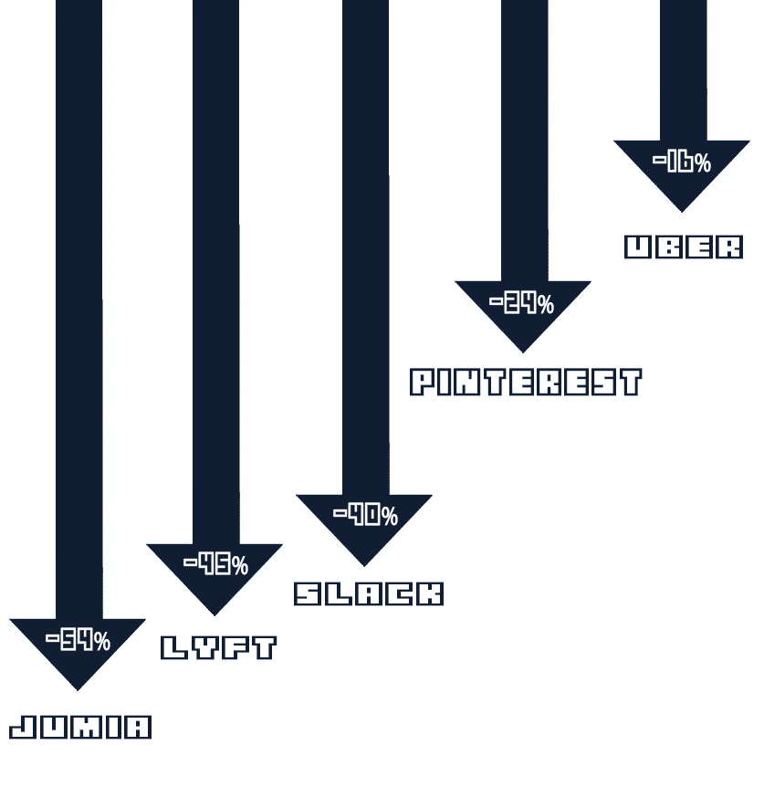

# 从 2019 年的科技独角兽踩踏事件中吸取的教训

> 原文：<https://medium.datadriveninvestor.com/the-lessons-learned-from-the-tech-unicorn-stampede-of-19-e8b1c4941a14?source=collection_archive---------6----------------------->

甚至比投资者在股市中获得的利润更有价值的是他们一路走来学到的惨痛教训……事实是，这些教训只有在他们真正*学到的时候才是有价值的*。

自从 2019 年提出了一个有趣的案例研究，风险投资家对科技公司的乐观情绪(通常是错误的)以来，我一直想写这个话题。在这一年，投资者似乎抛弃了古老的智慧，即把钱投给一家有可靠商业计划、盈利或有明确盈利路径、债务负担低且有正面媒体关注的公司。这一年，风险投资者从一家闪亮的新公司涌向另一家闪亮的新公司，买入包装最时尚、营销团队最优秀的公司的股票。对这些公司中的大多数来说，这种“包装”暂时掩盖了巨大的财务损失、混乱的董事会、无休止的争议，以及没有明确的计划来扭转财务状况。

这些科技独角兽一个接一个地申请首次公开募股，跃入公众视野……然后迅速崩溃并烧毁，以特别愚蠢的 WeWork 传奇达到高潮——备受期待的首次公开募股从未实现。

在经历了如此灾难性的一年后，2020 年第一季度似乎将是一个顿悟的“回归基础”时刻，投资者将把资金投入到盈利、稳定、基础雄厚、拥有才华横溢的商业领袖董事会的公司。在我坐下来写这篇文章之前，我读了一些关于在线床垫零售商 Casper 的标题，上面有一个棘手的三个字母的单词:“IPO”(从写这篇文章到发表之日，该公司被从独角兽地位降级，但这种情绪仍然存在)。该公司尚未盈利，已经耗尽了营销资金，而且估值过高，这让投资者更多的是怀疑而不是敬畏。当然，我们都学到了一些有价值的教训…对吗？

T “独角兽”一词指的是价值超过 10 亿美元的私人控股公司，这个词是在 2013 年创造出来的，以突出这些风险投资的统计稀有性。仅凭这个定义，它们听起来就像是自动为成功做好了准备(如果它们被认为是如此“罕见”，那么过去一年有这么多上市就很奇怪了，但我离题了)。事实未必如此:这些公司中的许多在申请首次公开募股之前还没有盈利，并且已经承担了大量的债务。

许多关于科技独角兽的头条新闻都报道了传统上(甚至技术上)没有被定义为“科技公司”的公司，尽管这些公司大多在科技平台上运营和发展，因此有助于他们快速成功。为了澄清我对“科技独角兽”的定义，我将指的是那些交易商品和服务、产生订阅或在科技平台上大量运营的估值达到 10 亿美元的公司。

任何关注去年上市的独角兽公司的人都可以列举出明显的失败案例:Jumia(从上市到年底下跌 54%)、Lyft(下跌 45%)、Slack(下跌 40%)、Pinterest(下跌 24%)和优步(下跌 16%)。除了 Jumia 和 Pinterest 这两个上市后迅速走红但最终不了了之外，大多数例子都是一上市就面临失败。

每家公司都有各种各样的细微差别，这确切地解释了为什么每家公司在上市时都失败了，因为这一功能没有足够的空间来介绍每一家公司。这些公司都挥舞着几个首要的危险信号，但过于乐观的投资者似乎忽视了这些信号，反而看到了诱人的营销和“潜力”和“创新”的模糊承诺。让我想起了 Bojack Horseman 的一句话:“当你透过玫瑰色的眼镜看某人时，所有的红旗看起来都只是旗。”事后看来，那些旗帜是红色的:

## **盈利问题**

这些公司最广为人知、最突出的问题是它们在盈利道路上的挣扎。增长优先于利润似乎是这些公司的口头禅，这一战略不可避免地在年底前适得其反。 [*《福布斯》*](https://www.forbes.com/sites/korihale/2019/11/29/africas-e-commerce-unicorn-jumia-is-struggling/#40186c692f7f) 描述了非洲在线市场公司 Jumia 的一贯收入预测失误。拼车服务 Lyft 和优步从未公布过自己的利润。更糟糕的是，在向公众募集额外资本之前，他们实际上报告了越来越多的损失。迈克·艾萨克的*超级加油:优步之战*勾勒了该公司戏剧性的轨迹。Isaac 去年 8 月报告称，该公司出现了 52 亿美元的最大亏损。《连线》*的评论支持了这笔资金被用于维护更崇高的公司形象的论点，该评论描述了优步如何在“为了支持上述巨头而为司机和乘客制作的广告”上每年损失 20 亿美元*

*一次又一次，这些公司首次公开募股的公告很快在主流金融出版物上产生了一篇关于这些公司如何无法盈利的分析文章。 [Slack](https://www.investopedia.com/articles/investing/012616/how-does-slack-work-and-make-money.asp) 和 [Pinterest](https://www.sec.gov/Archives/edgar/data/1506293/000119312519083544/d674330ds1.htm#toc) 也在 2019 年进行盈利能力测试，公布了更大的亏损。可能更难得的是遇到一个有可靠盈利模式的独角兽。迅速烧掉投资资本，以比其他颠覆者更快的速度增长，似乎是硅谷的口头禅，这是许多科技首席执行官在 2019 年广泛采用的一种说法。*

## ***债务缠身***

*当然，烧钱而无利可图会导致债务负担迅速增加。适度的债务可能是任何公司找到立足点的自然组成部分，但不需要注册会计师就能明白，越来越多的债务没有偿还能力对资产负债表不利。更糟糕的是，它对投资者没有吸引力。据 Wolf Street*报道，虽然多轮融资可能给了像优步这样的公司更多的资金，但为其积极扩张融资而借入的资金给了它 57 亿美元的长期债务负担。围绕 Jumia 与债务关系的[分析](https://simplywall.st/news/is-jumia-technologies-nysejmia-using-too-much-debt/)稍微乐观一些——前提是他们保持较高的现金水平，并且他们的长期盈利计划成功。应该指出的是，Pinterest 和 Slack 已经设法在几乎没有债务的情况下度过了难关。**

## ****年底，一切都归结于风险****

**经济的不确定性迫使企业在不稳定的基础上工作，投资者用他们的钱做出非常规的决定。2019 年是这些新秀公司的一个例子，这些公司似乎有可能成为叛离的市场颠覆者，但最终却成为风险上升的巨大现金坑。**

## ****坏的和丑的****

**当然，还有更多公司特有的问题让这些独角兽与众不同。独角兽公司首次公开募股失败的典型案例涉及非常戏剧性的负面新闻报道，导致非常公开的失败。优步和 WeWork 的传奇故事呈现了最能占据头条的公司破产事件。优步围绕拼车性侵的争议，以及首席执行官特拉维斯·卡兰尼克斥责他的一名司机的镜头，加深了该公司严重低估为其平台工作的人的印象。**

**尽管有损失和煽动性的头条新闻，痛苦的教训还是有价值的——它们肯定会持续更长时间。**

****

**2020 年迎来了新的一年，同时也带来了新的问题:美国和伊朗紧张局势的升级让不安的投资者退出，并抛出了第三次世界大战和围绕冠状病毒的担忧。随着不确定性的增加，考虑到这些公司去年的表现，独角兽似乎开始在投资者眼中失去魔力。分析师对这些公司持更加怀疑的态度，尤其是在 IPO 前公开的财务文件显示公司迅速亏损之后。2020 年可能会是投资者回归基础、投资盈利路径更清晰的公司的一年。**

**公司自己也在采取一些行动:他们更年轻、经验更少的首席执行官正被履历更长的业内资深人士所取代。优步是第一批将陷入困境的首席执行官换成达拉·科斯罗萨西(Dara Khosrowshahi)以改变其“道德指南针”的独角兽之一。WeWork 将新面孔亚当·诺伊曼(Adam Neumann)挤出了董事会，最近又引入了桑德普·马特拉尼(Sandeep Mathrani)，预计他将于 2 月 18 日接任这一职位。据 [*美国有线电视新闻网*](https://www.cnn.com/2020/02/02/business/wework-ceo-sandeep-mathrani/index.html) 报道，马特拉尼拥有记录在案的房地产背景，与诺伊曼形成鲜明对比的是，他计划以冷静的五年计划来推进 WeWork 的重组计划，以扭转公司局面，实现盈利，并在 2022 年前实现正的自由现金流。在追求更明智的商业计划的过程中，硅谷崇拜 CEO 的态度被抛在了后面。**

**我采访了达伦·西松( [@KiwiPMI](https://twitter.com/KiwiPMI) )，他是一位经验丰富的科技投资者，也是[Campbell Lee&Ross](https://www.clrim.com/site/home)投资管理团队的副总裁兼投资组合经理。与科技领域的老牌行业相比，像他这样的投资者认为科技独角兽作为长期投资机会不太可靠:“我们寻找成熟的科技公司，它们拥有经验丰富的管理，经历了几个市场周期。”他以半导体行业为例，该行业拥有 60 年的历史，经验丰富的管理层已经关注该行业数十年。**

**Sissons 认为，投资者在这些科技独角兽公司上进行快速交易，以获得快速利润，在这些公司上市后，在热情消退之前，股票价格短暂飙升。**

**他进一步补充说，对于这些新的独角兽公司，投资者不知道他们将如何应对重大的市场低迷。如果是科技领域的新公司，那么更有可能的机会是拥有新技术的公司将被收购。“当我们考虑投资一家公司时，我们会看它的故事。如果没有大的盈利故事，……我们不建议将其作为投资。”**

****

**“T4”、“创新”和“改变游戏规则”都是商业世界中诱人的词汇。每个人都喜欢一个失败者的故事，每个人都想成为一家即将成功的公司的第一人。如果说 2019 年教会了投资者什么，那就是这家闪亮的新公司可能会因为某种原因而成为失败者——就盈利能力而言，它还没有完全找到自己的立足点。他们身上没有伤痕也表明，他们没有经历过低迷时期，在不确定时期无法让投资者放心。尽管这些公司损失了资金，但我认为 2019 年的“独角兽踩踏事件”在行为经济学中提供了一个有趣的案例，投资者更热衷于做空公司，看着它们失败，而不是孵化其增长。**

***在 Twitter 上关注我*[*@ stephughes 95*](https://twitter.com/StephHughes95)*访问我的网站*[*stephaniehughesjournalism.com*](https://stephaniehughesjournalism.com/)*。***