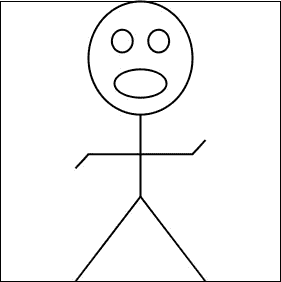
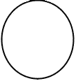
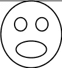
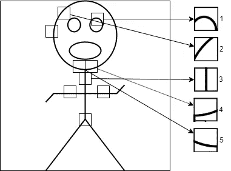
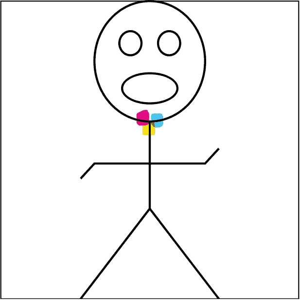
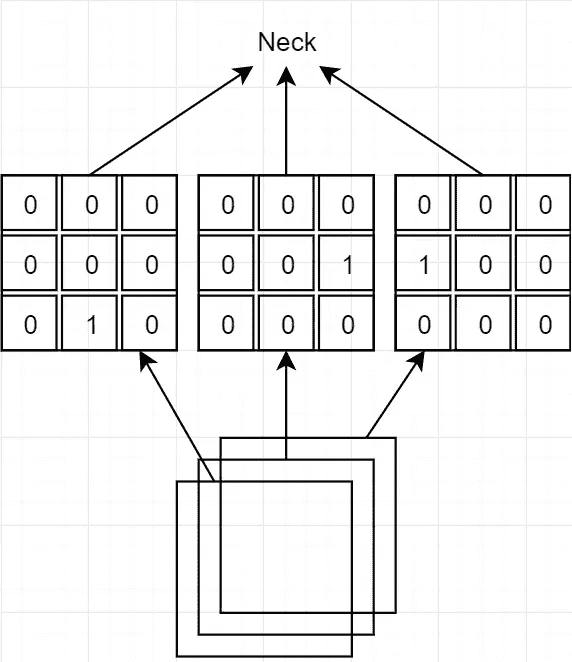

# 卷积神经网络中卷积运算背后的逻辑

> 原文：<https://medium.datadriveninvestor.com/the-logic-behind-convolution-operation-in-convolutional-neural-networks-5f81de135554?source=collection_archive---------5----------------------->

互联网上有很多解释卷积神经网络中的卷积运算的帖子。当我在研究和尝试实现它们时，我发现所有这些帖子都忽略了两个关键点，即操作背后的逻辑和实现中的操作顺序。在这篇文章中，我将谈论卷积运算背后的逻辑。我假设你知道卷积运算的基本知识。

# 概念:

## 内核:

先从“内核”这个概念说起。核用于定义图像处理中“一幅图像”的概念。任何图像(矩阵)都可以称为核。所以，当我在文章中说 3x3 内核的时候，意思是我说的是一个 3 行 3 列的矩阵。

## 卷积:

这个术语在神经网络中实际上是用错了。图像处理中的卷积指的是从图像的右下角开始在图像中滑动核(在此之前对神经网络是正确的)(对神经网络不是正确的)。在神经网络中，操作从左上角开始)。从图像左上角开始的操作称为互相关。因此，卷积神经网络的名称实际上应该是互相关神经网络。

# 卷积神经网络背后的逻辑:

让我们想象一个棍子人的形象。

Hello, I am stick man.

当我们看图像时，我们看到一个棍子人。我们的大脑分析它在图像中看到的边缘和形状，将图像分类为棍子人的图像。

 [## DDI 编辑推荐:5 本让你从新手变成专家的机器学习书籍|数据驱动…

### 机器学习行业的蓬勃发展重新引起了人们对人工智能的兴趣

www.datadriveninvestor.com](https://www.datadriveninvestor.com/2019/03/03/editors-pick-5-machine-learning-books/) 

如果我给你一个像下面这样的图像，你会说这只是一条线。

Line

当我们还是婴儿的时候，我们就学会了对线条、颜色、形状和这类基本的视觉效果进行分类。之后，我们学习一些更复杂的物体，比如几何物体，它们是由我们之前学过的基本视觉元素组成的。

A bit more complex object: Circle

然后通过组合这些稍微复杂的物体，我们学习更复杂的物体，比如眼睛、手、桌子。

A stick man face with a graduation hat :D

## 但是，我们如何在卷积神经网络中进行这些操作呢？

让我们回到我们的棍子人。棍子人包括几个特征，如眼睛、嘴、脸、胳膊和腿。这些组件由圆、弧、线和线交点组成。而这些组件是由更小的线和角组成的。

现在，假设我们用滤波器 3、4 和 5 对图像进行卷积。当我们做这些操作时，我们在棍子人的脖子周围得到高值，因为这些特征在那里匹配得最好。(将为每个过滤器创建 3 个矩阵。)

3:yellow, 4: blue, 5:pink

当我们用 3x3x3 内核对这些新矩阵(3 个特征矩阵)进行卷积时，我们实际上是试图找到特征的组合。对于在棍子人脖子周围的部分，神经网络识别出与 3x3x3 内核的卷积给出高值。

这种手术也适用于眼睛、头部、手臂和腿部。

下一个卷积层发现甚至更复杂的组合，如 2 个手臂+脖子，2 条腿+2 个手臂，等等。

最后，神经网络结合它发现的高级特征。这些特征是头部、上身、下身等。这就是它如何进行分类的。

希望你喜欢这篇文章。如果你有问题或任何模糊的方面，请在下面评论。

下一篇文章将从头开始讲述卷积神经网络的实现。