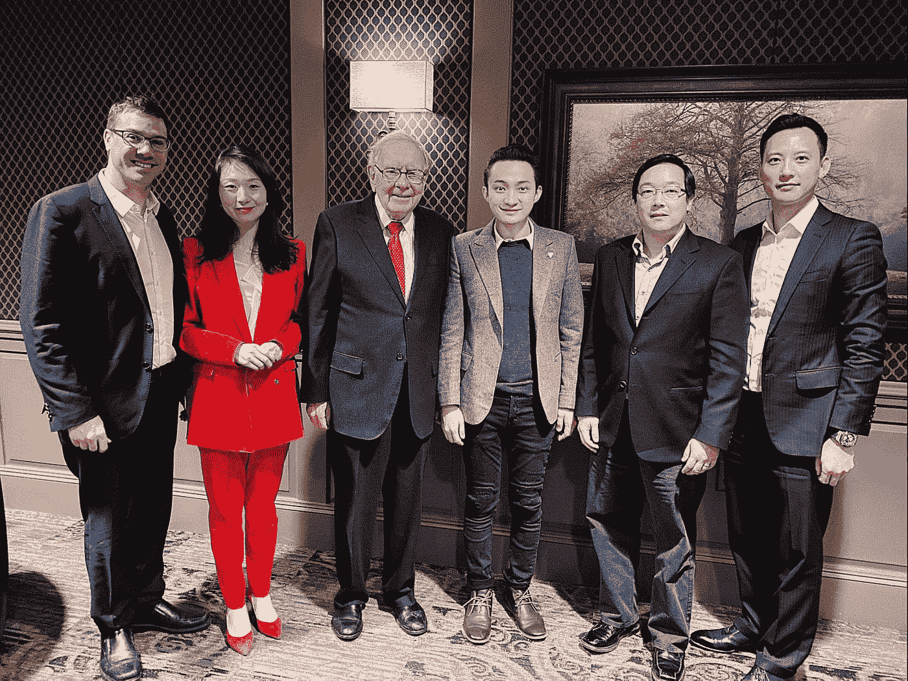
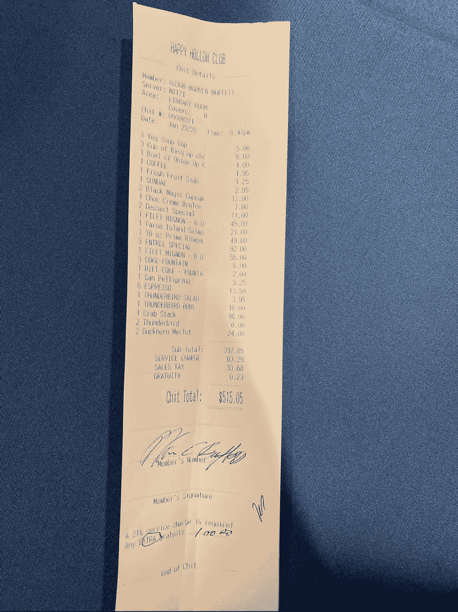

# 期待已久的午餐会

> 原文：<https://medium.datadriveninvestor.com/the-long-awaited-luncheon-e41ff4a4d2c0?source=collection_archive---------9----------------------->

Tron 创始人兼首席执行官贾斯汀·孙(Justin Sun)终于与伯克希尔·哈撒韦公司(Berkshire Hathaway)董事长、著名亿万富翁沃伦·巴菲特(Warren Buffett)共进了慈善午餐，这是去年一系列推迟之后的事情。

1 月 23 日，孙在内布拉斯加州一家私人非营利乡村俱乐部会见了巴菲特。出席嘉宾还包括 Litecoin 基金会创始人、火币网首席财务官、币安慈善基金会负责人海(Helen Hai)、eToro 首席执行官 Yoni Assia。午宴持续了三个多小时。

Source: [https://twitter.com/justinsuntron](https://twitter.com/justinsuntron)

在评论这一备受期待的事件时，孙说:

> “这真的是一种荣誉，我感谢巴菲特先生的晚餐、智慧和远见。我将永远记得巴菲特的善意和支持，并将接受巴菲特的建议和指导，让 Tron 成为一个更好的生态系统，与区块链及其他地区的所有合作伙伴开展业务。”

去年 6 月，孙在的一场慈善拍卖中胜出，与巴菲特共进午餐。孙的中标金额约为 450 万美元，是该赛事 20 年历史上的最高价。然而，Tron 首席执行官因医疗原因不得不推迟，并于 7 月宣布将“很快”重新安排他与巴菲特的慈善午餐。

 [## 总部位于瑞士的 ETP 进入加密交易市场|数据驱动的投资者

### 虽然金融市场几乎没有沉闷的时刻，特别是在引入…

www.datadriveninvestor.com](https://www.datadriveninvestor.com/2019/03/10/swiss-based-etp-enters-the-crypto-trading-market/) 

在推迟之前，孙特别向美国总统唐纳德·特朗普发出了邀请，此前总统在社交媒体上对加密货币发表了严厉的言论。

孙下一次开始谈论这顿午餐是在去年 9 月，当时他重新安排了饭局。

Source: [https://twitter.com/justinsuntron](https://twitter.com/justinsuntron)

> 有史以来最美味的一餐！感谢 [@WarrenBuffett](https://twitter.com/WarrenBuffett) 带我们去快乐谷俱乐部！一顿 515.05 美元的晚餐花了 456 万美元，真是物有所值！我得到的见解是无价的。和朋友们 [@SatoshiLite](https://twitter.com/SatoshiLite) ， [@ChrisLEE_Crypto](https://twitter.com/ChrisLEE_Crypto) ， [@HelenHaiyu](https://twitter.com/HelenHaiyu) ， [@yoniassia](https://twitter.com/yoniassia) 吃的每一口都很享受！

根据孙的说法，515.05 美元的晚餐“花得值”，是“有史以来最美味的一餐”

***如果您想了解更多，请访问 BIDITEX 页面并提出您的问题，关注我们的*** [***推特***](https://twitter.com/biditex_com) ***，*** [***脸书***](https://www.facebook.com/biditex/) ***，*** [***中型***](https://medium.com/@biditex) ***，*** 用[***bidi tex***](http://www.biditex.com/)***投标你的空格。***