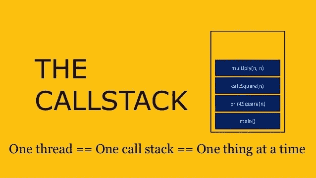
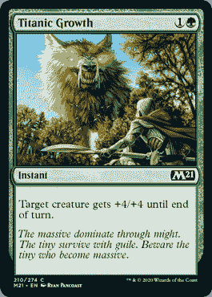
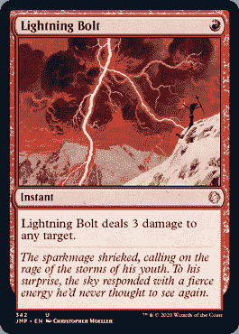
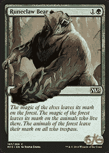
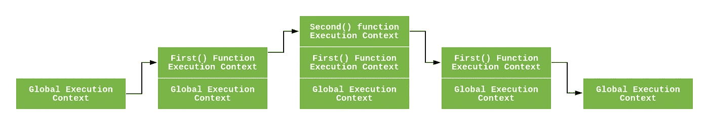
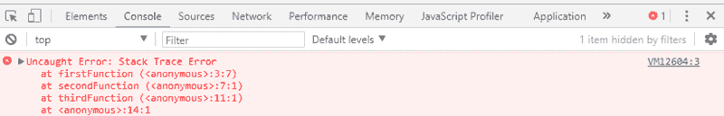
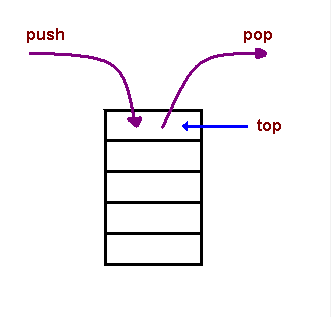
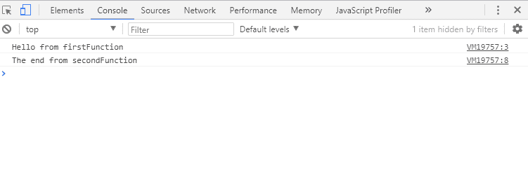
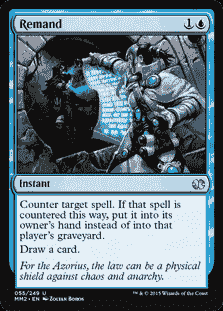

# 堆栈的魔力

> 原文：<https://medium.datadriveninvestor.com/the-magic-of-the-stack-73d83f5530a2?source=collection_archive---------13----------------------->



小时候，我最难忘的经历是和一群每周都会见到的人一起玩纸牌游戏。我从小时候的口袋妖怪交易卡游戏开始，在我初中和高中的时候毕业到游戏王。这一切都回到了 2020 年 2 月左右，当时我决定重温《魔法规则:聚会》，并最终尝试一下。

与此同时，我在熨斗学校学习如何在各种不同的环境下编程。随着我花更多的时间学习普通 Javascript、Rails 和 React 的细节，编码软件和玩交易卡游戏之间的重叠开始真正吸引我。

请继续阅读，和我一起探索这个概念。


Photo by [Markus Spiske](https://unsplash.com/@markusspiske?utm_source=medium&utm_medium=referral) on [Unsplash](https://unsplash.com?utm_source=medium&utm_medium=referral)

特别是，大多数纸牌游戏采用了堆栈的概念。在《魔法:聚会》中，它决定了出牌的顺序，这是游戏从头到尾的关键。有趣的是，Javascript *也*采用了堆栈的概念。

在【T2 魔法】中，牌在被激活和实际发生之间游走。简而言之，当玩家一施放一个咒语(例如出一张牌)，它就会进入堆叠。然后，二号玩家有机会做出回应，这被称为拥有“优先权”然后，无论是否播放，玩家一都有机会回应。如果两个玩家都不做任何事，咒语就会生效。

# 螺栓和熊

让我们探索一下*魔法*中一个非常常见的堆栈演示。

一号玩家有一只符文爪熊。他们攻击，玩他们手中的泰坦尼克增长，以增加熊的力量。



一号玩家随着巨大的成长获得优先权并通过。但是第二个玩家有一个锦囊妙计，他敲打一座山，向熊射出闪电。



一号玩家再次获得优先权并通过。二号玩家也通过了。螺栓分解，熊死亡。巨大的增长仍在堆栈中，但它不会解决。卡片“嘶嘶作响”，什么也不做，因为它没有有效的目标。

如果这种情况发生在不同的地方，会有一个非常不同的结果。例如，如果玩家 1 激活了泰坦尼克增长*以响应*闪电，熊将仍然活着，因为泰坦尼克增长由于堆栈的**后进先出(LIFO)** 原则而首先解决。



这个小例子演示了堆栈是如何工作的，并暗示了作为一个魔术玩家，你可以使用许多技巧来利用系统并利用其细微差别。

## Javascript 调用堆栈



例如，浏览器中的 JavaScript 引擎是一个单线程解释器，由一个堆和一个调用栈组成。浏览器提供了 web APIs，如 DOM、AJAX 和定时器。

调用堆栈主要用于调用函数。同步的调用堆栈(类似于 *Magic 的)*从上到下一次执行一个函数。

[](https://www.datadriveninvestor.com/2020/09/16/training-a-digit-recognizer-using-pytorch-and-inferencing-on-cpu-with-onnx-runtime/) [## 用 PyTorch 训练数字识别器，用 ONNX Runtime | Data Driven 在 CPU 上进行推理…

### 在任何机器学习问题中，我们的神经网络的目标是在新的未知数据上做得很好，训练一个深度…

www.datadriveninvestor.com](https://www.datadriveninvestor.com/2020/09/16/training-a-digit-recognizer-using-pytorch-and-inferencing-on-cpu-with-onnx-runtime/) 

简单地说，调用栈是一种数据结构，它使用**后进先出(LIFO)** 原则来临时存储和管理函数调用。

让我们看一个代码示例，通过将堆栈跟踪错误打印到控制台来演示 LIFO:

```
function firstFunction(){
  throw new Error('Stack Trace Error');
}function secondFunction(){
  firstFunction();
}function thirdFunction(){
  secondFunction();
}thirdFunction();
```

当代码运行时，我们得到一个错误。打印出一个堆栈，显示这些函数是如何相互堆叠的。



您会注意到，函数作为堆栈的排列以`firstFunction()`(这是添加到堆栈中的最后一个函数，被弹出以抛出错误)开始，接着是`secondFunction()`，然后是`thirdFunction()`(这是代码执行时第一个被推入堆栈的函数)。

当一个函数被调用时，该函数、它的参数和变量被压入调用堆栈，形成一个临时堆栈框架。这个堆栈帧是堆栈中的一个内存位置。当函数从堆栈中弹出并返回时，内存被清空。



调用堆栈维护每个堆栈帧位置的记录。它知道下一个要执行的函数和执行后要删除的函数。这就是 JavaScript 中代码执行同步的原因。想想玩*魔法*吧:你可以在两个玩家都通过优先权后，按顺序解决出牌的效果。

# 调用堆栈和函数调用

```
function firstFunction(){
  console.log("Hello from firstFunction");
}function secondFunction(){
  firstFunction();
  console.log("The end from secondFunction");
}secondFunction();
```



运行上述代码时会发生以下情况:

1.  当`secondFunction()`被执行时，一个栈帧被创建，并且是程序的主入口点。
    2。`secondFunction()`然后调用被推入堆栈的`firstFunction()`。
    3。`firstFunction()`返回并打印“Hello from firstFunction”到控制台。
    4。`firstFunction()`弹出堆栈。
    5。然后执行顺序移动到`secondFunction()`。
    6。`secondFunction()`返回并打印“secondFunction 结束”到控制台。7。`secondFunction()`弹出堆栈，清空内存。

综上，Javascript 调用栈为:
1。单线程，意味着它一次只能做一件事。
2。一次执行一个代码。
3。函数调用会创建一个占用临时内存的堆栈帧。
4。它的工作原理是后进先出法。

## 作为一般原则的堆栈

无论是 Javascript 还是*魔法:聚会*，理解堆栈对于能够利用其结构为你所用至关重要。



例如，在*魔法中，*巧妙地使用堆叠允许玩家将他们刚刚施放的还押法术还押，这样反制失败，你可以再次使用还押，但这次是安全的。

深入了解调用栈如何工作对于异步 JavaScript 至关重要，在异步 JavaScript 中，我们有一个回调函数、一个事件循环和一个任务队列。在回调函数被事件循环压入堆栈后，回调函数在执行过程中由调用堆栈执行，但作为程序员，操纵回调函数可以更精确地控制程序的运行方式，从而避免出错。

—

强化学习的最好方法之一是不断地将它与现实世界联系起来。在这种情况下， *Magic:聚集*使用堆栈的编程概念作为基本机制，就像 Javascript 使用调用堆栈来确定函数调用一样。然而，最重要的是，它向我证明了花在玩纸牌游戏上的时间并没有白费！

## 访问专家视图— [订阅 DDI 英特尔](https://datadriveninvestor.com/ddi-intel)