# 人工智能的主要发展及其驱动力

> 原文：<https://medium.datadriveninvestor.com/the-major-developments-in-ai-and-whats-powering-them-ef4c16e01baf?source=collection_archive---------12----------------------->

*阿里巴巴集团副总裁、阿里云智能计算平台事业部总裁贾。*

今天的演讲是由贾为阿里巴巴首席信息官学院的人工智能(AI)技术特别培训课程准备的。在直播期间，贾讨论了人工智能所涉及的工程和产品实践。首先，他介绍了人工智能及其应用。然后，与会者讨论了人工智能系统的重要问题，包括驱动算法创新的计算能力的突破以及云平台可以提供的价值。最后，贾先生分析了大数据与人工智能的关系，探讨了企业如何拥抱人工智能，并提出了企业智能化战略的重点。

 [## 商业价值和人工智能的 5 个原则|数据驱动的投资者

### 提取商业价值很难。我是说真的很难...说到高级分析，这一过程甚至…

www.datadriveninvestor.com](https://www.datadriveninvestor.com/2020/07/07/5-principles-for-business-value-and-artificial-intelligence/) 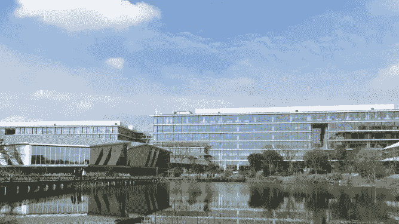

# 算法

人工智能已经成为一个重要的技术趋势。各种行业现在都在拥抱人工智能，并且与人工智能的关系越来越密切。下图列出了人工智能发挥重要作用的领域，其中不仅包括那些与人工智能密切相关的领域，还包括那些由人工智能间接授权的领域。

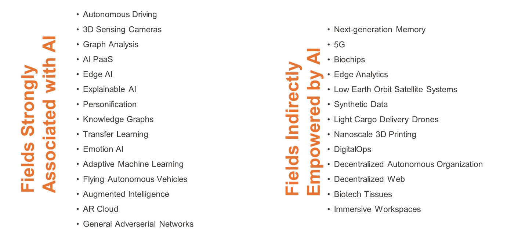

在我们过于超前之前，我们需要理解人工智能背后的思想，它的应用和它的系统。

随着人工智能在过去 80 年的发展，我们已经实现了从图灵测试到面向所有人的改变。机器使用人工智能来回答问题，并像人类一样创建或执行计算和分析任务。在某些领域，计算机已经达到了人类的能力。例如，2019 年发布的 Face Change for All app 就是基于深度学习和神经网络在人工智能领域的广泛应用。

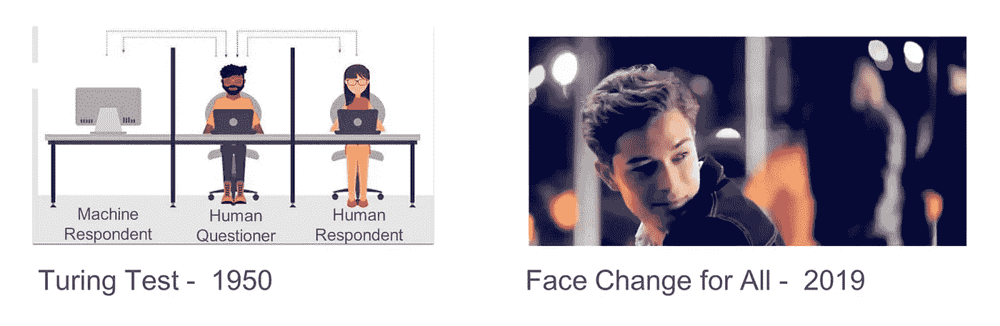

目前，许多人工智能应用程序用于我们的日常工作和生活中，以取代人类的工作。例如，埃隆·马斯克的人工智能项目能够模拟人脑的运作。然而，随着人工智能的快速发展，一些我想称为“假人工智能”的例子也出现了。

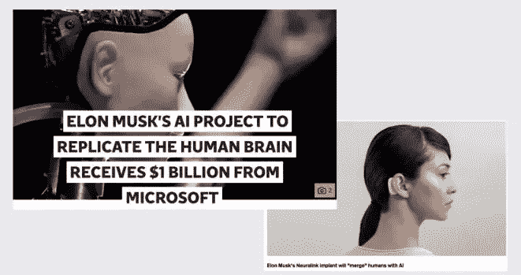

在人工智能的发展过程中，我们不得不面对一些虚假的人工智能项目，例如，一个严重的虚假人工智能项目骗取了投资者 2 亿 CNY(超过 2800 万美元)。因此，我们需要更好地理解什么是 AI，以及如何使用它。

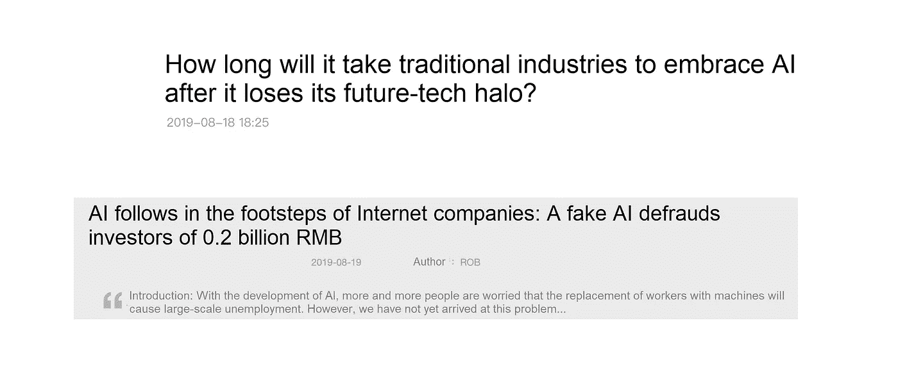

在学术界，人工智能的定义有些不同。人工智能是对人类智能的模拟，能够接收信息并对信息进行分类，合理地执行一系列任务并根据这些任务做出决策。

它的主要特征之一是采取理性行动的能力。

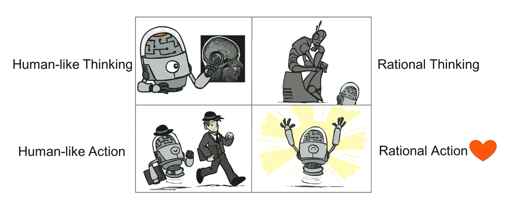

人工智能过程从感知到决策反馈。决定人工智能系统能否采取适当行动的关键因素是它们如何感知外部世界的信息。由于 AI 试图模拟人脑，所以感知的过程实际上是一个理解和学习的过程。这就是深度学习试图用 AI 解决的问题。

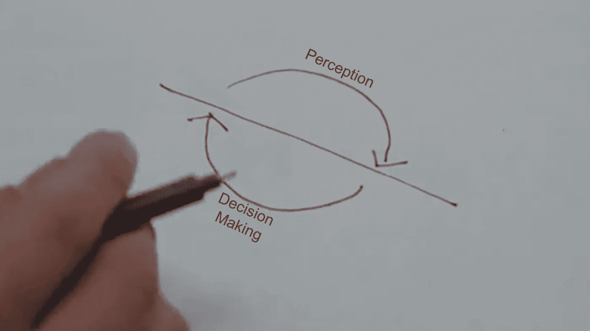

## 深度学习

只有当外部信息(如视频、文本或语音命令)被转换为机器语言时，AI 才能接受并做出响应。这个问题从 AI 最早的时候就被科学家考虑和研究。

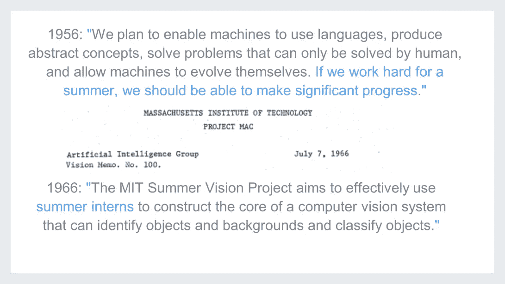

随后，人们开始讨论和研究如何通过视觉感知来输入信息。2012 年，加拿大多伦多大学 ImageNet 竞赛的获胜者 Geoffrey Hinton 和他的学生 Alex Krizhevsky 设计了一个解决方案。在那一年之后，更深层次的神经网络被提出，比如众所周知的 VGG 和谷歌网络。这些神经网络为传统的机器学习分类算法提供了出色的性能。

## AlexNet 在深度学习方面的发展历史

简而言之，AlexNet 的目标是从大量对象中准确识别命令中需要的对象。该模型的应用加速了图像识别领域的发展，目前已被广泛应用。

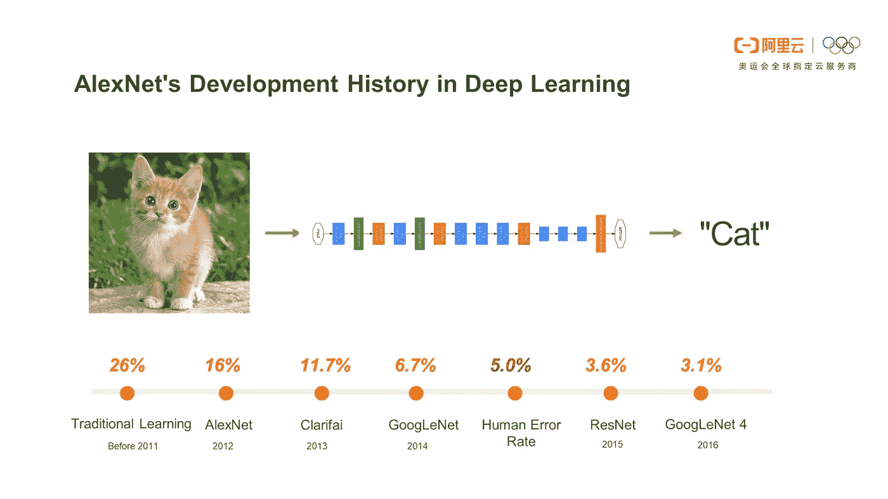

像我们的人脑一样，神经网络使用多级学习模型，并随着不断学习而变得越来越复杂。假设您希望从数百万张图像中找到标记为“cat”的图像，并在一个非常大的数据集上训练一个编辑过的视觉网络模型。然后通过模型迭代实现更复杂的训练。

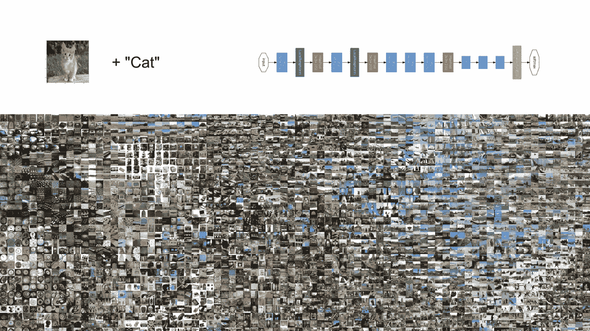

目前常用的 RestNet 模型深度超过一百层，并融入了一些最新的科研成果，比如下图底部所示的 quick bridge connections。这允许用户快速有效地训练深度网络。最终，这解决了视觉感知的问题。

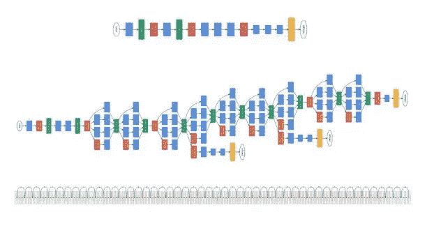

## 阿里云:智能航空停机坪管理

这个解决方案使用 AI 来识别飞机类型、登机门和机场车辆，并将其反映在实际地图上。它还允许用户在飞行中看到飞机的轨迹。这些信息可以作为 AI 管理的输入信息，使机场的运营更加便捷有效。

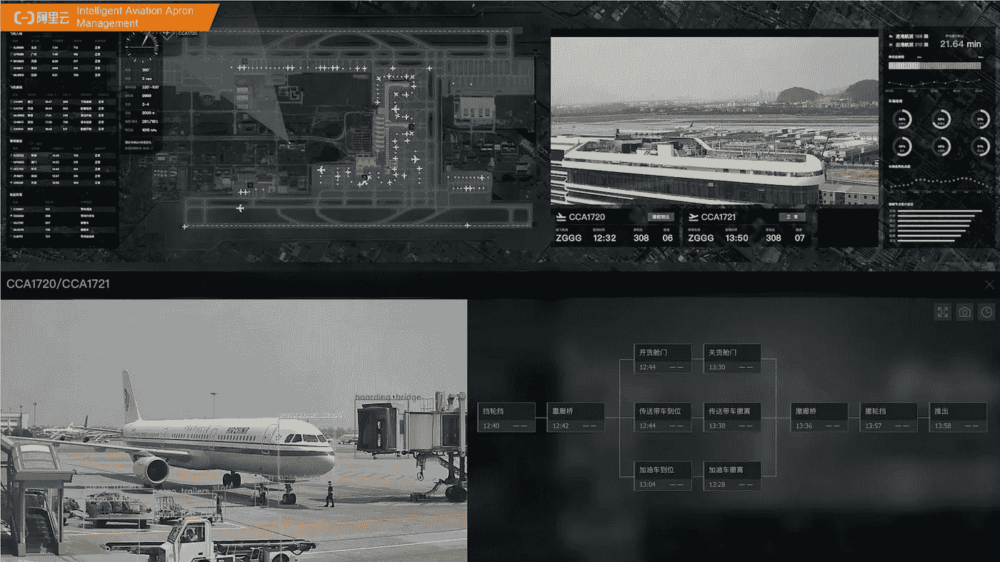

如前所述，深度学习是一种重要的感知模式和方法。深度学习算法主要涉及:

*   数据标记
*   算法模型开发
*   高性能分布式培训
*   模型优化
*   模型部署

感知之后，AI 系统需要做出决策。深度学习是一种黑箱操作，可以学习和感知外部信息，但不能提供任何解释感知问题原因的反馈。因此分析和反馈需要决策能力。

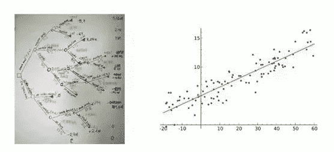

传统机器学习的例子主要有决策树算法和逻辑回归。比如银行发放贷款的过程就是一个决策过程，在权衡各种因素后输出一个决策。我们可以使用决策树来输出“是”或“否”的判断，以确定是否给予贷款。逻辑回归是指两类数据之间的相关性。这是一种输出精确解的数学方法。

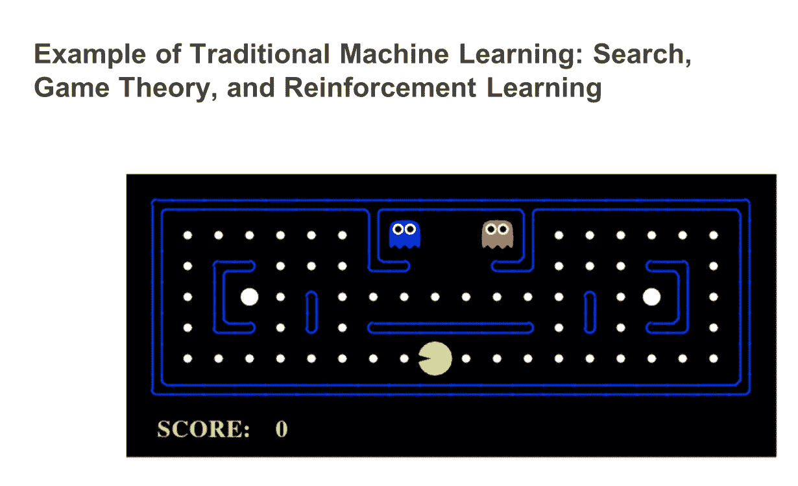

其实深度学习和机器学习是相辅相成的。深度学习可以解决感知问题，比如计算机视觉和语音识别。它使用神经网络架构来解决许多感知问题，但不能解释感知问题。传统的机器学习不提供这种用户友好的感知功能。但是它的模型比较小，可以直接解释，在财务和风控场景中是必须的。

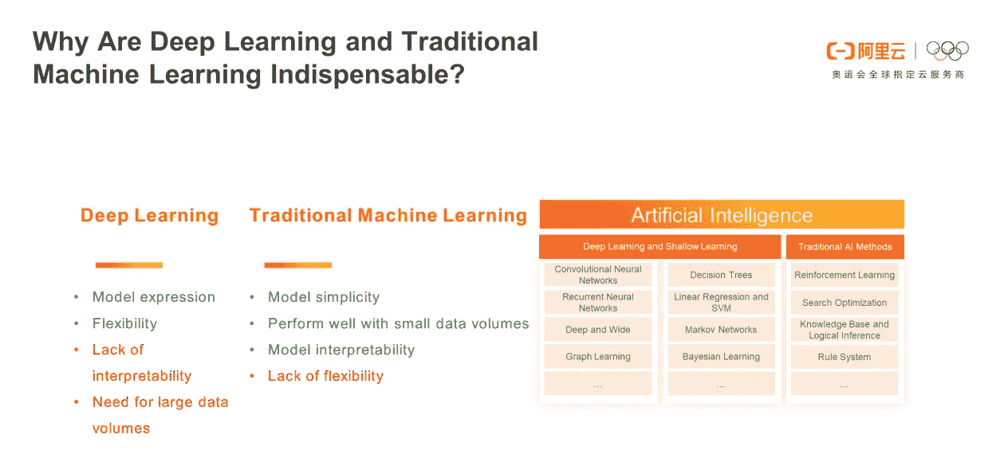

AI 在广告领域的应用由来已久。淘宝是最常见的广告场景之一。卖家首先根据消费者的个人浏览信息调查用户偏好，然后通过智能推荐系统推送与消费者搜索相关的产品。这种智能算法的广泛应用使得用户信息挖掘更加高效和精确。

感知和决策都依赖于算法。

*   **感知:**感知过程与深度学习算法相关，涉及数据标记、算法模型开发、高性能分布式训练、性能优化、模型部署。
*   **决策:**决策过程与传统的机器学习算法和深度学习算法有关。它涉及行业行为数据的收集、结构化和非结构化数据处理、数据和算法的组合建模、算法开发训练和调优、模型部署以及实时训练反馈。

# 人工智能系统

随着算法的快速发展，相应的基础设施支持变得越来越重要。这需要 AI 系统的支持。构建 AI 或机器学习系统的两个必不可少的因素是算法和计算能力。算法创新是由计算能力的突破推动的。

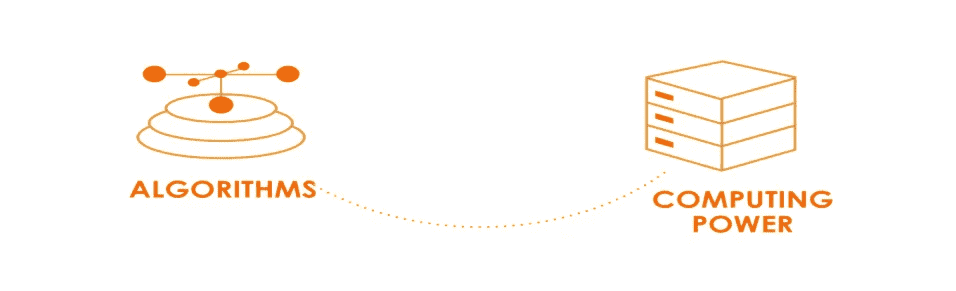

下图是 AI 到 2019 年所需的计算能力。AlexNet 对计算能力的需求比 AlphaGo Zero 需要的计算能力增加了 30 万倍。鉴于这种情况，算法迭代和算法实现的解决方案对系统提出了更高的要求。

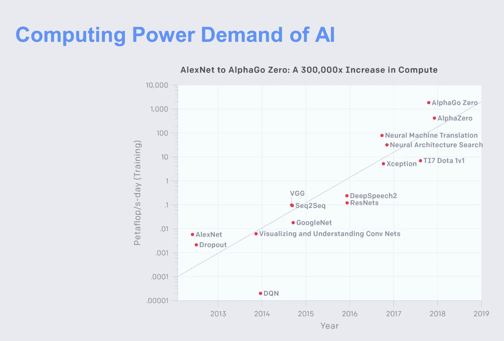

下图是 2013 年 AlexNet 的系统。通过简单地在机器上添加一个 GPU，7 天的培训成本约为每天 500 瓦。这意味着商业模型的迭代周期大约是一周。

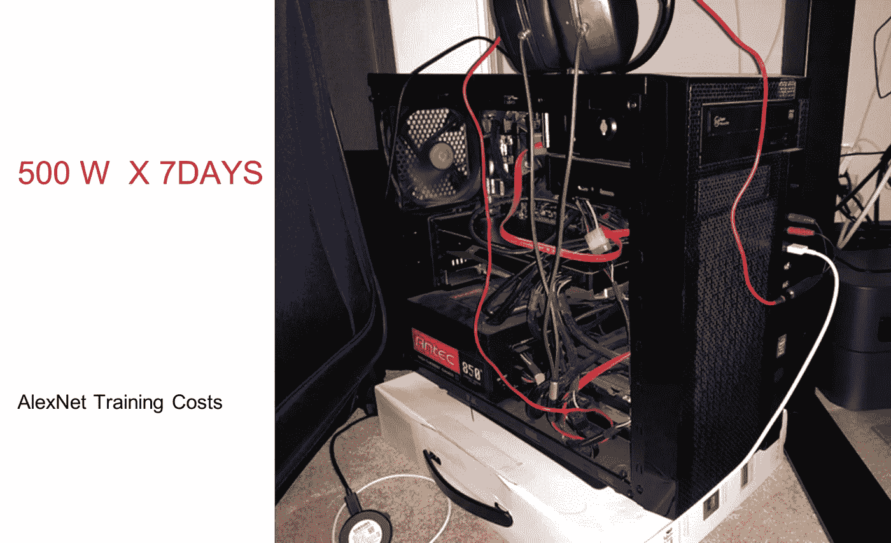

在当今时代，企业需要快速开发广告推荐和其他模型，一周的模型迭代周期太长了。因此，越来越多的人对使用大规模集群或芯片为 AI 系统提供更高的计算能力感兴趣。根据麻省理工学院在 2014 年进行的一项比较，一个人可以在一分钟内处理大约 77 幅图像，而一个 GPU 可以在同一时期处理 230 幅图像。虽然单个 GPU 的处理速度并不比人类快多少，但是我们可以通过 GPU 集群实现更大规模更快的计算。如下图所示，512 个 GPU 集群一分钟可以处理 60 万张图像。

在设计一个 AI 系统的时候，你需要重点考虑如何实现高性能存储，实现机器之间的快速通信，维护分布式集群的稳定性。目前，阿里云有一个内部 Eflops 平台，可以在三分钟内实现 10 次⁸计算，每分钟耗电 128 千瓦。这样的制度在 2015 年之前是不可想象的。我们能够实现这样的能力，主要得益于大规模集群和系统底层芯片的可扩展性。

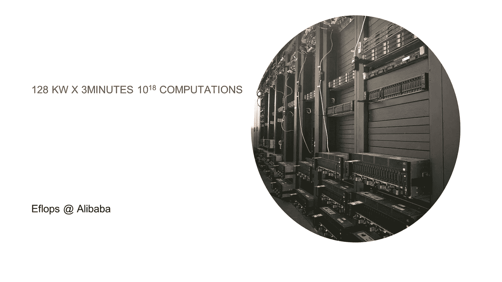

目前，全球很多企业，尤其是中国的企业都在研发更高性能的芯片，阿里巴巴也不例外。2019 年，阿里巴巴发布了全球最高性能的 AI 推理芯片——汉光 800。它在实际的城市大脑和航空大脑场景中进行了测试，达到了每秒近 800，000 张图像的峰值性能。这意味着性能比上一代产品提高了约 4000%。

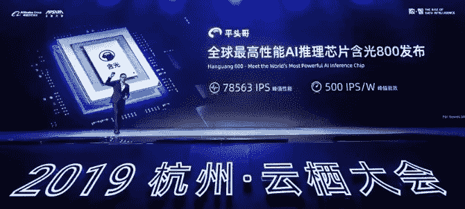

通过增加软件和硬件、资源管理、有效调度和系统范围优化的复杂性，增加的系统复杂性提出了一系列问题。这是系统开发过程中各方都必须面对的挑战。

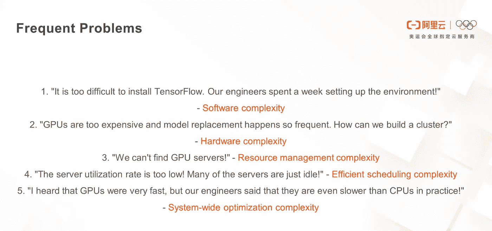

你必须注意，人工智能集群不是一个通用的集群。在 AI 训练过程中，子任务需要定期同步，不同机器之间需要高性能的通信。在大多数情况下，使用专门的基于 GPU 或基于 NPU 的组件。不同的计算模型和交互模式目前对人工智能训练构成了重大挑战。

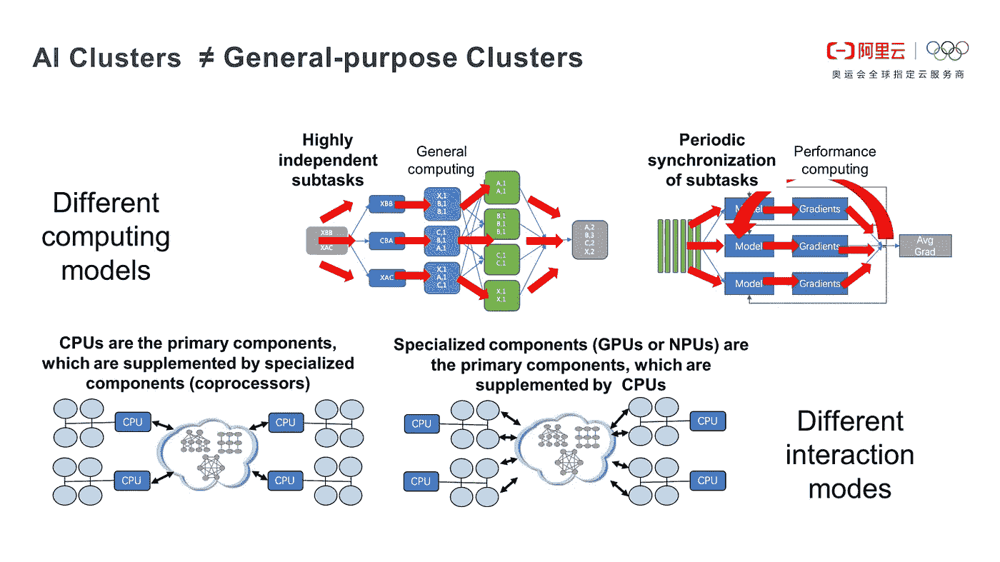

AI 被用于阿里巴巴的各种业务场景。因此，我们可以使用实际的 AI 应用程序来优化平台设计。一些例子包括淘宝移动拥有数百万个类别的 Pailitao(快照和搜索)分类模型，淘宝的语音+ NLP 解决方案，以及阿里妈妈的广告推荐系统。

优化后的 Apsara AI 平台分为三层，底层是底层基础设施，中间是训练和推理框架，最上面是开发平台。人工智能平台有三种重要类型:

*   **轻量级 AI 开发平台:**这些平台帮助算法和数据科学家进行一键式开发、调试和部署。
*   **AI 与大数据协同开发平台:**这些平台帮助用户快速开发面向大数据的业务系统。
*   **AI 推理服务平台:**这些平台解决计算资源问题，并提供推理所需的模型训练、部署和性能监控。

这三类平台支持算法 API 的输出以及垂直领域平台和大脑解决方案的开发。

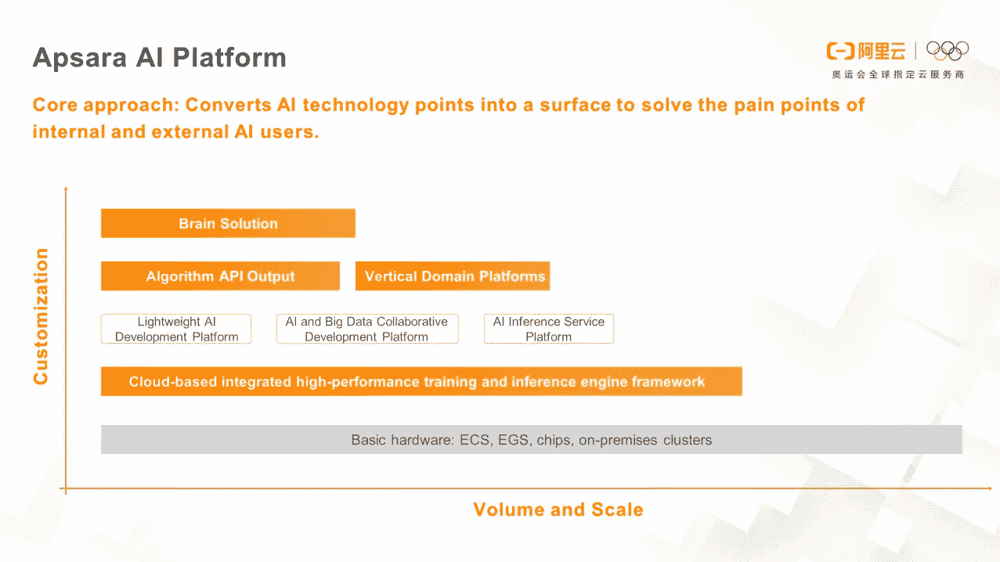

在深度学习领域，斯坦福大学推出了一个名为 DAWNBench 的基准。相比之前最好的性能，阿里云的机器学习解决方案在性能上提升了 10%左右。

如今，人工智能技术能力在提高资产利用率和满足不同场景的需求方面发挥着重要作用。全面的人工智能技术能力主要依赖于以下基础设施和服务:

*   **基础硬件:**这提供一般的计算能力和 AI 计算能力。它还通过基础架构即服务(IaaS)提供云功能。
*   **AI 云服务:**这个底层的平台即服务(PaaS)层，通过易于接入的软硬件环境，提供适合绝大多数用户的计算能力。
*   **高性能计算**:这加速了核心人工智能计算引擎。
*   **AI 系统框架:**这提供了 AI 计算模型和跨架构建模、迭代和部署的完整抽象。
*   **AI 托管平台:**这为算法 R & D 提高了共享部署和输出的效率，也提供了一个用户粘性高的开发平台。

# 智能计算和数据计算

AI 是为了智能计算，大数据是为了数据计算。这两种能力相辅相成。

## 人工智能的数据支持

前面提到的算法和计算能力需要大数据量的支持。数据是算法和计算能力价值的重要体现。

下面两张图片分别展示了 2005 年和 2013 年的教皇听众。随着移动互联网的发展，数据呈指数级增长，更大的可用数据量提高了深度学习的性能。

1998 年小 MNIST 系统的训练数据只有 10 MB，2009 年 ImageNet 的训练数据是 200 GB，2017 年 WebVision 有 3 TB 的数据集，一个典型产品的视觉系统需要 1 PB 的数据。海量的数据量帮助阿里巴巴几乎线性地提升了业绩。

让我们看一个我们都熟悉的常见场景，来说明更大的数据量如何提高性能。在 X 射线医学诊断领域，研究表明医生根据 X 射线图像诊断疾病的能力与他们观看的 X 射线图像的数量直接相关。他们检查的图像越多，诊断的准确性就越高。同样，当前的医疗引擎系统可以通过大规模计算机系统对更多数据进行训练，以实现更准确的医疗诊断。

## 人工智能让大数据更加智能

下图显示了大数据领域的趋势。目前大数据领域想提取更多的信息，实现实时计算，AI 平台，进行在线预测。所有这些趋势都表明了大数据的日益智能化。

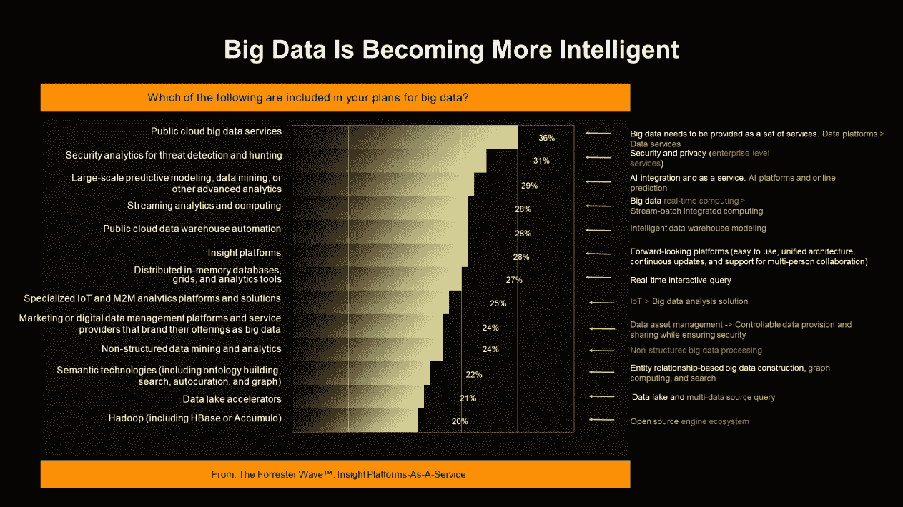

目前，不同类型的数据，包括结构化的、半结构化的和非结构化的，都是从多个数据源获得并存储在数据仓库中的。为了利用这些数据的潜在价值，需要智能计算。在广告推荐场景中，数据来源是用户在淘宝上的点击量、浏览量和购买量。数据通过离线或实时同步和离线或实时提取-转换-加载(ETL)写入数据仓库。然后，基于数据仓库或数据湖解决方案生成和训练各种数据模型。最后通过数据服务输出训练结果。如你所见，数据理解和使用的过程变得越来越智能。

几年前，混合事务/分析处理(HTAP)包括 OLTP 和 OLAP。OLAP 可以进一步分为大数据、离线和实时分析。不同的引擎适用于不同数据量的情况。目前，数据服务已经变得越来越重要。在一些智能客服场景中，实时 AI 推理服务和应用需要数据提取模型。因此，找到一种将分析和服务结合起来的方法至关重要。这就是我们目前追求混合服务和分析处理(HSAP)的原因。结合人工智能，我们可以通过离线和实时数据仓库从数据中提取见解，并通过在线服务向用户提供这些见解。

阿里巴巴在我们自己的应用中开发了人工智能驱动的大数据方法和解决方案。双 11 购物节中的离线计算(批处理)、实时计算(流计算)、交互分析、图计算场景与 Apsara AI 平台相结合，提供 AI 赋能的新一代 Apsara 大数据产品。

与 AI 类似，大数据侧重于性能。2019 年，根据 TPC 基准测试，阿里云的大数据平台 MaxCompute 和 E-MapReduce 在计算性能和成本效益方面表现出显著优势。下图显示了基准测试的结果。

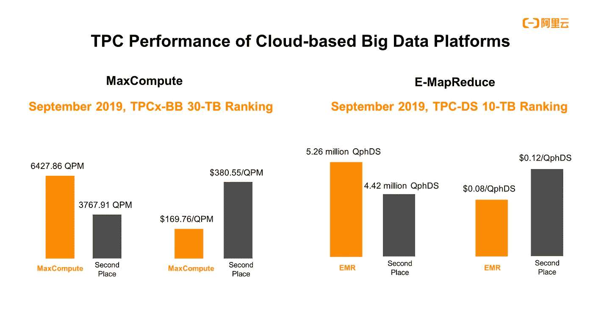

阿里巴巴的 AlimeBot 目前通过应用基于人工智能的深度学习和智能感知技术，在客户服务场景中为用户提供智能语音交互服务。要实现智能性能，它必须与大数据业务系统紧密相连，如物流或用户数据系统。

这就引出了我们的下一个问题:企业应该如何拥抱人工智能？简单来说，要让 AI 成为现实，就要从应用需求出发，逐步追求技术创新，就像爱迪生如何改进电灯泡一样。云提供了低成本、高性能和高稳定性的基础设施，但对我们来说，关键是要清楚地定义我们的需求。

在过去的几年里，人工智能领域一直在进行算法创新和演示，但这远远不够。

AI 算法只是系统的一部分。在实施 AI 时，企业还必须考虑如何收集数据，获取有用的特征，以及执行验证、流程管理和资源管理。

AI 不是万能的，但也是不可忽视的。企业拥抱 AI，首先要从自己的商业考虑出发。随着数据量和算法数量的增加，建立了解业务的数据工程师和算法工程师团队至关重要。这是智能企业成功的关键。我们提到的所有算法、计算能力和数据解决方案，都可以通过使用云中目前可用的服务和解决方案来实现。可以帮助企业更快的实现 AI。

*在* [*我们的科技展系列*](https://resource.alibabacloud.com/webinar/topic/tech-show.html) 上，从阿里巴巴的顶级资深专家那里了解我们的核心技术和最新产品更新

# 原始来源:

 [## 人工智能的主要发展及其驱动力

### 阿里巴巴云 2020 年 6 月 10 日 1，033 阿里巴巴集团副总裁、阿里巴巴计算平台事业部总裁贾

www.alibabacloud.com](https://www.alibabacloud.com/blog/the-major-developments-in-ai-and-whats-powering-them_596275) 

**访问专家视图—** [**订阅 DDI 英特尔**](https://datadriveninvestor.com/ddi-intel)