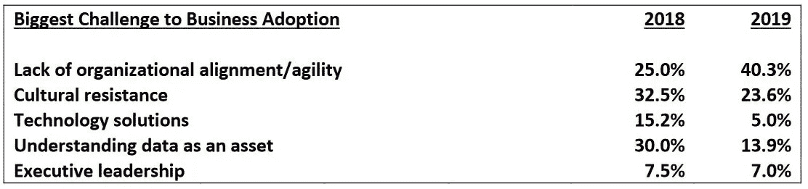

# 大多数商业分析和人工智能项目仍然失败

> 原文：<https://medium.datadriveninvestor.com/the-majority-of-business-analytics-and-ai-projects-are-still-failing-c8b2a3370c7e?source=collection_archive---------4----------------------->

## 新技术如何避免同样的老问题

Photo by [jean wimmerlin](https://unsplash.com/@jwimmerli?utm_source=unsplash&utm_medium=referral&utm_content=creditCopyText) on [Unsplash](https://unsplash.com/photos/eB6D0Wks7jA)

数据是新的黄金(或新的石油——由你选择)。

数据驱动的公司统治世界。

[数据科学](https://www.datadriveninvestor.com/glossary/data-science/)是游戏规则的改变者。

[AI](https://www.datadriveninvestor.com/glossary/artificial-intelligence/) 正在塑造未来。

不乏朗朗上口的口号。数据分析很性感。数据湖是新的炒作。数据科学是新的科学。我们听到很多关于[领先公司加快大数据和人工智能投资步伐的消息](https://newvantage.com/wp-content/uploads/2018/12/Big-Data-Executive-Survey-2019-Findings.pdf)。

现在让我们暂时把所有的宣传放在一边，看看现实。随着过去几年的巨额投资，这些大公司在成功实施方面做得如何？

让我带你回到 Gartner 的 2019 年顶级数据和分析预测，作者是[安德魯·怀特](https://blogs.gartner.com/andrew_white)。想想 2019 年 1 月做出的这些预测:

> …到 2022 年，90%的企业战略将明确提到信息是关键的企业资产，分析是一项基本能力
> 
> …到 2020 年，80%的人工智能项目将仍然是炼金术，由巫师运行，他们的才能不会在组织中扩展。
> 
> …到 2022 年，只有 20%的分析洞察能够带来业务成果。

大多数企业对数据驱动的渴望是显而易见的。

但是他们的能力如何呢？为什么我们要谈论“炼金术？”这难道不是科学的对立面吗？

所有的钱都投入到数据分析计划中，为什么 Gartner 专家预测只有 20%的成功率？

现在，让我们用来自 [NewVantage Partners](https://newvantage.com/) 、[大数据和人工智能高管调查 2019](https://newvantage.com/wp-content/uploads/2018/12/Big-Data-Executive-Survey-2019-Findings.pdf) 的一份报告来进行一次现实检查这项由首席数据官和各大公司高管完成的调查证实了从大数据和人工智能解决方案中获取价值的强烈愿望:

> ……对[大数据](https://www.datadriveninvestor.com/glossary/big-data/)和人工智能的投资步伐正在加快——91.6%的人确认了这一步伐的加快。
> 
> …高管们表示投资大数据和人工智能计划的紧迫性增加了，87.8%的人确认了这一紧迫性。
> 
> …高管们强调，他们的动机是害怕破坏性力量和竞争对手，75%的高管承认有这种担心。

尽管形势紧迫，但现实却截然不同。

“令人大开眼界的 **77.1%的高管报告称，企业采用大数据/人工智能计划仍然是他们的组织面临的挑战**——比 2018 年有所增加，”同一份[报告](https://newvantage.com/wp-content/uploads/2018/12/Big-Data-Executive-Survey-2019-Findings.pdf)称。随着报告聚焦于业务采用挑战，它进一步阐述了这些公司在业务转型方面的排名:

> 71.7%的公司报告称，他们尚未打造数据文化
> 
> 69.0%的公司报告称，他们没有创建数据驱动的文化
> 
> 53.1%的公司表示他们尚未将数据视为商业资产
> 
> 52.4%的公司声称他们没有在数据和分析上竞争。

AI 行业领导者的另一个事件， [Transform 2019](https://venturebeat.com/2019/07/05/transform-2019-lifting-the-hood-on-the-ai-tech-you-need-to-know-about/) ，声称 [**87%的数据科学项目从未投入生产**](https://venturebeat.com/2019/07/19/why-do-87-of-data-science-projects-never-make-it-into-production/) **。**

现在，是时候回答这个(字面上的)百万美元问题了。为什么？有哪些壁垒？这些举措到底在哪里失败了？是什么阻碍了数据驱动的决策？

NewVantage 报告中的总结很直白:

> **文化挑战仍然是业务采用的最大障碍…高管们列举了多种因素(组织一致性、敏捷性、阻力)，其中 95.0%源自文化挑战(人员和流程)，只有 5.0%与技术有关。如果企业希望转型，它们必须开始** [**解决**](https://www.datadriveninvestor.com/glossary/address/) **的文化障碍。**

[NewVantage report](https://newvantage.com/wp-content/uploads/2018/12/Big-Data-Executive-Survey-2019-Findings.pdf)

随着对分析和大数据实施带来的改变游戏规则的结果的巨大期望，关于成功因素(或缺乏成功因素)的讨论越来越激烈。

当我重新阅读和分析来自行业领袖和智库的报告、文章和研究时，我开始看到一个熟悉的模式。

***分析和大数据项目的大多数成功因素和失败原因与影响任何其他业务或数字化转型的因素相同* : *人类、人类行为和偏见。***

尽管存在各种宣传、难以理解的技术以及乏味的统计学家转变为性感的数据科学家的不可思议的崛起，大数据项目仍然是由人类发起和运营的。人类在可预见的方面也会犯错。

 [## 将定义 2020 年就业前景的五大数据科学和机器学习趋势|数据驱动…

### 数据科学和 ML 是 2019 年最受关注的趋势之一，毫无疑问，它们将继续发展…

www.datadriveninvestor.com](https://www.datadriveninvestor.com/2020/02/19/five-data-science-and-machine-learning-trends-that-will-define-job-prospects-in-2020/) 

我们已经学会了识别组织因素对软件开发项目的影响。我坚定地站在人的因素阵营，并在我的[书](https://www.amazon.com/dp/199912202X)中强调了[思维](https://medium.com/@yulia.kosarenko/how-to-do-your-best-with-a-business-analyst-mindset-844fae4535d8)对商业分析成功的重要性。

无论技术是旧的还是尖端的，问题都是一样的。让我们快速回顾一下——这些观点中有许多是我们非常熟悉的。

## **没有解决正确的问题**

每一项投资都必须解决一个业务问题，并与战略保持一致。

因为每个人都在做而建立一个数据湖并不是一个足够好的理由。“每个人都在做”并不是构建数据湖的足够好的理由。从长远来看，在高尔夫球场上用人工智能来打动公司伙伴不会给任何人留下深刻印象。

当然，您可以让您的开发人员和数据科学家在沙盒中玩数据游戏，以学习和获得专业知识。但是如果他们继续想出伟大的解决方案，却不能解决重要的商业问题，那么就有问题了。

数据专家需要向业务涉众询问需要解决的问题。

数据科学家可以提出潜在的解决方案，但问题陈述和企业知识必须来自业务。

> “无论团队多么优秀，方法多么有效，如果我们没有解决正确的问题，项目就会失败。”—伍迪·威廉姆斯

向业务分析师了解[提出正确问题的重要性](https://why-change.com/2019/07/04/business-analyst-mindset-principle-3-question-everything/)。

问正确的分析问题也同样重要。

## 仓促、不明确或不存在的业务需求

业务需求经常被认为是项目成功(或失败)的主要因素。

根据 [Standish Group](https://www.standishgroup.com/) 著名的混乱报告，可归因于需求的项目失败因素(缺乏用户输入、不完整或变化的需求、不明确的目标)[加起来在 40–50%之间](https://www.projectsmart.co.uk/white-papers/chaos-report.pdf)。

这对于分析和大数据来说没有什么不同。当项目以“让我们建造它，他们就会来”的理念进行时，结果往往是一个没有客户的产品。

每个项目都必须从业务需求、业务问题和用例开始。

分析将用于什么？

使用预测将做出什么决定？

需要衡量什么，衡量它的业务规则是什么？

> 如果没有提出正确的问题，分析项目将成为沉没成本。

## 项目太大

数据湖正成为公司转储所有数据的地方。即使是原始的、未经处理的数据，一个大公司的数据湖也可能需要数年才能建立起来。这可能相当于多年无任何回报的沉没投资。

正如混沌报告提醒我们的，项目越大，成功的几率越低。在 [2015 年的报告](https://www.standishgroup.com/sample_research_files/CHAOSReport2015-Final.pdf)中，研究人员发现最大的群体(“盛大”)中只有 2%的项目取得了成功。

通过使用迭代开发和从小处着手，我们可以大大增加成功的机会。根据同一份混沌报告，“敏捷项目的成功率几乎是瀑布项目的四倍。”

商业分析和[机器学习](https://www.datadriveninvestor.com/glossary/machine-learning/)计划，由于其复杂性和经常缺乏合格的资源，甚至更容易被自己的[重量](https://www.datadriveninvestor.com/glossary/weight/)埋没。

从小处着手，解决一些实际的业务问题，并在扩大规模之前从中学习，这是涉足数据湖最明智的策略。

> “当一个人工智能项目成功时，它往往是建立在许多失败的数据科学实验之上的。”——圣地亚哥·吉拉尔多， [Cloudera](https://www.cloudera.com/) ，引自[福布斯](https://www.forbes.com/sites/tomtaulli/2020/04/11/ai-artificial-intelligence-projects-where-to-start/#5dd294a11c11) *。*

我们在讨论规模的同时，不要忘记没有小数据就没有大数据。对于许多商业问题，使用小数据就足够了，而且更容易管理。

## 商业利益相关者还没有准备好

69%的 NewVantage 调查受访者表示，他们的公司没有建立数据驱动的文化。这告诉我们，他们的业务利益相关者还没有准备好将数据分析整合到业务流程和决策中。

准备就绪意味着什么？

它从[数据素养](https://www.gartner.com/smarterwithgartner/a-data-and-analytics-leaders-guide-to-data-literacy/)开始，需要业务所有权和对[数据治理](http://dama-phoenix.org/wp-content/uploads/2016/06/Enterprise-Data-Governance-in-EDM-summary.pdf)的积极参与，并且需要在分析和大数据解决方案方面建立一定程度的信任。

对信任的需求是从小处着手的另一个原因。逐步学习和建立成功将有助于企业利益相关者获得信任和一定程度的安慰。

如果您从您的企业面临的最复杂的问题开始，那么您面临的不仅是投资风险，还有数据驱动计划的声誉风险。如果雄心勃勃的大数据事业失败，利益相关者的不信任，加上资源浪费，将成为未来分析项目的障碍。

## 企业孤岛和缺乏跨部门协作

如果您已经读到这里，我不必让您相信这些问题会损害一个企业试图完成的任何事情。

业务分析师每天都在与这个问题做斗争。他们非常清楚筒仓、不同的议程和缺乏协作是如何影响分析过程和需求的(这将使我们回到原因 2)。

他们也知道利益相关者的抵制如何阻碍项目的进展，通常是由于害怕被系统取代。当经理们对人工智能以及人类监控、训练和改进人工智能模型的需求不够了解时，这种担心只会加剧。

> “人工智能不会取代经理，但使用人工智能的经理会取代不使用人工智能的经理。”——Deborah Leff，IBM 数据科学和人工智能首席技术官， [VentureBeat](https://venturebeat.com/2019/07/19/why-do-87-of-data-science-projects-never-make-it-into-production/) 引用

## 优化错误的流程

在我做业务分析师的日子里，我看到了我应该“自动化当前过程”的项目的公平份额如果一个业务分析师[不质疑当前的过程](https://why-change.com/2019/07/19/business-analyst-mindset-principle-7-simplify-until-nothing-can-be-removed/)，那么这个项目就冒着将一个旧的、次优的和过度膨胀的过程粘合到新的应用程序中的风险。

在自动化之前，需要捕获、审查和分析每个流程的效率。在将任何[预测分析](https://www.datadriveninvestor.com/glossary/predictive-analytics/)和决策建议引入业务流程之前，我们必须应用相同的理念。

## 培训和变革管理不足

文化阻力会阻碍任何变革。没有用户的采纳，解决方案在有机会证明其价值之前就失败了。没有持续的智慧沟通、培训和内部营销，再好的解决方案也可能注定失败。

正如我们在上面的数字中看到的，超过 23%的分析挑战归因于文化阻力。

由于高级分析和预测建模的复杂性，不信任或误解解决方案的风险也很高。预测模型的可解释性起着很大的作用。组织中数据素养的总体水平将决定需要付出多少努力来促进用户采用。

这份原因清单并不详尽。还有一些特定于机器学习和人工智能技术的其他因素在起作用，从数据质量和合格人才的可用性到机器学习算法中引入偏见的风险。

然而，如果我们能够消除这些障碍，并学会抛开我们的人类偏见，那么，也许其他挑战就不会那么令人生畏了。

> 都是人的问题。关于我们。

Yulia Kosarenko 是一名顾问、作家和导师。她写了关于商业分析师思维模式、架构、变化、建模、沟通和企业文化的文章。她出版了《商业分析师:一种职业和心态》一书**，并与多伦多亨伯学院合作开发一个新的商业分析项目。你总能在*[*why-change.com*](https://why-change.com)*找到她。**

**原载于 2020 年 4 月 30 日 https://www.datadriveninvestor.com***。***