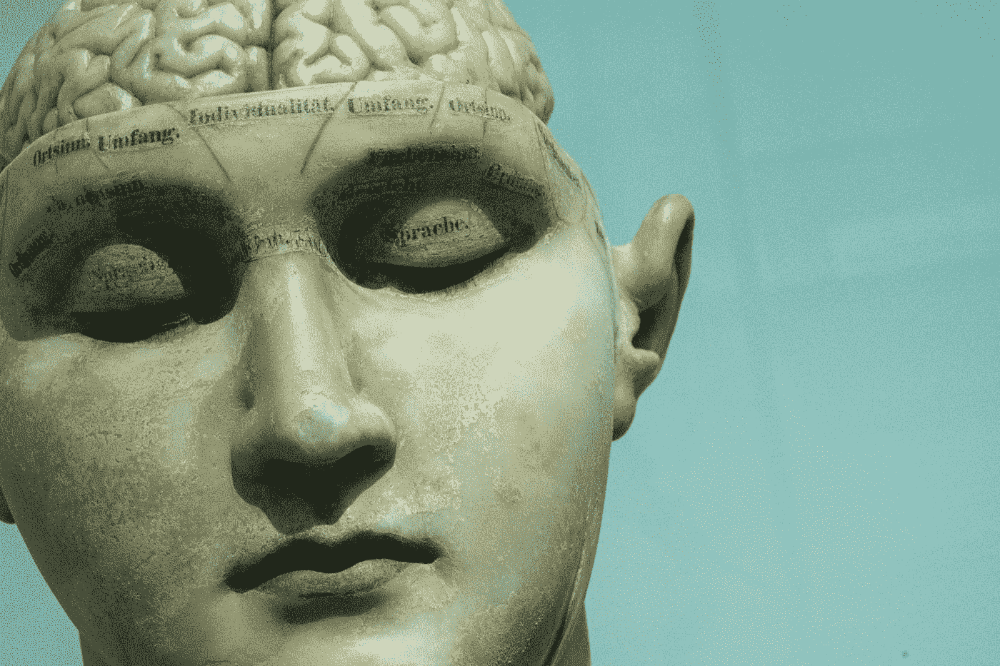
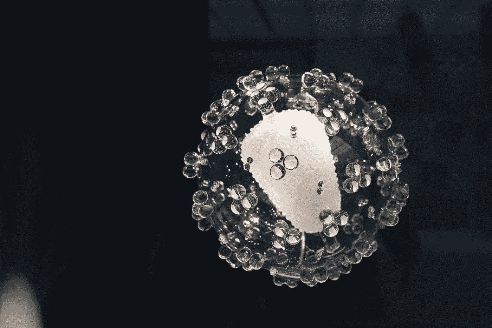

# 那个培育活体电极来制造最终大脑植入物的人

> 原文：<https://medium.datadriveninvestor.com/the-man-who-does-grow-live-electrodes-to-create-the-ultimate-brain-implant-464a9086c107?source=collection_archive---------22----------------------->

## 有没有可能制造一个完全生物化的活体电极来创造一个脑机接口？

Photo by [David Matos](https://unsplash.com/@davidmatos?utm_source=medium&utm_medium=referral) on [Unsplash](https://unsplash.com?utm_source=medium&utm_medium=referral)

想一想，博士生生长的神经元有很长的轴突和一根头发的厚度；博士后研究员一个接一个地把它们放入可生物降解的聚合物试管中；大学教授打开几十只老鼠的大脑，在活体中测试这种活体电极；而且，最重要的是， [*凯西卡伦*](https://www.med.upenn.edu/apps/faculty/index.php/g275/p8147231) 监督着这场戏。

宾夕法尼亚大学医学院神经外科教授凯西·卡伦(Kacy Cullen)多年来一直痴迷于将自 20 世纪 80 年代以来用于深度大脑刺激的所有金属设备送进历史的阁楼。这并不容易，甚至差得远，但卡伦的团队正在做的事情至少值得仔细看看。

# **寻找 100%生物界面**

Photo by [camilo jimenez](https://unsplash.com/@coolmilo?utm_source=medium&utm_medium=referral) on [Unsplash](https://unsplash.com?utm_source=medium&utm_medium=referral)

所有这些公司的问题， ***Neuralink*** 包括在内，就是一个叫'**现实'**的东西。技术，即使有像马斯克的‘缝纫机’这样有创意的解决方案，也还远远不能‘将我们的大脑与人工智能融合’。

更重要的是，通过降低标准，它甚至无法记录大脑的所有活动。

 [## 幸福的算法？数据驱动的投资者

### 从一开始，我们就认为技术正在使我们的生活变得更好、更快、更容易和更实用。社交媒体…

www.datadriveninvestor.com](https://www.datadriveninvestor.com/2019/03/08/an-algorithm-for-happiness/) 

很大程度上，原因恰恰是卡伦公开宣称的敌人:当整合到大脑中时，**损害它**，改变它或者**最终产生排斥**。

即使是经过几十年的研究最终被证明是可以接受的柔性电极，在功能上也有问题，还有许多需要改进的地方。

# 解决方案

Photo by [Zoltan Tasi](https://unsplash.com/@zoltantasi?utm_source=medium&utm_medium=referral) on [Unsplash](https://unsplash.com?utm_source=medium&utm_medium=referral)

至少在纸上的解决方案[是创造出“**活电极”**。](https://www.biorxiv.org/content/10.1101/333526v1)

也就是说，从诱导的干细胞中培养出来的神经链，通过不同的方法——最著名的是仍在实验中的**——*设法绘制大脑的功能，并成为非常非常深度的刺激工具。*

*卡伦已经对近百只老鼠进行了测试，他的初步数据证实，带电电极**在结构和功能上保持活性**超过一个半月。*

*他还认为他的技术可以在四五年内用于人体测试。*

*这种生物界面的想法是最有潜力成为仍然遥远的**人机集成**中的标准的发展。*

*会发生什么？他会像他声称的那样实现目标吗？我们不能确定这一点，但尝试是对科学的充分尊重。*

***你对此有什么看法？我希望你喜欢它，如果是的话，你会分享它。**😉*