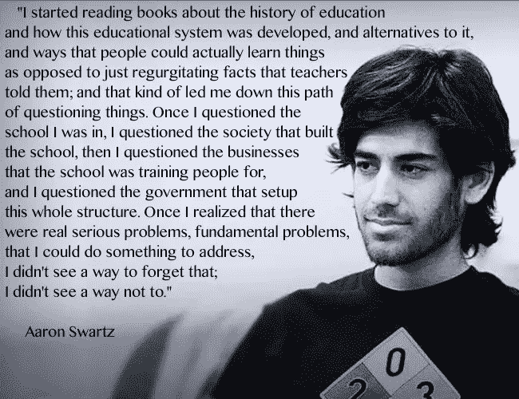
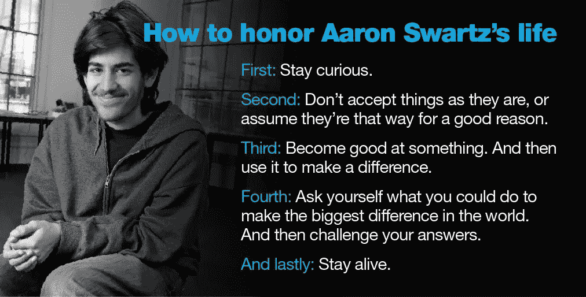

# 为“自由开放的互联网”而战的人

> 原文：<https://medium.datadriveninvestor.com/the-man-who-fought-for-free-and-open-internet-c2af9ac4b08c?source=collection_archive---------3----------------------->

阿伦·斯沃茨:*“有足够多的人，在世界各地，我们将不仅仅发出反对知识私有化的强烈信息——我们将使它成为过去。你会加入我们吗？”*

Aaron Swartz

一个黑客，程序员，天才和互联网活动家，他一生致力于自由和开放的互联网。

我最近读了他的 [**游击队开放访问宣言**](https://archive.org/details/GuerillaOpenAccessManifesto) **。**

26 岁时，艾伦·施瓦茨已经成为连接技术和行动主义世界的独特力量。

一个年轻人被无尽的好奇心和信念所驱使，他相信信息是最有价值的货币，是一种任何人都不应被剥夺的财富。作为一名青少年编程天才，他帮助开发了 RSS，这是一种现在无处不在的工具，允许用户在网上自我整合信息，19 岁时，他是社交新闻网站 Reddit 的创始人之一，该网站被康泰纳仕收购，在他可以合法订购啤酒之前，他就成为了百万富翁。2010 年，23 岁的他联合创立了一个名为 [Demand Progress](http://www.demandprogress.org/) 的在线倡导组织，该组织成功地发起了反对互联网审查法案的运动，吸引了 100 多万名成员。24 岁时，斯沃茨成为哈佛大学的研究员，从事政治腐败方面的研究。

 [## Stack Overflow 分析了来自 60，000 多名软件开发人员的数据，包括他们的工作时间、语言…

### 以下是他们的发现…

medium.com](https://medium.com/datadriveninvestor/stack-overflow-analyzed-data-from-60-000-software-developers-hours-they-work-languages-they-476ac6ca0197) 

在采访中，艾伦·施瓦茨描述他的童年是孤独的，他的郊区是一个没有中心的地方。在他早期的一篇博客文章中，斯沃茨不无仁慈地将高地公园描述为父母受教育和善意的地方之一，并同情地看待 60 年代的正义斗争，尽管他们自己没有参与。

 [## 编码原罪:令人捧腹的开发者自白

### “白板”是如何被嘲笑的

medium.com](https://medium.com/datadriveninvestor/coding-sins-hilarious-developer-confessions-f55eb342454e)  [## Python 迭代器、生成器和装饰器变得简单

### 快速实施指南

medium.com](https://medium.com/python-in-plain-english/python-iterators-generators-and-decorators-made-easy-659cae26054f)  [## 你应该知道的 23 种数据科学技术！

### 使用这些技巧来节省你的宝贵时间

medium.com](https://medium.com/ai-in-plain-english/23-data-science-techniques-you-should-know-61bc2c9d1b3a) 

当他试图从一个学术网站“解放”数据时，美国当局做出了激烈的回应。他面临高达 100 万美元的罚款和 35 年监禁。然后他结束了自己的生命。

***安息吧艾伦·施瓦茨。你每天都激励着我们！***

# 想看程序员幽默？

 [## 编程幽默第 2 部分

### 继续笑，因为太搞笑了…

medium.com](https://medium.com/datadriveninvestor/programming-humor-part-2-f92cf5a26f2b)  [## 史上最搞笑的代码注释

### 程序员幽默:是的，实际上是程序员写的！

medium.com](https://medium.com/datadriveninvestor/the-most-hilarious-code-comments-ever-bae3cb1030b5)  [## 编码原罪:令人捧腹的开发者自白

### “白板”是如何被嘲笑的

medium.com](https://medium.com/datadriveninvestor/coding-sins-hilarious-developer-confessions-f55eb342454e)  [## 10 个让你着迷的诙谐编程笑话

### 这些太搞笑了…

medium.com](https://medium.com/datadriveninvestor/10-witty-programming-jokes-that-will-make-you-go-rofl-a53fbfb91943) 

# 推荐文章-

 [## Python 迭代器、生成器和装饰器变得简单

### 快速实施指南

medium.com](https://medium.com/python-in-plain-english/python-iterators-generators-and-decorators-made-easy-659cae26054f)  [## 你应该知道的 23 种数据科学技术！

### 使用这些技巧来节省你的宝贵时间

medium.com](https://medium.com/ai-in-plain-english/23-data-science-techniques-you-should-know-61bc2c9d1b3a)  [## 编码原罪:令人捧腹的开发者自白

### “白板”是如何被嘲笑的

medium.com](https://medium.com/datadriveninvestor/coding-sins-hilarious-developer-confessions-f55eb342454e)  [## 面向数据科学家的 5 项酷炫先进熊猫技术

### 使用这些技巧…

medium.com](https://medium.com/datadriveninvestor/5-cool-advanced-pandas-techniques-for-data-scientists-c5a59ae0625d)  [## Stack Overflow 分析了来自 60，000 多名软件开发人员的数据，包括他们的工作时间、语言…

### 以下是他们的发现…

medium.com](https://medium.com/datadriveninvestor/stack-overflow-analyzed-data-from-60-000-software-developers-hours-they-work-languages-they-476ac6ca0197)  [## 高级 Python 变得简单—第 4 部分

### 使用这些技巧和技术…

medium.com](https://medium.com/datadriveninvestor/advanced-python-made-easy-part-4-a4996ba9fe19)  [## 高级 Python 变得简单—第 1 部分

### 使用这些技巧和技术…

medium.com](https://medium.com/datadriveninvestor/advanced-python-made-easy-part-1-ce1e2f17431e)