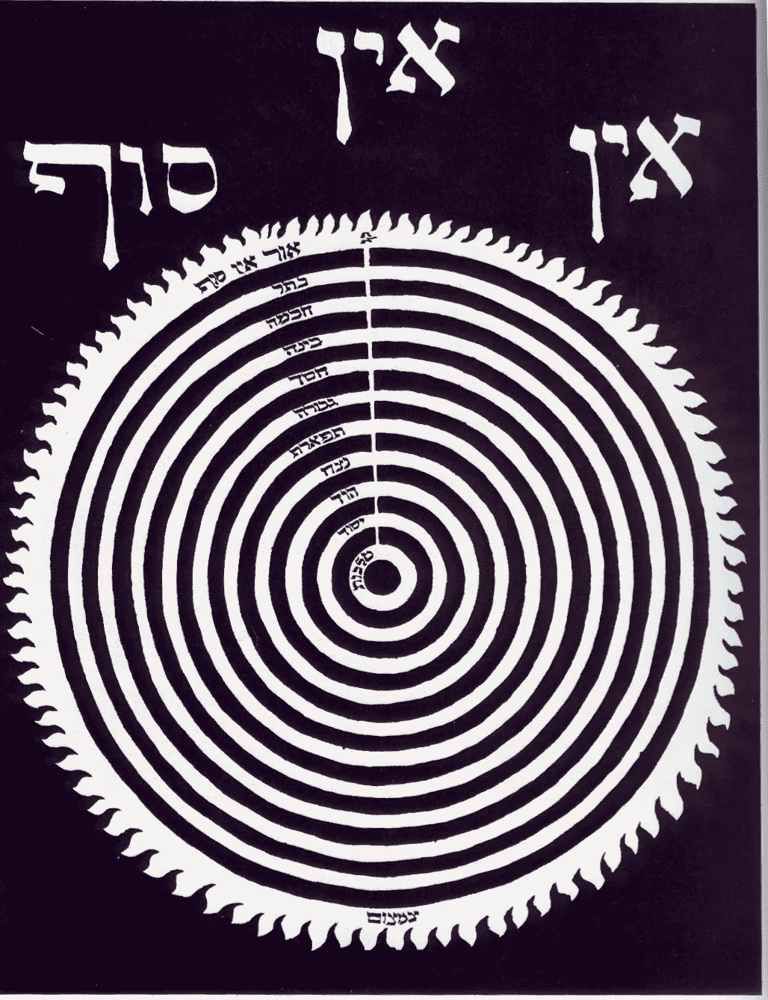

# 本体设计宣言

> 原文：<https://medium.datadriveninvestor.com/the-manifesto-of-ontological-design-7fdb19169107?source=collection_archive---------0----------------------->

本体设计是关于设计人类体验的设计学科。它这样做是基于一个基本假设:通过设计物品、空间、工具和体验，我们实际上是在设计人类本身。设计人类的能力将是在未来几十年的技术变革中生存的核心，即使只是一种代理的表象。

 [## 认知计算——一套被广泛认为是……

### 作为它的用户，我们已经习惯了科技。这些天几乎没有什么是司空见惯的…

www.datadriveninvestor.com](https://www.datadriveninvestor.com/2020/02/19/cognitive-computing-a-skill-set-widely-considered-to-be-the-most-vital-manifestation-of-artificial-intelligence/) 

## 反馈回路

本体论设计的关键假设是:当我们创造我们周围的物体和环境时，我们实际上是在设计我们自己。换句话说:首先，我们设计我们的工具，然后他们反过来设计我们。

这个反馈循环是本体设计作为一门学科的中心思想。这是它的主要工作原则。下面是它是如何展开的:

## 修复学理论

从某种意义上说，我们周围的所有物体都有这种效果:它们设计了我们。任何椅子都具有区分不同坐姿的特性。椅子否定了身体在空间中存在的某些可能性，而让其他人——其中最主要的是坐下来。

穿衣服也是这样。它增强了我们保持稳定体温和面对多变天气挑战的能力。实际上，衣服是我们皮肤和体温维持的修复术。

因此，我们可以说，每当一件衣服或一把椅子被创造出来，它们就构成了本体设计的行动。我们甚至可以说，所有的设计都是本体论的，因为所有的设计都是为了对存在本身产生影响——设计就是为了存在。但是对于这本书，我将关注本体设计的一些更具体的可能性——设计人类感知的可能性。为了探索这个问题，我们必须首先重新评估一些普遍持有的假设。

## 人类的身体没有极限

严格来说，人体没有极限。在时空中没有一个可定义的时刻，我们可以明确地说我们的身体结束了，我们的环境开始了。

罗伯特·佩佩尔在他的*后人类宣言中说了这么多。*他说*、*、*“意识(心灵)和环境(现实)不可分离；它们是连续的。在环境、身体和大脑之间无法划分出有限的界限。人是可识别的，但不是可定义的”。*

在后人类的术语中，“人”是一组功能、过程和流程，而不是一个定义明确、静态和离散的范畴。人的身体、人的思想和人的工具之间有一种连续性，所有这些构成了这里定义为后人类的扩展实体。

本体设计的*主体*恰恰是后人类。这就是从业者寻求设计的“实体”。

为了本体论设计的目的，解构自由主义的、人文主义的、启蒙时代的假设是有用的，这种假设认为存在着“人类个体”这种东西，它由“身体”、“心灵”组成，并且生活在“环境”中。这种假设占据主导地位有多种原因，其中许多都与维持过去几百年现代社会的本体论基础有关。

然而，*“如果我们接受心灵和身体不能绝对分离，身体和环境不能绝对分离，那么我们就剩下一个明显荒谬但逻辑一致的结论，即意识和环境不能绝对分离。”*

通过设计我们的环境，我们在设计意识。通过管理感知，我们正在设计现实。通过设计物品，我们也在设计人。这是本体论设计的运转引擎。

这正是我们正在设计的:扩展的人类意识的连续实体。它是通过设计它的环境、它的身体、它的对象、欲望、思想和工具来设计的。

我们为“人类”设计的观念在数字时代已经过时了；我们更像是在设计“人类成为”的过程。通过精心打造体验、构建环境和管理信息，一个人可以有效地配置本体生成技术——配置“个体”。

后人类是一个存在于反馈回路中的实体，反馈回路贯穿我们的思想、身体和空间。这些不是独立的类别；相反，它们是关系的持续强度。

## “本体论”

因此，仅仅谈论设计一把椅子或一件毛衣是不够的。当代设计界习惯性地说，我们正在设计毛衣的“体验”，或者椅子的“互动”，这也是不够的。

本体是一个复合词，来源于希腊语 *Ont* ，意为存在，而 *logia* ，意为学习。它是研究与存在、存在、成为和现实有关的问题的哲学学科。

因此，当我们谈论本体设计时，我们谈论的是定义一种系统的、创造性的方法来设计存在、存在和现实本身——通过*一把椅子、一件毛衣、邪教、技术或我们可能想到的任何其他东西。*

## 扩展的“主体”

汽车扩展了我们的移动能力，快速运送我们穿越广阔的距离。玻璃杯提高了我们摄入液体的能力。我们的鞋子增强了脚底的耐磨性，让我们能够舒适地行走数英里。哈勃望远镜和眼镜都是我们视觉神经信息处理能力的增强。

这些是通常被称为物理人体的增强和修复的例子；它们是我们感官和肌肉的延伸。然而，从后人类的角度来看，我们是一个由流程、功能和过程组成的实体，还可以通过多种方式进行扩展。那么文字呢？他们如何增强我们的力量？音乐呢？货币？意识形态？规则？语法？

## 延伸的“心智”

假体的范畴不仅限于我们身体的“物理”部分。扩展思维假说是由安迪·克拉克和大卫·查默斯在 1998 年首次提出的，认为环境中的物体是思维的一部分。以“奥托”和“因加”为例。他们同时去博物馆。奥托患有老年痴呆症，他在笔记本上写下了去博物馆的路。另一方面，Inga 依靠以前旅行的记忆来找到自己的路。

从功能的角度来看，奥托的笔记本与因加的记忆具有相同的作用——尽管一个是物理对象，另一个是精神属性。奥托的思维已经扩展到包括笔记本作为他自己记忆的来源，以及一个与他自己的思想交流的平台。

## 假肢与本体设计

当我们谈论本体设计时，我们是在谈论创造增加人类认知的装置。前面的例子假设笔记本是这些设备中的一种。然而，它们不限于物理对象。本体设计可以使用任何种类的媒介，只要它的目的是介入后人类主体。

奥托的笔记本是增强他大脑记忆能力的脚手架。在笔记本上使用地图的过程增强了他的认知，他的城市导航。

它作为他关注的工具，反过来又为他提供方向。奥托就这样与他的笔记本(以及他的衣服、眼镜、语言、迷因等等)形成了一个共生的循环。).

这个轶事是对本体论如何运作的综合阐述。这是一个原则。然而，当我们将这一原则中的假设扩展到几个例子或用例之外时，我们发现自己揭示了一些深刻的含义。

## 权力和话语

众所周知，秃顶的法国哲学家米歇尔·福柯因其对权力的观点而广为人知。福柯认为，除了其他方面，权力本身并不是一个东西，也不是一个或另一个代理人的能力。相反，他认为它存在于代理人之间的关系中。权力不仅是通过机构(如警察、学校或国家)运作的中央集权系统的财产；而且以扩散的方式通过相互作用的领域传播。它是通过实体之间的过程和关系出现的流的属性。

福柯的权力概念对理解本体论设计至关重要，因为它提供了对发生在后人类反馈回路中的过程、流动和关系的深刻见解。

对福柯来说，权力是无所不在的，不是因为它控制着所有的事物，而是因为它在所有时刻，在社会(和后人类)身体的节点之间的关系中产生。

权力也定义了真理的政体；它定义了在任何给定的情况下，什么可以说，什么不可以说。话语倾向于被惯例所支配，惯例的一致性来自于集体接受。

这种分散性做法的一个例子是，在许多社会中，每个孩子从某个年龄开始，就应该知道他们的名字、年龄、出生地、生日和父母的名字。

显而易见，这些实践是如何在本体论上生成的。它们以及构成它们的概念(年龄、名字、起源、生日)实际上是儿童认知器官的修复。它们在一个复杂的话语体系中用来定义、确定和识别儿童以及儿童是谁。它们增强了儿童体内的一系列认知能力、功能和流动——这与他们关于空间、时间、环境和世界的自我概念有关。

## 非道德性和*技巧*

我的目的不是质疑任何特定话语形式的效用的合法性，因为这已经成为主流文化中相对常见的做法。从本体设计的角度来看，相关的是话语的战术多元性，以及它们在我们设计干预中的效用。福柯说*“(……)人们不应该把话语的世界想象成被接受的话语和被排斥的话语，或者主导的话语和被主导的话语共享；而是作为多种多样的话语要素，可以在不同的策略中发挥作用”。*

在本体论设计的背景下，我们应该以一种功利主义的方式来看待话语。本体论设计(作为一种方法论)的任务不是做出伦理或道德判断，推翻压迫体系，为一个原本不公正的世界恢复正当性和正义。

为了阐明这门学科及其操作方法，像道德和正义这样的概念应该被理解为*技术上的，*他们那个时代话语中的权力机制。本体设计更多的是一种技术，而不是一个哲学或伦理的实体。它更接近于工程，而不是批判理论或社会学。是的，它存在于话语和权力流动之中:那又怎样？这不是战斗，以消除他们，回到一个虚幻的伊甸园，或非常理想化的锡安；更确切地说，这是关于从技术上面对和处理权力的问题。

此外，像“真理”、“善”和“正义”这样的观念是社会的、空间的和时间的。福柯自己说:*“真理是这个世界的东西(……)”。话语有其所属的时间和地点，我们不应被绝对化和普遍化的倾向所蒙蔽。相反，我们应该像福柯一样，接受尼采的传统，看待*、【超越善恶】、*正确理解权力。*正如尼采所说，“一切事物都可以解释。无论哪种解释在给定的时间内占上风，都是权力而非真理的作用”**

这种作为方法论的本体论设计的表述，并没有从根本上摒弃当代社会的价值观——比如自由、福利国家、言论自由或对平等和正义的追求。它也不教条地接受他们作为信仰的文章。更确切地说，价值观和道德被视为主要的东西；用于追求本体创造性的技术资源。从这个意义上说，信仰是一个技术问题，首先要通过设计感知-现实连续体来解决。

## 与反乌托邦调情

本体论设计只是说，将我们时代的话语视为道德和理性的绝对标准是一种智力上不精确的姿态——这是作为我们时代全球资本主义规范话语的人文主义霸权的深刻特征。

为了能够测试和探索围绕权力、压迫和话语的思想，精心设计本体论上的创造性框架是必不可少的；人们甚至可以从偶然的、不道德的或反乌托邦的事物中收集创造性的和有用的见解。事实上，不这样做是危险的。如果我们不能通过绘制它们的“负面”潜在结果来对技术进行逆向工程，那么我们根本就不能绘制它们——这是一种让人措手不及的可靠方法。

## 整体事故

保罗·维里利奥的整体事故概念暗示着技术本身包含着发生事故的可能性。随着每一项新技术的出现，也出现了一种新的灾难。用他自己的话说，*“你发明了船，也就发明了海难；当你发明了飞机，你也发明了飞机失事；而当你发明了电，你就发明了电刑……每一种技术都带有自己的负面性，这种负面性是与技术进步同时发明的”。*

本体设计忙于创造这艘隐喻的“船”，一个通过扩充后人类来导航现实的工具。

因此，作为本体论的设计者，我们应该尽可能地非道德地对待我们的设计任务，这样才不会让我们自己*意外地*陷入真理和权力关系的规范体系的分散网中——特别是那些最难察觉的——并努力尽可能接近真正重要的指标:设计权力流的代理和有效性。其他一切都应该留给适当的哲学去解决。

## 附录

*在第四代战争时代，迫切需要面向本体论的设计学科。现实隧道设计是一场竞争的斗争；迷因被武器化了，非生命体的自主运动正威胁着要将我们吞没在它的机器欲望中。信仰是一个注定要解决的技术问题——首先由有才华的策展人、有魔法倾向的技术专家解决，最终由先进的神经网络和资本的自主流动解决。*

*历史是这个奇点的系谱，我们现在就站在它的门槛上。技术与我们共同进化，并把我们带到了深渊的边缘。“个人”的观念会发生什么变化？感觉制造已经处于不可救药的混乱状态，而且还不止于此。当自主人工智能与市场、资本和战争机器合作，以策划最佳人类现实时，基本的本体论功能，如“时间”、语法，甚至“生”与“死”的区别，会发生什么？从技术上解决现象学？*

这是一个我们必须回答的问题，不仅在哲学上，而且在实践上。而且必然会得到回答。

**我的目的是概述一种设计方法，在这样一个全景中赋予它的实践者以力量。**

请继续关注这个空间，了解关于这个主题的更多帖子。同时，跟随[技术社交播客](https://www.youtube.com/channel/UCYRBTiUc6InEiJJ6BLF6piw)，欧文·考克斯和我探索技术、社会、哲学和本体设计的交集。