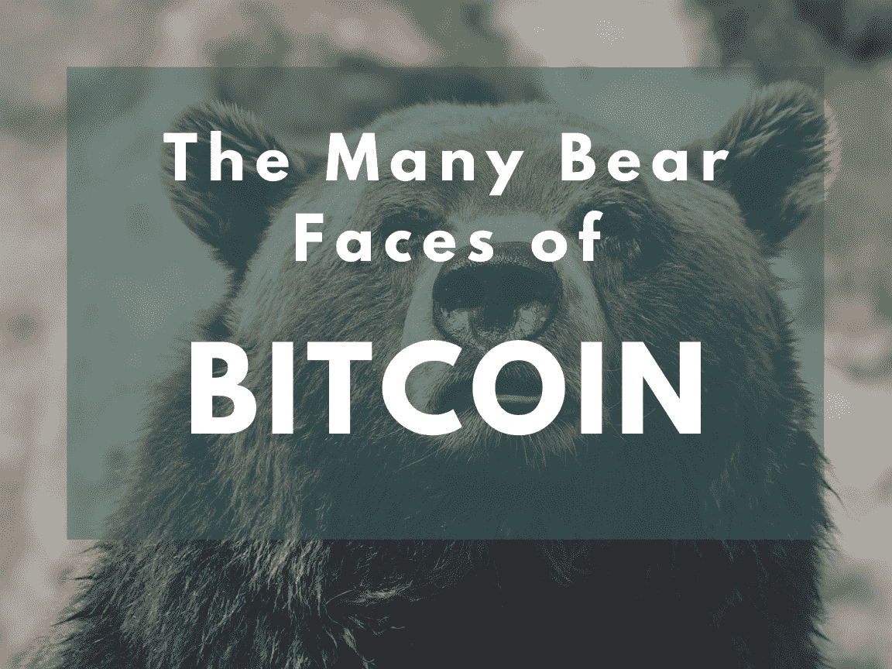
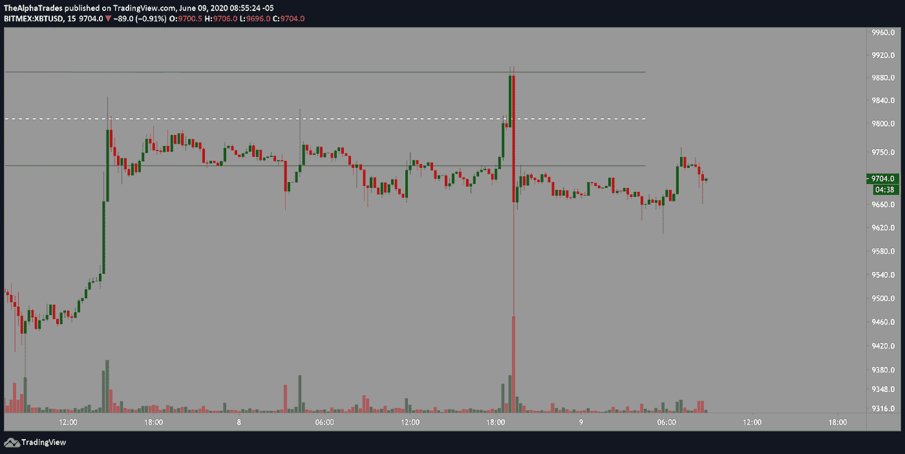
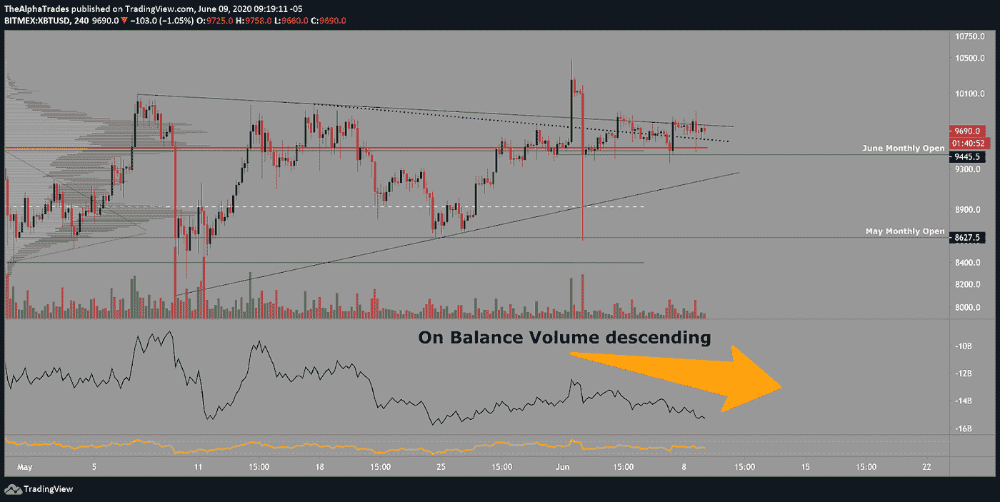
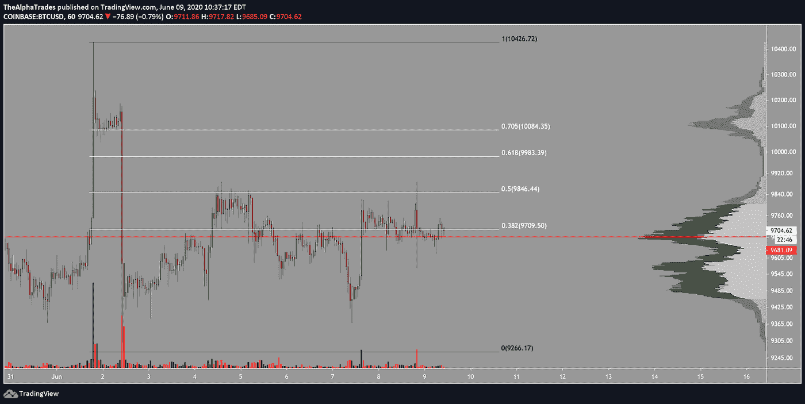

# 比特币的许多悲观面

> 原文：<https://medium.datadriveninvestor.com/the-many-bearish-faces-of-bitcoin-df8615889a0d?source=collection_archive---------17----------------------->

## 为什么我做空 BTC 作为一个摆动交易(奖金:我的交易惯例)

The Many Bearish Faces of Bitcoin; Source: Alpha Trades, LLC

早上好，

让我们打开比特币当天的图表，然后我们将讨论我们社区中讨论的一些与比特币和整个市场有关的新闻，以及我作为一名持续盈利的交易者的日常工作。到本文结束时，你将从更高的时间框架角度对比特币最近的价格波动有更好的理解。坚持到最后，你还会得到两个从溢价方面的自由贸易评论。

从 15 分钟的时间框架开始，注意向上移动的成交量与向下移动的陡峭蜡烛线相比是微不足道的，这使比特币回到了图表上看到的范围之下。这表明对该通道的强烈拒绝，这限制了目前的上涨势头，并表明随着较大的参与者继续以更有利的价格平仓，分销正在发生。基于这些信息，我仍然做空 BTC，因为我相信还会有更多的下跌。

# BTC 的头皮创意(这些创意可以在几小时内失效)

价格目前卡在形成三角形顶部的两条迷你趋势线之间，如下图 4 小时图和 6 月月开盘价所示。如果我在寻找头皮，我会考虑在 6 月份的月度开放测试中做空 BTC，并在下降趋势线中卖出。或者，我会考虑从趋势线向下到月线(BitMEX 上的 9445.5)的相反方向的头皮做空。

BTC squeeze didn’t hold the channel; Source: Alpha Trades, LLC

BTC four-hour timeframe high volume node; Source: Alpha Trades, LLC

在建交易量(OBV)继续滚动，对 BTC 价格的波动没有太多反应，这意味着资金没有真正流入市场。这些没有跟进和平衡交易量没有稳定增长的价格飙升可以被认为是短期挤压，它淘汰了许多参与者，并在波动的顶部困住了人们。

在过去几天里，我已经非常清楚地表明，如果你在 BTC 逐层观察，6 月份月度开盘的下跌将为下跌到 5 月份月度开盘(8600)打开大门。这两个区域都与固定范围容量配置文件指示器(上图左侧的水平条)中的高容量节点相一致。BTC 目前正徘徊在由水平红线标记的高交易量节点上方，与 6 月月度开盘汇合。随着期货到期，我预计这种情况将在本月底结束。

在现货交易所(以比特币基地为例)，BTC 触及 50%的 Fib 区域，无法突破，你可以再次看到价格如何在最高交易量节点附近徘徊。

在我们之前的文章中，我讨论了关于机构投资者在市场中的行为的交易者承诺报告，以及比特币杂凑利率和矿工投降对 BTC 价格的影响。

Spot exchange shows BTC failed to break the 50% Fib retracement level; Source: Alpha Trades, LLC

# 日常事务可以让你成为更好的交易者。

建立一个稳定的交易程序是我们社区中许多人努力的事情。我喜欢保持我的日常简单:第一，忘记你的赢家和输家。**不管昨天发生了什么，把它记为胜利或失败，然后继续前进**。我在早上 5 点左右醒来，做我早上的例行公事，冥想、思考和写日记。这为我今天的工作打下了基础，也定下了基调。这意味着我起床后的前 30 到 45 分钟不碰市场，这给了我时间来建立一天工作所需的动力。

接下来，记得在的前一天晚上**做你的调查，准备一份资产观察清单，并且**在你想要跟踪的价格水平设置警报**。从长远来看，一个能让你安心的诀窍是**当你连续平仓三个亏损的交易时，休息 24 小时**。没有交易，没有分析，如果有必要就把警报静音。给自己一些时间来重新调整，因为真实地面对损失是很重要的。为了控制你的情绪，你需要更多的时间来反思，并以更理性的方式看待这种情况。**

如果你连续平仓三个赢家，同样的策略也适用。休息 24 小时，让你的自我冷静下来，用新获得的自信变得更有效率，休息一下。相信我，通过这样做，你会避免因为一些非理性的信念而进入过大的仓位，这些信念认为星星最终会排成一行，你是市场的大师。

无论你是连胜还是面临一连串的亏损，手头都要有一本交易日志。写下你进场和出场的理由，你的杠杆，进场点和出场计划。在执行之前有一个完整的交易计划对长期成功至关重要。那些在交易时靠方向盘飞的人很可能只知道在运气用完之前什么时候离开桌子。

这可以归结为一个更简洁的教训:**管理你的风险。**不要过大，设置止损。

# 与阿尔法交易社区讨论新闻

比特币最近没有什么重大进展。一家总部位于南非的公司筹集了大约 400 万美元来生产太阳能，并利用区块链来激励人们参与其中。[比特币系统内的期权看涨期权正在上升](https://www.coindesk.com/bullish-bitcoin-options-market-data-prices)，一眼看去，肯定是看涨大于看跌。然而，我们不知道芝加哥商品交易所的交易员在对冲方面的真实定位，也不知道他们在一个交易所相对于另一个交易所的敞口，因此现在就假设这个消息足够看涨，足以打破熊市还为时过早。

# 阿尔法交易社区最近的交易

上周，我在**的斯伦贝谢(SLB)** 油田生产公司接到了一个有利可图的电话。这是 7 月 2 日的 23 美元的罢工，目前我有 110%的利润，并将允许剩余的 15%的原始头寸运行到周末。

Schlumberger (SLB) trade setup doing well; Source: Alpha Trades, LLC

昨天，我以 180 美元的价格买入了 147 美元的**Beyond Meat**看涨期权，因为我认为这是一家强大的公司，可能会受益于[一些关于向中国扩张的消息](https://www.investors.com/news/beyond-meat-stock-surges-china-distribution-deal-sinodis/)，我认为他们将从美国 7 月 4 日的庆祝活动中受益。*这不是财务建议*——我们带领我们的社区了解我们从事的所有交易。这需要巨大的努力，我相信我们的社区都赞赏这项工作和透明度，并通过学习如何根据自己的交易理念采取行动而受益。

# 优势成员赶上了每周炉边聊天:

**前花旗集团对冲基金经理奥斯汀·阿什拉夫(Austin Ashraf)**加入我们，讨论他对本周及未来几周市场的看法。我们已经决定将这些对话转移到 premium，我们本月将对这些服务进行大幅折扣。[订阅 Discord 服务器](https://bit.ly/2KJ1oor)了解高级会员第一个月的 50%折扣(优惠截止到 6 月 15 日)。在下面的视频中了解更多信息。

The Many Bearish Faces of Bitcoin; Source: Alpha Trades, LLC

不要错过，因为我们正在统治我们通常免费提供的内容，以关注更高质量的数据、新闻和对我们优势群体的分析。

# 放弃

Alpha Trades，LLC 提供的信息不用于制定任何财务决策，也不是购买、持有和/或销售特定产品、数字资产或 ICO 的请求或建议。

访问我们的完整服务条款:[https://bit.ly/3faVeeV](https://bit.ly/3faVeeV)