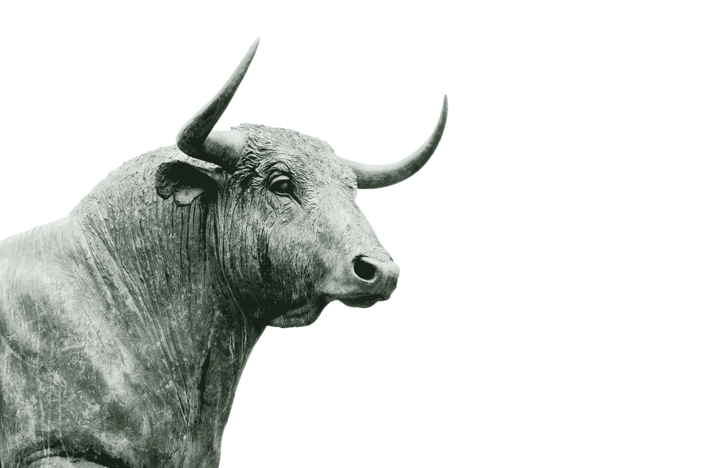
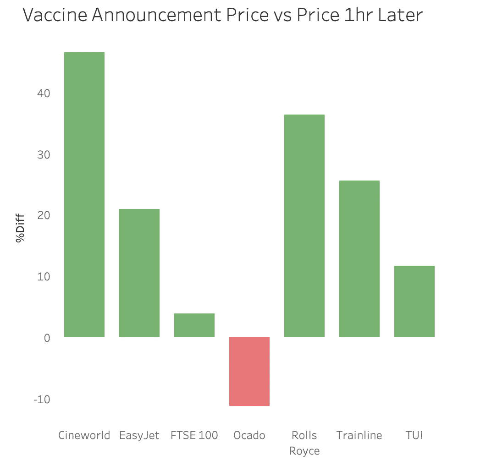
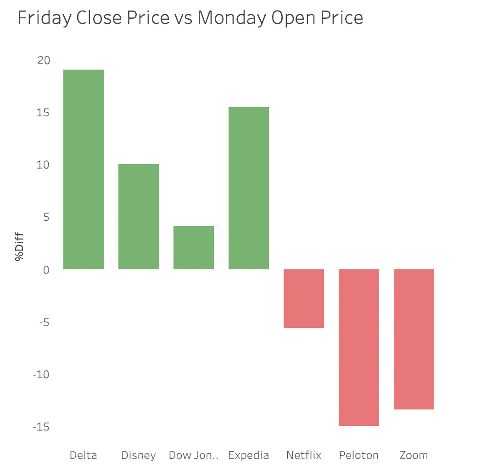

# Covid 疫苗试验成功后的市场反应

> 原文：<https://medium.datadriveninvestor.com/the-market-reaction-to-successful-covid-vaccine-trials-b94223cc3cc1?source=collection_archive---------22----------------------->

Credit: [Hans Eiskonen](https://unsplash.com/@eiskonen)

11 月 9 日，世界协调时约 11:45，制药公司辉瑞和 BioNTech 宣布，他们的冠状病毒疫苗在试验中有 90%的有效性。在美国大选“结束”后已经得到支撑的市场继续上涨，主要指数都在上涨，包括富时 100 指数，在消息公布后上涨了近 5%。

然而，最有趣的事情之一是这条新闻对某些行业的影响。欧洲市场在声明发布时已经开放，航空、旅游、甚至剧院的股价都出现了飙升。以设计喷气发动机的劳斯莱斯为例，在消息公布后的第一个小时内，股价就上涨了 36%以上。其他公司如 Trainline 和 TUI 分别增长了 25.56%和 11.71%，而在线超市 Ocado 则下降了 11%。

European markets react to the news

另一方面，美国市场在声明发布时休市，因此其开盘价较上周五收盘时大幅上涨。国内和国际旅行的领导者达美航空公司，从周五收盘时看，增长了近 19%。然而，Zoom 和 Peloton 等公司的跌幅较大，分别为 13.42%和 14.96%。

US Markets: Friday close price vs Monday open price

当然，看看未来几天会发生什么是很有趣的，无论这被认为是一种“膝跳反应”，还是这种疫苗的消息会对市场产生持续的影响。

感谢您阅读这篇短文！