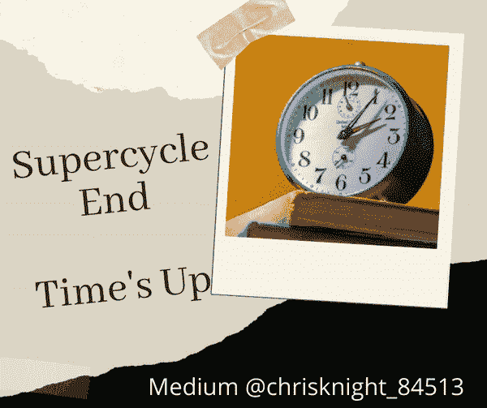
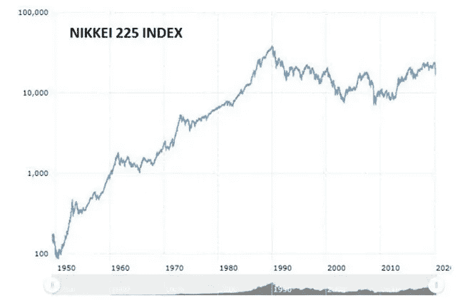

# 杀死日本的市场超级周期在美国

> 原文：<https://medium.datadriveninvestor.com/the-market-super-cycle-that-killed-japan-is-in-the-united-states-7cc9677b6f1d?source=collection_archive---------4----------------------->

## “权力是一个善变的情妇，容易勾引，但更容易失去。事情就是这样的。前一刻她是你最亲密的知己，在你耳边低语宇宙的秘密；下一秒，她就是你最卑鄙的压迫者”(尼尼亚·坎贝尔《流血我的欲望》)

Source: Self Created Image with Canva

自 1982 年以来，美国经历了令人难以置信的长达 38 年的超级周期和长达 13 年的牛市趋势。2020 年 4 月 1 日，美国和世界其他国家一起正式进入全球衰退。

> 四月份，国际货币基金组织公布了世界经济状况。国际货币基金组织表示，预计 2020 年 GDP 将收缩 3%。当前 3%的全球经济收缩导致了比 2008 年全球金融危机收缩更严重的衰退。

IMF 4 月份的观点与 1 月份 COVID 之前的预测发生了 180 度的逆转。一月份，国际货币基金组织在新冠肺炎之前预计今年的经济增长为 3.3%。

美国美联储正竭力将利率维持在零水平。美国政府靠债务和货币贬值维持运转。由于一种新型的人，股票价格出现了不合逻辑的反弹。这个人渴望探索资本市场，但不研究历史。这种缺乏研究和探索的情况将导致前所未有的市场崩溃。我们以前见过这样的崩溃。如果这是你第一次阅读市场崩溃的概念，让我在 5 分钟内带你浏览一遍。

根据你所处的位置，你可以获得财富，保持财富或失去财富。

**新手实验**

我们今天看到很多投资新手。对于金融市场来说，大多数都是相对陌生的。新手态度屈服于“V 型”宣传。

新手认为，美国 38 年的超级周期将无限期持续下去。

近 40 年来逢低买入的文化听起来很有说服力。事情将很快恢复的观点几乎是真理。许多人只知道他们一生中发生了什么。挫折发生了，政府介入刺激，债务增加到我们的国家，几乎没有后果，接近 0%的借款永远存在。

这是为不研究历史的人设计的虚假诡计。

**超级周期的命运**

与美国美联储相似，日本银行走上了系统性降低利率的道路，以刺激日本经济。日经 225 指数在 1989 年 12 月 29 日达到最高点，为 38，915 点。

30 多年后的今天，日经 225 指数仍未恢复昔日的辉煌。日经 225 指数实际上已经经历了 30 年的熊市。自超级周期峰值结束以来，日本经济一直得过且过。

让我们检查一个图表，看看超级周期峰值实际上是如何结束的，以及峰值结束后的表现如何。

资料来源:macrotrends.com

一张图胜过千言万语。**我让你们通过分析上图**来思考美国市场的未来 30 年。引发下跌趋势的下一个事件是什么？我认为这种情况已经发生了，但下一次下跌会出现在哪里，让我们继续处于这种下降趋势？让我们来讨论下一次市场下跌的可能性及其时间。

**下一个暴跌的催化剂**

商店关门了，人们不敢出门。如果你是高风险人群(像我一样)，你甚至不会与人交往。美国的死亡率仍在上升。美国在感染、死亡和缺乏准备方面处于世界领先地位(来源[世界统计](https://www.worldometers.info/coronavirus/?utm_campaign=homeAdvegas1?#countries))。

美国各州急需医疗用品。呼吸器很少。

纽约州对呼吸器的极度渴望导致了向亚龙·柳文欢-派恩斯先生支付了一笔荒谬的款项。柳文欢-派恩斯是一位有望拥有 76 名粉丝的 twitter 明星。尽管没有证据证明呼吸器的销售，柳文欢-派恩斯还是从纽约州政府获得了 6900 万美元。交货失败后，纽约州政府强烈要求柳文欢-派恩斯先生还钱。

 [## 如果资本主义失败了，那么还有什么选择呢？数据驱动的投资者

### 在当前政治领域的修辞之旅中，我们都可以面对面地接触到流行词汇，如…

www.datadriveninvestor.com](https://www.datadriveninvestor.com/2020/03/16/if-capitalism-is-a-failure-then-what-is-the-alternative/) 

*继上个月纽约国务院荒谬的付款后，其他国家领导人未能掌握过去 30 天的历史*。更重要的是，其他州的领导人认为，如果重新开放公共设施导致纽约的情况，确保储备足够的口罩并不重要。我们的公共区域重新开放将导致多个纽约州的情况。我想每个州都会指望另一个柳文欢·派恩斯先生来解决他们自己造成的问题。

> 谨慎的重新开放是不负责任的，多个州爆发疫情将对美国经济造成实质性打击。

“*经济重于健康*”的决策谬误将刺激下一轮市场下跌。**讽刺的是，经济驱动的决策会导致国家经济崩溃**。

> 如果不到一个月前，纽约根据 twitter 帖子做出购买医疗用品的决定，而呼吸器仍然短缺，那么其他州如何准备好面对重新开放？

尽管科学界多次呼吁就地隔离，但领导人重新开放了佛罗里达州的海滩，佐治亚州坚持全面重新开放，密歇根州的法官游说给脱衣舞俱乐部带来刺激，预计顾客会进行皮肤接触。

美国领导人正在授权下一次市场下跌。

**下一个大空头**

《大短片》是一部很棒的电影。我经历了那段时间。它非常准确地描述了房地产崩溃是如何发生的。我记得有几笔房地产投资。我记得由于对市场的无知，我几乎失去了所有的东西。我在生活中犯了很多错误，但我很少重复两次。

我们有机会从错误中学习。更重要的是，我们有机会从历史中学习。历史是一位伟大的老师，科技让历史事件发生在更短的时间范围内。技术的好处是获取信息。这篇文章是少量的知识。这些知识可以防止无知，并引导你为下一次大做空做好准备。

你是否押注于市场上升趋势中的更多收益？再看看日经 225 超级周期图。**交易是一种柜台交易系统**。**反方制是有限的**。要想获得巨大收益，你需要参与交易，从输家那里获利。你不能成为一群购买者来获得高于市场的回报。相反，如果你在羊群有能力买入的时候做空，你就会亏损。押注失败是一把双刃剑。

你是牧群中的一员还是牧羊人？

当一群羊开始冲向悬崖时，唯一没有掉下悬崖的人是牧羊人。我押注于市场事件来纠正羊群行为。我只有在群体解散的时候才会赢。上个月在市场上，我个人账户的收益超过了 38%,而其他人却损失惨重。确保你押对了方向。有时候站在正确的一边意味着不站在任何一边。许多人并没有在领先的时候放弃。很多人做不到。在有史以来最严重的市场崩溃期间，一年内获得 40%的收益，这说明了很多问题。那个人会在好的市场上受到追捧。知道耐心的价值。要知道，不是每一次胜利都是用行动或言语来衡量的。一个非常聪明的人曾经什么都没说。一个更聪明的人曾经什么都不做。

祝你未来知识成功！

****

关于 Christopher:Christopher Knight Lopez 是一名职业骗子，在他的职业生涯中，他与职业企业家进行了广泛的合作。在他 14 年的职业生涯中，Christopher 已经开了超过 7 家公司。克里斯托弗的目的是利用各种市场驱动的机会。Christopher 是注册项目经理(MPM)和认证财务分析师(AFA)。Christopher 之前通过了 65 系列证券执照考试。克里斯托弗也有他的总路线——人寿、意外、健康和健康维护组织。Christopher 已经管理了总计 2 . 86 亿美元的报告管理资产和建议资产。Christopher 在 29 个国家有工作经验，为各种业务筹集了超过 5000 万美元，在他的个人职业生涯中总收入超过 1300 万美元。Christopher 曾在高科技行业工作:生物技术、金融、证券、制造、房地产和住房抵押贷款。克里斯托弗是一名美国空军老兵。克里斯托弗热爱家庭、竞技体育、钓鱼、武术，并倡导企业家精神。克里斯托弗为崭露头角的企业家提供自助课程。克里斯托弗对导师的热情来自于企业家和骗子需要指导的信念。这个世界充满了关于企业家身份的相互矛盾的信息。在[www.christopherklopez.com 看更多。](http://www.christopherklopez.com.)

免责声明:这些信息并不意味着是一种投资建议或财务建议。不要把这种情况应用到你自己的个人环境中。各种风险包括:商业风险、投资风险、政治风险和其他风险。此信息仅用于信息和教育目的。请不要向作者寻求任何投资策略或哲学。针对自己的情况，请咨询自己的理财顾问或法律顾问。不是任何形式的推荐或认可。