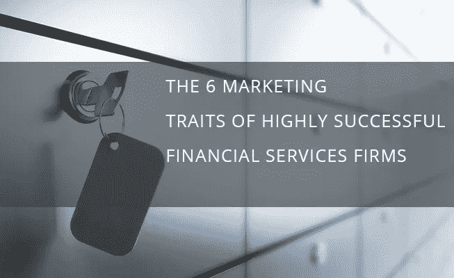

# 高度成功的金融服务公司的营销特征

> 原文：<https://medium.datadriveninvestor.com/the-marketing-traits-of-highly-successful-financial-services-firms-e6ebc0c5b48d?source=collection_archive---------22----------------------->

Photo by [Samson](https://unsplash.com/@samsonyyc?utm_source=medium&utm_medium=referral) on [Unsplash](https://unsplash.com?utm_source=medium&utm_medium=referral)

*对于精品金融服务，独立营销会适得其反*

金融机构一直像半个世纪前一样向客户销售。对于瞄准超高净值客户的精品资产管理公司、家族理财室和财富管理公司来说，尤其如此。然而，包括老一辈在内的消费者对银行家应该如何为他们服务有不同的看法，这已经不是什么新闻了。例如，根据 Forrester research 的数据，四分之一的美国成年网民会考虑在没有实体分支机构的公司从事银行业务。

我曾在一家新兴的精品投资银行担任营销和沟通部门主管。在几次机会中，我们无意中听到我们的竞争对手将他们的服务比作我们的，并大声问为什么我们的名字在目标市场比他们的更受认可，而他们的产品确实更好。也许答案是他们的营销和销售过程需要更新，以在商品化的市场中竞争。在一个几乎任何公司都可以提供全球市场准入的世界里，精品服务必须变得不仅仅是准入或咨询。

 [## 更好的预算，打造更大的|数据驱动型投资者

### 即使是专家也承认它们并不完美。从 1 到 10 的范围内，安东尼·科普曼和德尔…

www.datadriveninvestor.com](https://www.datadriveninvestor.com/2018/11/08/budget-better-to-build-bigger/) 

消费者早已不再对当面营销做出反应。朋友和信任的同行的推荐、口碑和网上评论是最能左右他们购买决定的因素。当人们做出购买决定时，他们希望得到快速、高效、个性化的帮助。不足为奇的是，质量较差的长篇大论和营销手册不再管用了。

擅长营销、赢得和保持忠诚客户的公司有六个关键特征值得我们学习。

**他们相信伟大的品牌是从内部孕育出来的**

私人银行家或经纪人带着他们的客户从一家公司转到另一家公司是很常见的。这些类型的团队成员可能会带来一些急需的短期业务流入，但他们不会为公司的长期品牌建设做出贡献。

这就是为什么当大多数与潜在客户的互动都是面对面进行时，精品、专业化金融服务公司的内部沟通有了全新的意义。

成功地在客户眼中建立起一个值得信赖的持久品牌的公司，在内部沟通和外部沟通上投入了同样多的努力。从他们的团队获得真实的认同意味着来自组织的所有信息都将符合一个一致的品牌故事，这将由一个团队成员一次一次互动来构建。

他们将营销整合到他们的流程中。
市场部不应该是一个发出下一次活动邀请的孤立团队。营销工作是企业日常运营流程的一部分。

一个伟大的营销流程包括对客户旅程中所有接触点的彻底检查，产生一致的品牌体验。这应该包括从电话问候，到声明，到电子邮件协议和入职文件的所有内容。

**设计一致**
一个品牌的故事不仅是口头的，也是视觉的。伟大的品牌在他们的努力中有一致性，并且在前端团队成员提供给他们的客户和潜在客户的材料上有很强的掌控力。

**销售是整合和交叉销售** 如今，银行家不仅需要对消费者及其行为有深入的了解，还需要以客户喜欢的方式提供服务。

不幸的是，金融服务公司往往总是各自为政。在这个世界上，随着利润率不断下降，获得新客户的成本不断上升，向内寻找交叉销售机会不仅是一种很好的做法，而且应该是理所当然的。这个过程中的一个关键因素是创造一种高度关注客户需求的文化。这意味着所有的努力都应该放在了解每一个客户上，以便能够预测他们的需求。

客户和银行之间的互动正在发生变化。客户不再希望他们的银行关系仅仅是交易关系；他们[想要建议驱动的银行业务](https://www.accenture.com/us-en/insight-consumer-banking-survey.aspx)来满足他们的个性化需求。伟大的金融品牌注重以人为本的设计，确保客户的需求、愿望和限制在他们与品牌的每次互动中都得到优先考虑。

**他们知道没有灵丹妙药** 伟大的品牌是一次一个接触点，一次一个客户，随着时间的推移而建立起来的。仅仅在一种营销工具上砸钱是不够的。成功的品牌将他们的营销努力和品牌故事融入他们所做的一切，并让这一过程长期为他们服务。

总之，伟大的金融服务品牌拥有一台营销机器，不断地为其品牌建设提供信息。

*原载于*[*https://slata.co*](https://slata.co/the-marketing-traits-of-highly-successful-financial-services-firms/)*。*