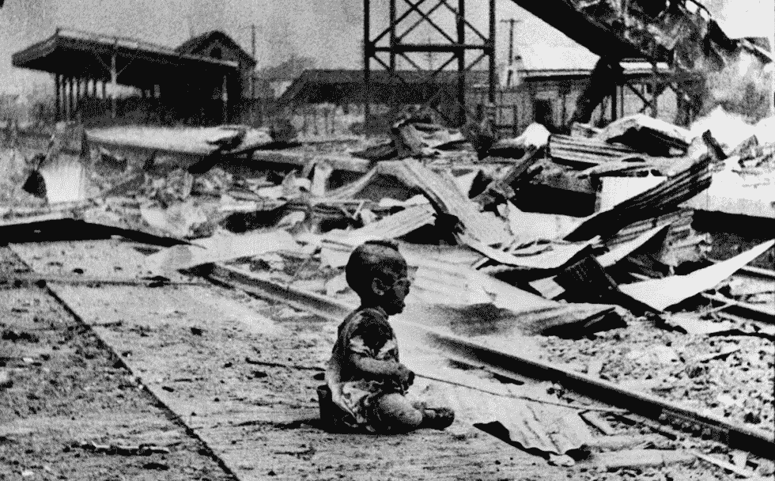

# 使日本成为国际社会敌人的大屠杀

> 原文：<https://medium.datadriveninvestor.com/the-massacre-that-made-japan-the-enemy-of-the-international-community-12027bf847b4?source=collection_archive---------1----------------------->

## 南京大屠杀与国际反应

The Japanese atrocities in the Second Sino-Japanese War

现在是 1937 年。日本帝国正试图实现其进一步扩张的愿望，而中国政府正试图抵制。第一次中日战争结束于 1895 年，日本军队获胜，中国清朝失败。

在最近的战争中，赌注更高，赢得战争的需要比以往任何时候都更迫切。日本推行始于本世纪初的帝国主义政策，在 1930 年大萧条之后，入侵中国满洲，一年后建立了名为满洲国的傀儡政府；根据许多历史学家的说法，两个强国之间的第二次战争始于 1931 年。另一方面，中国很担心，因为它是一个较小的军事大国，但同时，美国已经开始提供帮助；因为日本的扩张威胁到美国在太平洋水域的利益。

1931 年的九一八事变，日本军方指责中国军队炸毁了一列火车，尽管有大量证据表明日本是故意的；这样他们就可以宣战并为他们的攻击辩护。这一次，在 1937 年，战争的起点位于 7 月份的卢沟桥，当时日本和中国军队在北京的争端导致了全面入侵；许多人认为这是第二次世界大战在亚洲的开始。

中国政府获得的外援在战争初期是不够的，这导致日本军队在 1937 年占领了北京、上海和中国的首都南京。文本聚焦于最后的胜利，也就是南京大屠杀，这是由于日本军队表现出的残暴和不人道行为。

这不是日本军队的典型胜利，它被合理地命名为南京大屠杀，因为 6 周以来，日本帝国军队的士兵不断杀害解除武装的战斗人员和平民，估计人数超过 30 万。大规模的强奸和抢劫不仅侵犯了平民的人权，而且对许多人来说，向国际列强展示了日本人的真实面目。直到 20 世纪末，关于死亡人数的争论一直是一个重要的问题，因为日本人一直保密或销毁了所有证据，双方对死亡人数都有许多估计。

人们可能会问，为什么美国不干预并阻止这场大屠杀。要回答这个问题，我们必须了解事件的背景，以及其他全球大国反应的意义。如前所述，美国关注日本的扩张和对中国边界的侵犯，但主要由于 1930 年的大萧条、低效的海军力量和与日本的贸易关系，无法以强有力的干预作出反应。首先，大萧条的影响仍然令人不安，美国人民迫使胡佛总统和罗斯福总统专注于国内经济事务。

其次，大萧条的严重影响在军事领域也很明显，因为美国缺乏可靠的海军力量。在这种特殊情况下，通过支持中国和直接反对日本来挑起太平洋冲突，将会使美国在任何攻击面前都得不到保护。此外，美国的利益和安全没有受到日本袭击的直接影响，他们与美国密切的经济和贸易关系，敦促后者不要危及他们的贸易福祉。

 [## 对有商业头脑的投资者有用的行为经济学概念|数据驱动的投资者

### 在美国企业界，高斯统计，对我们周围世界的确定性解释，以及理性…

www.datadriveninvestor.com](https://www.datadriveninvestor.com/2020/07/09/helpful-behavioral-economics-concepts-for-the-business-minded/) 

出于这些原因，美国选择在 1932 年 1 月 7 日发布不承认原则，宣布美国不承认侵犯中国边界的协议。这是国务卿亨利·史汀生对日本行为的间接道德谴责。他明确表示，“看来，决定结束这种局面的事态发展的责任主要在于日本……”。

理查德·斯托里(Richard Story)等历史学家表示，“……它加剧了日本的民族主义情绪，对中国没有任何实际帮助，而且根本没有推进美国自身的利益”，支持史汀生主义没有必要，也没有明确表明美国完全中立。这种中立立场最终随着 1941 年 12 月 7 日日本偷袭珍珠港而结束，下面引用的文章可以展示美国是如何恢复并加入战争的。

 [## 罗斯福的复苏计划与美国对二战的干预

### 美国如何从孤立走向全球历史的改变

medium.com](https://medium.com/lessons-from-history/roosevelts-recovery-plan-and-the-us-intervention-in-wwii-4add2bf0f3c9) 

因此，当蒋介石支持“出售领土以争取时间”的政策时，他等待着日本轰炸的国际反应，但美国不会作出反应，而且，英国和法国也肯定不会作出反应。7 月，他出现在西方列强面前，1937 年 10 月，在上海大轰炸两个月后，大屠杀之前，组织了九国条约会议。尽管英国、法国、日本、意大利、比利时、荷兰、葡萄牙和中国等大国参加了会议，但日本拒绝出席，因为这些领导人知道将要讨论的问题。

该条约是在 1921-1922 年华盛顿会议的主持下签署的，促进了稳定和和平。然而，声明该条约总体上失败并没有错，因为日本继续进行毁灭性和残酷的攻击，在大屠杀中犯下了骇人听闻的暴行。

这一事件立即将日本置于当时最臭名昭著的国家之列，并使全球大国对缔造和平的未来“大开眼界”。甚至日本历史学家入江昭也指出，“南京大屠杀将使日本几乎仍有可能被国际社会接受为一个受尊敬的成员”。

## 文献学

伊里耶，亚基拉。珍珠港和太平洋战争的来临:文献与散文简史。波士顿:贝德福德/圣马丁，1999 年。

“书评:现代日本史。理查德·斯托里。鹈鹕。4/-."国际关系 2，第 2 期(1960 年 10 月):122–23。[https://doi.org/10.1177/004711786000200223.](https://doi.org/10.1177/004711786000200223.)

## 获得专家视图— [订阅 DDI 英特尔](https://datadriveninvestor.com/ddi-intel)