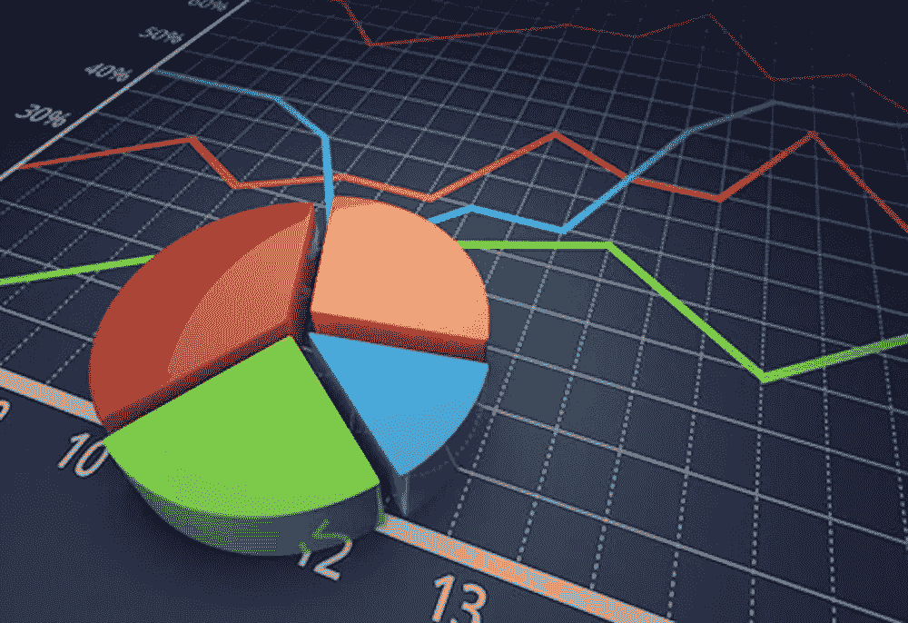
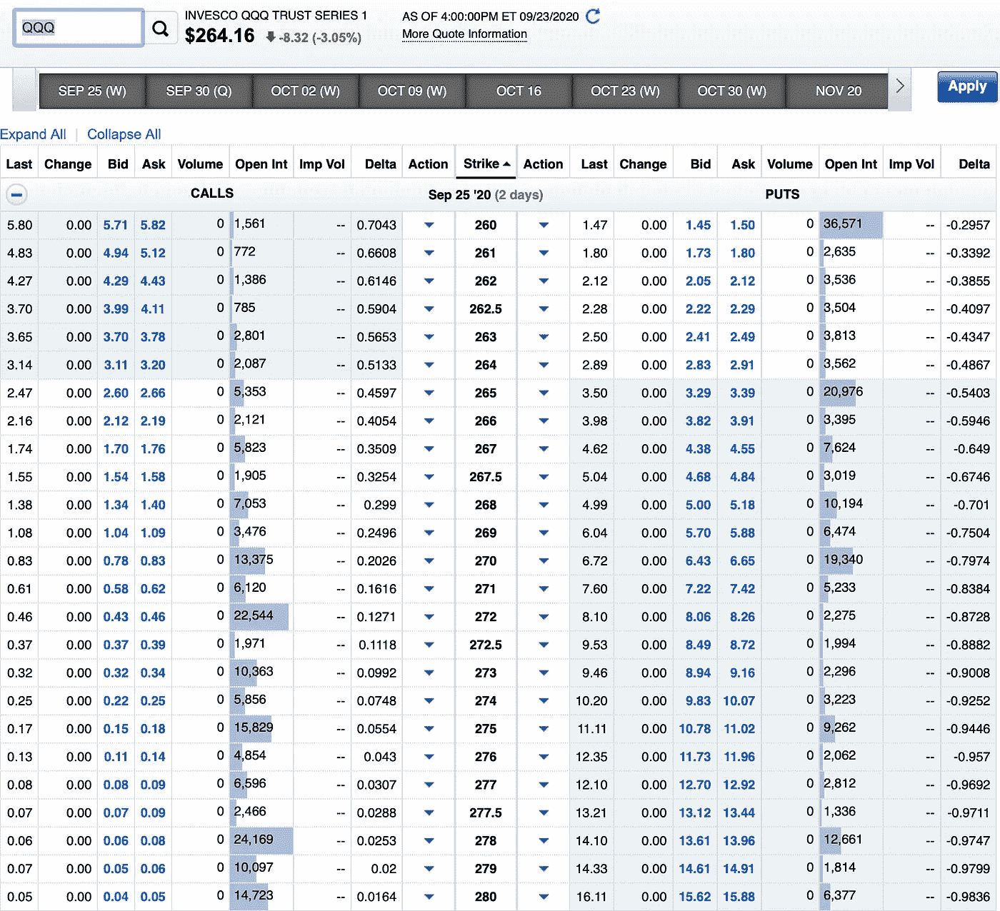
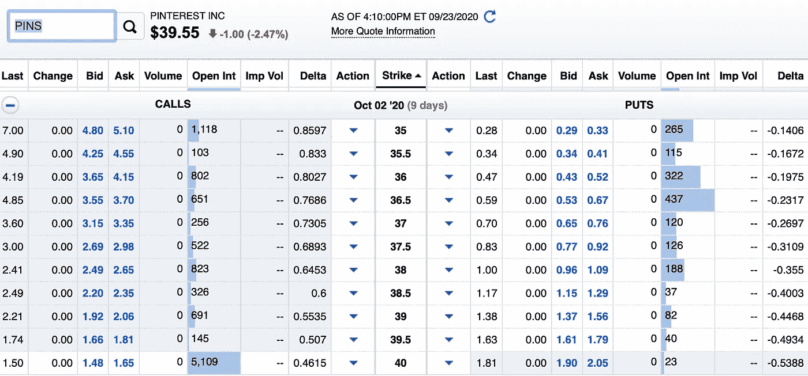

# 出售期权每年赚 10 万美元背后的数学原理

> 原文：<https://medium.datadriveninvestor.com/the-math-behind-making-100-000-each-year-selling-options-a399866d16fb?source=collection_archive---------0----------------------->

我煞费苦心地计算了这些数字，所以你不必

去年早些时候，我做了一些计算，以确定通过分红股票每年赚 10 万美元需要什么。

不出所料，这一壮举涉及大笔资金，将股息进行再投资，观察股息每年的增长，并继续投资于你的投资组合，加速了这一过程，但通过股息投资每年赚 10 万美元需要相当长的时间。

另一方面，卖出期权可以根据你的节奏加速或减速。你决定每周要收取多少保费，而不是获得持续的股息支付。

波动性高的股票会给你带来更高的溢价，而波动性低的可靠公司不会给你带来高溢价。

如果你想每年卖出期权赚 100，000 美元，你必须每周赚取 1，923.08 美元的溢价。

虽然你仍然需要一大笔钱才能每周赚到 1，923.08 美元的保费，但你可以用这种策略比通过分红股票更快地赚到 6 位数。

每年 100，000 美元的计算取决于您决定交易期权的股票或 ETF，但在本例中，我们将重点关注 QQQ。

QQQ 是一只追踪纳斯达克 100 指数的 ETF，这意味着你会想额外关注科技股。

纳斯达克指数通常优于标准普尔 500 和罗素 2000 指数，但它也更不稳定。

 [## 为什么大多数人在日内交易中亏损(以及如何不成为他们中的一员)|数据驱动的投资者

### 日内交易很难，大多数人都赔钱。我确实有。事实上，我曾经在一个单一的损失更多的钱…

www.datadriveninvestor.com](https://www.datadriveninvestor.com/2020/09/23/why-most-people-lose-money-day-trading-and-how-to-not-be-one-of-them/) 

我更喜欢出售在每个周末到期的期权，这是获得持续收入的好方法。以下是将于两天后到期的合同的 QQQ 溢价情况。

如果你在周一卖出期权，你会得到更高的溢价，因为离合约到期还有更多天。

假设您想尽可能长时间保留您的 QQQ 份额，但仍想收取保险费。在这种情况下，我会设定 269 的执行价格，立即赚取 104 美元的溢价。

269 美元对我来说是安全的，因为 QQQ 必须在 2 天内上涨 1.8%。鉴于市场最近的表现，我不会屏住呼吸等待 QQQ 涨到 269 美元。事实上，我不介意以每股 269 美元的价格出售我的股份。

*快速解释图表上的数字……*

是的，这张图表上有一大堆数字。只要看看中间的 269，再看看左边显示呼叫的地方，你会在出价类别下看到一个 1.04。这就是你卖合同的价格。1.09 代表如果你想买某人的看涨期权，你要付多少钱。

因为期权交易是 100 股的倍数，1.04 代表你每股赚多少。由于我们谈论的是 100 股的倍数，该认购期权的溢价是 104 美元。

您在一周内越早在 QQQ 上出售有保障的通话，就越有可能每周赚取 100 美元并保留您的股份。

问题是，为了卖出一个备兑看涨期权，你需要 100 股 QQQ 股票。由于 QQQ 的最后交易价格为每股 264.16 美元，您需要在 QQQ 上投资 26416 美元。

要想每周赚 1，923.08 美元，您需要卖出大约 19 个有担保的看涨期权，这意味着您需要 1，900 股 QQQ 股票。

由于 QQQ 上一次的交易价格是每股 264.16 美元，你需要在 QQQ 上投资 501，904 美元，才能通过出售有保障的通话获得 6 位数的收入。

如果你有 50 万美元，你已经准备好了。虽然这听起来很多，但你需要更多的钱来通过股息投资实现同样的目标。

50 万美元投资于股息收益率略高于平均水平 4%的股息股票，每年将产生 2 万美元。还不错，但离 6 位数还差得很远。

让我们看几个场景…

如果您只有 100 股 QQQ 股票，每周赚 104 美元，那么您将需要 254 周(差不多 5 年)才能从溢价中再获得 100 股 QQQ 股票。

如果你有 500 股 QQQ，那么不到一年的时间，就可以通过保费免费获得 100 股 QQQ。

这种策略很复杂。

另一种情况是设置一个较低的执行价格，如 268 美元，并根据图形获得每周 134 美元的溢价。

134 美元/周而不是 104 美元/周加快了这个过程。你不需要 1900 股 QQQ 股票，只需要 1500 股 QQQ 股票就能获得 6 位数的收入。

这样，您只需要 396，240 美元就可以按当前价格购买 1，500 股 QQQ 股票。

您从 100 股 QQQ 股票中获得的溢价会在一年前变成另外 100 股。

您从 500 股 QQQ 股票中收取的溢价将在大约 9 个月内变成另外 100 股，而不是实际上的 1 年(50.8 周，每周溢价 104 美元)。

你可以出售像 Fastly 这样的成长型股票的备兑买入期权，这种股票承诺更高的溢价，但风险也更大。这只股票不仅会比你的普通股票进一步下跌，而且还会突然暴涨，超过你的执行价。

你可以买 100 股这几种类型的股票。在我们之前的例子中，您不需要支付 396，240 美元。在这一点上，所需资金的数量很大程度上取决于你选择的股票和它们的溢价。

# 如果你被迫出售，会发生什么

最终，你将被迫以 100 的倍数卖出股票。这可能不是一件坏事，因为你可以在适当的时候退出。

你也可以通过现金担保看跌期权获得额外收入。这不仅是获得额外收入的好方法，而且你可以因为愿意以更有吸引力的价格购买你想要的股票而获得报酬。

让我们以 Pinterest 股票为例。

对于 Pinterest，我选择关注 9 天后到期的看跌期权(右边的数字)。两天后到期的看跌期权合约的溢价微乎其微，不值一提。

我可以用 29 美元买 100 股 Pinterest，每股 35 美元。我对购买这些股票完全没有意见，如果我在合同到期前没有得到它们，我仍然坐拥当周 0.8%的收益和 3，529 美元的现金。

对于现金担保看跌期权，你不必购买 100 股。你只要把钱放下。在合同到期时，你要么得到 100 股，要么拿回所有的钱加上溢价。

这也是买股票的最好方法。我在之前的一篇文章中详细描述了沃伦·巴菲特是如何利用这个策略在 5 分钟内赚到 750 万美元的。

如果您最终不得不以 265 英镑的价格出售 100 股 QQQ 股票，您可以继续以 260 英镑的行使价购买现金担保看跌期权，以获得溢价，并以每股 5 美元的折扣出售相同的股票。

唯一的风险是 QQQ 继续上涨，远远高于您的现金担保看跌期权的执行价。这就是为什么我更喜欢出售在周末到期的合约，因为除非有大的收益报告或事件，否则你通常不会在一周内看到剧烈的波动。

这两种情况对公司而非 ETF 来说更为普遍，但如果几家权重较大的纳斯达克公司同时公布收益(我指的是 FAANG 和微软)，这将使该指数在那一周格外波动。

# **结论**

出售期权是赚取额外收入的好方法，比股息投资更快达到 6 位数。即使你没有能力赚到 6 位数的收入，你也可以通过出售期权很快让自己每月多赚 100 美元甚至 1000 美元。

每周，你的收入将会增加。随着时间的推移，你也可以开始从出售期权中赚取 6 位数的收入，而不需要一百万美元的投资组合。

**更新**:我只推荐这种有备兑买入期权和现金担保看跌期权的策略。如果你卖出无担保的看涨期权和看跌期权，你就有可能遭受巨额亏损。备兑看涨期权和现金担保看跌期权保护您免受与未备兑头寸相关的巨额损失。

在文章中，我还暗示你可以设定较低的执行价格来收取较高的溢价。虽然这是事实，但它也增加了股票被赎回的机会。如果股票突然超过执行价，你可能会错过额外的股价上涨。

8-10%的年回报率是可能的，这意味着你只需要 100 万美元或略少于 100 万美元，就可以用这种策略获得 6 位数的回报。

20%的年回报率也是可能的，但它会带来一些额外的风险，你可能会因为备兑看涨期权的股票升值或现金担保看跌期权的贬值而把钱留在桌面上。

要更好地理解期权的风险，请阅读本文:

 [## 揭示备兑看涨期权和现金担保看跌期权的风险

### 卖出这两个期权是更安全的期权策略，但仍有风险

medium.com](https://medium.com/@MarcGuberti/uncovering-the-risks-of-covered-calls-and-cash-secured-puts-e659689c6753) 

除非你去尝试，否则很难理解选项。我建议从卖出一只低波动性股票的 1 天内到期的备兑买入期权开始。你不会从这个选项中获得太多，但它会让你更好地了解这个策略的风险和回报。

## 想了解更多股票投资知识吗？确保你订阅了 YouTube 上的《战胜市场》

**访问专家视图—** [**订阅 DDI 英特尔**](https://datadriveninvestor.com/ddi-intel)