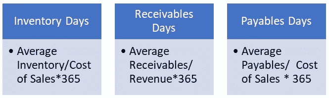
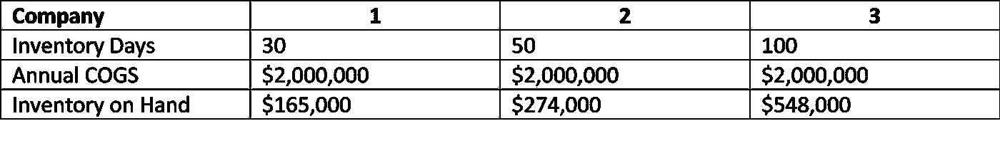
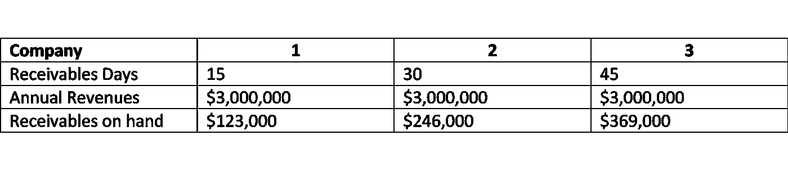
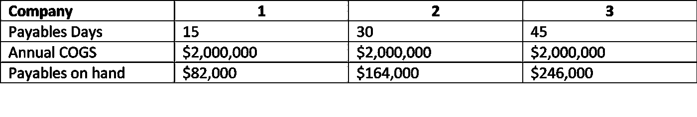
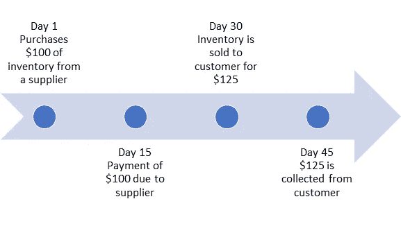
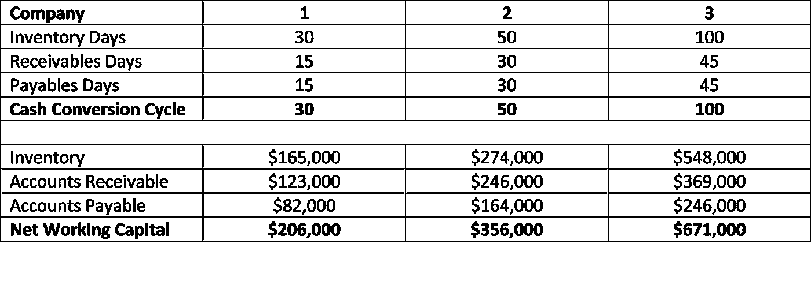

# 现金转换周期背后的意义

> 原文：<https://medium.datadriveninvestor.com/the-meaning-behind-the-cash-conversion-cycle-6a39cd0fe983?source=collection_archive---------13----------------------->

如果我告诉你，你可以通过给客户更好的信用条件来增加 10%的收入，这肯定会引起你的注意。你甚至可能会说，这是一个显而易见的，嘿，10%的收入增长是一个小变化，这实际上是免费的收入增长。然而，这可能会让你的企业失败…

Photo by [Helloquence](https://unsplash.com/@helloquence?utm_source=unsplash&utm_medium=referral&utm_content=creditCopyText) on [Unsplash](https://unsplash.com/s/photos/accountant?utm_source=unsplash&utm_medium=referral&utm_content=creditCopyText)

这是营运资本系列的第二篇文章。这篇文章的重点是理解现金转换周期，以及如何计算你的。你可以在这里找到第一篇[。](https://medium.com/datadriveninvestor/making-working-capital-work-cb2cf35453c0)

现金转换周期旨在回答一个简单的问题，这个问题在审视您的业务时可能不太清楚，但理解起来同样重要……“如果我们今天购买了一件产品，我们需要多长时间才能收回资金”。虽然这个问题看起来是良性的，但其重要性不能低估，你出售和收集现金的时间越长，你更换库存并再次开始出售的时间就越长。

**现金周转周期=库存天数+应收天数-应付天数**

太好了，你有一些计算，现在呢？首先，让我们更清楚地理解它们的含义。

**库存天数**

库存天数告诉你你手头有多少天的库存。另一种思考方式是，我需要多少天才能卖掉这些存货。一旦你明白了这一点，你就可以开始问这样的问题，为什么是这个天数，它对我的业务有意义吗，我们是否持有更多我们需要的库存。

 [## 2020 年最佳短期投资选择精选资源|数据驱动型投资者

### 投资是增加你净财富的一个好方法。如果你通过遵循一个严格的…

www.datadriveninvestor.com](https://www.datadriveninvestor.com/2020/03/28/handpicked-resources-for-the-best-short-term-investment-options-of-2020/) 

让我们来看看库存天数不同的公司对库存的影响。每家公司的年销售成本为 200 万美元

对于公司 1 来说，如果收入翻倍，它将需要另外 165，000 美元的存货，而公司 3 将需要另外 548，000 美元的存货。这笔钱必须来自某个地方。显然，公司 1 的可伸缩性比公司 3 更容易。虽然可能存在差异，使公司 3 的更高库存是必要的，但如果公司 3 可以减少库存天数，它将能够释放额外的增长。

**应收账款天数**

应收帐款天数大约是客户向您付款所需的时间。如果客户在 45 天内付款，那么您需要支持 45 天的应收账款销售额。

我们来看看应收账款天数不同的公司对应收账款的影响。每家公司的年收入为 300 万美元

如果公司 1 的收入翻倍，它将需要支持另外 123，000 美元的应收账款，而公司 3 将需要另外 369，000 美元来支持同样的增长。同样，这笔钱必须来自某个地方。与库存天数相反，应收账款的减少在某些时候会对收入产生负面影响，尤其是在客户重视给定的信用条款的情况下。必须始终根据收入和客户关系影响来考虑这一变化。

**应付款天数**

最后，应付款天数是您向供应商付款的天数。这就像应收帐款天，除了你是付款人。在这种情况下，你是在向供应商借钱，较长的应付款对你的业务更有利。

让我们来看看应付款天数不同的公司对应付款的影响。每家公司的年销售成本为 200 万美元

应付账款不同于存货和应收账款，因为它是现金的来源而不是现金的使用。这家企业正在向供应商借钱。在上述情景中，公司 3 能够通过向供应商借款 246，000 美元来减少其营运资本需求，如果公司 1 能够通过获得更好的供应商条款或更好地管理其应付款来延长其应付款天数，则可以减少其营运资本需求。因为这也是以关系为基础的，所以管理你与供应商的关系很重要，如果你突然停止付款，这将有助于你的现金流，但可能会破坏你与供应商的关系。

Photo by [Charles Deluvio](https://unsplash.com/@charlesdeluvio?utm_source=unsplash&utm_medium=referral&utm_content=creditCopyText) on [Unsplash](https://unsplash.com/s/photos/accountant?utm_source=unsplash&utm_medium=referral&utm_content=creditCopyText)

**现金转换周期**

现金转换周期告诉你需要多长时间才能收回你的钱。

让我们看看这对公司 1 是如何起作用的。

在第 15 天和第 45 天之间的 30 天里，公司 1 需要提供现金来支持存货和应收账款。你可以这样想，如果公司只有那一件商品，它需要等 30 天才能购买另一件商品。

由于现金转换周期为 30 天，公司 1 的营运资本要求相对较低。但是，如果它能将供应商条款延长至 30 天，从而将现金转换周期缩短至 15 天，现金需求将减半。

现金转换周期和企业所需的营运资金之间的关系是线性的。随着现金转换周期的增加，营运资本需求也会增加

更长的现金转换周期意味着企业需要更多的资本。由于资本需求，资本密集型企业更难扩大规模。一个有效管理营运资本的企业可以优化成长。

管理营运资本是每个企业的一个重要方面。理解现金转换周期告诉你一个特定的时间点是很重要的。它会随着时间而改变。最重要的是它如何变化以及为什么变化。一旦你理解了影响你现金转换周期的因素，你就可以相应地调整。

虽然盈利能力很重要，但现金流是你企业的命脉，而营运资本是推动这一过程的心脏。