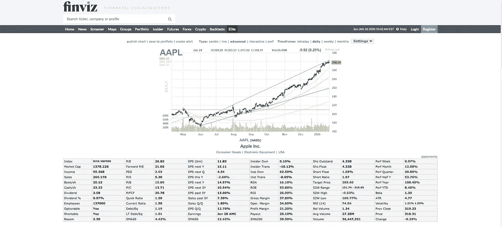

# 每个 Finviz 的扫描器搜索属性的含义。

> 原文：<https://medium.datadriveninvestor.com/the-meaning-of-each-finvizs-scanner-search-attribute-51e6705ef248?source=collection_archive---------0----------------------->

Finviz 是一个非常受投资者欢迎的股票筛选网站。在本文中，我将分析报价股票表显示的每个属性。

This screenshot has been taken from [https://finviz.com/](https://finviz.com/)

## 索引

指数“属性”告诉我们，我们正在研究的这只股票是在哪个指数中上市的。

## 市盈率

当前市场价格与每股收益之比是一个非常流行的公司当前市场价格与其每股收益的估值比率。低 P/E 值表明股票与其收益相比相对便宜。例如，如果 P/E 值为 5，则意味着股票的当前价格等于其 5 年总每股收益的总和。

## EPS (ttm)

过去 12 个月的每股收益就是这个属性的含义。每股收益(ttm)可以成为进一步研究一支股票的良好起点。它显示了公司是否盈利，但我们不能仅仅从这个数字做出决定。我们所说的盈利是指公司以每股为基础支付给股东的利润或股息形式的回报。(ttm)部分意味着将考虑过去 12 个月的回报。其计算方法是将总收益除以发行在外的股票数量(如下所述)。

## 内部人拥有

该属性向我们显示了机构投资者持有的股份百分比。

## Shs 未完成

该属性向我们显示了公众拥有的股份数量。不包括公司回购的股份。其计算方法是从股份总数中扣除国库中持有的股份。

## 表演周

业绩周显示了股票在过去 5 个交易日的正负变化百分比。

## 市值

如果我们将前面提到的发行在外的股票乘以当前的市场价格，我们就得到了公司的市值。这衡量了公司的规模。

## 远期市盈率

当当前市场价格除以预测的每股收益时，我们得到预测的市盈率。当这一属性大于每股收益的当前价格时，则收益有望增长。

## EPS 下一年

该属性向我们显示了下一财年的每股预测收益。

## 内部交易

这个数字显示了内部人总所有权的百分比变化。购买或出售的股份包括在内。

## Shs 浮动

该指标显示可供交易的股票数量。这个数字是已发行股票的子集。

## 绩效月

业绩月显示了股票在过去 21 个交易日的正负变化百分比。

## 收入(ttm)

收入是一家公司在过去 12 个月的收入。它的计算方法是从销售总额中减去销货成本和其他费用。

## 螺钉

股价对收益对增长的比率显示了公司是被高估还是被低估。较低的数字表明股票被低估。它的计算方法是将当前市场价格除以每股收益，然后将结果除以三至五年的每股收益预期增长。

## EPS 下一个 Q

下一季度的预计每股收益。

## 本镇

这个数字向我们展示了机构投资者目前持有的股份比例。

## 短期浮动

这个数字显示了机构交易者做空的股票占流通股的百分比(如上所述)。

## 绩效季度

“季度业绩”显示股票在过去 63 个交易日中的正负变化百分比。

## 销售(ttm)

这是公司过去 12 个月的总收入。

## P/S

该值向我们显示了当前股价除以每股总收入得出的比率。后者是总收入除以发行在外股票数量的结果。较低的价值表明更好的投资，因为我们为每单位销售支付的费用较少。

## 今年每股收益

今年的每股收益。

## 研究所事务

该值显示该份额的机构所有权的变化百分比。

## 短缺比率

这是被卖空的股票占看涨股票数量的百分比。

## 半年绩效

半年业绩显示了股票在过去 126 个交易日的正负变化百分比。

## 书/sh

每股账面价值来自股东权益除以普通股的平均数。该指标通过数量向我们显示所有股票的价值。

## 付款交单

市净率告诉潜在的投资者，如果一家公司今天停止经营，出售所有资产并清偿所有债务，其股票价值与公司本身价值的关系。假设一家公司的账面价值为 100 万美元，发行在外的股票为 100 股，股价为 20 美元。如果我们将公司的账面价值除以其发行在外的股票，我们得到每股价值 10 美元。如果我们将这个值与实际的 20 美元股票价格相比较，我们得到的市净率为 2。这意味着市场认为一家公司有更大的增长潜力，因此他们将这种信念纳入了股票价格。

## EPS 下一年

此指标预测下一年每股收益指标的预测增长。

## 资产收益率

资产回报率表明一家公司在管理资产和获得资产回报方面做得有多好。资产回报率是由年收益除以总资产得出的，它以百分比表示。

## 目标价格

这个数字是各种分析师认为这家公司的股票应该有的平均价格。

## 绩效年度

绩效年度显示股票在过去 252 个交易日中的正负变化百分比。

## 现金/现金

每股现金表示公司的流动资产除以发行在外的股票。

## P/C

这是股票价格对其现金资产的一个指标。现金价格比显示了公司相对于其股票价格产生了多少钱。

## 下一个 5 年的每股收益

每股收益百分比作为未来五年的年增长率。

## 鱼卵

这个指标告诉我们公司从股东投资的现金中产生了多少钱。它的计算方法是将净收入除以股东权益。

## 绩效年初至今

公司从年初至今的业绩。

## 股息

公司每股支付的年度股息。

## P/FCF

自由现金流价格指标源自公司市值除以自由现金流金额。如果这个数字很低，那么股票就被低估了。

## 超过 5 年的每股收益

过去五年每股收益的年增长率。

## 投资收益率

投资回报率衡量的是投资的效率，它是由投资收益与投资成本之差除以投资成本得出的。(收益-成本)/成本

## 52W 高、52W 范围和 52W 低

第一个指标显示了股票在过去 52 周内与最高交易价格的距离。第二个显示了股票在过去 52 周的最低价和最高价。最后，第三个指标显示了股票目前距离过去 52 周的最低价的距离。

## 贝塔

贝塔值显示了股票波动相对于市场的相关性。贝塔系数为 0 意味着股票与市场不相关。正贝塔值意味着股票跟随市场涨跌，负贝塔值意味着股票在市场上涨时下跌。这个值在项目组合管理中被广泛使用。

## 股息%

股息率显示了一家公司通过分红向股东支付的回报的百分比。我们通过将每股年度股息除以股价得到这个值。

## 速动比率

该值表示公司的短期流动性。它表明公司是否能够用其最具流动性的资产来偿还其短期债务。计算方法是流动资产与存货的差额除以流动负债。(流动资产-存货)/流动负债。速动比率和流动比率一起被称为流动性比率。

## 超过 5 年的销售额

公司在过去五年中的销售额。

## 毛利

这个数字是从公司的总销售额中减去成本后得出的。然后我们用这个数字除以公司的总销售额。这个数字显示了公司在支付了与生产商品和服务相关的直接成本后所获得的收入。

## ATR (14)

平均真实范围是一个技术指标，衡量股票在给定时期的平均历史波动性。它是以点数来衡量的。

## 雇员

公司雇佣的人数。

## 流动比率

类似于速动比率，流动比率衡量公司支付短期债务的能力。流动比率是由流动资产除以流动负债得出的。

## 销售 Q/Q

自上个季度以来销售额的增长。

## 操作。边缘

这个指标衡量的是在支付生产的可变成本后，留给公司的钱的比例。营业利润来源于营业收入除以净销售额。

## 相对强度指数(14)

相对强弱指数通过显示价格是超买还是超卖来衡量价格的强弱。RSI 被称为技术分析指标。

## 波动性

该值显示公司一天内的高或低变动百分比。

## 可选的

这表明，如果一个潜在的投资者可以交易股票期权。

## 债务/情商

该指标显示了公司用于为其资产融资的权益和债务的比例。它来源于总资产减去总负债再除以流动负债。

## 每股收益季度

自上一季度以来，每股收益(如上所述)有所增加。

## 利润率

它表明一个公司在销售中有多少利润。它来源于净收入除以收入。

## 相对体积

如果我们用当前的交易量指标(下面会提到)除以 3 个月的平均交易量，我们就得到了相对交易量指标。

## 沪指收盘

前一个交易日的收盘价。

## 可缩短

做空这只股票是可能的。

## LT 债务/Eq

长期负债权益比指标显示公司用于为其资产融资的权益和负债的比例。它来源于长期债务对股东权益的分割。

## 收益

此指标显示最近的收益报告日期。

## 支出

这是以股息形式支付给股东的所有收益的总和。它来源于股息除以收益的总和。

## 平均音量

所选股票在最近 3 个月期间的平均证券总数。

## 价格

股票的当前价格。

## 建议

一个分析师建议 1.0 表示强买，2.0 表示买，3.0 表示持有，4.0 表示卖，最后 5.0 表示强卖。

## SMA20、SMA50、SMA200

如果我们把过去 20 天的收盘价相加，然后除以 20，我们得到一个简单平均值。如果我们在多日的价格走势图上画出这些点，并将这些点连接起来，我们就得到 20 天的简单移动平均线。(SMA 20)SMA 50 和 SMA200 分别计算 50 天和 200 天的跨度。

## 卷

成交量表示一天或上一个交易时段内交易的股票总数。对于投资者来说，这些指标显示了对该股票开仓和/或平仓的难易程度。数字越大越容易。

## 变化

今天的价格和前一个交易时段的价格之间的百分比差异。

*来源*

1.  https://finviz.com/help/screener.ashx
2.  【https://en.wikipedia.org/wiki/Price%E2%80%93earnings_ratio 
3.  [https://finance.yahoo.com/news/investing-education-每股收益-ttm-142540641.html](https://finance.yahoo.com/news/investing-education--earnings-per-share--ttm-142540641.html)
4.  [https://investinganswers . com/dictionary/s/shares-outstanding](https://investinganswers.com/dictionary/s/shares-outstanding)
5.  [https://www . investopedia . com/ask/answers/062315/what-difference-between-shares-floating-stock . ASP](https://www.investopedia.com/ask/answers/062315/what-difference-between-shares-outstanding-and-floating-stock.asp)
6.  [https://www.investopedia.com/terms/p/pegratio.asp](https://www.investopedia.com/terms/p/pegratio.asp)
7.  [https://www . investor reg . net/guides/short-percentage-of-float-是什么意思](https://www.investorgreg.net/guides/what-does-short-percentage-of-float-mean)
8.  [https://www.investopedia.com/terms/s/salespershare.asp](https://www.investopedia.com/terms/s/salespershare.asp)
9.  [https://en.wikipedia.org/wiki/Price%E2%80%93sales_ratio](https://en.wikipedia.org/wiki/Price%E2%80%93sales_ratio)
10.  https://www . fool . com/knowledge-center/what-a-short-ratio . aspx
11.  [https://www . thebalancsmb . com/what-the-book-value-per-share-financial-ratio-393214](https://www.thebalancesmb.com/what-is-the-book-value-per-share-financial-ratio-393214)
12.  [https://www.investopedia.com/terms/p/price-to-bookratio.asp](https://www.investopedia.com/terms/p/price-to-bookratio.asp)
13.  【https://www.investopedia.com/terms/b/bookvalue.asp 号

免责声明:

为了投资这些市场，你必须意识到风险并愿意接受它们。不要用你输不起的钱去交易。本文包含的信息仅用于教育目的，不作为任何特定投资的建议。在任何市场交易都有很高的风险，可能不适合所有的投资者。