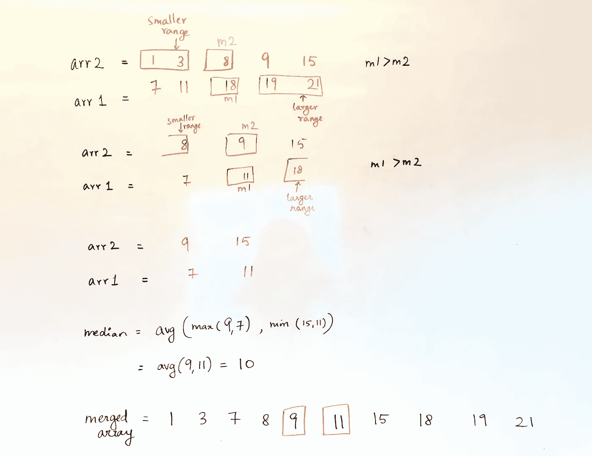

# 两个排序数组的中间值—基本算法

> 原文：<https://medium.datadriveninvestor.com/the-median-of-two-sorted-arrays-fundamental-algorithms-e4f50ef0c097?source=collection_archive---------3----------------------->

Photo by [Daniel Cheung](https://unsplash.com/@danielkcheung?utm_source=medium&utm_medium=referral) on [Unsplash](https://unsplash.com?utm_source=medium&utm_medium=referral)

作为一名算法爱好者，我遇到了这个问题，并认为写下这个问题背后的直觉可能会很有趣。我认为，在解决问题时，培养直觉比仅仅练习一大堆问题更重要。所以我真的希望这对像我一样的人们有所帮助。

 [## 算法诱人的商业逻辑|数据驱动的投资者

### 某些机器行为总是让我感到惊讶。我对他们从自己的成就中学习的能力感到惊讶…

www.datadriveninvestor.com](https://www.datadriveninvestor.com/2019/03/22/the-seductive-business-logic-of-algorithms/) 

这个问题有 ***两个不变量*** 来求中位数:

1.  排序后的**数组大小相同**
2.  不同大小的**排序数组**

我将试图涵盖这两个问题的直觉。尽管两者的方法不同，但直觉是相同的。

# 基本知识:

我们先来了解一下 ***中位数*** 的概念。

> 中位只是一种花哨的说法， ***中间元素*** *。*

因此，给定数组中的一组数字，你的工作是找出哪个数字位于中间。例如，假设给我们一个奇数长度的数组:

*奇数长度排列* = [ 1，2，5，7，8 ]

这种情况下的中间元素很简单！现在是 5 点。两个元素在它的左边，两个在它的右边。完美！

但是在偶数长度数组的情况下。

偶数长度排列 = [1，2，5，7，8，10]

我们取中间的两个元素，5 和 7，取它们的平均值。

所以中间元素是(5 + 7 )/ 2 = 6

够简单吗？好了，现在是起飞的时候了！

# 两个排序数组的中间值——一种简单的方法

我们可以将两个数组合并成一个大数组，然后像上面一样计算中值。

arr1 = [2，4，6]

arr2 = [3，5，10]

***合并 _ 数组*** = [2，3，4，5，6，10]

因此，中间值= 4.5

> 从现在开始，每当我提到 merged_array，这就是我要说的

然而，在合并排序中使用 merge 合并两个数组所花费的时间:***【O(m+n)】***其中 m 和 n 是数组的长度。有点线性时间。

这还不错，但是我们没有利用两个数组都排序的事实。

> 如果有**排序**，那就一定会有**二分搜索法**。
> 
> -不要引用

让我们使用二分搜索法，看看我们能否将时间复杂度降低到对数。真正的交易！

# 两个大小相同的排序数组的中值:

## 算法:

1.  求两个数组 a1 和 a2 的中间值。让我们称它们为 m1 和 m2。
2.  现在比较这两个中间值
3.  如果 m1 == m2，意味着我们正好在合并数组的中间。
4.  否则，如果 m1 > m2:

***现在想到的是 merged_array。中位数不可能在 m1(更大的范围)之后。由于 m1 大于 m2，因此中位数也不可能位于 m2 之前(较小的范围)。***

## ***消除这些不必要的范围，并使用递归方法继续寻找剩余数字中的中值。***

5.否则:(m2 > m1)

与上一点的逻辑正好相反

6.继续步骤 1-5，直到每个数组中只剩下两个元素或一个元素。

7.然后使用以下公式找到这些元素的中值:(基本情况)

如果每个数组中还有 2 个元素，那么 median= ***avg(max(两个数组的前两个)+ min(数组的后两个))***

如果每个数组中有 1 个元素，那么 median =***(arr 1 _ num+arr 2 _ num)/2***

***这个公式的直觉同样来自对偶数长度的合并数组的中值的思考。***

Example with two sorted arrays of odd lengths

一些可供参考的代码:

## 要记住的注意事项(最好在自己编码后阅读):

1.  递归时，记住 ***在数组长度为偶数*** 时包括每个数组的中间元素，在数组长度为奇数时包括单个中间元素。(*因此代码中的数组切片为+1)*
2.  递归时数组长度将始终保持不变，因为实质上我们从每个数组中移除了一半的元素
3.  由于长度相同，因此时间复杂度为 O(log n + log m)或 O(log n)。
4.  这种方法不适用于不同的长度:为什么？因为假设一个数组是奇数，一个是偶数，那么在递归中就没有基本情况。(在基本情况下，不能保证两个数组最终具有相同数量的元素)

## 脚注:

1.  我将在另一篇文章中介绍的**下一种方法**稍微复杂一些，但是**可以用于解决长度相同和长度不同的数组大小**。
2.  我介绍这种方法的原因是为了深入了解**分而治之**概念的消除过程。
3.  对这种方法的深入了解将为您带来另一个著名问题: [**如何在两个有序数组的并集中找到第 k 个最小元素？**](https://stackoverflow.com/questions/4607945/how-to-find-the-kth-smallest-element-in-the-union-of-two-sorted-arrays)
4.  此外，这将为下一步寻找任意大小的排序数组的中值奠定基础。

暂时就这样了。下一个方法即将到来。我希望写更多关于有趣问题的直觉，并希望这能帮助一些人。感谢阅读伙计们！^_^